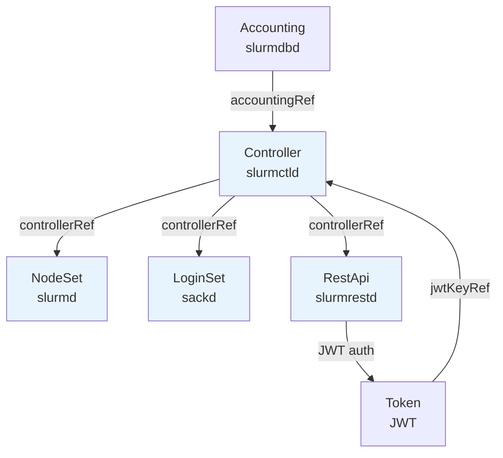

# API_SURFACE.md — slurm-operator CRD API 與 Webhook 介面參考

> **API Group**: `slinky.slurm.net` / **Version**: `v1beta1`
> **專案版本**: 1.2.0-rc1 | **最低 Kubernetes**: v1.29 | **最低 Slurm**: 25.11

---

## 1. CRD 清單與短名（shortName）

| Kind | shortName | 對應 Slurm 元件 | scale subresource |
|------|-----------|----------------|-------------------|
| `Controller` | `slurmctld` | slurmctld（主控制器） | 無 |
| `NodeSet` | `nodesets`, `nss`, `slurmd` | slurmd（計算節點群） | 支援（HPA 可用） |
| `LoginSet` | `loginsets`, `lss`, `sackd` | sackd（登入節點） | 支援 |
| `Accounting` | `slurmdbd` | slurmdbd（會計子系統） | 無 |
| `RestApi` | `slurmrestd` | slurmrestd（REST daemon） | 無 |
| `Token` | `tokens`, `jwt` | JWT Token 管理 | 無 |

---

## 2. CRD 依賴關係



---

## 3. 各 CRD 完整 API 範例

### 3.1 Controller CR

管理 slurmctld pod，是整個 Slurm 叢集的核心。

```yaml
apiVersion: slinky.slurm.net/v1beta1
kind: Controller
metadata:
  name: slurm-controller
  namespace: slurm
spec:
  # Slurm 叢集名稱，最長 40 字元，部署後不可更改
  clusterName: "mycluster"

  # auth/slurm 金鑰（部署後不可更換 Secret 名稱）
  slurmKeyRef:
    name: slurm-auth-key
    key: slurm.key

  # auth/jwt 金鑰（部署後不可更換）
  jwtKeyRef:
    name: slurm-jwt-key
    key: jwt.key

  # （可選）JWKS 公鑰，用於非對稱 JWT 驗證
  jwksKeyRef:
    name: slurm-jwks-cm
    key: jwks.json

  # （可選）連結 Accounting CR
  accountingRef:
    name: slurm-accounting
    namespace: slurm

  # slurmctld 容器設定（等同 corev1.Container）
  slurmctld:
    image: ghcr.io/slinkyproject/slurmctld:25.11
    resources:
      requests:
        cpu: "500m"
        memory: "512Mi"

  # 是否支援原地 reconfigure（不重建 pod）
  inplaceReconfigure: false

  # 持久化（儲存 slurmctld save-state）
  persistence:
    enabled: true
    storageClassName: standard
    resources:
      requests:
        storage: 1Gi

  # 附加到 slurm.conf 的自訂設定
  extraConf: |
    SelectType=select/cons_tres
    TaskPlugin=task/affinity

  # 掛載額外設定檔到 /etc/slurm（不可包含 slurm.conf / slurmdbd.conf）
  configFileRefs:
    - name: slurm-gres-conf    # ConfigMap 名稱

  # Prometheus 監控
  metrics:
    enabled: true
    serviceMonitor:
      enabled: true
      interval: "30s"

  # Pod template（支援所有 corev1.PodSpec 欄位）
  template:
    metadata:
      labels:
        app: slurmctld
    spec:
      nodeSelector:
        kubernetes.io/os: linux
```

---

### 3.2 NodeSet CR（StatefulSet 模式）

固定副本數，每個 pod 有穩定的身份（適合 GPU 節點等需要固定名稱的情境）。

```yaml
apiVersion: slinky.slurm.net/v1beta1
kind: NodeSet
metadata:
  name: slurm-workers
  namespace: slurm
spec:
  # 必填：指向 Controller CR
  controllerRef:
    name: slurm-controller
    namespace: slurm

  # StatefulSet 模式（預設）
  scalingMode: StatefulSet
  replicas: 4

  # slurmd 容器設定
  slurmd:
    image: ghcr.io/slinkyproject/slurmd:25.11
    resources:
      requests:
        cpu: "8"
        memory: "32Gi"
      limits:
        nvidia.com/gpu: 4

  # 附加到 slurmd --conf 的節點參數
  extraConf: "Gres=gpu:h100:4"

  # Slurm partition 設定
  partition:
    enabled: true
    config: "MaxTime=INFINITE State=UP"

  # 更新策略
  updateStrategy:
    type: RollingUpdate
    rollingUpdate:
      maxUnavailable: "25%"   # 預設值，可設為整數或百分比

  # PVC 保留策略
  persistentVolumeClaimRetentionPolicy:
    whenDeleted: Retain   # Retain | Delete
    whenScaled: Retain

  # 是否釘選 pod 到首次排程的節點
  pinToNode: false

  # Slurm 節點記錄清理策略
  pruneSlurmNodeRecords: Never   # Never | NodeNotFound

  # 工作負載中斷保護（PodDisruptionBudget）
  workloadDisruptionProtection: true

  # Pod 序號補零（如 worker-001）
  ordinalPadding: 3

  # Pod template
  template:
    spec:
      tolerations:
        - key: nvidia.com/gpu
          operator: Exists
          effect: NoSchedule
```

---

### 3.3 NodeSet CR（DaemonSet 模式）

每個符合條件的 Kubernetes node 自動排程一個 pod，`replicas` 欄位忽略。

```yaml
apiVersion: slinky.slurm.net/v1beta1
kind: NodeSet
metadata:
  name: slurm-workers-daemon
  namespace: slurm
spec:
  controllerRef:
    name: slurm-controller
    namespace: slurm

  # DaemonSet 模式：replicas 欄位忽略
  scalingMode: DaemonSet

  slurmd:
    image: ghcr.io/slinkyproject/slurmd:25.11

  # DaemonSet 模式下，NodeNotFound 可清理已消失節點的 Slurm 記錄
  pruneSlurmNodeRecords: NodeNotFound

  partition:
    enabled: true

  # Pod template 的 nodeSelector / tolerations 決定哪些 node 執行 pod
  template:
    spec:
      nodeSelector:
        slurm-worker: "true"
      tolerations:
        - key: slurm-worker
          operator: Exists
          effect: NoSchedule
```

---

### 3.4 LoginSet CR

管理 Slurm 登入節點（sackd），提供使用者 SSH 入口。

```yaml
apiVersion: slinky.slurm.net/v1beta1
kind: LoginSet
metadata:
  name: slurm-login
  namespace: slurm
spec:
  # 必填：指向 Controller CR（部署後不可更改）
  controllerRef:
    name: slurm-controller
    namespace: slurm

  replicas: 2

  # 必填：SSSD 設定（使用者身份來源）
  sssdConfRef:
    name: sssd-secret
    key: sssd.conf

  # 登入節點容器
  login:
    image: ghcr.io/slinkyproject/login:25.11

  # 附加到 sshd_config 的自訂設定
  extraSshdConfig: |
    MaxSessions 50

  # root SSH 授權金鑰
  rootSshAuthorizedKeys: "ssh-ed25519 AAAA... admin@example.com"

  # Deployment 更新策略
  strategy:
    type: RollingUpdate
    rollingUpdate:
      maxSurge: 1
      maxUnavailable: 0

  # 對外 Service 設定
  service:
    port: 22
    spec:
      type: LoadBalancer

  template:
    spec:
      nodeSelector:
        kubernetes.io/os: linux
```

---

### 3.5 Accounting CR

管理 slurmdbd pod（Slurm 會計資料庫 daemon）。

```yaml
apiVersion: slinky.slurm.net/v1beta1
kind: Accounting
metadata:
  name: slurm-accounting
  namespace: slurm
spec:
  # auth/slurm 金鑰
  slurmKeyRef:
    name: slurm-auth-key
    key: slurm.key

  # auth/jwt 金鑰（部署後 jwtKeyRef 不可更換）
  jwtKeyRef:
    name: slurm-jwt-key
    key: jwt.key

  # slurmdbd 容器設定
  slurmdbd:
    image: ghcr.io/slinkyproject/slurmdbd:25.11

  # MariaDB / MySQL 連線設定
  storageConfig:
    host: mariadb.slurm.svc.cluster.local
    port: 3306                      # 預設 3306
    database: slurm_acct_db         # 預設 slurm_acct_db
    username: slurm
    passwordKeyRef:
      name: slurm-db-secret
      key: password

  # 附加到 slurmdbd.conf 的自訂設定
  extraConf: |
    DebugLevel=debug3

  template:
    spec:
      nodeSelector:
        kubernetes.io/os: linux
```

> **外部 Accounting**：若 slurmdbd 在 Kubernetes 外部運行，設定 `spec.external: true` 並提供 `spec.externalConfig.host/port`。

---

### 3.6 RestApi CR

管理 slurmrestd pod，提供 Slurm REST API 端點。

```yaml
apiVersion: slinky.slurm.net/v1beta1
kind: RestApi
metadata:
  name: slurm-restapi
  namespace: slurm
spec:
  # 必填：指向 Controller CR
  controllerRef:
    name: slurm-controller
    namespace: slurm

  replicas: 2

  # slurmrestd 容器設定
  slurmrestd:
    image: ghcr.io/slinkyproject/slurmrestd:25.11
    ports:
      - name: http
        containerPort: 6820

  # Service 設定
  service:
    port: 6820
    spec:
      type: ClusterIP

  template:
    spec:
      nodeSelector:
        kubernetes.io/os: linux
```

---

### 3.7 Token CR

自動簽發並輪換 Slurm JWT Token，儲存到 Kubernetes Secret。

```yaml
apiVersion: slinky.slurm.net/v1beta1
kind: Token
metadata:
  name: slurm-api-token
  namespace: slurm
spec:
  # auth/jwt 金鑰（部署後不可更換）
  jwtKeyRef:
    name: slurm-jwt-key
    key: jwt.key
    namespace: slurm    # 支援跨 namespace 引用

  # Token 對應的 Slurm 使用者
  username: "slurm"

  # Token 有效期（預設 15 分鐘）
  lifetime: "1h"

  # 是否自動輪換（預設 true）
  refresh: true

  # 寫入的目標 Secret
  secretRef:
    name: slurm-jwt-token-secret
    key: token
```

---

## 4. Webhook 一覽表

| Webhook | 型別 | 路徑 | 觸發時機 | 驗證規則 |
|---------|------|------|---------|---------|
| `ControllerWebhook` | Validator | `/validate-slinky-slurm-net-v1beta1-controller` | create / update | 見下方 |
| `AccountingWebhook` | Validator | `/validate-slinky-slurm-net-v1beta1-accounting` | create / update | 見下方 |
| `NodeSetWebhook` | Validator | `/validate-slinky-slurm-net-v1beta1-nodeset` | create / update | 見下方 |
| `LoginSetWebhook` | Validator | `/validate-slinky-slurm-net-v1beta1-loginset` | create / update | 見下方 |
| `RestapiWebhook` | Validator | `/validate-slinky-slurm-net-v1beta1-restapi` | create / update | 無額外規則 |
| `TokenWebhook` | Validator | `/validate-slinky-slurm-net-v1beta1-token` | create / update | 見下方 |
| `PodBindingWebhook` | Mutator | `/mutate--v1-binding` | Pod 排程（binding） | 注入 topology annotation |

所有 Webhook 的 `failurePolicy=fail`，任何驗證失敗即拒絕請求。

### 4.1 ControllerWebhook 驗證規則

**Create 時**：
- `ClusterName`（即 CR name 或 `spec.clusterName`）不可超過 40 字元
- `configFileRefs` 中的 ConfigMap 必須存在
- ConfigMap 中不可包含保留檔案：`slurm.conf`、`slurmdbd.conf`
- ConfigMap 中的未知設定檔會產生 Warning（不拒絕）

**Update 時（額外）**：
- `ClusterName` 不可更改
- `SlurmKeyRef`（Secret 名稱）不可更改
- `JwtKeyRef` / `JwtHs256KeyRef` 不可更改
- `persistence.enabled` 不可更改

**Spec 層級 XValidation**（CRD schema）：
- `external=false` 時，`slurmKeyRef` 必填
- `external=false` 時，`jwtKeyRef` 或 `jwtHs256KeyRef` 至少一個必填
- `external=true` 時，`externalConfig` 必填

### 4.2 AccountingWebhook 驗證規則

**Update 時**：
- `JwtKeyRef` / `JwtHs256KeyRef` 不可更改

**Spec 層級 XValidation**（同 Controller）：
- `external=false` 時，`slurmKeyRef` 必填
- `external=false` 時，`jwtKeyRef` 或 `jwtHs256KeyRef` 至少一個必填
- `external=true` 時，`externalConfig` 必填

### 4.3 NodeSetWebhook 驗證規則

**Create / Update 時**：
- `spec.controllerRef.name` 不可為空
- `spec.updateStrategy.rollingUpdate.maxUnavailable` 若為整數必須 > 0，若為百分比不可為 `"0%"`
- `spec.ssh.enabled=true` 時，`ssh.sssdConfRef.name` 不可為空
- `spec.taintKubeNodes=true` 會產生 Deprecation Warning

**Update 時（額外）**：
- `spec.controllerRef` 不可更改
- `spec.volumeClaimTemplates` 不可更改

### 4.4 LoginSetWebhook 驗證規則

**Create / Update 時**：
- `spec.controllerRef.name` 不可為空
- `spec.sssdConfRef.name` 不可為空

**Update 時（額外）**：
- `spec.controllerRef` 不可更改

### 4.5 TokenWebhook 驗證規則

**Update 時**：
- `JwtKeyRef` / `JwtHs256KeyRef` 不可更改

**Spec 層級 XValidation**（CRD schema）：
- `jwtKeyRef` 或 `jwtHs256KeyRef` 至少一個必填

### 4.6 PodBindingWebhook（Mutating）

在 Pod 排程（`pods/binding`）時觸發，針對 NodeSet worker pod：
1. 讀取被排程到的 Kubernetes Node 上的 `topology.slinky.slurm.net/spec` annotation
2. 將該 annotation 複製到 Pod，供 slurmd 設定 Slurm Dynamic Topology

---

## 5. Status 欄位說明

### 5.1 NodeSet.status

| 欄位 | 型別 | 說明 |
|------|------|------|
| `replicas` | int32 | 目前運行中的 pod 數量 |
| `updatedReplicas` | int32 | 已更新到最新 template 的 pod 數 |
| `readyReplicas` | int32 | Ready condition 為 True 的 pod 數 |
| `availableReplicas` | int32 | 滿足 minReadySeconds 的可用 pod 數 |
| `unavailableReplicas` | int32 | 尚不可用的 pod 數 |
| `desired` | int32 | 期望數量（DaemonSet 模式為符合 selector 的 node 數） |
| `slurmIdle` | int32 | Slurm 狀態為 IDLE 的節點數（未分配任何 job） |
| `slurmAllocated` | int32 | Slurm 狀態為 ALLOCATED / MIXED 的節點數（執行中 job） |
| `slurmDown` | int32 | Slurm 狀態為 DOWN 的節點數（不可用） |
| `slurmDrain` | int32 | Slurm 狀態為 DRAIN 的節點數（排空中） |
| `nodeSetHash` | string | 當前 ControllerRevision hash |
| `selector` | string | Label selector 字串（供 HPA scale subresource 使用） |
| `ordinalToNode` | map[string]string | Pod 序號到 Kubernetes Node 名稱的對應表（StatefulSet 模式） |

### 5.2 NodeSet.status.conditions

| Condition Type | 說明 |
|---------------|------|
| `Available` | NodeSet 有足夠可用副本 |
| `Progressing` | NodeSet 正在更新中（rolling update 進行中） |

### 5.3 LoginSet.status

| 欄位 | 型別 | 說明 |
|------|------|------|
| `replicas` | int32 | 目前 pod 數量 |
| `selector` | string | Label selector（供 HPA 使用） |
| `conditions` | []Condition | 標準 metav1.Condition 列表 |

### 5.4 Token.status

| 欄位 | 型別 | 說明 |
|------|------|------|
| `issuedAt` | metav1.Time | JWT 簽發時間（RFC3339） |
| `conditions` | []Condition | 標準 metav1.Condition 列表 |

### 5.5 Controller / Accounting / RestApi.status

均只包含 `conditions []metav1.Condition`，使用標準 Condition type（`Ready`、`Available` 等）。

---

## 6. Scale Subresource 與 HPA 支援

`NodeSet` 和 `LoginSet` 均支援 scale subresource：

```
spec path:    .spec.replicas
status path:  .status.replicas
selector path: .status.selector
```

### 設定 HPA 自動縮放 NodeSet

```yaml
apiVersion: autoscaling/v2
kind: HorizontalPodAutoscaler
metadata:
  name: slurm-workers-hpa
  namespace: slurm
spec:
  scaleTargetRef:
    apiVersion: slinky.slurm.net/v1beta1
    kind: NodeSet
    name: slurm-workers
  minReplicas: 2
  maxReplicas: 20
  metrics:
    - type: Resource
      resource:
        name: cpu
        target:
          type: Utilization
          averageUtilization: 70
```

> **注意**：`scalingMode: DaemonSet` 模式下，`replicas` 欄位無效，HPA 不適用。

---

## 7. kubectl 操作範例

### 基本查詢

```bash
# 查看所有 CRD 資源（使用短名）
kubectl get slurmctld,slurmdbd,slurmrestd -n slurm
kubectl get nodesets,loginsets,tokens -n slurm

# NodeSet 詳細狀態（顯示 DESIRED/REPLICAS/UPDATED/READY）
kubectl get nodesets -n slurm

# 顯示 IDLE/ALLOCATED/DOWN/DRAIN 欄位（priority=1，需 -o wide）
kubectl get nodesets -n slurm -o wide

# 查看特定 NodeSet 狀態
kubectl describe nodeset slurm-workers -n slurm

# 查看 JWT Token 狀態（顯示 USER/IAT 欄位）
kubectl get tokens -n slurm
```

### 縮放操作

```bash
# 縮放 NodeSet（僅 StatefulSet 模式有效）
kubectl scale nodeset slurm-workers --replicas=5 -n slurm

# 縮放 LoginSet
kubectl scale loginset slurm-login --replicas=3 -n slurm
```

### 查看 Controller 管理的資源

```bash
# 查看 slurmctld pod
kubectl get pods -l app.kubernetes.io/component=controller -n slurm

# 查看 NodeSet 管理的 pods
kubectl get pods -l nodeset.slinky.slurm.net/pod-name=slurm-workers -n slurm
```

---

## 8. Well-Known Annotation 操作

### Pod 相關 Annotation

```bash
# 手動 cordon NodeSet pod（觸發 Slurm DRAIN，不驅逐現有 job）
kubectl annotate pod slurm-workers-0 -n slurm \
  nodeset.slinky.slurm.net/pod-cordon=true

# 移除 cordon
kubectl annotate pod slurm-workers-0 -n slurm \
  nodeset.slinky.slurm.net/pod-cordon-

# 設定 pod 刪除優先順序（數值越小越優先刪除）
kubectl annotate pod slurm-workers-3 -n slurm \
  nodeset.slinky.slurm.net/pod-deletion-cost="-100"

# 查看 pod 的 deadline（由 operator 根據 Slurm job 完成時間設定）
kubectl get pod slurm-workers-0 -n slurm \
  -o jsonpath='{.metadata.annotations.nodeset\.slinky\.slurm\.net/pod-deadline}'
```

### Node 相關 Annotation

```bash
# 設定自訂 Kubernetes node cordon reason（影響 Slurm drain reason 顯示）
kubectl annotate node kube-gpu-node-1 \
  nodeset.slinky.slurm.net/node-cordon-reason="Hardware maintenance scheduled"

# 設定 Slurm Dynamic Topology（由 PodBindingWebhook 自動複製到 pod）
kubectl annotate node kube-gpu-node-1 \
  topology.slinky.slurm.net/spec="topo-switch:s2,topo-block:b2"

# 覆寫 DaemonSet 模式下的 pod hostname（即 Slurm 節點名稱）
kubectl annotate node kube-gpu-node-1 \
  nodeset.slinky.slurm.net/hostname-override="gpu-node-custom-01"
```

### 查看 NodeSet 管理的 Label

```bash
# NodeSet controller 自動設定以下 label 到 pods：
# nodeset.slinky.slurm.net/pod-name      pod 名稱
# nodeset.slinky.slurm.net/pod-index     pod 序號
# nodeset.slinky.slurm.net/pod-hostname  pod hostname（Slurm 節點名稱）
# nodeset.slinky.slurm.net/pod-protect   是否受 PDB 保護
# nodeset.slinky.slurm.net/scaling-mode  DaemonSet | StatefulSet

kubectl get pods -n slurm -L \
  nodeset.slinky.slurm.net/pod-hostname,\
  nodeset.slinky.slurm.net/pod-index,\
  nodeset.slinky.slurm.net/scaling-mode
```

---

## 9. 已棄用欄位

| 欄位 | 位置 | 取代方式 |
|------|------|---------|
| `spec.jwtHs256KeyRef` | Controller, Accounting, Token | 改用 `spec.jwtKeyRef` |
| `spec.taintKubeNodes` | NodeSet | 待移除，webhook 會發出 Warning |
