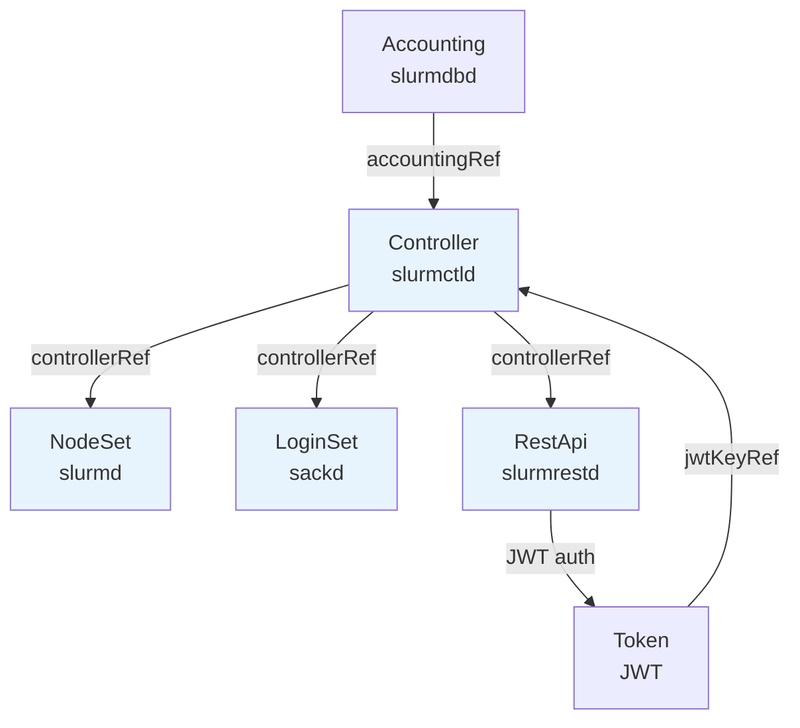

# API_SURFACE Part 1 — CRD 型別定義與 Webhook 規則

> **API Group**: `slinky.slurm.net` / **Version**: `v1beta1`
> **專案版本**: 1.2.0-rc1 | **最低 Kubernetes**: v1.29 | **最低 Slurm**: 25.11
> 繼續閱讀：[API_SURFACE_part2.md](./API_SURFACE_part2.md)（Status 欄位、HPA、kubectl、Annotation）

---

## 1. CRD 清單與短名（shortName）

| Kind | shortName | 對應 Slurm 元件 | scale subresource |
|------|-----------|----------------|-------------------|
| `Controller` | `slurmctld` | slurmctld（主控制器） | 無 |
| `NodeSet` | `nodesets`, `nss`, `slurmd` | slurmd（計算節點群） | 支援（HPA 可用） |
| `LoginSet` | `loginsets`, `lss`, `sackd` | sackd（登入節點） | 支援 |
| `Accounting` | `slurmdbd` | slurmdbd（會計子系統） | 無 |
| `RestApi` | `slurmrestd` | slurmrestd（REST daemon） | 無 |
| `Token` | `tokens`, `jwt` | JWT Token 管理 | 無 |

---

## 2. CRD 依賴關係



---

## 3. 各 CRD 完整 API 範例

### 3.1 Controller CR

管理 slurmctld pod，是整個 Slurm 叢集的核心。

```yaml
apiVersion: slinky.slurm.net/v1beta1
kind: Controller
metadata:
  name: slurm-controller
  namespace: slurm
spec:
  # Slurm 叢集名稱，最長 40 字元，部署後不可更改
  clusterName: "mycluster"

  # auth/slurm 金鑰（部署後不可更換 Secret 名稱）
  slurmKeyRef:
    name: slurm-auth-key
    key: slurm.key

  # auth/jwt 金鑰（部署後不可更換）
  jwtKeyRef:
    name: slurm-jwt-key
    key: jwt.key

  # （可選）JWKS 公鑰，用於非對稱 JWT 驗證
  jwksKeyRef:
    name: slurm-jwks-cm
    key: jwks.json

  # （可選）連結 Accounting CR
  accountingRef:
    name: slurm-accounting
    namespace: slurm

  # slurmctld 容器設定（等同 corev1.Container）
  slurmctld:
    image: ghcr.io/slinkyproject/slurmctld:25.11
    resources:
      requests:
        cpu: "500m"
        memory: "512Mi"

  # 是否支援原地 reconfigure（不重建 pod）
  inplaceReconfigure: false

  # 持久化（儲存 slurmctld save-state）
  persistence:
    enabled: true
    storageClassName: standard
    resources:
      requests:
        storage: 1Gi

  # 附加到 slurm.conf 的自訂設定
  extraConf: |
    SelectType=select/cons_tres
    TaskPlugin=task/affinity

  # 掛載額外設定檔到 /etc/slurm（不可包含 slurm.conf / slurmdbd.conf）
  configFileRefs:
    - name: slurm-gres-conf    # ConfigMap 名稱

  # Prometheus 監控
  metrics:
    enabled: true
    serviceMonitor:
      enabled: true
      interval: "30s"

  # Pod template（支援所有 corev1.PodSpec 欄位）
  template:
    metadata:
      labels:
        app: slurmctld
    spec:
      nodeSelector:
        kubernetes.io/os: linux
```

---

### 3.2 NodeSet CR（StatefulSet 模式）

固定副本數，每個 pod 有穩定的身份（適合 GPU 節點等需要固定名稱的情境）。

<!-- 更新於 2026-06-30, commit range: d5c49df..cfb5029 -->
```yaml
apiVersion: slinky.slurm.net/v1beta1
kind: NodeSet
metadata:
  name: slurm-workers
  namespace: slurm
spec:
  # controllerRef 型別改為 corev1.LocalObjectReference（禁止跨 namespace，無 namespace 欄位）
  controllerRef:
    name: slurm-controller

  scalingMode: StatefulSet   # 預設值
  replicas: 4

  slurmd:
    image: ghcr.io/slinkyproject/slurmd:25.11
    resources:
      requests:
        cpu: "8"
        memory: "32Gi"
      limits:
        nvidia.com/gpu: 4

  # 附加到 slurmd --conf 的節點參數
  extraConf: "Gres=gpu:h100:4"

  partition:
    enabled: true
    # config 欄位加入 pattern validation ^[^\n]+$，防止換行注入 slurm.conf
    config: "MaxTime=INFINITE State=UP"

  updateStrategy:
    type: RollingUpdate        # 可選值：RollingUpdate | OnDelete | ScheduledUpdate（新增）
    rollingUpdate:
      maxUnavailable: "25%"   # 預設值，可設為整數或百分比字串

  # ScheduledUpdate 範例（type=ScheduledUpdate 時，startTime 和 duration 為必填）
  # updateStrategy:
  #   type: ScheduledUpdate
  #   scheduledUpdate:
  #     startTime: "2026-07-01T02:00:00Z"   # RFC3339 時間戳
  #     duration: "30m"                       # 預設 "30m"
  #     flags: []                             # 附加 Slurm reservation flags（optional）

  persistentVolumeClaimRetentionPolicy:
    whenDeleted: Retain   # Retain | Delete
    whenScaled: Retain

  pinToNode: false
  pruneSlurmNodeRecords: Never      # Never | NodeNotFound
  workloadDisruptionProtection: true
  ordinalPadding: 3                  # pod 序號補零，如 worker-003

  # oversubscribeNode：新增欄位，允許多個 pod 排程到同一 K8s Node（預設 false）
  # 警告：不建議在生產環境啟用
  oversubscribeNode: false

  template:
    spec:
      tolerations:
        - key: nvidia.com/gpu
          operator: Exists
          effect: NoSchedule
```

---

### 3.3 NodeSet CR（DaemonSet 模式）

每個符合條件的 Kubernetes node 自動排程一個 pod，`replicas` 欄位忽略。

<!-- 更新於 2026-06-30, commit range: d5c49df..cfb5029 -->
```yaml
apiVersion: slinky.slurm.net/v1beta1
kind: NodeSet
metadata:
  name: slurm-workers-daemon
  namespace: slurm
spec:
  # controllerRef 型別改為 corev1.LocalObjectReference（無 namespace 欄位）
  controllerRef:
    name: slurm-controller

  scalingMode: DaemonSet   # replicas 欄位忽略

  slurmd:
    image: ghcr.io/slinkyproject/slurmd:25.11

  # DaemonSet 模式下，NodeNotFound 可清理消失節點的 Slurm 記錄
  pruneSlurmNodeRecords: NodeNotFound

  partition:
    enabled: true

  template:
    spec:
      nodeSelector:
        slurm-worker: "true"
      tolerations:
        - key: slurm-worker
          operator: Exists
          effect: NoSchedule
```

---

### 3.4 LoginSet CR

管理 Slurm 登入節點（sackd），提供使用者 SSH 入口。

<!-- 更新於 2026-06-30, commit range: d5c49df..cfb5029 -->
```yaml
apiVersion: slinky.slurm.net/v1beta1
kind: LoginSet
metadata:
  name: slurm-login
  namespace: slurm
spec:
  # controllerRef 禁止跨 namespace 引用（fix: disallow cross namespace Slinky CR references）
  controllerRef:
    name: slurm-controller      # 部署後不可更改；namespace 欄位已移除

  replicas: 2

  # 必填：SSSD 設定（使用者身份來源）
  sssdConfRef:
    name: sssd-secret
    key: sssd.conf

  login:
    image: ghcr.io/slinkyproject/login:25.11

  extraSshdConfig: |
    MaxSessions 50

  rootSshAuthorizedKeys: "ssh-ed25519 AAAA... admin@example.com"

  strategy:
    type: RollingUpdate
    rollingUpdate:
      maxSurge: 1
      maxUnavailable: 0

  service:
    port: 22
    spec:
      type: LoadBalancer
```

---

### 3.5 Accounting CR

管理 slurmdbd pod（Slurm 會計資料庫 daemon）。

```yaml
apiVersion: slinky.slurm.net/v1beta1
kind: Accounting
metadata:
  name: slurm-accounting
  namespace: slurm
spec:
  slurmKeyRef:
    name: slurm-auth-key
    key: slurm.key

  jwtKeyRef:                     # 部署後不可更換
    name: slurm-jwt-key
    key: jwt.key

  slurmdbd:
    image: ghcr.io/slinkyproject/slurmdbd:25.11

  storageConfig:
    host: mariadb.slurm.svc.cluster.local
    port: 3306                   # 預設 3306
    database: slurm_acct_db      # 預設 slurm_acct_db
    username: slurm
    passwordKeyRef:
      name: slurm-db-secret
      key: password

  extraConf: |
    DebugLevel=debug3
```

> **外部 slurmdbd**：設定 `spec.external: true` 並填入 `spec.externalConfig.host/port`。

---

### 3.6 RestApi CR

管理 slurmrestd pod，提供 Slurm REST API 端點（`v0044`，對應 Slurm 25.11+）。

<!-- 更新於 2026-06-30, commit range: d5c49df..cfb5029 -->
```yaml
apiVersion: slinky.slurm.net/v1beta1
kind: RestApi
metadata:
  name: slurm-restapi
  namespace: slurm
spec:
  # controllerRef 禁止跨 namespace 引用
  controllerRef:
    name: slurm-controller

  replicas: 2

  slurmrestd:
    image: ghcr.io/slinkyproject/slurmrestd:25.11
    ports:
      - name: http
        containerPort: 6820

  service:
    port: 6820
    spec:
      type: ClusterIP
```

---

### 3.7 Token CR

自動簽發並輪換 Slurm JWT Token，儲存到 Kubernetes Secret。SlurmClient controller 預設每 12 分鐘輪換一次（lifetime 15 分鐘的 4/5）。

<!-- 更新於 2026-06-30, commit range: d5c49df..cfb5029 -->
```yaml
apiVersion: slinky.slurm.net/v1beta1
kind: Token
metadata:
  name: slurm-api-token
  namespace: slurm
spec:
  # jwtKeyRef 型別改為 corev1.SecretKeySelector（移除 namespace 欄位，僅限同 namespace Secret）
  jwtKeyRef:                     # 部署後不可更換
    name: slurm-jwt-key
    key: jwt.key
    # namespace 欄位已移除（fix: disallow cross namespace Slinky CR references）

  username: "slurm"

  lifetime: "1h"                 # 預設 15 分鐘（operator 內部）

  refresh: true                  # 預設 true；false 時 Secret 設為 immutable

  secretRef:
    name: slurm-jwt-token-secret
    key: token
```

---

## 4. Webhook 一覽表

<!-- 更新於 2026-06-30, commit range: d5c49df..cfb5029 -->
> **注意**：`failurePolicy` 預設值已改為 `Ignore`（`fix(helm): parametrize webhook failurePolicy/matchPolicy and default to Ignore`）。下表顯示 Helm chart 預設值；可透過 Helm values 覆寫。
> Webhook 現支援 namespace-scoped watching（`feat(helm): add namespaced-scope watching for webhook`）。

| Webhook | 型別 | 路徑 | failurePolicy（預設） | 觸發條件 |
|---------|------|------|----------------------|---------|
| `ControllerWebhook` | Validator | `/validate-slinky-slurm-net-v1beta1-controller` | Ignore | create / update |
| `AccountingWebhook` | Validator | `/validate-slinky-slurm-net-v1beta1-accounting` | Ignore | create / update |
| `NodeSetWebhook` | Validator | `/validate-slinky-slurm-net-v1beta1-nodeset` | Ignore | create / update |
| `LoginSetWebhook` | Validator | `/validate-slinky-slurm-net-v1beta1-loginset` | Ignore | create / update |
| `RestapiWebhook` | Validator | `/validate-slinky-slurm-net-v1beta1-restapi` | Ignore | create / update |
| `TokenWebhook` | Validator | `/validate-slinky-slurm-net-v1beta1-token` | Ignore | create / update |
| `PodBindingWebhook` | Mutator | `/mutate--v1-binding` | Ignore | Pod binding（排程時） |

### 4.1 ControllerWebhook 驗證規則

**Create 時**：
- `ClusterName`（CR name 或 `spec.clusterName`）不可超過 40 字元
- `configFileRefs` 中引用的 ConfigMap 必須存在（實際呼叫 API Server 驗證）
- ConfigMap 中不可包含保留檔案：`slurm.conf`、`slurmdbd.conf`（拒絕）
- ConfigMap 中含未知設定檔時產生 Warning（允許通過，如 `topology.conf` 等已知檔案不警告）

**Update 時（額外不可變欄位）**：
- `ClusterName` 不可更改
- `SlurmKeyRef.Name` 不可更改
- `JwtKeyRef` / `JwtHs256KeyRef` 不可更改
- `persistence.enabled` 不可更改

**CRD Schema XValidation**：
- `external=false` → `slurmKeyRef` 必填
- `external=false` → `jwtKeyRef` 或 `jwtHs256KeyRef` 至少一個必填
- `external=true` → `externalConfig` 必填

已知設定檔白名單（不警告）：`acct_gather.conf`, `burst_buffer.conf`, `cgroup.conf`, `cli_filter.lua`, `gres.conf`, `helpers.conf`, `job_container.conf`, `job_submit.lua`, `mpi.conf`, `namespace.yaml`, `oci.conf`, `plugstack.conf`, `topology.conf`, `topology.yaml`

### 4.2 AccountingWebhook 驗證規則

**Update 時**：`JwtKeyRef` / `JwtHs256KeyRef` 不可更改

**CRD Schema XValidation**：同 Controller（`slurmKeyRef` / `jwtKeyRef` / `externalConfig` 規則）

### 4.3 NodeSetWebhook 驗證規則

<!-- 更新於 2026-06-30, commit range: d5c49df..cfb5029 -->
**Create / Update 時**：
- `spec.controllerRef.name` 不可為空
- `updateStrategy.rollingUpdate.maxUnavailable`：整數必須 > 0；百分比不可為 `"0%"`
- `updateStrategy.scheduledUpdate.duration`：若設定，必須 >= 1 分鐘
- `ssh.enabled=true` 時，`ssh.sssdConfRef.name` 不可為空
- ~~`taintKubeNodes=true` 產生 Deprecation Warning~~（`spec.taintKubeNodes` 欄位已移除，見 [已移除 cfb5029]）

**CRD Schema XValidation**（`NodeSetUpdateStrategy`）：
- `type=ScheduledUpdate` 時，`scheduledUpdate.startTime` 與 `scheduledUpdate.duration` 為必填

**Update 時（額外不可變欄位）**：
- `spec.controllerRef` 不可更改
- `spec.volumeClaimTemplates` 不可更改

### 4.4 LoginSetWebhook 驗證規則

**Create / Update 時**：
- `spec.controllerRef.name` 不可為空
- `spec.sssdConfRef.name` 不可為空

**Update 時**：`spec.controllerRef` 不可更改

### 4.5 TokenWebhook 驗證規則

**Update 時**：`JwtKeyRef` / `JwtHs256KeyRef` 不可更改

**CRD Schema XValidation**：`jwtKeyRef` 或 `jwtHs256KeyRef` 至少一個必填

### 4.6 PodBindingWebhook（Mutating）

在 Pod 排程（`pods/binding`）時觸發，僅處理帶有 `app=worker` label 的 NodeSet slurmd pod：
1. 讀取目標 Kubernetes Node 上的 `topology.slinky.slurm.net/spec` annotation
2. 將 topology annotation 複製到 Pod，slurmd 啟動時據此設定 Slurm Dynamic Topology

---

*繼續閱讀：[API_SURFACE_part2.md](./API_SURFACE_part2.md)*
