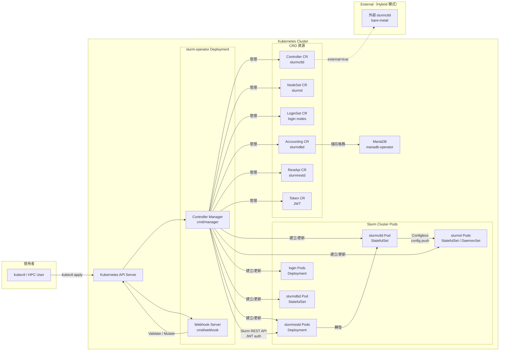
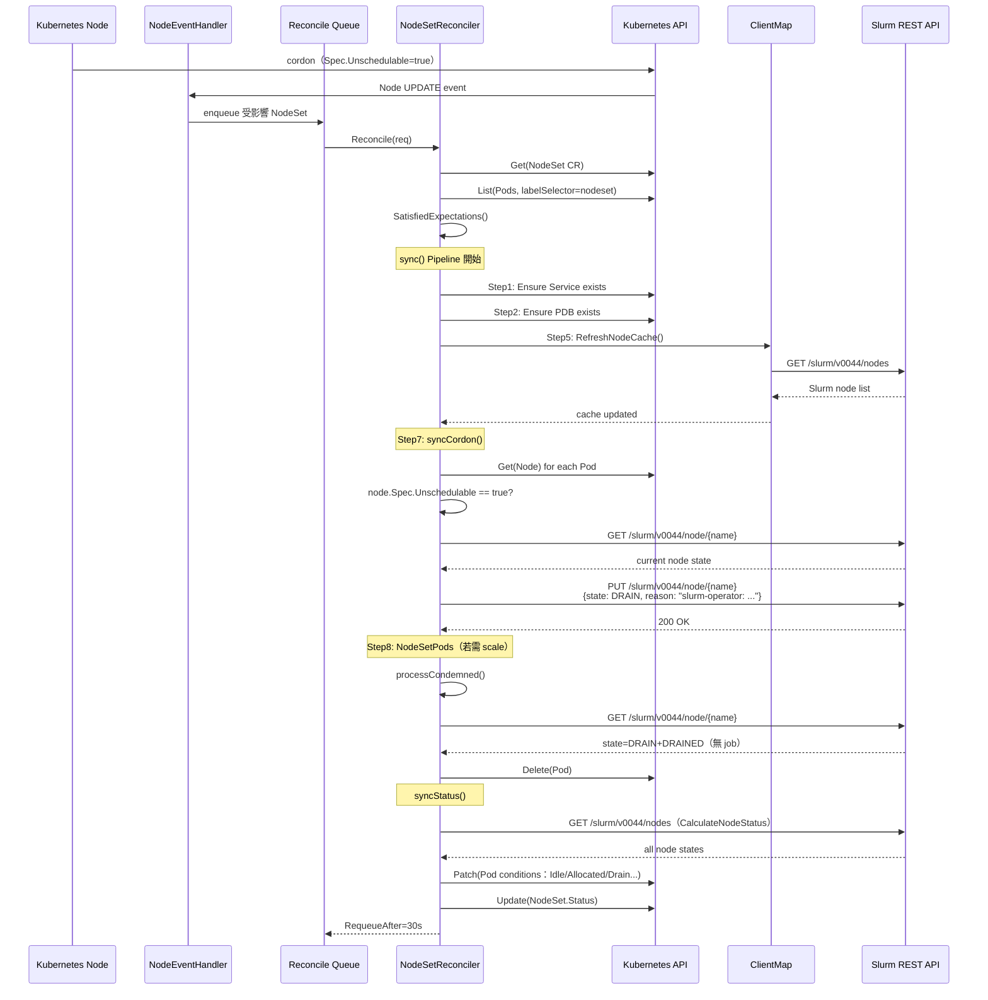
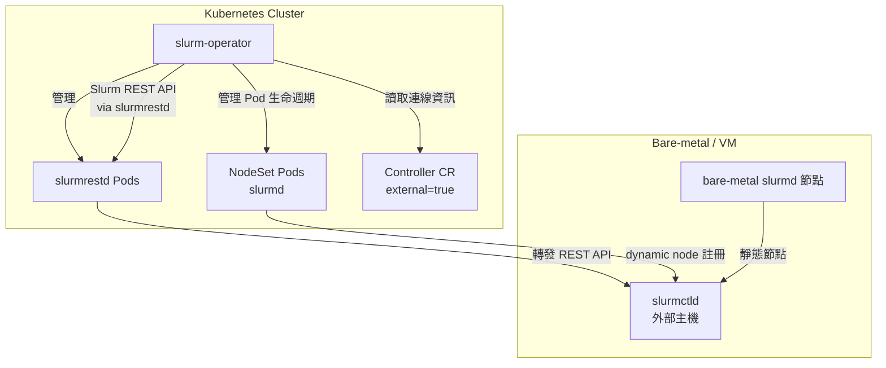

# slurm-operator 系統架構文件

> **版本**：1.2.0-rc1 | **語言**：Go 1.26.3 | **框架**：controller-runtime 0.23.3
> **API Group**：`slinky.slurm.net/v1beta1` | **最低 Kubernetes**：v1.29 | **最低 Slurm**：25.11

---

## 1. 高層架構

slurm-operator 是 [Slinky 計畫](https://github.com/SlinkyProject)的核心元件，由 SchedMD LLC（Slurm 主要開發商）主導、NVIDIA 支援開發。其目標是讓 Slurm HPC workload manager 以 cloud-native 方式運行在 Kubernetes 上，統一 HPC 與雲端工作負載的排程平台。



### 兩個獨立 Deployment

| Deployment | 進入點 | 監聽 Port | 主要職責 |
|-----------|--------|-----------|---------|
| `slurm-operator` | `cmd/manager/main.go` | `:8080`（metrics）`:8081`（health） | CRD Reconcile loop |
| `slurm-operator-webhook` | `cmd/webhook/main.go` | `:9443`（webhook）`:8081`（health） | Admission validation + topology mutation |

**安裝順序**：`cert-manager → slurm-operator-crds → slurm-operator → slurm（cluster）`

---

## 2. 元件清單

| 名稱 | 職責 | 關鍵檔案/目錄 | 上游依賴 | 下游依賴 |
|------|------|--------------|---------|---------|
| **Controller Manager** | 管理所有 CRD reconcile loop，leader election | `cmd/manager/main.go` | Kubernetes API | 所有 Controller |
| **Webhook Server** | CR 驗證、Pod topology annotation 注入 | `cmd/webhook/main.go` | Kubernetes API | — |
| **Controller Ctrl** | 管理 slurmctld StatefulSet、slurm.conf ConfigMap | `internal/controller/controller/` | Controller CR | slurmctld Pod |
| **NodeSet Ctrl** | 管理 slurmd Pods（最複雜），雙 API 調和 | `internal/controller/nodeset/` | NodeSet CR, Slurm REST API | slurmd Pods |
| **LoginSet Ctrl** | 管理 login node Deployment | `internal/controller/loginset/` | LoginSet CR | login Pods |
| **Accounting Ctrl** | 管理 slurmdbd StatefulSet | `internal/controller/accounting/` | Accounting CR | slurmdbd Pod, MariaDB |
| **RestApi Ctrl** | 管理 slurmrestd Deployment | `internal/controller/restapi/` | RestApi CR | slurmrestd Pods |
| **Token Ctrl** | 產生並輪換 Slurm JWT，寫入 Secret | `internal/controller/token/` | Token CR, JwtKeyRef Secret | Kubernetes Secret |
| **SlurmClient Ctrl** | 維護 Slurm REST API client（每個 Controller 一個） | `internal/controller/slurmclient/` | Controller CR, RestApi CR | `ClientMap` |
| **ClientMap** | Thread-safe map 儲存各 Controller 的 Slurm client | `internal/clientmap/clientmap.go` | SlurmClient Ctrl | NodeSet Ctrl |
| **SyncSteps** | 泛型 pipeline，依序執行各 sync 步驟 | `internal/syncsteps/syncsteps.go` | — | 所有 Controller |
| **Builder 系統** | 從 CR Spec 產生 Kubernetes 物件規格 | `internal/builder/` | CRD Spec | API Server |
| **PodBindingWebhook** | 在 Pod 排程時注入 topology annotation（唯一 Mutating Webhook） | `internal/webhook/pod_binding_webhook.go` | Kube Scheduler binding | NodeSet Ctrl |

---

## 3. 六個 CRD 詳細說明

### 3.1 Controller（slurmctld）

**對應 Slurm 元件**：`slurmctld`（Slurm 主控 daemon）

Controller CR 是整個 Slurm 叢集的根物件。其他所有 CR（NodeSet、LoginSet、RestApi）都透過 `controllerRef` 指向某個 Controller CR。

**主要欄位**：
- `slurmKeyRef`：`auth/slurm` 認證金鑰 Secret（`external=false` 時必填）
- `jwtKeyRef`：JWT signing key Secret（`external=false` 時必填）
- `accountingRef`：指向 Accounting CR（可選）
- `inplaceReconfigure`：是否支援原地重新設定，不重啟 slurmctld
- `extraConf`：附加到自動產生的 `slurm.conf` 末尾的自訂設定
- `configFileRefs` / `prologScriptRefs` / `epilogScriptRefs`：從 ConfigMap 掛載額外設定與腳本
- `external`：`true` 時代表 slurmctld 運行在 Kubernetes 外部（Hybrid 模式）

**Sync 步驟**（`controller_sync.go`）：
1. `Service` → slurmctld Kubernetes Service
2. `Config` → 產生 `slurm.conf` ConfigMap（external 模式僅含連線資訊）
3. `StatefulSet` → slurmctld StatefulSet（含 `slurmctld`、`reconfigure`、`logfile` containers）
4. `ServiceMonitor` → Prometheus ServiceMonitor（可選）

---

### 3.2 NodeSet（slurmd）— StatefulSet vs DaemonSet

**對應 Slurm 元件**：`slurmd`（計算節點 daemon）

NodeSet 是 operator 中**最複雜的 CRD**，負責同時調和 Kubernetes Pod 狀態與 Slurm node 狀態（雙 API 調和）。

**ScalingMode**（`api/v1beta1/nodeset_types.go`）：

| 模式 | `+kubebuilder:default` | 行為 | 適用場景 |
|------|----------------------|------|---------|
| `StatefulSet`（預設） | ✓ | 固定 `replicas` 個 Pod，有序 ordinal 命名 | GPU 節點、需固定 hostname 的工作負載 |
| `DaemonSet` | — | 每個符合 `nodeSelector/tolerations` 的 Kube node 部署一個 Pod | 跨所有 worker node 均勻部署 |

**DaemonSet 模式的內部實作**：直接引用 `k8s.io/kubernetes/pkg/controller/daemon/util` 的 `NodeShouldRunDaemonPod()` 邏輯，這是 slurm-operator 直接依賴 Kubernetes 內部套件的主要原因。

**PinToNode**（StatefulSet 模式）：`spec.pinToNode=true` 時，operator 在 `status.ordinalToNode` 記錄 Pod ordinal 與 Kube node 的對應，並在後續 reconcile 注入 `nodeAffinity`，確保 Pod 固定在同一 Kube node 重啟，防止 Slurm 節點名稱漂移。

**WorkloadDisruptionProtection**：預設 `true`，operator 建立動態 PodDisruptionBudget，`maxUnavailable` 等於當前執行 Slurm job 的 Pod 數，隨 job 完成動態調整，防止 Kubernetes 在 job 執行中強制驅逐 Pod。

**關鍵 Sync 步驟**（共 11 步，`nodeset_sync.go`）：
```
ClusterWorkerService → ClusterWorkerPDB → SSHConfig → NodeTaint
    → RefreshNodeCache(StopOnError) → SlurmDeadline → Cordon
    → NodeSetPods → SlurmNodeRecords → SlurmNodes → SlurmTopology
```

`RefreshNodeCache` 設定 `StopOnError=true`，若 Slurm REST API 不可達則立即停止後續步驟。

---

### 3.3 LoginSet（login nodes）

**對應 Slurm 元件**：Login node（使用者提交 job 的入口）

LoginSet 管理 login node 的 Deployment。Login node 需要連接到 slurmctld 以提交 job，並提供 SSH 存取。

**主要欄位**：
- `controllerRef`：指向 Controller CR（建立後不可修改，由 webhook 強制）
- `sssdConfRef`：SSSD 設定（使用者身份驗證）
- `sshdConfig`：SSH daemon 設定

---

### 3.4 Accounting（slurmdbd）

**對應 Slurm 元件**：`slurmdbd`（Slurm 帳務資料庫 daemon）

Accounting CR 管理 slurmdbd 的 StatefulSet。slurmdbd 將 job 歷史、使用量等資料儲存到 MariaDB。

**主要欄位**：
- `slurmKeyRef`：`auth/slurm` 金鑰（external=false 時必填）
- `jwtKeyRef`：JWT 金鑰
- `storageConfig`：MariaDB 連線設定，透過 `mariadb-operator` 整合

支援 `external=true`，讓 operator 連接到 Kubernetes 外部的 slurmdbd。

---

### 3.5 RestApi（slurmrestd）

**對應 Slurm 元件**：`slurmrestd`（Slurm REST API daemon）

RestApi CR 管理 slurmrestd 的 Deployment。slurmrestd 是 operator 透過 Slurm REST API 與 Slurm cluster 溝通的橋樑。

**主要欄位**：
- `controllerRef`：指向 Controller CR
- `replicas`：slurmrestd 副本數（可搭配 HPA）

SlurmClient controller 自動發現 RestApi Service FQDN，作為 Slurm REST API endpoint。

---

### 3.6 Token（JWT 管理）

**對應功能**：為外部使用者（如 JupyterHub、CI/CD）產生 Slurm JWT

Token CR 是面向**終端使用者**的 CRD，允許將 Slurm JWT 輸出到 Kubernetes Secret，供其他 Pod 或工具使用。

**主要欄位**：
- `username`：Slurm 使用者名稱（JWT `sun` claim）
- `lifetime`：Token 有效期（Duration 格式）
- `refresh`：`true` 時自動在 Token 過期前輪換
- `jwtKeyRef`：JWT signing key Secret
- `secretRef`：輸出 Token 的 Secret 名稱

**與 SlurmClient Ctrl 的差異**：Token CR 產生的 JWT 給外部使用者；SlurmClient Ctrl 產生的 JWT 是 operator 自己呼叫 slurmrestd 用的（lifetime 15 分鐘，每 12 分鐘自動輪換）。

---

## 4. 通訊模式

### 4.1 同步 API 呼叫

**Kubernetes API**（透過 `controller-runtime` client）：
- `r.Get()` / `r.List()` → 讀取 CR、Pod、Node 狀態
- `r.Create()` / `r.Update()` / `r.Patch()` → 建立/更新 Kubernetes 物件
- `r.Status().Update()` → 回寫 CR Status

**Slurm REST API**（透過 `slurm-client` v1.1.0-rc1）：
- `GET /slurm/v0044/node/{name}` → 讀取 Slurm node 狀態
- `PUT /slurm/v0044/node/{name}` → 更新 Slurm node（DRAIN/UNDRAIN/topology）
- `DELETE /slurm/v0044/node/{name}` → 刪除 Slurm node 記錄
- 認證：JWT Bearer token（`Authorization: Bearer <jwt>`）

### 4.2 事件驅動（Event Handlers）

NodeSet controller 監聽多種資源變化，轉換為 reconcile 請求：

| 資源 | Handler 位置 | 觸發行為 |
|------|------------|---------|
| `Pod` | `eventhandler/eventhandler_pod.go` | Pod 建立/更新/刪除 → 更新 expectations，enqueue NodeSet |
| `Node` | `eventhandler/eventhandler_node.go` | Node cordon/uncordon → 影響所在 NodeSet reconcile |
| `Controller` CR | `eventhandler/eventhandler_controller.go` | Controller 變化 → 通知相關 NodeSet |
| `Secret` | `eventhandler/eventhandler_secret.go` | auth key / JWT key 變化 → 觸發 reconcile |

### 4.3 週期性調和（RequeueAfter）

透過 `internal/utils/durationstore/durationstore.go` 的 `DurationStore` 機制：

| Controller | RequeueAfter | 說明 |
|-----------|-------------|------|
| NodeSet | 30 秒 | 固定週期確保狀態一致 |
| SlurmClient | 12 分鐘 | JWT 快過期前（15 分鐘 × 4/5）重新產生 |
| Token（refresh=true） | 根據 lifetime 計算 | 自動輪換前觸發 |

---

## 5. 關鍵設計決策與 Trade-off

### 5.1 以 auth/slurm 取代 MUNGE

**決策**：使用 Slurm 內建的 `auth/slurm`（加密金鑰認證）取代傳統 MUNGE 認證。

**理由**：
- MUNGE daemon 需要在所有節點上運行，管理困難
- `auth/slurm` 可以透過 `use_client_ids` 在無 LDAP 的容器化環境中認證使用者
- Kubernetes Secret 可安全地分發加密金鑰給各 Pod

**Trade-off**：需要 Slurm 25.11+ 版本，不相容舊版 Slurm 設施。

### 5.2 Configless Slurm

**決策**：使用 Slurm 的 Configless 模式，`slurmd` 從 `slurmctld` 動態取得設定，不需要 NFS 掛載或預先分發 `slurm.conf`。

**理由**：
- 避免在所有計算節點上維護一份一致的 `slurm.conf`
- 符合雲端原生的 cattle（牲口）而非 pet（寵物）理念
- 支援節點動態加入，不需修改設定檔

**Trade-off**：slurmctld 成為單點，slurmd 無法在 slurmctld 不可用時自主運作。

### 5.3 Dynamic Nodes

**決策**：`slurmd` 以 Slurm Dynamic Node 方式啟動，不需預先在 `slurm.conf` 中定義節點。

**理由**：
- 支援 Kubernetes 的彈性擴縮容（Autoscaling）
- 新 Pod 啟動後自動向 slurmctld 註冊
- 配合 DaemonSet 模式，節點可動態加入/退出 Slurm 叢集

**Trade-off**：Dynamic Nodes 有 Slurm 版本限制，且部分 Slurm 功能（如特定的 topology plugin）需要額外設定。

### 5.4 雙 API 調和的複雜性

**決策**：NodeSet controller 同時調和 Kubernetes API 與 Slurm REST API 的狀態。

**複雜性**：
- 兩個 API 的狀態可能暫時不一致（Slurm node DOWN 但 Pod 仍 Running）
- `RefreshNodeCache(StopOnError=true)` 確保在 Slurm API 不可達時停止後續操作
- `ControllerExpectations` 機制防止在 informer 確認前重複建立/刪除 Pod
- `processCondemned()` 在刪除 Pod 前必須確認 Slurm job 已完成

**Trade-off**：增加了 controller 邏輯複雜度，但確保了 workload protection（不中斷執行中的 HPC job）。

### 5.5 直接引用 k8s.io/kubernetes 內部套件

**決策**：NodeSet 的 DaemonSet 模式直接引用 `k8s.io/kubernetes/pkg/controller/daemon/util`（Kubernetes 內部套件）。

**理由**：
- 重用 Kubernetes 官方的 DaemonSet 調度邏輯（`NodeShouldRunDaemonPod()`），避免重新實作
- 確保 DaemonSet 模式的行為與 Kubernetes 原生 DaemonSet 一致

**Trade-off**：
- `k8s.io/kubernetes` 不是公開穩定的 API，可能隨版本變化而 break
- 增加了版本升級的複雜度
- 需要在 `go.mod` 中 `replace` directive 精確鎖定版本

---

## 6. NodeSet Reconcile 核心流程（Sequence Diagram）



---

## 7. Hybrid 架構（external=true 模式）

Hybrid 模式允許 operator 管理「Kubernetes 中的計算節點 + 外部 bare-metal slurmctld」的混合部署。



**運作方式**（`controller_sync.go`）：
- `Controller.Spec.External=true` → operator **跳過** Service 和 StatefulSet 建立步驟
- 改為建立包含外部連線資訊（host/port）的 ConfigMap，供 NodeSet Pods 使用
- NodeSet Pods 中的 `slurmd` 向外部 `slurmctld` 以 Dynamic Node 方式註冊
- operator 透過 RestApi CR（slurmrestd）呼叫外部 Slurm cluster 的 REST API

**應用場景**：
- 漸進式遷移：既有 bare-metal HPC 叢集逐步加入 Kubernetes 節點
- 資源混用：GPU 節點在 Kubernetes，CPU 節點在 bare-metal
- Kubernetes 節點作為 burst 擴充，主計算資源在 bare-metal

**限制**：`externalConfig.host/port` 必須在 `external=true` 時填寫（由 webhook validation rule 強制）。

---

## 附錄：關鍵檔案索引

| 功能 | 檔案路徑 |
|------|---------|
| Controller Manager 進入點 | `cmd/manager/main.go` |
| Webhook Server 進入點 | `cmd/webhook/main.go` |
| CRD 型別定義 | `api/v1beta1/*_types.go` |
| NodeSet Reconcile 主邏輯 | `internal/controller/nodeset/nodeset_sync.go` |
| NodeSet Status 同步 | `internal/controller/nodeset/nodeset_sync_status.go` |
| Slurm 操作抽象 | `internal/controller/nodeset/slurmcontrol/slurmcontrol.go` |
| SlurmClient 維護 | `internal/controller/slurmclient/slurmclient_sync.go` |
| Thread-safe Client Map | `internal/clientmap/clientmap.go` |
| 通用 Sync Pipeline | `internal/syncsteps/syncsteps.go` |
| JWT Token 產生 | `internal/controller/token/slurmjwt/token.go` |
| Topology Mutation Webhook | `internal/webhook/pod_binding_webhook.go` |
| Slurm 狀態 → Pod Conditions | `pkg/conditions/conditions.go` |
| DurationStore（RequeueAfter） | `internal/utils/durationstore/durationstore.go` |
