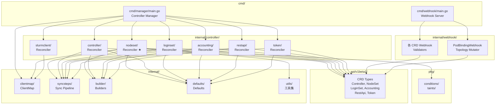

# Codebase Map — slurm-operator

## Annotated 目錄樹

```
slurm-operator/
│
├── api/                        # CRD API 型別定義（外部可匯入）
│   └── v1beta1/
│       ├── groupversion_info.go     # API group: slinky.slurm.net, version: v1beta1
│       ├── base_types.go            # 共用型別（ObjectReference, PodTemplate, ServiceSpec 等）
│       ├── well_known.go            # 所有 Annotation/Label 常數定義
│       ├── controller_types.go      # Controller CRD（slurmctld）型別
│       ├── controller_keys.go       # Controller 的 annotation/label key 常數
│       ├── controller_convert.go    # CRD version conversion（Hub）
│       ├── nodeset_types.go         # NodeSet CRD（slurmd）型別
│       ├── nodeset_keys.go
│       ├── nodeset_convert.go
│       ├── loginset_types.go        # LoginSet CRD 型別
│       ├── loginset_keys.go
│       ├── loginset_convert.go
│       ├── accounting_types.go      # Accounting CRD（slurmdbd）型別
│       ├── accounting_keys.go
│       ├── accounting_convert.go
│       ├── restapi_types.go         # RestApi CRD（slurmrestd）型別
│       ├── restapi_keys.go
│       ├── restapi_convert.go
│       ├── token_types.go           # Token CRD（JWT 管理）型別
│       ├── token_keys.go
│       ├── token_convert.go
│       └── zz_generated.deepcopy.go # 自動產生，勿手動修改
│
├── cmd/                        # 可執行的二進位進入點
│   ├── main.go                     # ⚠️ 空檔（占位符）
│   ├── manager/
│   │   ├── main.go                 # ★ Controller Manager 主程式
│   │   └── main_test.go
│   └── webhook/
│       ├── main.go                 # ★ Webhook Server 主程式
│       └── main_test.go
│
├── config/                     # Kustomize 部署 YAML（非 Helm 路徑）
│   ├── crd/bases/                  # 產生的 CRD YAML（make manifests）
│   ├── rbac/manager/               # Controller Manager RBAC
│   ├── rbac/webhook/               # Webhook Server RBAC
│   └── webhook/manifests.yaml      # Webhook configuration
│
├── docs/                       # 官方文件（Sphinx 格式）
│   ├── concepts/
│   │   ├── architecture.md         # 架構說明（含 Slurm 必要功能說明）
│   │   ├── nodeset-controller.md   # NodeSet controller 詳細說明
│   │   ├── slurmclient-controller.md
│   │   └── slurm.md                # Slurm 基礎概念
│   └── usage/
│       ├── autoscaling.md          # HPA 自動縮放
│       ├── hybrid.md               # 混合 k8s/bare-metal
│       ├── jupyter.md              # Jupyter 整合
│       ├── nodeset-operations.md   # NodeSet 操作指南
│       ├── pyxis.md                # OCI container jobs
│       ├── sriov.md                # SR-IOV 高速網路
│       ├── topology.md             # 拓撲感知排程
│       ├── tutorial-pytorch.md     # PyTorch 分散式訓練
│       └── workload-isolation.md   # 工作負載隔離
│
├── hack/                       # 開發工具腳本
│   ├── kind.sh                     # 建立 kind 本機測試叢集（含 openldap 範例）
│   ├── kind.yaml                   # kind 設定
│   ├── watch.sh                    # 本機開發 watch 腳本
│   ├── README.md.gotmpl            # Helm README 模板
│   ├── profile.sh                  # ★ 新增（2026-06-30）pprof profiling 腳本
│   ├── fix-vulns.sh                # ★ 新增（2026-06-30）govulncheck 漏洞修復腳本
│   ├── openldap-values.yaml        # ★ 新增（2026-06-30）OpenLDAP kind 測試設定
│   └── resources/                  # 測試用資源 YAML
│
├── helm/                       # Helm Charts
│   ├── slurm/                      # ★ Slurm 叢集 chart（slurm.conf、所有元件）
│   │   ├── Chart.yaml
│   │   ├── values.yaml             # 使用者面對的主要設定入口
│   │   ├── templates/              # 所有 CR YAML 模板
│   │   └── _vendor/                # chart 依賴
│   ├── slurm-operator/             # ★ Operator chart（Deployment、RBAC、webhook 設定）
│   │   ├── Chart.yaml
│   │   ├── values.yaml
│   │   └── templates/
│   └── slurm-operator-crds/        # ★ CRD chart（可獨立升級）
│       ├── Chart.yaml
│       └── templates/              # 包含所有 CRD YAML
│
├── internal/                   # 私有程式碼（不可被外部 module 匯入）
│   ├── builder/                    # Kubernetes 物件建構器
│   │   ├── common/                 # ★ 共用建構邏輯（container、secret、PDB 等）
│   │   ├── controllerbuilder/      # Controller → StatefulSet, ConfigMap, Service
│   │   ├── workerbuilder/          # NodeSet + Controller → Pod, Service
│   │   ├── loginbuilder/           # LoginSet → Deployment, Service, Secret
│   │   ├── accountingbuilder/      # Accounting → StatefulSet, ConfigMap, Service
│   │   ├── restapibuilder/         # RestApi → Deployment, Service
│   │   ├── labels/                 # Label 管理工具（app.kubernetes.io/* labels）
│   │   └── metadata/               # Annotation/Label 設定工具
│   │
│   ├── clientmap/                  # Slurm REST API client 的執行緒安全 map
│   │   └── clientmap.go            # ★ ClientMap: sync.RWMutex + map[string]client.Client
│   │
│   ├── controller/                 # ★★ 核心 Reconcile Logic
│   │   ├── accounting/             # Accounting CRD controller
│   │   │   ├── accounting_controller.go  # SetupWithManager, Reconcile
│   │   │   ├── accounting_sync.go        # Sync() pipeline
│   │   │   ├── accounting_sync_status.go # syncStatus()
│   │   │   └── eventhandler/             # 觸發 reconcile 的事件處理器
│   │   ├── controller/             # Controller CRD controller
│   │   │   ├── controller_controller.go
│   │   │   ├── controller_sync.go        # ★ 4-step pipeline（Service, Config, StatefulSet, ServiceMonitor）
│   │   │   └── eventhandler/
│   │   ├── loginset/               # LoginSet CRD controller
│   │   ├── nodeset/                # ★★★ NodeSet CRD controller（最複雜）
│   │   │   ├── nodeset_controller.go     # SetupWithManager, Reconcile
│   │   │   ├── nodeset_sync.go           # ★★ Sync() 主邏輯（11-step pipeline）
│   │   │   ├── nodeset_sync_status.go    # Slurm 狀態 → NodeSet.Status
│   │   │   ├── nodeset_history.go        # ControllerRevision 管理
│   │   │   ├── eventhandler/             # Pod/Node/Controller/Secret 事件處理器
│   │   │   ├── indexes/                  # Informer field index 設定
│   │   │   ├── podcontrol/               # ★ Pod CRUD 操作（CreateNodeSetPod, PVC 管理）
│   │   │   ├── slurmcontrol/             # ★ Slurm REST API 操作（Interface + 實作）
│   │   │   └── utils/                    # Pod 排序、ordinal 計算等工具
│   │   ├── restapi/                # RestApi CRD controller
│   │   ├── slurmclient/            # ★ Slurm client 管理（JWT 產生、client 建立）
│   │   │   ├── slurmclient_controller.go
│   │   │   ├── slurmclient_sync.go       # JWT 生命週期管理 + slurmclient.NewClient()
│   │   │   ├── eventhandler/             # ★ 新增（2026-06-30）RestAPI 事件監聽
│   │   │   │   └── eventhandler_restapi.go  # 監聽 RestAPI 變更以觸發 SlurmClient reconcile
│   │   │   └── utils/                    # ★ 新增（2026-06-30）排序工具
│   │   │       └── sort.go               # deterministic RestAPI 選取排序邏輯
│   │   └── token/                  # Token CRD controller（JWT 輸出到 Secret）
│   │       ├── token_controller.go
│   │       ├── token_sync.go
│   │       └── slurmjwt/                 # JWT 產生/解析工具
│   │
│   ├── defaults/                   # CRD 欄位預設值（在 Reconcile 開始前套用）
│   │   ├── nodeset.go              # NodeSet defaults（replicas=1, ScalingMode=StatefulSet 等）
│   │   ├── controller.go
│   │   ├── loginset.go
│   │   ├── accounting.go
│   │   ├── restapi.go
│   │   └── token.go
│   │
│   ├── syncsteps/                  # ★ 泛型 sync pipeline（Step[T] + Sync[T]()）
│   │
│   ├── utils/                      # 各種工具
│   │   ├── durationstore/          # 動態 RequeueAfter 儲存
│   │   ├── historycontrol/         # ControllerRevision CRUD
│   │   ├── mathutils/              # Clamp 等數學工具
│   │   ├── objectutils/            # SyncObject, PatchObject, DeleteObject
│   │   ├── podcontrol/             # Pod condition 工具
│   │   ├── podinfo/                # Pod → Slurm node 的 metadata 映射
│   │   ├── podutils/               # Pod 狀態判斷（IsRunning, IsTerminating 等）
│   │   ├── refresolver/            # CRD reference 解析（controllerRef, secretRef 等）
│   │   ├── structutils/            # 結構體比較工具
│   │   ├── timestore/              # 時間戳 map（用於 job deadline）
│   │   └── tools.go                # SlowStartBatch 等
│   │
│   └── webhook/                    # ★ Admission Webhooks
│       ├── accounting_webhook.go   # Accounting CRD 驗證
│       ├── controller_webhook.go   # Controller CRD 驗證
│       ├── loginset_webhook.go     # LoginSet CRD 驗證
│       ├── nodeset_webhook.go      # NodeSet CRD 驗證
│       ├── pod_binding_webhook.go  # ★ Pod binding Mutator（拓撲注入）
│       ├── restapi_webhook.go      # RestApi CRD 驗證
│       └── token_webhook.go        # Token CRD 驗證
│
├── pkg/                        # 公開可匯入的程式碼
│   ├── conditions/conditions.go    # Slurm node state → PodConditionType 常數映射
│   └── taints/taints.go            # Kubernetes taint 常數（TaintNodeWorker）
│
├── test/                       # 測試工具
│   ├── test_types.go               # 測試型別定義
│   ├── test_utils.go               # 測試工具函式
│   ├── component_utils.go          # 元件測試工具
│   └── e2e/                        # End-to-end 測試
│       ├── e2e_test.go             # E2E 測試主入口
│       ├── e2e_installation_utils.go
│       ├── e2e_component_utils.go
│       └── e2e_test_utils.go
│
├── tools/                      # 建置時需要的 Go 工具（controller-gen 等）
│
├── Makefile                    # ★ 所有開發指令的入口
├── Dockerfile                  # Operator 映像建置
├── docker-bake.hcl             # 多映像 buildx 設定
├── go.mod                      # Go module 定義（module: github.com/SlinkyProject/slurm-operator）
├── VERSION                     # 目前版本（1.2.0-rc1）
└── .golangci.yaml              # linting 設定
```

---

## 「我想改 X，要看哪裡？」速查表

| 我想要... | 看這裡 | 關鍵檔案 |
|---------|--------|---------|
| 修改 NodeSet CRD 欄位 | `api/v1beta1/` | `nodeset_types.go` |
| 修改 NodeSet 調和邏輯 | `internal/controller/nodeset/` | `nodeset_sync.go` |
| 修改 Slurm API 操作 | `internal/controller/nodeset/slurmcontrol/` | `slurmcontrol.go` |
| 修改 Controller（slurmctld）調和邏輯 | `internal/controller/controller/` | `controller_sync.go` |
| 修改 JWT 產生邏輯 | `internal/controller/token/slurmjwt/` | `token.go` |
| 修改 Slurm client 認證更新 | `internal/controller/slurmclient/` | `slurmclient_sync.go` |
| 修改 SlurmClient 觸發邏輯（RestAPI 事件） | `internal/controller/slurmclient/eventhandler/` | `eventhandler_restapi.go` |
| 修改 SlurmClient 選取 RestAPI 策略 | `internal/controller/slurmclient/utils/` | `sort.go` |
| 新增/修改 slurm.conf 設定產生 | `internal/builder/controllerbuilder/` | `controller_config.go` |
| 新增/修改 slurmd pod 規格 | `internal/builder/workerbuilder/` | `worker_app.go` |
| 修改 NodeSet webhook 驗證 | `internal/webhook/` | `nodeset_webhook.go` |
| 修改 pod 拓撲注入邏輯 | `internal/webhook/` | `pod_binding_webhook.go` |
| 修改 CRD 預設值 | `internal/defaults/` | `nodeset.go` 等 |
| 新增 CRD 欄位預設值 | `internal/defaults/` | 對應 `*.go` |
| 修改 Helm chart 設定 | `helm/slurm/` | `values.yaml`, `templates/` |
| 修改 Operator 部署設定 | `helm/slurm-operator/` | `values.yaml`, `templates/` |
| 修改 RBAC 權限 | `config/rbac/` | `*.yaml` 或 kubebuilder markers |
| 查看所有 Label/Annotation 定義 | `api/v1beta1/` | `well_known.go` |
| 修改 Slurm node 狀態對映 | `pkg/conditions/` | `conditions.go` |
| 新增 E2E 測試 | `test/e2e/` | `e2e_test.go` |
| 新增單元測試 | 對應 `*_test.go` | 同目錄下 |

---

## 模組依賴關係圖



---

## 關鍵呼叫鏈

### NodeSet Reconcile → Slurm Drain

```
NodeSetReconciler.Reconcile()
  → Sync()
    → sync()
      → syncsteps.Sync(steps)
        → Step[Cordon]: syncCordon()
          → slurmControl.MakeNodeDrain(pod, reason)  [SlurmControlInterface]
            → realSlurmControl.MakeNodeDrain()
              → clientMap.Get(controllerRef)  [ClientMap]
                → slurmClient.Update(slurmNode, {State: DRAIN})  [slurm-client]
                  → PUT http://{slurmrestd}:6820/slurm/v0044/node/{name}
```

### SlurmClient Controller → JWT 更新

```
SlurmClientReconciler.Reconcile()
  → Sync()
    → getRestApiServer()  [取得 slurmrestd URL]
    → refResolver.GetSecretKeyRef()  [取得 JWT signing key]
    → slurmjwt.NewToken(signingKey).NewSignedToken()  [產生 JWT]
    → clientMap.Add(controller, slurmClient)  [儲存 client]
    → durationStore.Push(refresh)  [排程 12min 後更新]
```
