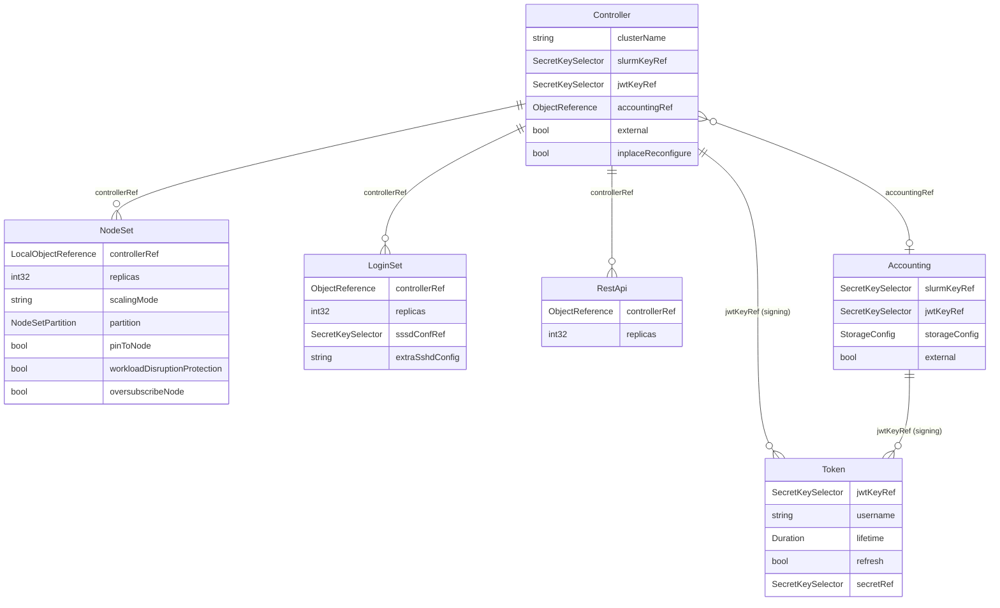

# DATA_MODEL — slurm-operator CRD 資料模型

> API Group: `slinky.slurm.net/v1beta1` | 版本: 1.2.0-rc1

---

## 1. CRD 關係圖

<!-- 更新於 2026-06-30, commit range: d5c49df..cfb5029 -->


---

## 2. 各 CRD 欄位詳細說明

### 2.1 Controller（slurmctld）

對應 Slurm 元件：`slurmctld`（Slurm 主控 daemon）。以 Kubernetes StatefulSet 部署（`external=false` 時）。

#### Spec 關鍵欄位

| 欄位 | 型別 | 必填 | 預設值 | 用途 |
|------|------|------|--------|------|
| `clusterName` | `string` | 否 | `""` | Slurm ClusterName，對應 `slurm.conf#ClusterName` |
| `slurmKeyRef` | `SecretKeySelector` | 條件必填 | — | `auth/slurm` 加密金鑰；`external=false` 時必填 |
| `jwtKeyRef` | `*SecretKeySelector` | 條件必填 | — | `auth/jwt` JWT 簽章金鑰（PEM 格式）；`external=false` 時需填此或 `jwtHs256KeyRef` |
| `jwtHs256KeyRef` | `*SecretKeySelector` | 否 | — | **已棄用**，改用 `jwtKeyRef` |
| `jwksKeyRef` | `*ConfigMapKeySelector` | 否 | — | `auth/jwt` JWKS 格式金鑰（ConfigMap） |
| `accountingRef` | `*ObjectReference` | 否 | — | 指向 Accounting CR；設定後啟用 slurmdbd 整合 |
| `external` | `bool` | 否 | `false` | `true` 代表 slurmctld 在 Kubernetes 外部運行（Hybrid 模式） |
| `externalConfig` | `ExternalConfig` | 條件必填 | — | `external=true` 時需填，指定外部 host/port |
| `slurmctld` | `ContainerWrapper` | 否 | — | slurmctld 主容器設定（繼承 `corev1.Container`） |
| `inplaceReconfigure` | `bool` | 否 | `false` | `true` 時 slurm.conf 變更不需重建 Pod，由 reconfigure sidecar 原地套用 |
| `reconfigure` | `ContainerWrapper` | 否 | — | reconfigure sidecar 容器設定 |
| `logfile` | `ContainerWrapper` | 否 | — | 日誌 sidecar 容器設定 |
| `template` | `PodTemplate` | 否 | — | Pod metadata 與 PodSpec 模板 |
| `extraConf` | `string` | 否 | — | 附加到 `slurm.conf` 末尾的自訂設定 |
| `configFileRefs` | `[]ObjectReference` | 否 | — | 額外掛載到 `/etc/slurm` 的 ConfigMap 清單 |
| `prologScriptRefs` | `[]ObjectReference` | 否 | — | Prolog 腳本 ConfigMap 清單 |
| `epilogScriptRefs` | `[]ObjectReference` | 否 | — | Epilog 腳本 ConfigMap 清單 |
| `prologSlurmctldScriptRefs` | `[]ObjectReference` | 否 | — | PrologSlurmctld 腳本 ConfigMap 清單 |
| `epilogSlurmctldScriptRefs` | `[]ObjectReference` | 否 | — | EpilogSlurmctld 腳本 ConfigMap 清單 |
| `persistence` | `ControllerPersistence` | 否 | enabled=true | slurmctld save-state PVC 設定 |
| `service` | `ServiceSpec` | 否 | — | 自訂 Kubernetes Service 模板 |
| `metrics` | `Metrics` | 否 | enabled=false | Prometheus ServiceMonitor 設定 |

#### Status 欄位

| 欄位 | 型別 | 說明 |
|------|------|------|
| `conditions` | `[]metav1.Condition` | 最新觀測狀態（Available、Progressing 等） |

---

### 2.2 NodeSet（slurmd 計算節點群組）

對應 Slurm 元件：`slurmd`（計算節點 daemon）。支援 StatefulSet 與 DaemonSet 兩種擴展模式。

<!-- 更新於 2026-06-30, commit range: d5c49df..cfb5029 -->
#### Spec 關鍵欄位

| 欄位 | 型別 | 必填 | 預設值 | 用途 |
|------|------|------|--------|------|
| `controllerRef` | `corev1.LocalObjectReference` | **是** | — | 指向所屬的 Controller CR（**僅限同 namespace**，不允許跨 namespace 參照） |
| `replicas` | `*int32` | 否 | `1` | 期望 Pod 數（StatefulSet 模式有效） |
| `scalingMode` | `ScalingModeType` | 否 | `StatefulSet` | `StatefulSet`（固定數量）或 `DaemonSet`（每節點一個） |
| `slurmd` | `ContainerWrapper` | 否 | — | slurmd 主容器設定 |
| `ssh` | `NodeSetSsh` | 否 | enabled=false | SSH 存取設定（含 `sssdConfRef`、`extraSshdConfig`） |
| `logfile` | `ContainerWrapper` | 否 | — | 日誌 sidecar 容器設定 |
| `template` | `PodTemplate` | 否 | — | Pod metadata 與 PodSpec 模板 |
| `extraConf` | `string` | 否 | — | 傳給 `slurmd --conf` 的額外節點參數 |
| `partition` | `NodeSetPartition` | 否 | enabled=false | 是否為此 NodeSet 建立 Slurm Partition |
| `volumeClaimTemplates` | `[]PVC` | 否 | — | Pod 使用的 PVC 模板清單 |
| `updateStrategy` | `NodeSetUpdateStrategy` | 否 | RollingUpdate 25% | Pod 更新策略（RollingUpdate / OnDelete / ScheduledUpdate） |
| `revisionHistoryLimit` | `int32` | 否 | `0` | 保留的 ControllerRevision 歷史數量 |
| `ordinalPadding` | `uint` | 否 | `0` | Pod ordinal 數字補零位數（StatefulSet 模式） |
| `pinToNode` | `bool` | 否 | `false` | Pod 固定到首次排程的 Kube node（StatefulSet 模式） |
| ~~`taintKubeNodes`~~ | ~~`bool`~~ | — | — | **已移除（d5c49df..cfb5029）** — 原功能為對運行此 NodeSet Pod 的 Kube node 套用 NoExecute taint |
| `oversubscribeNode` | `bool` | 否 | `false` | 允許多個 NodeSet Pod 共用同一 Kubernetes Node（移除 anti-affinity）；**不建議用於生產環境** |
| `workloadDisruptionProtection` | `*bool` | 否 | `true` | 是否建立動態 PDB 保護執行中的 Slurm job |
| `pruneSlurmNodeRecords` | `string` | 否 | `Never` | 清除無效 Slurm node 記錄策略（`Never` / `NodeNotFound`） |
| `minReadySeconds` | `int32` | 否 | `0` | Pod 被視為可用的最短就緒秒數 |
| `persistentVolumeClaimRetentionPolicy` | `NodeSetPVCRetentionPolicy` | 否 | Retain/Retain | NodeSet 刪除或縮容時 PVC 的保留策略 |

> **安全性變更（d5c49df..cfb5029）**：`controllerRef` 型別從自訂 `ObjectReference`（含 namespace 欄位）改為 `corev1.LocalObjectReference`，**禁止跨 namespace 參照**。

#### Status 欄位

| 欄位 | 型別 | 說明 |
|------|------|------|
| `replicas` | `int32` | 目前 Pod 總數 |
| `updatedReplicas` | `int32` | 已套用最新模板的 Pod 數 |
| `readyReplicas` | `int32` | Ready 狀態的 Pod 數 |
| `availableReplicas` | `int32` | 可用 Pod 數（Ready 超過 minReadySeconds） |
| `unavailableReplicas` | `int32` | 不可用 Pod 數 |
| `desired` | `int32` | 期望 Pod 數（DaemonSet 為符合 selector 的 node 數） |
| `slurmIdle` | `int32` | Slurm IDLE 節點數（無 job 分配） |
| `slurmAllocated` | `int32` | Slurm ALLOCATED/MIXED 節點數（有 job 執行） |
| `slurmDown` | `int32` | Slurm DOWN 節點數（不可用） |
| `slurmDrain` | `int32` | Slurm DRAIN 節點數（等待 job 完成後下線） |
| `observedGeneration` | `int64` | 最新觀測到的 NodeSet generation |
| `nodeSetHash` | `string` | 最新 ControllerRevision hash |
| `collisionCount` | `*int32` | hash 碰撞計數 |
| `conditions` | `[]metav1.Condition` | 最新觀測狀態 |
| `ordinalToNode` | `map[string]string` | ordinal → Kube node 名稱映射（PinToNode 使用） |
| `selector` | `string` | HPA Scale subresource 用 label selector |

---

### 2.3 LoginSet（登入節點群組）

對應 Slurm 元件：`sackd`（Slurm authentication and cred kiosk daemon）。以 Kubernetes Deployment 部署。

#### Spec 關鍵欄位

| 欄位 | 型別 | 必填 | 預設值 | 用途 |
|------|------|------|--------|------|
| `controllerRef` | `ObjectReference` | **是** | — | 指向所屬的 Controller CR |
| `replicas` | `*int32` | 否 | `1` | 期望 Pod 數 |
| `login` | `ContainerWrapper` | 否 | — | login 主容器設定 |
| `initconf` | `ContainerWrapper` | 否 | — | initconf init 容器設定 |
| `template` | `PodTemplate` | 否 | — | Pod metadata 與 PodSpec 模板 |
| `rootSshAuthorizedKeys` | `string` | 否 | — | `root/.ssh/authorized_keys` 內容 |
| `extraSshdConfig` | `string` | 否 | — | 附加到 `sshd_config` 末尾的設定 |
| `sssdConfRef` | `SecretKeySelector` | 是 | — | 包含 `sssd.conf` 的 Secret 引用 |
| `strategy` | `DeploymentStrategy` | 否 | — | Deployment 更新策略（RollingUpdate/Recreate） |
| `service` | `ServiceSpec` | 否 | — | 自訂 Kubernetes Service 模板 |

#### Status 欄位

| 欄位 | 型別 | 說明 |
|------|------|------|
| `replicas` | `int32` | 目前 Pod 總數 |
| `conditions` | `[]metav1.Condition` | 最新觀測狀態 |
| `selector` | `string` | HPA Scale subresource 用 label selector |

---

### 2.4 Accounting（slurmdbd 會計子系統）

對應 Slurm 元件：`slurmdbd`（Slurm Database Daemon）。與 MariaDB/MySQL 整合。

#### Spec 關鍵欄位

| 欄位 | 型別 | 必填 | 預設值 | 用途 |
|------|------|------|--------|------|
| `slurmKeyRef` | `SecretKeySelector` | 條件必填 | — | `auth/slurm` 加密金鑰；`external=false` 時必填 |
| `jwtKeyRef` | `*SecretKeySelector` | 條件必填 | — | JWT 簽章金鑰；`external=false` 時需填此或 `jwtHs256KeyRef` |
| `jwtHs256KeyRef` | `*SecretKeySelector` | 否 | — | **已棄用**，改用 `jwtKeyRef` |
| `jwksKeyRef` | `*ConfigMapKeySelector` | 否 | — | JWKS 格式金鑰（ConfigMap） |
| `external` | `bool` | 否 | `false` | `true` 代表 slurmdbd 在 Kubernetes 外部運行 |
| `externalConfig` | `ExternalConfig` | 條件必填 | — | `external=true` 時需填，指定外部 host/port |
| `slurmdbd` | `ContainerWrapper` | 否 | — | slurmdbd 主容器設定 |
| `template` | `PodTemplate` | 否 | — | Pod metadata 與 PodSpec 模板 |
| `storageConfig` | `StorageConfig` | 否 | — | MariaDB/MySQL 連線設定（見下方共用型別） |
| `extraConf` | `string` | 否 | — | 附加到 `slurmdbd.conf` 末尾的設定 |
| `service` | `ServiceSpec` | 否 | — | 自訂 Kubernetes Service 模板 |

#### Status 欄位

| 欄位 | 型別 | 說明 |
|------|------|------|
| `conditions` | `[]metav1.Condition` | 最新觀測狀態 |

---

### 2.5 RestApi（slurmrestd）

對應 Slurm 元件：`slurmrestd`（Slurm REST API daemon）。以 Kubernetes Deployment 部署。

#### Spec 關鍵欄位

| 欄位 | 型別 | 必填 | 預設值 | 用途 |
|------|------|------|--------|------|
| `controllerRef` | `ObjectReference` | **是** | — | 指向所屬的 Controller CR |
| `replicas` | `*int32` | 否 | `1` | 期望 Pod 數 |
| `slurmrestd` | `ContainerWrapper` | 否 | — | slurmrestd 主容器設定 |
| `template` | `PodTemplate` | 否 | — | Pod metadata 與 PodSpec 模板 |
| `service` | `ServiceSpec` | 否 | — | 自訂 Kubernetes Service 模板（預設 port 6820） |

#### Status 欄位

| 欄位 | 型別 | 說明 |
|------|------|------|
| `conditions` | `[]metav1.Condition` | 最新觀測狀態 |

---

### 2.6 Token（JWT Token 管理）

對應 Slurm 功能：`auth/jwt`。將 JWT 寫入 Kubernetes Secret，供其他元件或使用者使用。

<!-- 更新於 2026-06-30, commit range: d5c49df..cfb5029 -->
#### Spec 關鍵欄位

| 欄位 | 型別 | 必填 | 預設值 | 用途 |
|------|------|------|--------|------|
| `jwtKeyRef` | `*corev1.SecretKeySelector` | 條件必填 | — | JWT 簽章金鑰，需填此或 `jwtHs256KeyRef`（**僅限同 namespace**） |
| `jwtHs256KeyRef` | `*corev1.SecretKeySelector` | 條件必填 | — | **已棄用**，改用 `jwtKeyRef`（**僅限同 namespace**） |
| `username` | `string` | **是** | — | JWT `sun` claim 的 Slurm 使用者名稱 |
| `lifetime` | `*metav1.Duration` | 否 | — | JWT 有效期（如 `24h`） |
| `refresh` | `*bool` | 否 | `true` | `true` 時自動輪換 Token；`false` 時 Secret 為 immutable |
| `secretRef` | `*SecretKeySelector` | 否 | — | 指定輸出 Secret 的名稱與 key |

> **安全性變更（d5c49df..cfb5029）**：`jwtKeyRef` 與 `jwtHs256KeyRef` 型別從自訂 `JwtSecretKeySelector`（含 namespace 欄位）改為標準 `corev1.SecretKeySelector`，Token CR 現在只能參照**同 namespace** 的 Secret，不能跨 namespace 引用 JWT 金鑰。

#### Status 欄位

| 欄位 | 型別 | 說明 |
|------|------|------|
| `issuedAt` | `*metav1.Time` | JWT 簽發時間（對應 JWT `iat` claim） |
| `conditions` | `[]metav1.Condition` | 最新觀測狀態 |

---

## 3. 共用型別說明

### ObjectReference

<!-- 更新於 2026-06-30, commit range: d5c49df..cfb5029 -->
> **已驗證**（commit `511771c`）：`ObjectReference` 自訂型別已從 `api/v1beta1/base_types.go` 完整移除。`NodeSet.controllerRef`、`LoginSet.controllerRef`、`RestApi.controllerRef` 均已改為 `corev1.LocalObjectReference`（只有 `name`，無 `namespace`）。`Controller` 的 `accountingRef`、`configFileRefs`、`prologScriptRefs`、`epilogScriptRefs`、`prologSlurmctldScriptRefs`、`epilogSlurmctldScriptRefs` 也全部改為 `corev1.LocalObjectReference`。升級前若有跨 namespace 設定，請執行 pre-upgrade 檢查（見 DISCOVERY_LOG.md）。

~~`ObjectReference` 自訂 struct（含 Namespace、Name 欄位及 NamespacedName()、IsMatch() 方法）已於 d5c49df..cfb5029 移除。~~

---

### ContainerWrapper

```go
type ContainerWrapper struct {
    corev1.Container `json:"-"`
}
```

包裝 `corev1.Container` 以避免 CRD 欄位污染（PreserveUnknownFields）。各 CRD 的主容器欄位（`slurmctld`、`slurmd`、`slurmdbd`、`slurmrestd`、`login`）均使用此型別，讓使用者可以設定任何標準 Container 欄位（image、resources、env、volumeMounts 等）。

---

### PodTemplate

```go
type PodTemplate struct {
    Metadata        Metadata       `json:"metadata,omitempty"`
    PodSpecWrapper  PodSpecWrapper `json:"spec,omitempty"`
}
```

允許使用者完整自訂 Pod metadata（labels/annotations）與 PodSpec（nodeSelector、tolerations、volumes 等）。`PodSpecWrapper` 同樣使用 PreserveUnknownFields 以相容未來 Kubernetes API 擴充。

---

### ~~JwtSecretKeySelector~~（已移除）

<!-- 更新於 2026-06-30, commit range: d5c49df..cfb5029 -->
> **已於 d5c49df..cfb5029 移除。** Token CR 的 `jwtKeyRef` 與 `jwtHs256KeyRef` 欄位現在直接使用標準 `corev1.SecretKeySelector`，不再有 namespace 欄位，**不支援跨 namespace 引用**。

~~`JwtSecretKeySelector` 是 `corev1.SecretKeySelector`（Secret name + key）加上 `namespace` 欄位的 wrapper，允許跨 namespace 引用 JWT 簽章金鑰。~~

---

### NodeSetPartition

<!-- 更新於 2026-06-30, commit range: d5c49df..cfb5029 -->
`NodeSetPartition.Config` 新增 kubebuilder validation pattern `^[^\n]+$`，禁止換行符號，防止惡意 `slurm.conf` 內容注入（config injection 安全修正）。

---

### NodeSetUpdateStrategy

<!-- 更新於 2026-06-30, commit range: d5c49df..cfb5029 -->
`NodeSetUpdateStrategy.Type` 列舉值新增第三個選項 `ScheduledUpdate`，共三個有效值：

| Type | 說明 |
|------|------|
| `RollingUpdate` | 滾動更新（預設），每次替換比例由 `maxUnavailable` 控制 |
| `OnDelete` | 僅在舊 Pod 被刪除時才更新 |
| `ScheduledUpdate` | 透過 Slurm reservation（MAINT flag）在指定時間視窗內更新；需搭配 `scheduledUpdate` 子欄位 |

`type=ScheduledUpdate` 時有 CEL 驗證：`scheduledUpdate.startTime` 與 `scheduledUpdate.duration` 均為必填。

```go
// +kubebuilder:validation:XValidation:rule="self.type != 'ScheduledUpdate' || (has(self.scheduledUpdate.startTime) && has(self.scheduledUpdate.duration))"
```

---

### ScheduledUpdateNodeSetStrategy

<!-- 更新於 2026-06-30, commit range: d5c49df..cfb5029 -->
```go
type ScheduledUpdateNodeSetStrategy struct {
    StartTime metav1.Time     `json:"startTime,omitempty"`   // RFC3339 時間戳，開始更新時間
    Duration  metav1.Duration `json:"duration,omitempty"`    // 更新持續時間，預設 "30m"
    Flags     []string        `json:"flags,omitempty"`       // 附加 Slurm reservation flags
}
```

用於 `NodeSetUpdateStrategy.ScheduledUpdate` 子欄位。operator 會依照 `StartTime` 與 `Duration` 建立對應的 Slurm reservation，讓 Pod 在該時間視窗內透過 MAINT reservation flag 進行更新。`Flags` 可附加額外的 reservation flags（參考 `scontrol` 文件）。

---

### StorageConfig（Accounting 使用）

```go
type StorageConfig struct {
    Host           string              `json:"host"`
    Port           int                 `json:"port"`           // 預設 3306
    Database       string              `json:"database"`       // 預設 "slurm_acct_db"
    Username       string              `json:"username"`
    PasswordKeyRef corev1.SecretKeySelector `json:"passwordKeyRef"`
}
```

對應 `slurmdbd.conf` 的 `StorageHost`、`StoragePort`、`StorageLoc`、`StorageUser`、`StoragePass` 欄位，設定 slurmdbd 連接 MariaDB/MySQL 的資訊。

---

### ExternalConfig

```go
type ExternalConfig struct {
    Host string `json:"host"`
    Port int    `json:"port"`
}
```

當 `Controller.Spec.External=true` 或 `Accounting.Spec.External=true` 時，描述如何連線到 Kubernetes 外部的 slurmctld 或 slurmdbd（Hybrid 模式）。

---

## 4. Well-Known Annotations 與 Labels 表格

### Annotations（作用於 Pod）

| Annotation Key | 完整名稱 | 用途 |
|----------------|----------|------|
| `nodeset.slinky.slurm.net/pod-cordon` | `AnnotationPodCordon` | 標記此 Pod 應在 Slurm 中設為 DRAIN 狀態 |
| `nodeset.slinky.slurm.net/pod-deletion-cost` | `AnnotationPodDeletionCost` | int32，縮容時優先刪除值較低的 Pod |
| `nodeset.slinky.slurm.net/pod-deadline` | `AnnotationPodDeadline` | RFC3339 時間戳，Slurm job 預計完成時間；用於決定縮容優先順序 |

### Annotations（作用於 Kubernetes Node）

| Annotation Key | 完整名稱 | 用途 |
|----------------|----------|------|
| `nodeset.slinky.slurm.net/node-cordon-reason` | `AnnotationNodeCordonReason` | 自訂 Kube node cordon 時觸發的 Slurm DRAIN reason |
| `topology.slinky.slurm.net/spec` | `AnnotationNodeTopologySpec` | Slurm Dynamic Topology 規格字串（如 `topo-switch:s2,topo-block:b2`）；由 PodBindingWebhook 從 Node 複製到 Pod |
| `nodeset.slinky.slurm.net/hostname-override` | `AnnotationNodeHostnameOverride` | DaemonSet 模式下覆蓋 Pod hostname（即 Slurm node 名稱）的值 |

### Labels（作用於 Pod，由 NodeSet controller 設定）

| Label Key | 完整名稱 | 用途 |
|-----------|----------|------|
| `nodeset.slinky.slurm.net/pod-name` | `LabelNodeSetPodName` | Pod 名稱 |
| `nodeset.slinky.slurm.net/pod-index` | `LabelNodeSetPodIndex` | Pod ordinal 序號（StatefulSet 模式） |
| `nodeset.slinky.slurm.net/pod-hostname` | `LabelNodeSetPodHostname` | Pod hostname，即對應的 Slurm node 名稱 |
| `nodeset.slinky.slurm.net/pod-protect` | `LabelNodeSetPodProtect` | 標記 Pod 受 PDB 保護（有 Slurm job 執行中） |
| `nodeset.slinky.slurm.net/scaling-mode` | `LabelNodeSetScalingMode` | Pod 所屬 NodeSet 的 ScalingMode（DaemonSet / StatefulSet） |

---

## 5. CRD 狀態機：Slurm Node 狀態 → Kubernetes PodCondition

`pkg/conditions/conditions.go` 定義了 Slurm node 狀態到 Pod Condition 的映射。所有 Condition type 以 `SlurmNodeState` 為前綴。

### 基礎狀態（Base States）

| Slurm Node State | PodConditionType | 說明 |
|------------------|------------------|------|
| ALLOCATED | `SlurmNodeStateAllocated` | 節點已被分配一或多個 job，無空閒資源 |
| DOWN | `SlurmNodeStateDown` | 節點不可用（硬體故障、網路中斷等） |
| ERROR | `SlurmNodeStateError` | 節點處於錯誤狀態 |
| FUTURE | `SlurmNodeStateFuture` | 節點為預留狀態（尚未啟動） |
| IDLE | `SlurmNodeStateIdle` | 節點可用，無 job 執行 |
| MIXED | `SlurmNodeStateMixed` | 節點部分資源已分配，仍有空閒資源 |
| UNKNOWN | `SlurmNodeStateUnknown` | 節點狀態未知（通訊中斷） |

### Flag 狀態（Flag States，可與基礎狀態並存）

| Slurm Node Flag | PodConditionType | 說明 |
|-----------------|------------------|------|
| COMPLETING | `SlurmNodeStateCompleting` | job 正在完成清理階段 |
| DRAIN | `SlurmNodeStateDrain` | 節點被標記為 drain，不接受新 job |
| FAIL | `SlurmNodeStateFail` | 節點被標記為即將失敗 |
| INVALID | `SlurmNodeStateInvalid` | 節點設定無效 |
| INVALID_REG | `SlurmNodeStateInvalidReg` | 節點註冊無效 |
| MAINTENANCE | `SlurmNodeStateMaintenance` | 節點處於維護模式 |
| NOT_RESPONDING | `SlurmNodeStateNotResponding` | 節點無回應（slurmd 未回覆 slurmctld） |
| UNDRAIN | `SlurmNodeStateUndrain` | 節點正在取消 drain 狀態 |

### 衍生狀態函式

| 函式 | 條件 | 說明 |
|------|------|------|
| `IsNodeBusy()` | Allocated=true 或 Mixed=true 或 Completing=true | 節點有工作負載執行 |
| `IsNodeDrain()` | Drain=true 且 Undrain=false | 節點處於 drain 中 |
| `IsNodeDraining()` | Drain=true 且 IsNodeBusy=true | 節點 drain 中但 job 仍執行 |
| `IsNodeDrained()` | Drain=true 且 IsNodeBusy=false | 節點已完全 drain（可安全刪除 Pod） |

> **設計意義**：NodeSet controller 透過 `IsNodeDrained()` 判斷是否可安全刪除 Pod，確保不中斷執行中的 Slurm job（workload protection）。

---

## 6. Slurm Node 名稱計算規則

### StatefulSet 模式（scalingMode: StatefulSet）

Pod 名稱由 NodeSet 名稱加上補零的 ordinal 組成：

```
Pod name = {nodeset-name}-{ordinal:ordinalPadding 位補零}
Slurm node name = Pod hostname = Pod name
```

範例（`ordinalPadding=3`，NodeSet 名稱為 `gpu`）：
```
gpu-000, gpu-001, gpu-002, ...
```

Slurm hostlist 格式：`gpu-[000-999]`

- `PinToNode=true` 時，`NodeSet.Status.OrdinalToNode` 記錄 `ordinal → Kube node name` 映射，controller 透過 nodeAffinity 讓 Pod 固定在同一個 Kube node 上重啟。

### DaemonSet 模式（scalingMode: DaemonSet）

Pod hostname 來自排程到的 Kubernetes Node 名稱：

```
Pod hostname = Kube node name（預設）
Slurm node name = Pod hostname
```

可透過 `AnnotationNodeHostnameOverride` annotation 覆蓋 Kube node 上的 Pod hostname：

```
Node annotation: nodeset.slinky.slurm.net/hostname-override = "custom-slurm-name"
→ Pod spec.hostname = "custom-slurm-name"
→ Slurm node name = "custom-slurm-name"
```

### Slurm node 名稱用途

Slurm node 名稱同時用於：
1. `slurmClient.Get(nodeName)` — 查詢節點狀態（`GET /slurm/v0044/node/{name}`）
2. `slurmClient.Update(nodeName, state)` — 更新節點狀態（`PUT /slurm/v0044/node/{name}`）
3. Dynamic Nodes 模式下 slurmd 以此名稱向 slurmctld 自我註冊
