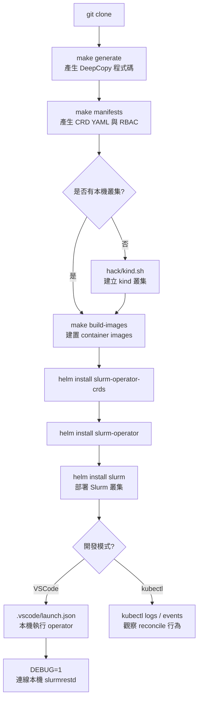

# slurm-operator 開發者上手指南

> **專案**: Slinky slurm-operator（SchedMD / NVIDIA）
> **版本**: 1.2.0-rc1 · **API 群組**: `slinky.slurm.net/v1beta1`
> **官方文件**: https://slinky.schedmd.com/

---

## 目錄

1. [Prerequisites](#1-prerequisites)
2. [本地開發 Workflow](#2-本地開發-workflow)
3. [測試策略](#3-測試策略)
4. [Kubebuilder 開發流程](#4-kubebuilder-開發流程)
5. [Debugging 技巧](#5-debugging-技巧)
6. [常見踩坑](#6-常見踩坑)
7. [Contribution Workflow](#7-contribution-workflow)
8. [相依性更新](#8-相依性更新)

---

## 1. Prerequisites

| 工具 | 版本要求 | 說明 |
|------|---------|------|
| Go | 1.26+ | 主要開發語言 |
| Docker / Buildx | 28.5.2+ | 映像建置（或 podman） |
| kubectl | — | 叢集操作 |
| Helm | v3 | Chart 安裝與打包 |
| kind | latest | 本機 Kubernetes 叢集 |
| skaffold | — | `hack/kind.sh` 必要工具 |
| make | — | 建置自動化 |
| yq | v4+ | YAML 處理（kind.sh 必要） |
| golangci-lint | v2.11.1 | 程式碼 lint（Makefile 自動下載） |
| controller-gen | v0.20.1 | CRD 程式碼產生（Makefile 自動下載） |
| pre-commit | — | Git hooks（建議安裝） |

> **注意**: `controller-gen`、`golangci-lint`、`helm`、`envtest` 等工具由 Makefile 自動下載到 `./bin/` 目錄，無需手動全域安裝。

安裝開發用工具：

```bash
make install-dev   # 安裝 dlv（debugger）、kind、cloud-provider-kind
```

---

## 2. 本地開發 Workflow

### 本地開發流程圖



### Step-by-Step

**Step 1 — Clone 專案**

```bash
git clone https://github.com/SlinkyProject/slurm-operator.git
cd slurm-operator
```

**Step 2 — 產生程式碼**

```bash
# 產生 DeepCopy、DeepCopyInto、DeepCopyObject 方法
make generate

# 產生 CRD YAML、WebhookConfiguration、ClusterRole
make manifests
```

> `make generate` 和 `make manifests` 皆由 pre-commit hook 自動觸發，但首次開發前建議手動執行一次。

**Step 3 — 建立本機 kind 叢集**

```bash
# hack/kind.sh 會先做 prerequisites 檢查（docker/podman、go、helm、skaffold、yq）
# 並調整 kernel.keys.maxkeys、fs.inotify 等系統參數
bash hack/kind.sh
```

**Step 4 — 建置 container images**

```bash
# 使用 docker buildx bake 建置所有映像
make build-images

# 若要指定不同的 registry
REGISTRY=my.registry.example.com make build-images
```

**Step 5 — Helm 安裝**

安裝順序**不可顛倒**（cert-manager 必須最先）：

```bash
# 1. cert-manager（若尚未安裝）
kubectl apply -f https://github.com/cert-manager/cert-manager/releases/latest/download/cert-manager.yaml
kubectl -n cert-manager wait --for=condition=Available deployment --all --timeout=120s

# 2. CRD chart
helm install slurm-operator-crds helm/slurm-operator-crds \
  --namespace slurm-operator \
  --create-namespace

# 3. Operator chart（含 webhook）
helm install slurm-operator helm/slurm-operator \
  --namespace slurm-operator \
  --values helm/slurm-operator/values-dev.yaml

# 4. Slurm 叢集 chart
helm install slurm helm/slurm \
  --namespace slurm \
  --create-namespace \
  --values helm/slurm/values-dev.yaml
```

開發用 values 檔案初始化（安全地複製 values.yaml 為 values-dev.yaml）：

```bash
make values-dev
```

**Step 6 — 本機 slurmrestd 開發（DEBUG=1）**

在本機執行 operator 並連線至本機 slurmrestd（用於開發 `slurmclient` 相關功能）：

```bash
DEBUG=1 ./slurm-operator --zap-log-level=debug
```

當 `DEBUG=1` 時，`internal/controller/slurmclient/slurmclient_sync.go` 會將 slurmrestd 連線目標改為 `http://localhost:<port>`（`builder.SlurmrestdPort`）。

---

## 3. 測試策略

### 單元測試 + Controller 整合測試

```bash
make test
```

使用 `envtest`（kubebuilder assets）提供假的 Kubernetes API server，無需真實叢集。

- **框架**: ginkgo v2 / gomega（BDD 風格）
- **覆蓋率門檻**: 70%（低於此值 CI 失敗）
- **測試範圍**: 排除 `api/`、`test/e2e/`、`test/` 目錄
- **輸出**: `cover.out`（可用 `go tool cover -html cover.out -o cover.html` 產生 HTML 報告）

測試結構範例：

```go
var _ = Describe("NodeSet controller", func() {
    Context("When scaling up", func() {
        It("Should create new pods", func() {
            Expect(reconciler.Reconcile(ctx, req)).To(Succeed())
        })
    })
})
```

### E2E 測試

```bash
make test-e2e   # timeout 30 分鐘
```

- 位置：`test/e2e/`
- 框架：`sigs.k8s.io/e2e-framework` v0.6.0
- 使用 Helm API（`helm.sh/helm/v3`）部署叢集
- 需要真實的 Kubernetes 叢集（搭配 kind 或雲端叢集）

### Helm Chart 測試

```bash
make helm-unittest          # 執行 helm-unittest 快照測試
make helm-unittest-update   # 更新快照（修改 chart 後執行）
make helm-lint              # 嚴格模式 lint
make helm-validate          # lint + dependency update
```

### 漏洞掃描

```bash
make govulncheck   # 輸出 govulncheck-vulns.csv，有 fixed_version 則失敗
```

---

## 4. Kubebuilder 開發流程

### 新增 CRD 欄位的標準流程

```bash
# 1. 修改 api/v1beta1/*_types.go
# 2. 重新產生程式碼
make generate   # 更新 DeepCopy 方法
make manifests  # 更新 CRD YAML、RBAC、Webhook 設定
# 3. 更新 internal/defaults/ 中的預設值（如有需要）
# 4. 更新 internal/webhook/ 中的驗證邏輯（如有需要）
```

### `make generate` vs `make manifests`

| 指令 | 使用 controller-gen 做什麼 | 輸出位置 |
|------|--------------------------|---------|
| `make generate` | 產生 `DeepCopy`、`DeepCopyInto`、`DeepCopyObject` 方法；執行 `go generate ./...` | `api/v1beta1/zz_generated.deepcopy.go` |
| `make manifests` | 產生 CRD YAML、RBAC ClusterRole、WebhookConfiguration | `config/crd/bases/`、`config/rbac/`、`config/webhook/`、`helm/slurm-operator-crds/templates/` |

> **重要**: 修改 `api/v1beta1/` 後，兩個指令都要執行。pre-commit hook 會自動檢查這兩個指令是否有執行，未更新的產生檔案會導致 commit 失敗。

### Kubebuilder Markers 使用

```go
// RBAC 權限宣告（controller 層）
// +kubebuilder:rbac:groups=slinky.slurm.net,resources=nodesets,verbs=get;list;watch;create;update;patch;delete
// +kubebuilder:rbac:groups=slinky.slurm.net,resources=nodesets/status,verbs=get;update;patch

// CRD 欄位驗證
// +kubebuilder:validation:Minimum=1
// +kubebuilder:validation:Enum=StatefulSet;DaemonSet

// CRD 列印欄位（kubectl get 顯示）
// +kubebuilder:printcolumn:name="Ready",type="string",JSONPath=".status.conditions[?(@.type=='Ready')].status"

// 棄用欄位標記
// Deprecated: use JwtKeyRef instead.
JwtHs256KeyRef *corev1.SecretKeySelector `json:"jwtHs256KeyRef,omitempty"`
```

---

## 5. Debugging 技巧

### DEBUG=1 — 本機 slurmrestd

```bash
export DEBUG=1
# operator 會連線 http://localhost:<SlurmrestdPort> 而非 in-cluster slurmrestd
```

適用場景：在 VSCode 中本機執行 operator，同時透過 port-forward 或本機 slurmrestd 進行測試。

### 詳細日誌

```bash
# CLI 啟動時
./slurm-operator --zap-log-level=debug

# VSCode launch.json 使用 level 5（更詳細）
# "args": ["--zap-log-level=5"]
```

### VSCode 除錯設定

`.vscode/launch.json` 提供兩個設定：

| 設定名稱 | 進入點 | 特點 |
|---------|--------|------|
| `Launch Operator` | `cmd/manager/main.go` | 自動設定 `DEBUG=1`，`--zap-log-level=5` |
| `Launch Webhook` | `cmd/webhook/main.go` | 執行前自動呼叫 `Setup Webhook Debugging` task |

Webhook 本機除錯需要先執行：

```bash
# 將 Kubernetes webhook 設定指向本機（需要 patch）
.vscode/patch-webhook-local-debug.sh

# 除錯結束後還原
.vscode/revert-webhook-local-debug.sh
```

### 查看 Kubernetes Events

```bash
# 查看 slurm namespace 中的事件
kubectl get events -n slurm --sort-by='.lastTimestamp'

# 查看 operator 本身的事件
kubectl get events -n slurm-operator --sort-by='.lastTimestamp'

# 持續監看 operator logs
kubectl logs -n slurm-operator deployment/slurm-operator -f

# 查看 reconcile 對象的狀態
kubectl describe nodeset <name> -n slurm
kubectl describe controller <name> -n slurm
```

### controller-runtime Manager Flags

```bash
# 健康檢查端點
curl http://localhost:8081/healthz
curl http://localhost:8081/readyz

# Prometheus metrics
curl http://localhost:8080/metrics
```

---

## 6. 常見踩坑

### cert-manager 必須優先安裝

Operator 的 Webhook TLS 憑證由 cert-manager 簽發。若 cert-manager 尚未就緒，webhook pod 會因無法取得憑證而 CrashLoopBackOff。

```bash
# 確認 cert-manager 已就緒
kubectl -n cert-manager wait --for=condition=Available deployment --all --timeout=120s
```

### Slurm 需要 Cgroup v2

Slurm 25.11+ 只支援 Cgroup v2。確認 worker node 已啟用：

```bash
stat -f /sys/fs/cgroup   # 應輸出 Type: cgroup2fs
```

### Slurm 版本必須 >= 25.11（v0044 API）

`slurm-client` 對應 Slurm REST API v0044，使用舊版 Slurm 將導致 API 不相容。

### `JwtHs256KeyRef` 已棄用

```yaml
# 舊（已棄用，勿使用）
spec:
  jwtHs256KeyRef:
    name: slurm-jwt
    key: jwt.key

# 新（正確用法）
spec:
  jwtKeyRef:
    name: slurm-jwt
    key: jwt.key
```

Webhook 在 `create`/`update` 時會發出警告，但仍接受棄用欄位，未來版本可能移除。

### `TaintKubeNodes` 已棄用

NodeSet spec 中的 `taintKubeNodes` 欄位已標記為 `Deprecated`，webhook 會主動警告。請改用其他節點隔離機制。

### kind 叢集 kernel 參數

`hack/kind.sh` 會檢查並提示以下系統參數，若不符合建議值，部分功能（如大量 pod）可能異常：

```bash
sudo sysctl -w kernel.keys.maxkeys=2000
sudo sysctl -w fs.file-max=10000000
sudo sysctl -w fs.inotify.max_user_instances=65535
sudo sysctl -w fs.inotify.max_user_watches=1048576
```

### HTTP/2 CVE

Controller Manager 預設關閉 HTTP/2（`--enable-http2=false`），以規避 Stream Cancellation CVE（GHSA-qppj-fm5r-hxr3、GHSA-4374-p667-p6c8）。除非明確需要，不要開啟此選項。

---

## 7. Contribution Workflow

### 分支命名

從 `main` 分支建立 feature branch，命名建議遵循 conventional commits 類型：

```
feat/<short-description>
fix/<short-description>
docs/<short-description>
refactor/<short-description>
test/<short-description>
chore/<short-description>
```

### Commit Message 格式（commitlint）

本專案使用 `@commitlint/config-conventional`，格式為：

```
<type>(<scope>): <subject>

[optional body]

Signed-off-by: Your Name <your@email.com>
```

- **type**: `feat` | `fix` | `docs` | `style` | `refactor` | `test` | `chore` | `ci` | `perf`
- **scope**: 選填，如 `nodeset`、`webhook`、`helm`
- **DCO 強制**: 每個 commit 必須有 `Signed-off-by`，使用 `git commit -s` 自動加入

### PR 提交

提交至 GitHub：https://github.com/SlinkyProject/slurm-operator — Fork 或從 `main` 開 branch，開啟 PR 並連結 Issue，確保 CI 全部通過後等待 maintainer review。

### Pre-commit Hooks 設定

```bash
# 安裝 pre-commit（建議使用 pip 或 brew）
pip install pre-commit

# 安裝 git hooks
pre-commit install                 # 安裝 pre-commit + commit-msg hooks
pre-commit install --install-hooks # 初始化 hook 環境

# 手動執行所有 hooks（不含 commit-msg）
pre-commit run --all-files
```

Pre-commit 執行的檢查清單：

| Hook | 說明 |
|------|------|
| `commitlint` | commit message 格式驗證（commit-msg 階段） |
| `check-merge-conflict` | 偵測未解決的 merge conflict |
| `check-yaml` / `check-json` | YAML / JSON 格式驗證 |
| `detect-private-key` | 防止意外 commit 私鑰 |
| `trailing-whitespace` | 尾端空白清理 |
| `mdformat` | Markdown 格式化（wrap=80） |
| `codespell` | 拼字檢查（自動修正） |
| `yamlfmt` | YAML 格式化 |
| `shellcheck` | Shell script 靜態分析 |
| `go-fmt` / `go-mod-tidy` | Go 格式化與模組整理 |
| `make-golangci-lint` | Go 靜態分析 |
| `make-manifests` | 確保 CRD YAML 已更新 |
| `make-generate` | 確保 DeepCopy 程式碼已更新 |
| `make-helm-unittest` | Helm chart unit tests |
| `version-match` | `VERSION` 檔案與 Chart.yaml 版本一致 |

### codespell 拼字檢查

codespell 使用 `--write-changes` 自動修正。若有誤報，可在 `.codespellrc` 中加入白名單。

---

## 8. 相依性更新

### go.mod 管理

```bash
# 更新所有相依性到最新相容版本
make get-u   # go get -u ./... + go mod tidy

# 只整理 go.mod（不更新版本）
make tidy

# 漏洞檢查
make govulncheck
```

### slurm-client 版本對應

`github.com/SlinkyProject/slurm-client` 版本必須與 Slurm REST API 版本對應：

| slurm-client 版本 | Slurm REST API 版本 | Slurm 版本 |
|------------------|---------------------|------------|
| v1.1.0-rc1 | v0044 | 25.11+ |

更新 slurm-client 時，需同步確認：
1. `go.mod` 中 `github.com/SlinkyProject/slurm-client` 版本
2. `internal/controller/slurmclient/` 中的 API 呼叫相容性
3. `internal/builder/` 中的物件建構邏輯

### Helm Chart 相依性

```bash
# 更新 chart 相依性（Chart.yaml 中的 dependencies）
make helm-dependency-update

# 更新 chart 版本號（同步 VERSION 到所有 Chart.yaml）
make version-match
```

### controller-runtime 版本

`controller-runtime` 版本決定 `envtest` 版本。Makefile 會自動從 `go.mod` 讀取對應版本，更新 `controller-runtime` 後執行 `make tidy` 即可同步。

---

## 附錄：常用指令速查

```bash
# 開發
make generate           # 產生 DeepCopy 程式碼
make manifests          # 產生 CRD YAML + RBAC
make fmt                # go fmt
make vet                # go vet
make golangci-lint      # lint（含自動修正）

# 建置
make build-images       # 建置 container images
make build-chart        # 打包 Helm charts
make build              # 兩者都做

# 測試
make test               # 單元 + 整合測試（envtest）
make test-e2e           # E2E 測試
make helm-unittest      # Helm chart unit tests
make govulncheck        # 漏洞掃描

# 除錯資訊
make help               # 顯示所有可用 target
make version            # 顯示目前版本
```
