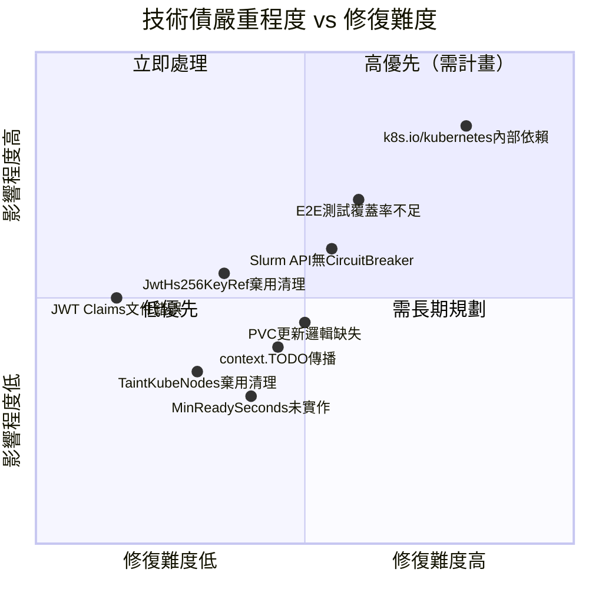

# DISCOVERY_LOG — slurm-operator 探索紀錄

> 產出時間：2026-05-19  
> 版本：1.2.0-rc1  
> 維護者：SchedMD LLC（NVIDIA 支援）

---

## 1. Web Search 發現摘要

### 官方文件位址

| 資源 | URL |
|------|-----|
| 官方文件首頁 | https://slinky.schedmd.com/projects/slurm-operator |
| GitHub 原始碼 | https://github.com/SlinkyProject/slurm-operator |
| SchedMD 官方 Slinky 頁面 | https://slurm.schedmd.com/slinky.html |
| 架構概念文件（release-1.0） | https://slinky.schedmd.com/projects/slurm-operator/en/release-1.0/concepts/architecture.html |

### 主要使用場景

| 場景 | 說明 | 案例 |
|------|------|------|
| GPU 訓練叢集（AI/ML） | Slurm 管理 GPU 資源，Kubernetes 管理容器 | Crusoe AI：Managed GPU Training 基礎設施 |
| 混合 HPC/Kubernetes 環境 | 實體機 slurmctld + Kubernetes worker pods（Hybrid 模式） | Red Hat OpenShift 整合 |
| 自動縮放 HPC 工作負載 | HPA + Slurm node 狀態作為 custom metrics | 雲端彈性 HPC |
| 多雲端平台部署 | AWS EKS、OpenShift、GKE 等 | AWS EKS 整合文件 |

### 社群資源

- **GitHub Issues**: https://github.com/SlinkyProject/slurm-operator/issues
- **SchedMD 官方 Issue Tracker**: https://support.schedmd.com/
- **社群接觸**: https://www.schedmd.com/slurm-resources/contact-schedmd/

### 與競品定位差異

- **Volcano / Kueue**：Kubernetes 原生 batch 排程器，無 Slurm 相容性
- **Open HPC**：傳統 HPC 軟體棧，非 Kubernetes 原生
- **社群非官方版本**：Slinky 是 SchedMD **官方支援**的解法

---

## 2. 既有文件與程式碼落差

### 落差清單

| # | 說明 | 嚴重程度 |
|---|------|----------|
| 1 | `JwtHs256KeyRef` 棄用狀態未反映在文件中 | 中 |
| 2 | `TaintKubeNodes` 棄用狀態未在文件中明確標示 | 低 |
| 3 | JWT Claims 欄位名稱 `sl_ung` 未見於程式碼（core_logic.md 文件有誤） | 高 |
| 4 | `context.TODO()` 廣泛使用於 builder 層，表示 context 傳播未完成 | 中 |

### 詳細落差說明

**落差 1：JwtHs256KeyRef 棄用**

文件說：`jwtHs256KeyRef` 為 Controller/Accounting/Token CR 的有效 JWT key 設定欄位。

程式碼實際是：
```
api/v1beta1/controller_types.go:38  // Deprecated: use JwtKeyRef instead.
api/v1beta1/accounting_types.go:32  // Deprecated: use JwtKeyRef instead.
api/v1beta1/token_types.go:26       // Deprecated: use JwtKeyRef instead.
```
`jwtHs256KeyRef` 仍在 v1beta1 CRD 中存在且可用（CHANGELOG-1.1 提到「Added option to enable/disable creation of SlurmKey and jwtHs256Key」），但 inline 標記為 Deprecated，建議改用 `jwtKeyRef`。文件應加上棄用警告。

**落差 2：TaintKubeNodes 棄用**

文件說：N/A（文件未提及此欄位）

程式碼實際是：
```
api/v1beta1/nodeset_types.go:132  // Deprecated: To be removed in the future.
api/v1beta1/nodeset_types.go:133  TaintKubeNodes bool `json:"taintKubeNodes,omitempty"`
```
欄位仍保留在 schema，但已被標記為「未來將移除」，文件應明確說明遷移路徑。

**落差 3：JWT Claims `sl_ung` 欄位不存在**

`core_logic.md` 文件記載：
```go
SunLong int64  `json:"sl_ung"` // ⚠️ 未驗證欄位名稱
```
程式碼實際（`internal/controller/token/slurmjwt/token.go:50`）：
```go
SlurmUsername string `json:"sun"`
```
`TokenClaims` struct 只有單一欄位 `sun`，不存在 `sl_ung` 或 `SunLong`。context 文件的此描述是錯誤的。

**落差 4：context.TODO() 廣泛使用**

```
internal/builder/ 及 internal/utils/historycontrol/ 中共 21 處 context.TODO()
```
這表示這些函式的 context 傳播尚未完成，無法透過 context 傳遞 cancellation 或 deadline 信號。

---

## 3. 程式碼中的 TODO / FIXME / Deprecated

### TODO 清單

| 檔案 | 行號 | 內容摘要 |
|------|------|----------|
| `internal/controller/nodeset/nodeset_sync.go` | 1032 | TODO: Track UIDs of creates just like deletes — 建立 Pod 的 UID 追蹤尚未實作（現有 expectations 只追蹤刪除） |
| `internal/controller/nodeset/podcontrol/podcontrol.go` | 313 | TODO: Check resource requirements and accessmodes, update if necessary — PVC 資源需求變更時尚未處理更新邏輯 |
| `internal/controller/nodeset/eventhandler/eventhandler_pod.go` | 170 | TODO: MinReadySeconds in the Pod — MinReadySeconds 尚未從 NodeSet 傳播到 Pod |
| `internal/controller/nodeset/utils/sort.go` | 83 | TODO: take availability into account when we push minReadySeconds — 排序邏輯尚未考慮 minReadySeconds |
| `internal/controller/nodeset/utils/utils.go` | 205 | TODO: Use source definition to set this value when we have one — 來源定義尚未確定 |

### Deprecated 欄位清單

| 欄位 | 所在型別 | 替換方案 | 位置 |
|------|---------|---------|------|
| `JwtHs256KeyRef` | `ControllerSpec` | `JwtKeyRef` | `api/v1beta1/controller_types.go:38` |
| `JwtHs256KeyRef` | `AccountingSpec` | `JwtKeyRef` | `api/v1beta1/accounting_types.go:32` |
| `JwtHs256KeyRef` | `TokenSpec` | `JwtKeyRef` | `api/v1beta1/token_types.go:26` |
| `TaintKubeNodes` | `NodeSetSpec` | 待確認 | `api/v1beta1/nodeset_types.go:132` |
| `AuthJwtHs256Key()` | controller/accounting keys | `AuthJwtKey()` | `controller_keys.go:73`, `accounting_keys.go:74` |
| `AuthJwtHs256Ref()` | controller/accounting keys | `AuthJwtRef()` | `controller_keys.go:78`, `accounting_keys.go:79` |
| `JwtHs256Key()` | token keys | `JwtKey()` | `token_keys.go:38` |
| `JwtHs256Ref()` | token keys | `JwtRef()` | `token_keys.go:43` |

---

## 4. 技術債清單

### 4.1 棄用欄位未移除

`JwtHs256KeyRef` 在三個 CRD（Controller、Accounting、Token）中標記 Deprecated，但仍保留在 API schema 和 CRD validation XValidation rules 中（`jwtKeyRef or jwtHs256KeyRef must be set`），形成混亂的雙重支援。待 v1 API 穩定後應一次移除。

`TaintKubeNodes` 欄位無明確移除時間表（「To be removed in the future」），但也無遷移文件。

### 4.2 直接引用 k8s.io/kubernetes 內部套件

```go
// go.mod:25
k8s.io/kubernetes v1.35.2

// 引用處（internal/controller/nodeset/）：
kubecontroller "k8s.io/kubernetes/pkg/controller"
daemonutils    "k8s.io/kubernetes/pkg/controller/daemon/util"
podutil        "k8s.io/kubernetes/pkg/api/v1/pod"
```

**風險說明**：`k8s.io/kubernetes` 屬於 Kubernetes 的 internal 套件，Go module 並未正式承諾 API 穩定性。每次 Kubernetes 升級都可能造成 breaking change，且引入此套件會導致 go.mod 極為龐大（需要全 Kubernetes 依賴樹）。這是為了複製 DaemonSet 排程邏輯（`NodeShouldRunDaemonPod()`）而採用的高風險做法。

CHANGELOG-1.0 顯示此依賴已被升級（`v1.34.2` 修補 CVE-2025-13281），表示維護者仍在積極追蹤此依賴的安全性。

### 4.3 context.TODO() 未完成 Context 傳播

builder 層（`internal/builder/`）和 historycontrol 工具共 21 處使用 `context.TODO()`，表示這些路徑無法透過 context 傳遞取消信號，對長時間運行的操作有潛在超時風險。

### 4.4 Slurm REST API 無 Circuit Breaker

`slurmcontrol.go:tolerateError()` 對 Slurm REST API 錯誤的處理策略是：
- 404/204 → 容忍（忽略）
- 其他錯誤 → 交由 controller reconcile loop 重試

沒有 circuit breaker 或 rate limiting，若 slurmrestd 持續不可用，controller 會持續嘗試，可能在 API server 造成壓力。

### 4.5 cmd/main.go 為占位符

```
/home/user/slurm-operator/cmd/main.go
```
內容僅為空的 `main()` 函式，附有注解說明這是 kubebuilder go.kubebuilder.io/v4 layout 的要求。實際進入點為：
- `cmd/manager/main.go` — Controller Manager
- `cmd/webhook/main.go` — Webhook Server

---

## 5. 未解答的疑問

| # | 疑問 | 目前狀態 | 建議行動 |
|---|------|---------|---------|
| 1 | JWT claims `sun` 欄位名稱是否符合 Slurm 規格？ | 已確認：`sun` = Slurm Username（`slurmjwt/token.go:50`），無 `sl_ung` 欄位 | context 文件需更正，建議對照 Slurm 25.11 auth/jwt 規格確認 |
| 2 | SlurmClient 的 cache 機制細節 | slurm-client 內部有 object cache；`RefreshNodeCache` 步驟（StopOnError=true）強制刷新；但 cache 的 TTL、資料結構在 slurm-client repo 中，未在本 repo 暴露 | 需讀取 `github.com/SlinkyProject/slurm-client` 原始碼確認 |
| 3 | `cmd/main.go` 是否為空占位符？ | 已確認：是占位符，符合 kubebuilder v4 layout 要求 | 無需進一步調查 |
| 4 | `TaintKubeNodes` 的替代方案是什麼？ | 欄位已棄用但無明確替代方案說明 | 需詢問維護者 |
| 5 | DaemonSet 模式下的 `NodeShouldRunDaemonPod()` 是否與 upstream 邏輯完全一致？ | 直接 import `k8s.io/kubernetes/pkg/controller/daemon/util`，理論上一致，但可能受版本影響 | 建議定期比對 upstream 變更 |

---

## 6. 建議深入調查的區域

### 6.1 NodeSet Rolling Update 邏輯完整性

`syncUpdate()` 實作 rolling update，但以下細節需確認：
- `maxUnavailable` 與 Slurm DRAIN 狀態的互動（若 Slurm job 長時間不結束，rolling update 是否會卡住？）
- `PinToNode=true` 時 rolling update 的 node affinity 重設邏輯
- 建議路徑：`internal/controller/nodeset/nodeset_sync.go:syncUpdate()`

### 6.2 E2E 測試覆蓋率

E2E 測試僅有 4 個檔案（`test/e2e/`），且需要真實的 Slurm 環境。已知：
- CHANGELOG-1.1 提到「Adds end-to-end tests for slurm-operator」（v1.1.0-rc1 新增）
- 缺乏 CI/CD 設定（`.github/workflows/` 不存在，可能在 GitLab CI）
- 建議確認是否有 mock Slurm 的 integration test，避免只能在完整環境中測試

### 6.3 多叢集支援可行性

目前架構：一個 Controller CR = 一個 Slurm 叢集，`clientMap` 以 `namespace/name` 為 key。

多叢集的可能路徑：
- 部署多個 Controller CR（已支援，但共享同一個 operator instance）
- 跨 namespace 隔離（`--namespaces` flag 可限制）
- 跨 Kubernetes 叢集尚不支援（`extensions.md` 明確記載）

### 6.4 WorkloadDisruptionProtection PDB 動態更新

PDB 的 `maxUnavailable` 動態調整（隨 Slurm job 完成而更新）是非常細膩的邏輯，建議確認：
- PDB 更新頻率（每次 reconcile？還是有節流機制？）
- 若 Slurm REST API 不可用，PDB 是否卡在舊值？

---

## 7. 建議與維護者確認的問題

| 問題 | 背景 | 優先級 |
|------|------|--------|
| Slurm API 版本 `v0044` 對應哪些 Slurm 版本？ | 程式碼使用 `slurmapi.V0044*` 型別，文件說支援 Slurm 25.11+，但 v0044 的確切對應關係不明 | 高 |
| 是否計畫在 CRD 穩定後推出 `v1` API 版本？ | 目前仍是 `v1beta1`，v1.0 剛完成 CRD conversion 架構，`v1` 計畫時間表未知 | 高 |
| `TaintKubeNodes` 的替代方案與移除時間表 | 欄位已標記棄用但無遷移說明 | 中 |
| slurm-client 的 cache TTL 與刷新策略 | 需確認 `RefreshCache` 強制刷新的行為細節，影響 Step 5 StopOnError 的適當性 | 中 |
| CI/CD Pipeline 位置與測試策略 | `.github/workflows/` 不存在，E2E 測試需要真實環境，如何在 CI 中驗證？ | 低 |
| `--propagated-node-conditions` 的推薦設定值 | 文件缺乏具體的 GPU/硬體故障 condition 名稱建議 | 低 |

---

## 8. 技術債分佈圖



---

## 版本歷史摘要

| 版本 | 關鍵變更 |
|------|---------|
| v0.1–v0.4 | 早期 alpha 階段，基礎 CRD 建立 |
| v1.0.0-rc1 | v1beta1 CRD 取代 v1alpha1，支援 CRD conversion，無停機升級 |
| v1.0.1 | Helm 4 相容性修正、CVE-2025-13281 修補（k8s.io/kubernetes 升級） |
| v1.0.2 | initconf container 相容性修正、slurm-client v1.0.2 |
| v1.1.0-rc1 | 新增 DaemonSet scalingMode、Topology 注入、JWKS 支援、JwtKeyRef 欄位、E2E 測試 |
| v1.1.0 | 修正多個 NodeSet reconciliation bug、CVE-2026-33186 修補（grpc 升級） |
| v1.2.0-rc1（當前） | 開發中 |

---

## 附錄：重要檔案路徑速查

| 主題 | 關鍵路徑 |
|------|---------|
| CRD 型別定義 | `api/v1beta1/*_types.go` |
| JWT Token 產生 | `internal/controller/token/slurmjwt/token.go` |
| NodeSet 主要同步邏輯 | `internal/controller/nodeset/nodeset_sync.go` |
| Slurm API 操作抽象 | `internal/controller/nodeset/slurmcontrol/slurmcontrol.go` |
| SlurmClient 生命週期 | `internal/controller/slurmclient/slurmclient_sync.go` |
| Pod Binding Webhook（拓撲注入） | `internal/webhook/pod_binding_webhook.go` |
| Deprecated 欄位集中處 | `api/v1beta1/controller_types.go`, `accounting_types.go`, `token_types.go`, `nodeset_types.go` |
| k8s internal 依賴引用 | `internal/controller/nodeset/nodeset_sync.go`（DaemonSet 邏輯） |
| E2E 測試 | `test/e2e/` |
| 版本歷史 | `CHANGELOG/CHANGELOG-1.1.md`, `CHANGELOG/CHANGELOG-1.0.md` |

---

## 增量更新紀錄 — 2026-06-30（commit d5c49df..cfb5029）

<!-- 更新於 2026-06-30, commit range: d5c49df..cfb5029 -->

### 本次更新涵蓋範圍
- Base Branch：`main`（原 trace 所用 `claude/generate-project-docs-LmQlv` 已合入 main）
- 變更幅度：~41%（200/488 檔案，85 non-merge commits）
- 更新的 .trace/ 文件：CODEBASE_MAP, INDEX, DATA_MODEL, API_SURFACE, ARCHITECTURE, DEV_GUIDE

### 重要發現

#### 安全性變更（需注意）
1. **跨 namespace 參照禁止**：NodeSet.controllerRef、Token.jwtKeyRef 等欄位現在被 Webhook 強制限制在同一 namespace。既有跨 namespace 設定的叢集升級時**可能需要調整** CRD 設定。
2. **slurm.conf injection 防護**：`NodeSetPartition.Config` 新增 `^[^\n]+$` pattern validation，含換行符號的舊設定將被 webhook 拒絕。

#### API 破壞性變更
- `ObjectReference` 和 `JwtSecretKeySelector` 自訂型別已從 API 中移除，改用 Kubernetes 原生型別（`corev1.LocalObjectReference`、`corev1.SecretKeySelector`）。跨版本升級需確認 YAML。
- `TaintKubeNodes` 欄位已完全移除（原為 Deprecated），需清除既有 YAML 中的此欄位。

#### 新功能摘要
- **ScheduledUpdate 策略**：NodeSet 新增第三種更新策略，透過 Slurm MAINT reservation 在指定時間窗口（StartTime + Duration）內更新 pods。適合維護窗口場景。
- **OversubscribeNode**：允許多個 NodeSet pod 共用同一 K8s Node（移除 anti-affinity）。**不建議生產環境使用**。
- **pprof 端點**：Operator 內建 pprof HTTP 端點（localhost:6060），搭配 `hack/profile.sh` 使用。
- **Google A3 Mega vendor 支援**：`helm/slurm/_vendor/google/a3mega/` 提供 A3 Mega GPU 節點的預設設定範例。

#### 架構調整
- SlurmClient Controller 現在 watch RestAPI CR 事件（透過新增的 `eventhandler_restapi.go`），RestAPI 被刪除時 SlurmClient 也會跟著刪除。
- SlurmClient 選取 RestAPI 的邏輯改為 deterministic（依 CreationTimestamp + Name 排序），修正了隨機選取的 bug。
- DaemonSet scalingMode 現在可以同時進行 scale in + out（原本只能一個方向）。

#### Helm 重要變更
- Webhook `failurePolicy` 預設從 `Fail` 改為 `Ignore`。生產環境若需強制 validation，需明確設定。
- PDB 新增支援 Operator、Webhook、RestApi，與 HA 設定連動。
- 預設映像版本：`26.05-ubuntu26.04`。

### 已驗證項目（2026-06-30，code 直讀）

#### ScheduledUpdate 策略的 Slurm reservation 互動（已驗證）
<!-- source: internal/controller/nodeset/nodeset_sync.go:1511, slurmcontrol/slurmcontrol.go:820+ -->

**完整流程**（code 確認）：

1. **Reservation 命名**：固定為 `SlurmOperatorMaint-{nodeset.Name}`（`slurmcontrol.go`）
2. **建立條件**：`type=ScheduledUpdate` + `replicas > 0` + `SlurmIdle+SlurmAllocated > 0`（等 pod 健康再建）
3. **Finalizer**：建立前加 finalizer，確保刪除 NodeSet 時 reservation 也被清除
4. **過期 startTime**：`startTime` 已過且不帶 `FORCE_START` flag → reservation **不建立**，靜默跳過（`slurmcontrol.go: case !slurmReservationExists && !created`）
5. **Active 中的更新限制**：Slurm 不允許修改 active reservation 的大部分欄位，controller 對 active reservation 只會更新 node list（`updateReservationNodes()`）
6. **重複發生的 reservation**：Slurm 完成後自動推進 StartTime 到下一次；controller 偵測到 old StartTime > new StartTime 且是 reoccurring reservation 時，**保留 Slurm 的新 StartTime**，避免觸發多餘 update 或 Slurm 拒絕過去時間的錯誤
7. **Idempotency**：`apiequality.Semantic.DeepEqual(coreNewReservationInfo, coreOldReservationInfo)` 保護，flags 排序後比較，不會重複建立
8. **Pod 更新觸發**：只有在 `GetPodsUnderReservation()` 回傳（即節點在 MAINT reservation 下）的 pod 才會被刪除並更新

#### 跨版本升級路徑（已驗證）
<!-- source: api/v1beta1/nodeset_convert.go, config/crd/bases/, commit 511771c -->

**結論：只有單一 v1beta1，無 conversion webhook，但有 silent breaking change。**

- `api/v1beta1/nodeset_convert.go` 的 `Hub()` 方法只是空函式，供 controller-runtime 識別 storage version，不做任何轉換
- CRD 始終只有一個版本（v1beta1），API server 不需要 conversion webhook
- **升級時的 etcd 資料行為**：舊 CR 中 `controllerRef.namespace`（舊型別 `ObjectReference` 的欄位）在新 schema（`corev1.LocalObjectReference`，只有 `name`）讀取時，Go JSON unmarshal 會**靜默丟棄**未知欄位
- **⚠️ 潛在 Breaking Change**（有意為之）：若叢集中存在跨 namespace 設定的 NodeSet（`controllerRef.namespace != nodeset.namespace`），升級後 controller 改用 NodeSet 自身的 namespace 找 Controller CR，**可能找不到**導致 reconcile 失敗。commit `511771c` 明確說明這是安全修正（"Security is compromised if objects can consume objects in other namespaces"）
- **建議**：升級前執行 `kubectl get nodesets -A -o json | jq '.items[] | select(.spec.controllerRef.namespace != null and .spec.controllerRef.namespace != .metadata.namespace)'` 確認是否有跨 namespace 設定
