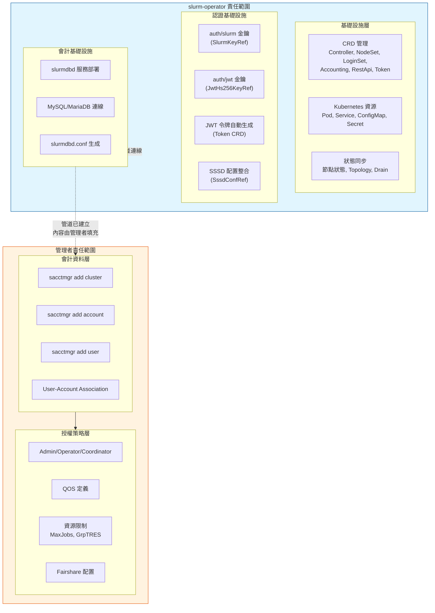
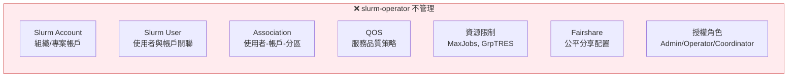
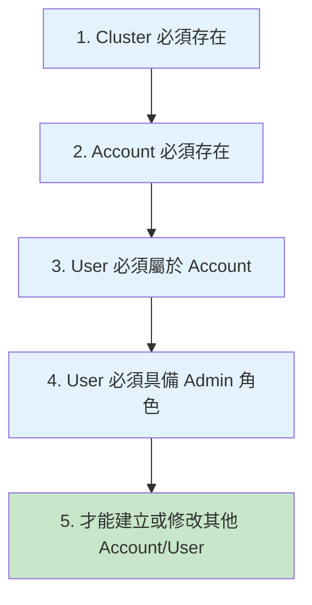
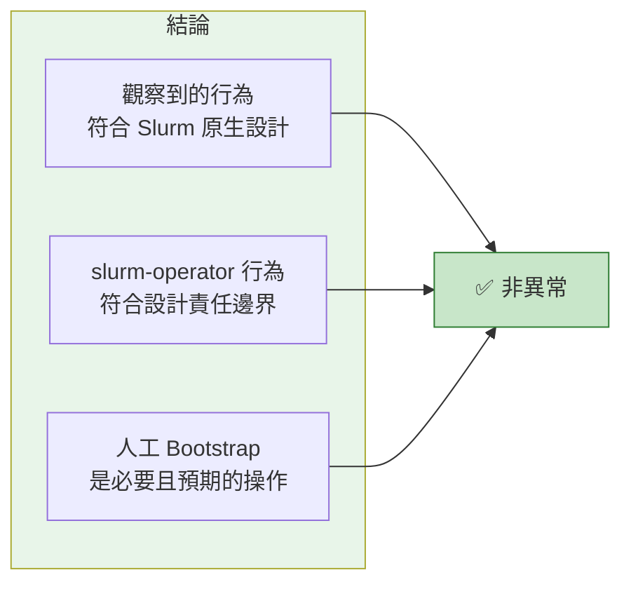

# Authentication 與 Accounting 的職責邊界說明

> 最後更新：2025-12-29
> 適用版本：slurm-operator v1.x
> 目標讀者：Slurm 叢集管理員、平台工程師
> 相關文件：[CRD 參考](./crd-reference-guide.md) | [使用指南](./slurm-usage-guide.md) | [FAQ](./slurm-faq.md)

---

## 目錄

- [1. 文件目的](#1-文件目的)
- [2. 設計結論](#2-設計結論)
- [3. 職責邊界架構圖](#3-職責邊界架構圖)
- [4. slurm-operator 的責任範圍](#4-slurm-operator-的責任範圍)
  - [4.1 負責的事項](#41-負責的事項)
  - [4.2 不負責的事項](#42-不負責的事項)
- [5. 為何 Slurm Accounting 必須人工 Bootstrap](#5-為何-slurm-accounting-必須人工-bootstrap)
  - [5.1 Slurm 原生授權模型](#51-slurm-原生授權模型)
  - [5.2 Chicken-Egg 問題](#52-chicken-egg-問題)
- [6. Bootstrap 操作指南](#6-bootstrap-操作指南)
  - [6.1 前置條件檢查](#61-前置條件檢查)
  - [6.2 初始化步驟](#62-初始化步驟)
  - [6.3 完整範例腳本](#63-完整範例腳本)
- [7. 使用者名稱一致性要求](#7-使用者名稱一致性要求)
- [8. 常見問題排除](#8-常見問題排除)
- [9. 設計澄清](#9-設計澄清)
- [10. 總結](#10-總結)

---

## 1. 文件目的

本文件說明在 **Slinky（slurm-operator）** 架構下，**Authentication、Authorization 與 Accounting（AAA）相關行為的設計邊界與預期操作方式**。

此說明用於：

- 釐清哪些行為屬於 **Slurm 原生設計**
- 說明哪些行為 **不在 slurm-operator 的管理責任內**
- 解釋為何 **Slurm Accounting 必須進行人工 Bootstrap**
- 避免在導入時誤判為功能缺失或部署錯誤

---

## 2. 設計結論

> **slurm-operator 不負責建立或管理 Slurm Accounting 內的資料內容。**

具體而言：

| 層面 | slurm-operator 負責 | 管理者負責 |
|------|---------------------|-----------|
| **基礎設施** | 元件部署、生命週期、連線 | - |
| **認證配置** | auth/slurm、auth/jwt 金鑰管理 | LDAP/AD 整合策略 |
| **會計服務** | slurmdbd 部署、資料庫連線 | Account/User/QOS 建立 |
| **授權策略** | - | Admin/Operator/Coordinator 指派 |

**這是刻意的設計選擇，而非功能缺漏。**

---

## 3. 職責邊界架構圖



### 層級對照表

| 層級 | 比喻 | slurm-operator | 管理者 |
|------|------|----------------|--------|
| 基礎設施 | 蓋好辦公大樓 | ✅ | - |
| 認證配置 | 安裝門禁系統 | ✅ | - |
| 會計服務 | 鋪設水電管線 | ✅ | - |
| 帳戶管理 | 發放門禁卡給員工 | - | ✅ |
| 授權策略 | 決定誰能進哪個樓層 | - | ✅ |
| 資源限制 | 安裝電錶、分配用電配額 | - | ✅ |

---

## 4. slurm-operator 的責任範圍

### 4.1 負責的事項

slurm-operator 採用 Kubernetes Operator Pattern，管理範圍限於 **基礎設施與控制面層級**：

#### 元件生命週期管理

| 元件 | CRD | 對應 Slurm 守護程序 |
|------|-----|-------------------|
| Controller | `Controller` | slurmctld |
| 計算節點 | `NodeSet` | slurmd |
| 登入節點 | `LoginSet` | sackd + sshd |
| 會計服務 | `Accounting` | slurmdbd |
| REST API | `RestApi` | slurmrestd |
| JWT 令牌 | `Token` | - |

> 詳細 CRD 欄位請參考 [CRD 參考指南](./crd-reference-guide.md)

#### 認證金鑰管理

```yaml
# Controller CRD 中的認證配置
spec:
  slurmKeyRef:           # auth/slurm 共享金鑰
    name: slurm-auth-slurm
    key: slurm.key
  jwtHs256KeyRef:        # auth/jwt 簽名金鑰
    name: slurm-auth-jwt
    key: jwt_hs256.key
```

#### 會計服務連線配置

```yaml
# Accounting CRD 中的資料庫配置
spec:
  storageConfig:
    host: mariadb.database.svc
    port: 3306
    database: slurm_acct_db
    username: slurm
    passwordKeyRef:
      name: slurm-db-password
      key: password
```

#### 自動生成的配置

slurm-operator 會自動生成以下配置檔：

| 配置檔 | 來源 CRD | 包含內容 |
|--------|---------|---------|
| `slurm.conf` | Controller | ClusterName, AuthType, AccountingStorageType 等 |
| `slurmdbd.conf` | Accounting | DbdHost, StorageType, 資料庫連線參數 |

> 詳細配置請參考 [Helm Chart 深入解析](./deep-dive-helm.md)

### 4.2 不負責的事項

以下項目明確不屬於 slurm-operator 的管理範圍：



**原因**：這些屬於 **Slurm policy 與組織治理層面**，高度依賴各組織的具體需求，無法通用化。

---

## 5. 為何 Slurm Accounting 必須人工 Bootstrap

### 5.1 Slurm 原生授權模型

Slurm Accounting 採用階梯式授權模型：



### 5.2 Chicken-Egg 問題

在一個全新的 slurmdbd 中：

| 狀態 | 說明 |
|------|------|
| ❌ 不存在任何 Cluster | 資料庫是空的 |
| ❌ 不存在任何 Account | 沒有組織結構 |
| ❌ 不存在任何 Admin | 沒有人有權限建立 |
| ❌ 無法透過正常權限路徑建立 | 死結 |

👉 **第一位管理者必須透過 out-of-band 方式建立**

這是 **Slurm 的設計前提**，而非 Slinky 的限制。

---

## 6. Bootstrap 操作指南

### 6.1 前置條件檢查

在開始 Bootstrap 之前，確認以下條件：

```bash
# 1. 確認 Controller Pod 運行中
kubectl get pods -l app.kubernetes.io/component=slurmctld -n slurm

# 2. 確認 Accounting (slurmdbd) 運行中
kubectl get pods -l app.kubernetes.io/component=slurmdbd -n slurm

# 3. 確認資料庫連線正常
kubectl logs -l app.kubernetes.io/component=slurmdbd -n slurm | grep -i "database"
```

### 6.2 初始化步驟

#### 步驟 1：進入 Controller Pod

```bash
# 取得 Controller Pod 名稱
CONTROLLER_POD=$(kubectl get pods -l app.kubernetes.io/component=slurmctld \
  -n slurm -o jsonpath='{.items[0].metadata.name}')

# 進入 Pod
kubectl exec -it $CONTROLLER_POD -n slurm -- bash
```

#### 步驟 2：註冊 Cluster 到 Accounting

```bash
# 查看目前的 ClusterName（從 slurm.conf）
grep ClusterName /etc/slurm/slurm.conf

# 註冊 Cluster（將 <cluster-name> 替換為實際名稱）
sacctmgr add cluster <cluster-name>

# 驗證
sacctmgr show cluster
```

#### 步驟 3：建立根帳戶

```bash
# 建立組織根帳戶
sacctmgr add account root description="Root account"

# 建立部門/專案帳戶（範例）
sacctmgr add account research parent=root description="Research group"
sacctmgr add account engineering parent=root description="Engineering team"

# 驗證帳戶結構
sacctmgr show account tree
```

#### 步驟 4：建立第一位 Admin 使用者

```bash
# 建立使用者並指派 Admin 權限
# 注意：使用者名稱必須與 LDAP/SSSD 解析的名稱完全一致
sacctmgr add user admin account=root adminlevel=admin

# 驗證
sacctmgr show user admin withassoc
```

#### 步驟 5：建立一般使用者

```bash
# 建立使用者並關聯帳戶
sacctmgr add user alice account=research
sacctmgr add user bob account=engineering

# 批次建立（使用檔案）
cat << 'EOF' > /tmp/users.txt
User|Account|AdminLevel
alice|research|None
bob|engineering|None
charlie|research|None
EOF

sacctmgr load /tmp/users.txt
```

#### 步驟 6：設定 QOS（可選）

```bash
# 建立 QOS
sacctmgr add qos normal priority=50
sacctmgr add qos high priority=100 maxjobs=10
sacctmgr add qos low priority=10 maxjobs=100

# 指派 QOS 給帳戶
sacctmgr modify account research set qos=normal,high
sacctmgr modify account engineering set qos=normal

# 驗證
sacctmgr show qos format=name,priority,maxjobs
```

#### 步驟 7：設定資源限制（可選）

```bash
# 設定帳戶層級的資源限制
sacctmgr modify account research set GrpTRES=cpu=1000,mem=500G
sacctmgr modify account engineering set GrpTRES=cpu=500,mem=250G

# 設定使用者層級的資源限制
sacctmgr modify user alice set MaxJobs=50 MaxSubmitJobs=100

# 驗證
sacctmgr show assoc format=user,account,grptres,maxjobs
```

### 6.3 完整範例腳本

以下是一個完整的 Bootstrap 腳本範例：

```bash
#!/bin/bash
# Slurm Accounting Bootstrap Script
# 請在 Controller Pod 內執行

set -e

# 配置變數（請根據實際情況修改）
CLUSTER_NAME="my_cluster"
ADMIN_USER="admin"           # 必須與 LDAP 使用者名稱一致
ADMIN_ACCOUNT="root"

echo "=== Slurm Accounting Bootstrap ==="

# 1. 註冊 Cluster
echo "[1/5] 註冊 Cluster..."
sacctmgr -i add cluster $CLUSTER_NAME

# 2. 建立根帳戶
echo "[2/5] 建立帳戶結構..."
sacctmgr -i add account root description="Root account"
sacctmgr -i add account research parent=root description="Research"
sacctmgr -i add account engineering parent=root description="Engineering"

# 3. 建立 Admin 使用者
echo "[3/5] 建立 Admin 使用者..."
sacctmgr -i add user $ADMIN_USER account=$ADMIN_ACCOUNT adminlevel=admin

# 4. 建立 QOS
echo "[4/5] 建立 QOS..."
sacctmgr -i add qos normal priority=50
sacctmgr -i add qos high priority=100 maxjobs=10
sacctmgr -i add qos low priority=10 maxjobs=100

# 5. 驗證
echo "[5/5] 驗證設定..."
echo ""
echo "=== Cluster ==="
sacctmgr show cluster
echo ""
echo "=== Account Tree ==="
sacctmgr show account tree
echo ""
echo "=== Admin User ==="
sacctmgr show user $ADMIN_USER withassoc
echo ""
echo "=== QOS ==="
sacctmgr show qos

echo ""
echo "=== Bootstrap 完成 ==="
echo "現在 $ADMIN_USER 可以透過正常權限路徑管理其他使用者了。"
```

---

## 7. 使用者名稱一致性要求

### 關鍵設計原則

Slurm Accounting 中的使用者名稱，**必須與系統層實際辨識到的使用者名稱完全一致**。

此名稱來源於：

- SSSD 設定
- LDAP user mapping

### 驗證步驟

在 **LoginSet Pod** 中執行：

```bash
# 取得 LoginSet Pod 名稱
LOGIN_POD=$(kubectl get pods -l app.kubernetes.io/component=loginset \
  -n slurm -o jsonpath='{.items[0].metadata.name}')

# 進入 Pod 並驗證使用者名稱
kubectl exec -it $LOGIN_POD -n slurm -- id <username>
```

Accounting 中所使用的 `User` 欄位，必須與輸出結果完全相同：

| 系統顯示 (`id` 輸出) | Accounting 應使用 |
|---------------------|-------------------|
| `admin@domain` | `admin@domain` |
| `admin` | `admin` |
| `uid=1000(alice)` → `alice` | `alice` |

### 常見錯誤

```bash
# ❌ 錯誤：名稱不一致
# 系統顯示: alice@EXAMPLE.COM
# Accounting 使用: alice
sacctmgr add user alice account=research  # 權限將無法生效

# ✅ 正確：名稱一致
sacctmgr add user alice@EXAMPLE.COM account=research
```

> 詳細 LDAP 配置請參考 [使用指南 - LDAP 認證配置](./slurm-usage-guide.md#5-ldap-認證配置)

---

## 8. 常見問題排除

### Q1: 在 Controller Pod 中出現 "user not found on this system"

**現象**：
```bash
$ sacctmgr add user alice account=research
 Warning: user 'alice' not found on this system
```

**說明**：這是 **預期行為**，原因如下：

- Controller Pod 可能未配置 SSSD
- `sacctmgr` 操作的是 slurmdbd 資料庫
- 不依賴該容器本身是否能解析 LDAP 使用者

**該警告不影響 Accounting 資料寫入。**

### Q2: sacctmgr add account 失敗，顯示權限不足

**現象**：
```bash
$ sacctmgr add account newproject
 Problem adding accounts: Access/permission denied
```

**原因**：當前使用者沒有 Admin 權限。

**解決方案**：
```bash
# 在 Controller Pod 中以 root 身份執行 Bootstrap
kubectl exec -it $CONTROLLER_POD -n slurm -- bash
sacctmgr add user <your-ldap-user> account=root adminlevel=admin
```

### Q3: 提交作業時顯示 "Invalid account"

**現象**：
```bash
$ sbatch --account=research job.sh
sbatch: error: Invalid account or account/partition combination specified
```

**原因**：使用者未與該帳戶關聯。

**解決方案**：
```bash
# 檢查使用者關聯
sacctmgr show user <username> withassoc

# 新增關聯
sacctmgr add user <username> account=research
```

### Q4: 如何查看目前的帳戶/使用者/QOS 設定？

```bash
# 查看所有帳戶（樹狀結構）
sacctmgr show account tree

# 查看所有使用者及其關聯
sacctmgr show assoc format=user,account,partition,qos,grptres

# 查看所有 QOS
sacctmgr show qos

# 查看特定使用者的詳細資訊
sacctmgr show user alice withassoc
```

---

## 9. 設計澄清

### Non-Goals（非設計目標）

以下並非 slurm-operator 的設計目標：

| 項目 | 原因 |
|------|------|
| 將 Slurm Accounting 宣告化（CRD 化） | 帳戶結構高度依賴組織政策 |
| 強制統一組織的 project/account 模型 | 無法通用化 |
| 自動推導使用者與資源歸屬關係 | 需要組織層級的決策 |
| 自動執行 `sacctmgr add cluster` | 應由管理者明確執行 |

### 設計定位

Bootstrap 操作被視為：

- ✅ 一次性初始化（one-time bootstrap）
- ✅ 緊急維運或 break-glass 操作
- ❌ **不屬於 Operator Reconciliation 範圍**

slurm-operator 不會、也不應該嘗試重播或管理此狀態。

---

## 10. 總結



### 核心要點

1. **所觀察到的行為符合 Slurm 原生設計**
2. **slurm-operator 的行為符合其設計責任邊界**
3. **Slurm Accounting 的人工 Bootstrap 是必要且預期的操作**

### 設計保證

此設計確保：

- Operator 的職責清晰
- Slurm 的治理彈性不被限制
- 組織可以自由定義自己的帳戶結構和授權策略

> slurm-operator 的目標是讓 Slurm 在 Kubernetes 上穩定運作，
> 而不是定義組織如何分配與治理計算資源。

---

## 相關文件

| 文件 | 說明 |
|------|------|
| [CRD 參考指南](./crd-reference-guide.md) | 完整 CRD 欄位定義 |
| [使用指南](./slurm-usage-guide.md) | 入門操作與 LDAP 配置 |
| [FAQ](./slurm-faq.md) | 常見問題 |
| [Helm Chart 深入解析](./deep-dive-helm.md) | Helm 部署配置 |
| [架構文件](./architecture.md) | 系統架構設計 |

---

## 附錄：sacctmgr 常用命令速查

| 操作 | 命令 |
|------|------|
| 註冊 Cluster | `sacctmgr add cluster <name>` |
| 新增帳戶 | `sacctmgr add account <name> [parent=<parent>]` |
| 新增使用者 | `sacctmgr add user <name> account=<account>` |
| 設定 Admin | `sacctmgr modify user <name> set adminlevel=admin` |
| 新增 QOS | `sacctmgr add qos <name> [priority=N] [maxjobs=N]` |
| 設定資源限制 | `sacctmgr modify account <name> set GrpTRES=cpu=N,mem=NG` |
| 查看帳戶樹 | `sacctmgr show account tree` |
| 查看使用者關聯 | `sacctmgr show user <name> withassoc` |
| 查看所有關聯 | `sacctmgr show assoc` |
| 刪除使用者 | `sacctmgr delete user <name>` |
| 刪除帳戶 | `sacctmgr delete account <name>` |

> 完整 sacctmgr 文件：[https://slurm.schedmd.com/sacctmgr.html](https://slurm.schedmd.com/sacctmgr.html)
