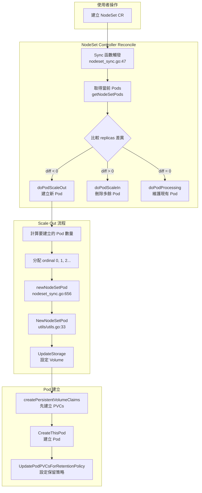
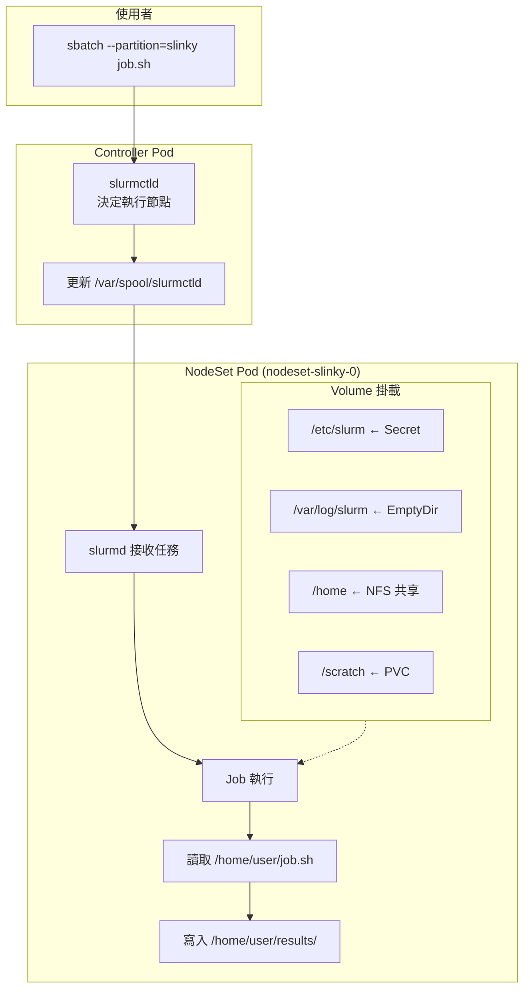
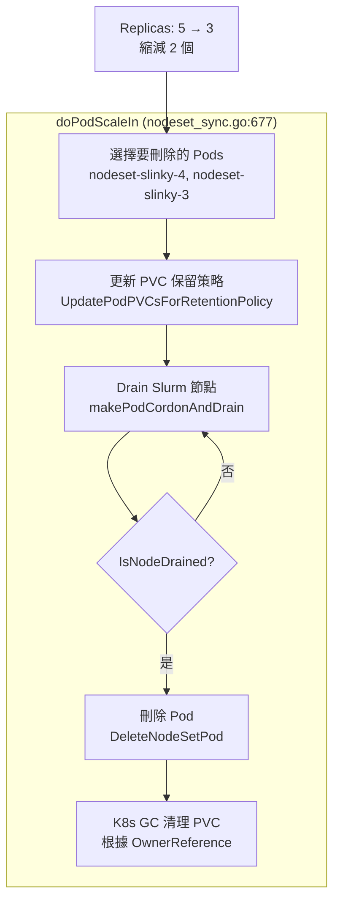
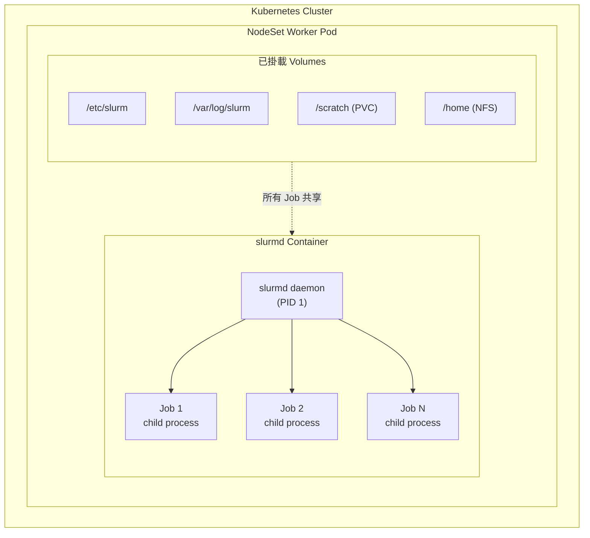
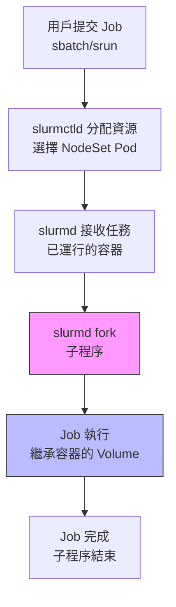
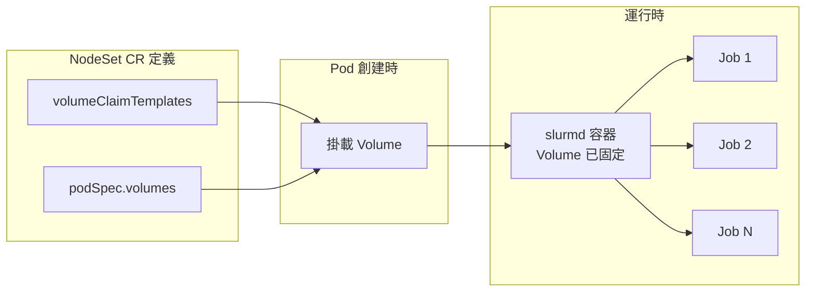

# NodeSet Storage 深入分析

> 最後更新：2025-12-23
> 相關文件：[FAQ](./slurm-faq.md) | [使用指南](./slurm-usage-guide.md) | [Helm 管理指南](./helm-nodeset-guide.md) | [NodeSet API 參考](./nodeset-api-reference.md)

---

## 概覽

本文檔深入分析 NodeSet 中儲存 (Storage) 的實現機制，包括：

- Worker (slurmd) Pod 如何建立
- 儲存如何掛載到容器
- Slurm 與 Kubernetes 儲存的關係

**目標讀者**：需要了解底層實現的開發者和進階管理員

---

## 1. NodeSet Storage 架構總覽

### 1.1 儲存類型對比

| 儲存類型 | 用途 | 生命週期 | 適用場景 |
|---------|------|---------|---------|
| `volumeClaimTemplates` | 每個 Pod 專屬的持久化儲存 | 跟隨 Pod 或 NodeSet | 本地工作目錄、暫存資料 |
| `volumes` (在 `podSpec` 中) | 共享儲存 | 獨立於 Pod | NFS 家目錄、共享資料集 |
| `emptyDir` | 臨時儲存 | Pod 生命週期 | 日誌、臨時快取 |

### 1.2 關鍵差異：NodeSet vs Controller

```
┌─────────────────────────────────────────────────────────────────┐
│                     Controller (slurmctld)                       │
├─────────────────────────────────────────────────────────────────┤
│  persistence:                                                   │
│    enabled: true        → StatefulSet VolumeClaimTemplate      │
│    existingClaim: xxx   → 直接使用現有 PVC                      │
│    enabled: false       → EmptyDir (資料不持久化)               │
│                                                                 │
│  用途: 保存 Slurm 狀態 (save-state)                             │
│  路徑: /var/spool/slurmctld                                    │
└─────────────────────────────────────────────────────────────────┘

┌─────────────────────────────────────────────────────────────────┐
│                       NodeSet (slurmd)                          │
├─────────────────────────────────────────────────────────────────┤
│  volumeClaimTemplates:  → 每個 Pod 建立獨立 PVC                  │
│  podSpec.volumes:       → 共享 Volume (如 NFS)                  │
│                                                                 │
│  用途: 工作目錄、家目錄掛載                                      │
│  路徑: 由使用者定義 (如 /home, /scratch)                        │
└─────────────────────────────────────────────────────────────────┘
```

---

## 2. Worker Pod 建立流程

### 2.1 完整流程圖



**關鍵函數說明：**

| 函數 | 檔案位置 | 說明 |
|------|----------|------|
| `Sync()` | `nodeset_sync.go:47` | Reconcile 主入口 |
| `doPodScaleOut()` | `nodeset_sync.go:570` | 擴容邏輯 |
| `NewNodeSetPod()` | `utils/utils.go:33` | 建構 Pod 規格 |
| `UpdateStorage()` | `utils/utils.go:89` | 設定 Volume 對應 |
| `CreateNodeSetPod()` | `podcontrol/podcontrol.go:61` | 建立 PVC 和 Pod |

### 2.2 關鍵程式碼解析

#### 2.2.1 UpdateStorage - 設定 Volume 與 VolumeMount 對應

**檔案:** `internal/controller/nodeset/utils/utils.go:89-111`

```go
// UpdateStorage 將 volumeClaimTemplates 轉換為 Pod 的 Volumes
func UpdateStorage(nodeset *slinkyv1beta1.NodeSet, pod *corev1.Pod) {
    currentVolumes := pod.Spec.Volumes
    claims := GetPersistentVolumeClaims(nodeset, pod)
    newVolumes := make([]corev1.Volume, 0, len(claims))

    // 為每個 PVC 建立對應的 Volume
    for name, claim := range claims {
        newVolumes = append(newVolumes, corev1.Volume{
            Name: name,  // Volume 名稱 = VolumeClaimTemplate 名稱
            VolumeSource: corev1.VolumeSource{
                PersistentVolumeClaim: &corev1.PersistentVolumeClaimVolumeSource{
                    ClaimName: claim.Name,  // PVC 名稱 = "{template}-{nodeset}-{ordinal}"
                    ReadOnly:  false,
                },
            },
        })
    }

    // 保留其他非 PVC 的 Volumes (如 NFS)
    for i := range currentVolumes {
        if _, ok := claims[currentVolumes[i].Name]; !ok {
            newVolumes = append(newVolumes, currentVolumes[i])
        }
    }
    pod.Spec.Volumes = newVolumes
}
```

#### 2.2.2 GetPersistentVolumeClaims - PVC 名稱生成規則

**檔案:** `internal/controller/nodeset/utils/utils.go:253-270`

```go
// GetPersistentVolumeClaims 根據 volumeClaimTemplates 生成 PVC 規格
func GetPersistentVolumeClaims(nodeset *slinkyv1beta1.NodeSet, pod *corev1.Pod) map[string]corev1.PersistentVolumeClaim {
    ordinal := GetOrdinal(pod)  // 從 pod name 解析 ordinal
    templates := nodeset.Spec.VolumeClaimTemplates
    claims := make(map[string]corev1.PersistentVolumeClaim, len(templates))

    for i := range templates {
        claim := templates[i].DeepCopy()
        // ⭐ PVC 命名規則: {volumeClaimTemplate.name}-{nodeset.name}-{ordinal}
        // 例如: data-nodeset-slinky-0, data-nodeset-slinky-1, ...
        claim.Name = GetPersistentVolumeClaimName(nodeset, claim, ordinal)
        claim.Namespace = nodeset.Namespace
        claim.Labels = selectorLabels  // 設定選擇器標籤
        claims[templates[i].Name] = *claim
    }
    return claims
}

// GetPersistentVolumeClaimName 生成 PVC 名稱
func GetPersistentVolumeClaimName(nodeset *slinkyv1beta1.NodeSet, claim *corev1.PersistentVolumeClaim, ordinal int) string {
    return fmt.Sprintf("%s-%s-%d", claim.Name, nodeset.Name, ordinal)
}
```

#### 2.2.3 createPersistentVolumeClaims - 實際建立 PVC

**檔案:** `internal/controller/nodeset/podcontrol/podcontrol.go:272-300`

```go
// createPersistentVolumeClaims 在建立 Pod 前先建立所需的 PVCs
func (r *realPodControl) createPersistentVolumeClaims(ctx context.Context, nodeset *slinkyv1beta1.NodeSet, pod *corev1.Pod) error {
    var errs []error
    for _, claim := range nodesetutils.GetPersistentVolumeClaims(nodeset, pod) {
        pvc := &corev1.PersistentVolumeClaim{}
        err := r.Get(ctx, pvcId, pvc)
        switch {
        case apierrors.IsNotFound(err):
            // PVC 不存在，建立新的
            if err := r.Create(ctx, &claim); err != nil {
                errs = append(errs, fmt.Errorf("failed to create PVC %s: %w", claim.Name, err))
            }
        case err != nil:
            errs = append(errs, fmt.Errorf("failed to retrieve PVC %s: %w", claim.Name, err))
        default:
            // PVC 已存在，檢查是否正在刪除
            if pvc.DeletionTimestamp != nil {
                errs = append(errs, fmt.Errorf("pvc %s is being deleted", claim.Name))
            }
        }
    }
    return errorutils.NewAggregate(errs)
}
```

---

## 3. 儲存掛載機制

### 3.1 基礎 Volume 掛載 (所有 NodeSet Pod 都有)

**檔案:** `internal/builder/worker_app.go:96-168`

```go
func nodesetVolumes(nodeset *slinkyv1beta1.NodeSet, controller *slinkyv1beta1.Controller) []corev1.Volume {
    out := []corev1.Volume{
        // 1. Slurm 配置目錄 (唯讀)
        {
            Name: slurmEtcVolume,  // "slurm-etc"
            VolumeSource: corev1.VolumeSource{
                Projected: &corev1.ProjectedVolumeSource{
                    Sources: []corev1.VolumeProjection{
                        {
                            Secret: &corev1.SecretProjection{
                                LocalObjectReference: corev1.LocalObjectReference{
                                    Name: controller.AuthSlurmRef().Name,
                                },
                                Items: []corev1.KeyToPath{
                                    {Key: "slurm.key", Path: "slurm.key"},
                                },
                            },
                        },
                    },
                },
            },
        },
        // 2. 日誌目錄
        logFileVolume(),  // EmptyDir for /var/log/slurm
    }

    // 3. SSH 相關 (如果啟用)
    if nodeset.Spec.Ssh.Enabled {
        out = append(out, sshConfigVolume, sssdConfVolume)
    }

    return out
}
```

**對應的 VolumeMount:**

```go
func (b *Builder) slurmdContainer(...) corev1.Container {
    volumeMounts := []corev1.VolumeMount{
        {Name: slurmEtcVolume, MountPath: "/etc/slurm", ReadOnly: true},
        {Name: slurmLogFileVolume, MountPath: "/var/log/slurm"},
    }

    if nodeset.Spec.Ssh.Enabled {
        volumeMounts = append(volumeMounts,
            {Name: sshConfigVolume, MountPath: "/etc/ssh/sshd_config", SubPath: "sshd_config"},
            {Name: sssdConfVolume, MountPath: "/etc/sssd/sssd.conf", SubPath: "sssd.conf"},
        )
    }
    // ...
}
```

### 3.2 使用者自定義 Volume 掛載

在 Helm `values.yaml` 中，使用者可以透過兩種方式添加儲存：

#### 方式 1: volumeClaimTemplates (每個 Pod 獨立 PVC)

```yaml
nodesets:
  slinky:
    enabled: true
    replicas: 3
    # 每個 Pod 都會建立獨立的 PVC
    volumeClaimTemplates:
      - metadata:
          name: scratch
        spec:
          accessModes: ["ReadWriteOnce"]
          storageClassName: "local-path"
          resources:
            requests:
              storage: 100Gi
    slurmd:
      volumeMounts:
        - name: scratch
          mountPath: /scratch
```

**結果:**
- 建立 PVC: `scratch-nodeset-slinky-0`, `scratch-nodeset-slinky-1`, `scratch-nodeset-slinky-2`
- 每個 Pod 掛載自己的 PVC 到 `/scratch`

#### 方式 2: podSpec.volumes (共享儲存)

```yaml
nodesets:
  slinky:
    enabled: true
    replicas: 3
    slurmd:
      volumeMounts:
        - name: nfs-home
          mountPath: /home
        - name: nfs-data
          mountPath: /data
    podSpec:
      volumes:
        - name: nfs-home
          nfs:
            server: nfs-server.example.com
            path: /exports/home
        - name: nfs-data
          nfs:
            server: nfs-server.example.com
            path: /exports/data
```

**結果:**
- 所有 Pod 共享相同的 NFS 掛載
- 適用於家目錄、共享資料集

---

## 4. Slurm 與 Kubernetes 儲存的關係

### 4.1 Slurm 需要的儲存

| Slurm 元件 | 儲存需求 | 路徑 | K8s 實現方式 |
|-----------|---------|------|-------------|
| slurmctld | 狀態保存 (save-state) | `/var/spool/slurmctld` | Controller persistence (PVC/EmptyDir) |
| slurmd | 工作目錄 | `/var/spool/slurmd` | EmptyDir (預設) 或自定義 |
| slurmdbd | 資料庫 | 外部 MariaDB | 不在 K8s 管理範圍 |
| Job 資料 | 使用者家目錄 | `/home` | NFS 或其他共享儲存 |
| Job 資料 | 暫存空間 | `/scratch`, `/tmp` | volumeClaimTemplates 或 NFS |

### 4.2 Slurm Job 如何存取儲存



**Volume 掛載對應：**

| 路徑 | 來源 | 用途 |
|------|------|------|
| `/etc/slurm` | Projected Secret | Slurm 認證金鑰 |
| `/var/log/slurm` | EmptyDir | 日誌（Pod 生命週期） |
| `/home` | NFS | 共享家目錄 |
| `/scratch` | PVC | Per-Pod 高速暫存 |

### 4.3 為什麼 NodeSet 需要共享儲存？

1. **家目錄一致性:** 使用者在任何節點登入或執行 Job 都需要看到相同的家目錄
2. **資料存取:** Job 輸入檔案和輸出結果需要可被存取
3. **Slurm 工具:** `sbatch`, `squeue`, `srun` 等指令需要存取配置

**典型配置範例:**

```yaml
nodesets:
  compute:
    enabled: true
    replicas: 10
    slurmd:
      volumeMounts:
        - name: home
          mountPath: /home
        - name: data
          mountPath: /data
          readOnly: true  # 資料集唯讀
        - name: scratch
          mountPath: /scratch
    podSpec:
      volumes:
        - name: home
          nfs:
            server: nfs.example.com
            path: /exports/home
        - name: data
          nfs:
            server: nfs.example.com
            path: /exports/datasets
    volumeClaimTemplates:
      - metadata:
          name: scratch
        spec:
          accessModes: ["ReadWriteOnce"]
          storageClassName: "local-nvme"
          resources:
            requests:
              storage: 1Ti
```

---

## 5. PVC 保留策略 (RetentionPolicy)

### 5.1 策略類型

| 策略組合 | whenDeleted | whenScaled | 行為 |
|---------|-------------|------------|------|
| 完全保留 | Retain | Retain | PVC 永不自動刪除 |
| 刪除時清理 | Delete | Retain | NodeSet 刪除時刪除 PVC，縮容時保留 |
| 縮容時清理 | Retain | Delete | 縮容時刪除 PVC，NodeSet 刪除時保留 |
| 全部清理 | Delete | Delete | 縮容或刪除都會清理 PVC |

### 5.2 實現機制

**檔案:** `internal/controller/nodeset/podcontrol/podcontrol.go:155-182`

```go
// PVC OwnerReference 設定策略:
//
// Retain/Retain: 無 OwnerRef
// Delete/Retain: OwnerRef 指向 NodeSet
// Retain/Delete: OwnerRef 指向 Pod (僅當 Pod 被縮容時)
// Delete/Delete: OwnerRef 指向 NodeSet 或 Pod

func isClaimOwnerUpToDate(...) bool {
    policy := getPersistentVolumeClaimRetentionPolicy(nodeset)
    switch {
    case policy.WhenDeleted == retain && policy.WhenScaled == retain:
        // 不應有任何 OwnerRef
        if hasOwnerRef(claim, nodeset) || hasOwnerRef(claim, pod) {
            return false
        }
    case policy.WhenDeleted == delete && policy.WhenScaled == retain:
        // 應該只有 NodeSet 的 OwnerRef
        if !hasOwnerRef(claim, nodeset) || hasOwnerRef(claim, pod) {
            return false
        }
    // ...
    }
    return true
}
```

### 5.3 Helm 配置方式

```yaml
nodesets:
  slinky:
    persistentVolumeClaimRetentionPolicy:
      whenDeleted: Delete  # NodeSet 刪除時刪除 PVC
      whenScaled: Retain   # 縮容時保留 PVC (可重用)
```

---

## 6. 縮容時的儲存處理

### 6.1 縮容流程



**縮容步驟說明：**

| 步驟 | 函數 | 說明 |
|------|------|------|
| 1 | `doPodScaleIn()` | 選擇較高 ordinal 的 Pod |
| 2 | `fixPodPVCsFn()` | 更新 PVC OwnerReference |
| 3 | `processCondemned()` | 標記 cordon + drain |
| 4 | `IsNodeDrained()` | 等待 Job 完成 |
| 5 | `DeleteNodeSetPod()` | 安全刪除 Pod |
| 6 | K8s GC | 自動清理 PVC（依策略）|

### 6.2 重要：資料保護機制

```go
// 縮容時 Slurm 的保護流程:
// 1. Pod 被標記為 cordon (不再接受新 Job)
// 2. Slurm node 被設為 DRAIN 狀態
// 3. 等待現有 Job 完成
// 4. 確認 Slurm node 完全 DRAINED
// 5. 才刪除 Pod

func (r *NodeSetReconciler) processCondemned(ctx, nodeset, condemned, i) error {
    pod := condemned[i]

    // 檢查是否已完全 drain
    isDrained, err := r.slurmControl.IsNodeDrained(ctx, nodeset, pod)
    if !isDrained {
        // 未完成，設定 drain 並等待
        return r.makePodCordonAndDrain(ctx, nodeset, pod, reason)
    }

    // 已完全 drain，可以安全刪除
    return r.podControl.DeleteNodeSetPod(ctx, nodeset, pod)
}
```

---

## 7. 實際使用範例

### 7.1 基本設定 (僅共享儲存)

```yaml
# values.yaml
nodesets:
  compute:
    enabled: true
    replicas: 4
    slurmd:
      image:
        repository: ghcr.io/slinkyproject/slurmd
        tag: "25.11"
      resources:
        limits:
          cpu: "16"
          memory: "64Gi"
      volumeMounts:
        - name: home
          mountPath: /home
    podSpec:
      volumes:
        - name: home
          nfs:
            server: nfs.cluster.local
            path: /exports/home
```

### 7.2 進階設定 (本地高速暫存 + 共享儲存)

```yaml
# values.yaml
nodesets:
  gpu:
    enabled: true
    replicas: 2
    slurmd:
      image:
        repository: ghcr.io/slinkyproject/slurmd
        tag: "25.11"
      resources:
        limits:
          cpu: "32"
          memory: "128Gi"
          nvidia.com/gpu: "4"
      volumeMounts:
        - name: home
          mountPath: /home
        - name: datasets
          mountPath: /data
          readOnly: true
        - name: local-scratch
          mountPath: /scratch
    podSpec:
      nodeSelector:
        node-type: gpu
      volumes:
        - name: home
          nfs:
            server: nfs.cluster.local
            path: /exports/home
        - name: datasets
          nfs:
            server: nfs.cluster.local
            path: /exports/datasets
    # 每個 GPU 節點都有本地 NVMe SSD
    volumeClaimTemplates:
      - metadata:
          name: local-scratch
        spec:
          accessModes: ["ReadWriteOnce"]
          storageClassName: "local-nvme"
          resources:
            requests:
              storage: 2Ti
    persistentVolumeClaimRetentionPolicy:
      whenDeleted: Delete
      whenScaled: Delete  # 暫存資料不需保留
```

### 7.3 多節點集群 (不同儲存需求)

```yaml
nodesets:
  # 高記憶體節點：大量共享儲存
  highmem:
    enabled: true
    replicas: 2
    slurmd:
      resources:
        limits:
          cpu: "64"
          memory: "512Gi"
      volumeMounts:
        - name: home
          mountPath: /home
        - name: bigdata
          mountPath: /bigdata
    podSpec:
      volumes:
        - name: home
          nfs:
            server: nfs.cluster.local
            path: /exports/home
        - name: bigdata
          nfs:
            server: lustre.cluster.local
            path: /lustre/bigdata

  # 標準計算節點：本地暫存
  standard:
    enabled: true
    replicas: 20
    slurmd:
      resources:
        limits:
          cpu: "16"
          memory: "32Gi"
      volumeMounts:
        - name: home
          mountPath: /home
        - name: scratch
          mountPath: /tmp
    podSpec:
      volumes:
        - name: home
          nfs:
            server: nfs.cluster.local
            path: /exports/home
    volumeClaimTemplates:
      - metadata:
          name: scratch
        spec:
          accessModes: ["ReadWriteOnce"]
          resources:
            requests:
              storage: 100Gi
```

---

## 8. 故障排除

### 8.1 常見問題

| 問題 | 可能原因 | 解決方法 |
|------|---------|---------|
| Pod 卡在 Pending | PVC 無法建立 | 檢查 StorageClass 是否存在、配額是否足夠 |
| Pod 啟動失敗 | Volume 掛載失敗 | 檢查 NFS 伺服器連線、PVC 是否 Bound |
| Job 找不到檔案 | 掛載路徑錯誤 | 確認 volumeMounts 路徑正確 |
| 縮容後資料遺失 | RetentionPolicy 設為 Delete | 如需保留資料，使用 Retain 策略 |

### 8.2 診斷指令

```bash
# 檢查 NodeSet 狀態
kubectl get nodesets -n slurm

# 檢查 PVC 狀態
kubectl get pvc -n slurm -l app.kubernetes.io/component=worker

# 檢查 Pod 的 Volume 掛載
kubectl describe pod nodeset-slinky-0 -n slurm | grep -A20 "Volumes:"

# 進入 Pod 檢查掛載
kubectl exec -it nodeset-slinky-0 -n slurm -- df -h

# 檢查 Slurm 節點狀態
kubectl exec -it nodeset-slinky-0 -n slurm -- sinfo -N
```

---

## 9. Slurm Job 與 Storage 的關係

### 9.1 核心問題：Job 能否動態掛載 Storage？

**答案：否，Slurm Job 無法動態掛載額外的 Storage。**

### 9.2 技術原因

#### Job 的執行本質



**層次結構**：K8s Cluster → Pod → Container → slurmd daemon → Job (child process)

**關鍵理解：**

| 概念 | 說明 |
|------|------|
| **Slurm Job** | 是 slurmd daemon 的 **子程序 (child process)**，不是 Kubernetes Pod |
| **K8s Volume** | 只能在 **Pod 創建時** 掛載，無法動態添加 |
| **結論** | Job 只能存取 Pod 創建時已掛載的 Volume |

### 9.3 Job 執行流程



**重點**：Job 是 slurmd 的子程序，自動繼承容器已掛載的所有 Volume。

### 9.4 Job 可存取的 Storage 類型

| Storage 類型 | 配置位置 | 範圍 | 適用場景 |
|-------------|---------|------|----------|
| **volumeClaimTemplates** | NodeSet spec | 每 Pod 獨立 | 本地快取、中繼資料 |
| **NFS (podSpec.volumes)** | NodeSet podSpec | 所有 Pod 共享 | 家目錄、共享資料集 |
| **hostPath** | NodeSet podSpec | K8s Node 本地 | 存取 GPU Driver、本地 SSD |
| **emptyDir** | NodeSet podSpec | Pod 生命週期內 | 暫存計算結果 |

### 9.5 實務配置範例

```yaml
# values.yaml - 為 Job 提供 Storage
nodesets:
  gpu:
    enabled: true
    replicas: 4
    slurmd:
      volumeMounts:
        - name: scratch       # Per-Pod 高速儲存
          mountPath: /scratch
        - name: home          # 共享家目錄
          mountPath: /home
        - name: datasets      # 共享資料集
          mountPath: /datasets
        - name: output        # 共享輸出目錄
          mountPath: /output
    podSpec:
      volumes:
        # 共享 NFS
        - name: home
          nfs:
            server: nfs.example.com
            path: /exports/home
        - name: datasets
          nfs:
            server: nfs.example.com
            path: /exports/datasets
        - name: output
          nfs:
            server: nfs.example.com
            path: /exports/output
    # Per-Pod PVC
    volumeClaimTemplates:
      - metadata:
          name: scratch
        spec:
          accessModes: ["ReadWriteOnce"]
          storageClassName: fast-ssd
          resources:
            requests:
              storage: 500Gi
```

### 9.6 Pyxis 容器化 Job

使用 Pyxis 時，Job 在獨立容器中執行，但 **storage 仍來自 host Pod**：

```bash
# 將 Pod 已掛載的 Volume 傳遞給 Job 容器
srun --container-image=pytorch:latest \
     --container-mounts=/home:/home,/scratch:/scratch \
     python train.py
```

這不是動態掛載新 storage，而是將 **已存在的 Volume** 映射到 Job 容器。

### 9.7 架構限制總結



**限制摘要：**

| 狀態 | 說明 |
|------|------|
| ❌ | Job 無法動態掛載新 Volume |
| ❌ | Job 無法存取未預先掛載的 Storage |
| ✅ | Job 可使用所有 Pod 創建時已掛載的 Storage |

### 9.8 解決方案建議

| 需求 | 解決方案 |
|------|----------|
| Job 需要存取共享資料 | 使用 NFS Volume 在 podSpec.volumes 配置 |
| Job 需要高速本地儲存 | 使用 volumeClaimTemplates 配置 Per-Pod SSD |
| 不同 Job 需要不同容器環境 | 使用 Pyxis 搭配 container-mounts |
| Job 需要存取特定資料集 | 預先掛載所有可能需要的資料集路徑 |

---

## 10. 相關檔案索引

| 檔案 | 用途 |
|------|------|
| `api/v1beta1/nodeset_types.go` | NodeSet CRD 定義 (含 volumeClaimTemplates) |
| `internal/controller/nodeset/nodeset_sync.go` | NodeSet 控制器主邏輯 |
| `internal/controller/nodeset/podcontrol/podcontrol.go` | Pod 和 PVC 建立邏輯 |
| `internal/controller/nodeset/utils/utils.go` | PVC 名稱生成、Storage 更新 |
| `internal/builder/worker_app.go` | Worker Pod 模板建構 |
| `helm/slurm/templates/nodeset/nodeset-cr.yaml` | Helm 模板 |
| `helm/slurm/values.yaml` | 預設配置值 |

---

> 原始生成：2025-12-22（document-project deep-dive 模式）
> 最後改寫：2025-12-23（新增 Mermaid 圖表、交叉連結）
