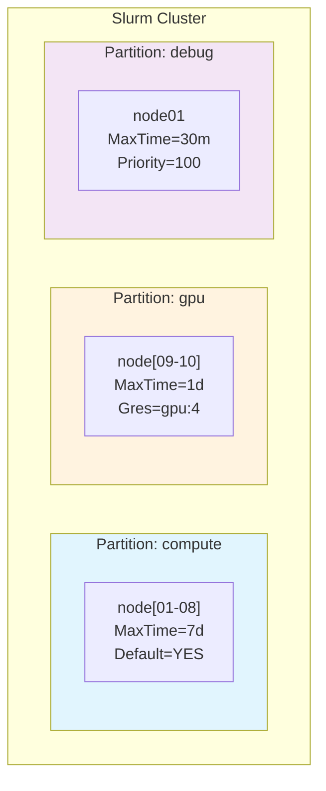
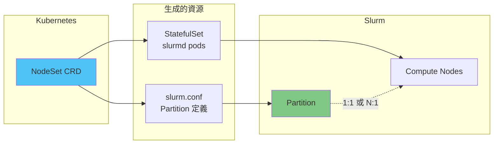
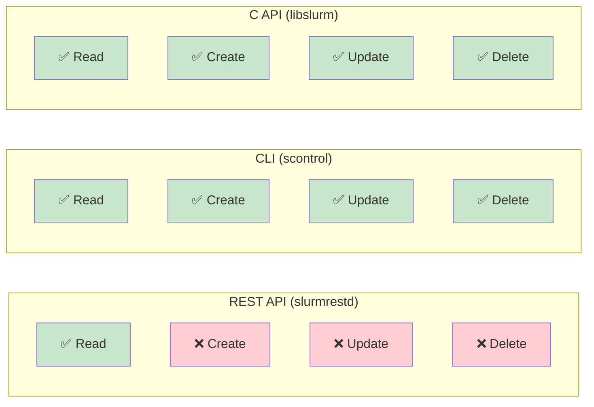
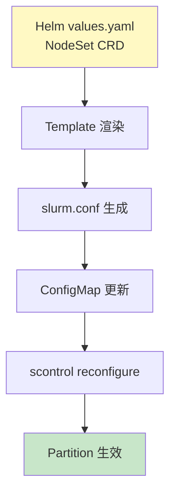
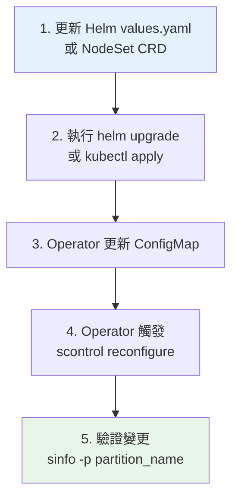

# Slurm Partition 管理深度分析

> 產生日期：2025-12-31 | 來源：Slurm 26.05 原始碼分析 + slurm-operator 實作研究

## 目錄

- [概述](#概述)
- [Partition 基礎概念](#partition-基礎概念)
- [REST API 現況分析](#rest-api-現況分析)
- [底層 C API 分析](#底層-c-api-分析)
- [scontrol CLI 分析](#scontrol-cli-分析)
- [slurm-operator 現有做法](#slurm-operator-現有做法)
- [動態 Partition 管理方案評估](#動態-partition-管理方案評估)
- [優缺點分析](#優缺點分析)
- [可能遇到的問題](#可能遇到的問題)
- [Best Practices](#best-practices)
- [結論與建議](#結論與建議)

---

## 概述

本文深入分析 Slurm Partition 的管理機制，特別聚焦於 REST API 的限制、可用的替代方案，以及在 Kubernetes 環境中的最佳實踐。

### 關鍵發現

| 管理方式 | 支援 CRUD | 備註 |
|----------|-----------|------|
| REST API (slurmrestd) | **僅 Read** | 無法透過 REST API 建立/修改/刪除 partition |
| C API (libslurm) | 完整支援 | `slurm_create_partition`, `slurm_update_partition`, `slurm_delete_partition` |
| CLI (scontrol) | 完整支援 | `scontrol create/update/delete partition` |
| slurm.conf | 宣告式 | 需要 `scontrol reconfigure` 重載 |

---

## Partition 基礎概念

### 什麼是 Partition？

Partition（分割區）是 Slurm 中將節點分組的邏輯單位，類似於傳統 HPC 系統的「佇列 (queue)」概念。



### Partition 資料結構

**位置**：`src/common/part_record.h`

```c
struct part_record {
    // 識別
    char *name;              // Partition 名稱
    char *nodes;             // 節點列表
    bitstr_t *node_bitmap;   // 節點位圖

    // 容量限制
    uint32_t total_nodes;
    uint32_t total_cpus;
    uint32_t max_nodes;
    uint32_t min_nodes;

    // 時間限制
    uint32_t max_time;
    uint32_t default_time;

    // 資源限制
    uint32_t max_cpus_per_node;
    uint64_t max_mem_per_cpu;
    uint16_t max_share;

    // 優先級
    uint16_t priority_job_factor;
    uint16_t priority_tier;

    // 狀態
    uint16_t state_up;       // UP, DOWN, DRAIN, INACTIVE
    uint32_t flags;          // PART_FLAG_*
};
```

### Partition 與 NodeSet 的關係

在 slurm-operator 中，NodeSet CRD 同時管理計算節點和對應的 Partition：



---

## REST API 現況分析

### 可用端點

| 方法 | 路徑 | 功能 | 狀態 |
|------|------|------|------|
| GET | `/slurm/{version}/partitions/` | 列出所有 partition | ✅ 可用 |
| GET | `/slurm/{version}/partition/{name}` | 取得特定 partition | ✅ 可用 |
| POST | `/slurm/{version}/partition/` | 建立 partition | ❌ 不存在 |
| POST | `/slurm/{version}/partition/{name}` | 更新 partition | ❌ 不存在 |
| DELETE | `/slurm/{version}/partition/{name}` | 刪除 partition | ❌ 不存在 |

### 原始碼證據

**檔案**：`src/slurmrestd/plugins/openapi/slurmctld/partitions.c`

```c
extern int op_handler_partitions(openapi_ctxt_t *ctxt)
{
    // 明確拒絕非 GET 請求
    if (ctxt->method != HTTP_REQUEST_GET) {
        resp_error(ctxt, ESLURM_REST_INVALID_QUERY, __func__,
                   "Unsupported HTTP method requested: %s",
                   get_http_method_string(ctxt->method));
        goto done;
    }
    // ... 只實作讀取邏輯
}
```

### 與其他資源的對比

| 資源類型 | GET | POST (Create) | POST (Update) | DELETE |
|----------|-----|---------------|---------------|--------|
| Jobs | ✅ | ✅ | ✅ | ✅ |
| Nodes | ✅ | ✅ | ✅ | ✅ |
| Reservations | ✅ | ✅ | ✅ | ✅ |
| **Partitions** | ✅ | ❌ | ❌ | ❌ |
| QoS (slurmdbd) | ✅ | ✅ | ✅ | ✅ |

**結論**：Partition 是 slurmctld 資源中**唯一不支援完整 CRUD 的資源類型**。

以下圖表說明各管理介面的 CRUD 支援情況：



### 為什麼 SchedMD 沒有實作？

可能原因：

1. **設計哲學**：Partition 被視為「配置」而非「運行時資源」
2. **複雜性**：Partition 變更涉及節點重新分配、作業遷移等複雜邏輯
3. **優先級**：相比 Jobs/Nodes，動態 Partition 管理需求較低
4. **安全考量**：Partition 影響叢集整體結構，限制修改途徑可減少誤操作

---

## 底層 C API 分析

雖然 REST API 不支援，但 Slurm 的 C API 提供完整的 Partition CRUD 功能。

### 可用 API

**位置**：`slurm/slurm.h`

```c
// 初始化 partition 描述結構
extern void slurm_init_part_desc_msg(update_part_msg_t *update_part_msg);

// 建立 partition（僅 root 可用）
extern int slurm_create_partition(update_part_msg_t *part_msg);

// 更新 partition（僅 root 可用）
extern int slurm_update_partition(update_part_msg_t *part_msg);

// 刪除 partition（僅 root 可用）
extern int slurm_delete_partition(delete_part_msg_t *part_msg);

// 讀取 partition 資訊
extern int slurm_load_partitions(time_t update_time,
                                  partition_info_msg_t **part_buffer_ptr,
                                  uint16_t show_flags);
```

### update_part_msg_t 結構

`update_part_msg_t` 實際上是 `partition_info_t` 的別名：

```c
typedef struct partition_info update_part_msg_t;
```

關鍵欄位：

| 欄位 | 類型 | 說明 |
|------|------|------|
| `name` | char* | Partition 名稱（必填） |
| `nodes` | char* | 節點列表 |
| `state_up` | uint16_t | UP, DOWN, DRAIN, INACTIVE |
| `max_time` | uint32_t | 最大執行時間（分鐘） |
| `default_time` | uint32_t | 預設執行時間 |
| `max_nodes` | uint32_t | 每個作業最大節點數 |
| `min_nodes` | uint32_t | 每個作業最小節點數 |
| `flags` | uint32_t | PART_FLAG_* 旗標 |
| `priority_tier` | uint16_t | 優先級層級 |
| `max_share` | uint16_t | 節點共享設定 |

### Flags 定義

```c
#define PART_FLAG_DEFAULT       SLURM_BIT(0)  // 預設 partition
#define PART_FLAG_HIDDEN        SLURM_BIT(1)  // 隱藏 partition
#define PART_FLAG_NO_ROOT       SLURM_BIT(2)  // 禁止 root 作業
#define PART_FLAG_ROOT_ONLY     SLURM_BIT(3)  // 僅 root 可提交
#define PART_FLAG_REQ_RESV      SLURM_BIT(4)  // 需要預約
#define PART_FLAG_EXCLUSIVE_USER SLURM_BIT(6) // 使用者獨佔節點

// 清除旗標用
#define PART_FLAG_DEFAULT_CLR   SLURM_BIT(8)
#define PART_FLAG_HIDDEN_CLR    SLURM_BIT(9)
// ...
```

---

## scontrol CLI 分析

`scontrol` 是目前動態管理 Partition 的主要方式。

### 建立 Partition

```bash
scontrol create partition \
    PartitionName=gpu \
    Nodes=node[09-10] \
    State=UP \
    MaxTime=1-00:00:00 \
    Default=NO
```

### 更新 Partition

```bash
# 修改狀態
scontrol update partitionname=compute state=drain

# 修改時間限制
scontrol update partitionname=compute maxtime=14-00:00:00

# 新增/移除節點
scontrol update partitionname=compute nodes+=node11
scontrol update partitionname=compute nodes-=node01
```

### 刪除 Partition

```bash
scontrol delete partition=gpu
```

### 實作原理

**檔案**：`src/scontrol/update_part.c`

```c
extern int scontrol_update_part(int argc, char **argv)
{
    update_part_msg_t part_msg;
    slurm_init_part_desc_msg(&part_msg);

    // 解析參數
    scontrol_parse_part_options(argc, argv, &update_cnt, &part_msg);

    // 呼叫 C API
    if (slurm_update_partition(&part_msg)) {
        exit_code = 1;
        return errno;
    }
    return SLURM_SUCCESS;
}
```

---

## slurm-operator 現有做法

### 設計決策

slurm-operator 採用**靜態配置生成**而非**動態 API 呼叫**：



### 程式碼實作

**檔案**：`internal/builder/controller_config.go`

```go
func buildSlurmConf(...) {
    // 遍歷每個 NodeSet
    for _, nodeset := range nodesets {
        // 生成 NodeSet 行
        nodesetLine := []string{
            fmt.Sprintf("NodeSet=%v", name),
            fmt.Sprintf("Feature=%v", name),
        }
        conf.AddProperty(config.NewPropertyRaw(nodesetLineRendered))

        // 如果啟用 partition，生成 Partition 行
        partition := nodeset.Spec.Partition
        if !partition.Enabled {
            continue
        }
        partitionLine := []string{
            fmt.Sprintf("PartitionName=%v", name),
            fmt.Sprintf("Nodes=%v", name),
            partition.Config,
        }
        conf.AddProperty(config.NewPropertyRaw(partitionLineRendered))
    }
}
```

### Helm Chart 支援

**檔案**：`helm/slurm/templates/controller/_helpers.tpl`

```yaml
# 方式一：透過 NodeSet 內嵌 partition
nodesets:
  compute:
    partition:
      enabled: true
      config: "State=UP MaxTime=UNLIMITED"

# 方式二：獨立 partitions 區塊（可跨多個 NodeSet）
partitions:
  all:
    enabled: true
    nodesets:
      - ALL
    configMap:
      State: UP
      Default: "YES"
```

---

## 動態 Partition 管理方案評估

### 方案一：透過 REST API（不可行）

❌ **不可行**：REST API 不支援 Partition 的 CUD 操作。

### 方案二：透過 scontrol CLI

透過 `kubectl exec` 執行 `scontrol` 命令：

```bash
kubectl exec -it slurmctld-0 -- scontrol create partition PartitionName=gpu Nodes=gpu-node[1-4]
```

**優點**：
- 即時生效
- 無需重啟服務
- 完整支援所有 partition 參數

**缺點**：
- 非宣告式管理
- 變更不會持久化到 slurm.conf
- slurmctld 重啟後會遺失動態變更
- 需要 root 權限

### 方案三：修改 slurm.conf + reconfigure

修改 ConfigMap 中的 slurm.conf，然後觸發 reconfigure：

```bash
# 1. 修改 ConfigMap
kubectl edit configmap slurm-config

# 2. 觸發 reconfigure
kubectl exec -it slurmctld-0 -- scontrol reconfigure
```

**優點**：
- 變更會持久化
- 符合 Kubernetes 宣告式管理模式
- 可透過 GitOps 管理

**缺點**：
- 需要額外的自動化機制
- reconfigure 期間可能影響排程

### 方案四：自訂 Kubernetes Controller

建立專門管理 Partition 的 CRD 和 Controller：

```yaml
apiVersion: slinky.slurm.net/v1beta1
kind: SlurmPartition
metadata:
  name: gpu-partition
spec:
  clusterRef:
    name: my-slurm-cluster
  nodes: "gpu-node[1-4]"
  state: UP
  maxTime: "7-00:00:00"
  default: false
```

Controller 可以：
1. 監聽 SlurmPartition CRD 變更
2. 透過 `scontrol` 或直接呼叫 C API 更新 Slurm
3. 同步更新 slurm.conf ConfigMap

**優點**：
- 完全宣告式
- 與 Kubernetes 原生整合
- 可實作完整的 reconciliation 邏輯

**缺點**：
- 需要額外開發工作
- 增加系統複雜度
- 需要處理 C API 綁定或 CLI 呼叫

---

## 優缺點分析

### 使用 REST API 管理 Partition

| 面向 | 評估 |
|------|------|
| 可行性 | ❌ 不可行（只支援 Read） |
| 標準化 | - |
| 複雜度 | - |

### 使用 scontrol CLI 管理 Partition

| 面向 | 優點 | 缺點 |
|------|------|------|
| 即時性 | 即時生效 | - |
| 持久性 | - | 動態變更不持久 |
| 權限 | - | 需要 root |
| 整合 | 容易呼叫 | 非 API 驅動 |
| 可靠性 | 成熟穩定 | 需要解析輸出 |

### 使用 slurm.conf 管理 Partition

| 面向 | 優點 | 缺點 |
|------|------|------|
| 持久性 | 變更持久化 | - |
| 宣告式 | 符合 K8s 模式 | - |
| 即時性 | - | 需要 reconfigure |
| 複雜度 | 簡單明確 | 手動同步 |

---

## 可能遇到的問題

### 1. Partition 與 NodeSet 不同步

**問題**：NodeSet 新增/刪除時，Partition 未同步更新

**解決方案**：
- 確保 NodeSet CRD 的 partition 欄位正確設定
- 使用 Helm `partitions` 區塊集中管理
- 實作 Controller 自動同步

### 2. 動態 Partition 變更遺失

**問題**：透過 `scontrol` 建立的 partition 在 slurmctld 重啟後遺失

**解決方案**：
```bash
# 將動態變更寫入 slurm.conf
scontrol write config

# 或確保所有 partition 都定義在 slurm.conf 中
```

### 3. Partition 引用不存在的 NodeSet

**錯誤訊息**：
```
partition "xxx" is referencing nodeset "yyy" that does not exist
```

**解決方案**：
```yaml
# 確認 NodeSet 已啟用
nodesets:
  compute:
    enabled: true  # 必須為 true

partitions:
  batch:
    nodesets:
      - compute  # 必須匹配已啟用的 NodeSet
```

### 4. 多個 Partition 引用相同節點

**問題**：同一節點屬於多個 partition，作業排程可能混亂

**最佳實踐**：
- 使用 `Default=YES` 明確指定預設 partition
- 使用 `PriorityTier` 控制 partition 優先級
- 避免過多重疊，除非有明確需求

### 5. REST API 版本相容性

**問題**：不同 Slurm 版本的 API 路徑不同

**版本對應**：
| Slurm 版本 | API 版本 |
|------------|----------|
| 24.11 | v0.0.42 |
| 25.05 | v0.0.43 |
| 25.11 | v0.0.44 |
| 26.05 | v0.0.45 |

**建議**：在程式碼中使用版本探測或配置化 API 版本。

---

## Best Practices

### 1. Partition 命名規範

```yaml
# 好的命名
partitions:
  compute:     # 通用計算
  gpu:         # GPU 節點
  highmem:     # 高記憶體節點
  debug:       # 除錯用途
  interactive: # 互動式作業

# 避免的命名
partitions:
  p1:          # 不具描述性
  test123:     # 臨時性命名
  default:     # 保留字
```

### 2. 使用 NodeSet 自動建立 Partition

對於簡單的 1:1 映射，使用 NodeSet 內嵌 partition：

```yaml
nodesets:
  compute:
    enabled: true
    replicas: 10
    partition:
      enabled: true
      config: "State=UP MaxTime=7-00:00:00 Default=YES"
```

### 3. 使用獨立 partitions 區塊進行複雜配置

對於跨 NodeSet 的 partition：

```yaml
# 關閉 NodeSet 自動建立
nodesets:
  compute:
    partition:
      enabled: false
  gpu:
    partition:
      enabled: false

# 獨立定義 partition
partitions:
  all:
    enabled: true
    nodesets:
      - ALL
    configMap:
      State: UP
      Default: "YES"

  gpu-only:
    enabled: true
    nodesets:
      - gpu
    configMap:
      State: UP
      MaxTime: "7-00:00:00"
```

### 4. Partition 監控

透過 REST API 定期檢查 partition 狀態：

```python
import requests

def check_partitions(api_url, token):
    headers = {"X-SLURM-USER-TOKEN": token}
    resp = requests.get(f"{api_url}/slurm/v0.0.45/partitions/", headers=headers)

    for part in resp.json().get("partitions", []):
        name = part.get("name")
        state = part.get("state", {}).get("current", [])
        nodes_total = part.get("node_count", {}).get("total", 0)
        nodes_idle = part.get("node_count", {}).get("idle", 0)

        print(f"Partition: {name}")
        print(f"  State: {state}")
        print(f"  Nodes: {nodes_idle}/{nodes_total} idle")
```

### 5. 變更管理流程



---

## 結論與建議

### 現況總結

1. **REST API 限制**：Slurm REST API **不支援** Partition 的建立、更新、刪除操作
2. **C API 完整**：底層 C API 提供完整 CRUD 功能
3. **CLI 可用**：`scontrol` 是目前動態管理 Partition 的主要方式
4. **Operator 採用靜態方式**：slurm-operator 透過生成 slurm.conf 來管理 Partition

### 建議做法

#### 短期（維持現狀）

- 繼續使用 slurm.conf 靜態配置
- 透過 Helm values.yaml 管理 Partition
- 必要時使用 `scontrol` 進行臨時調整

#### 中期（增強自動化）

- 在 Operator 中加入 Partition 同步邏輯
- 監控 NodeSet 變更，自動更新 slurm.conf
- 實作自動 reconfigure 機制

#### 長期（完整 CRD 支援）

- 考慮建立獨立的 SlurmPartition CRD
- 實作專門的 Partition Controller
- 透過 C API binding 或 CLI wrapper 執行 CRUD

### 關於擴展 REST API

如果需要透過 REST API 管理 Partition，有兩個選擇：

1. **向 SchedMD 提交功能請求**：在官方 Slurm 中加入 Partition CRUD 端點
2. **自建 API 代理層**：建立中間層，將 REST 請求轉換為 `scontrol` 命令

---

## 相關文件

- [slurm-conf-guide.md](./slurm-conf-guide.md) - slurm.conf 配置指南
- [nodeset-api-reference.md](./nodeset-api-reference.md) - NodeSet API 參考
- [slurm-operator-api-guide.md](./slurm-operator-api-guide.md) - Operator API 指南
- [Slurm REST API 契約](../slurm/_bmad-output/api-contracts.md) - 完整 REST API 文件

## 原始碼參考

| 檔案 | 說明 |
|------|------|
| `slurm/slurm.h:4636-4657` | Partition C API 定義 |
| `src/slurmrestd/plugins/openapi/slurmctld/partitions.c` | REST API 實作（僅 GET） |
| `src/scontrol/update_part.c` | scontrol partition 操作 |
| `internal/builder/controller_config.go:268-278` | Operator partition 生成 |
| `helm/slurm/templates/controller/_helpers.tpl:43-70` | Helm partition 模板 |
