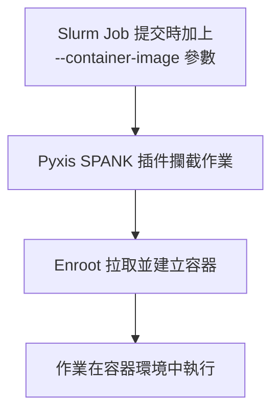
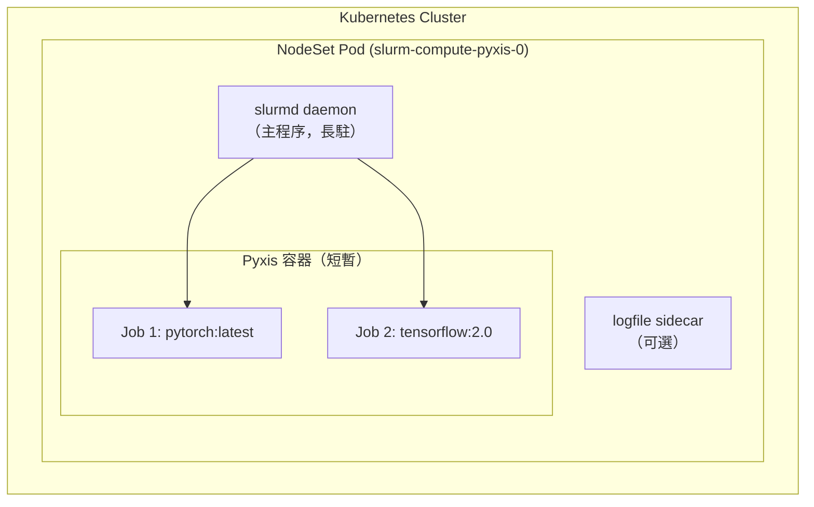
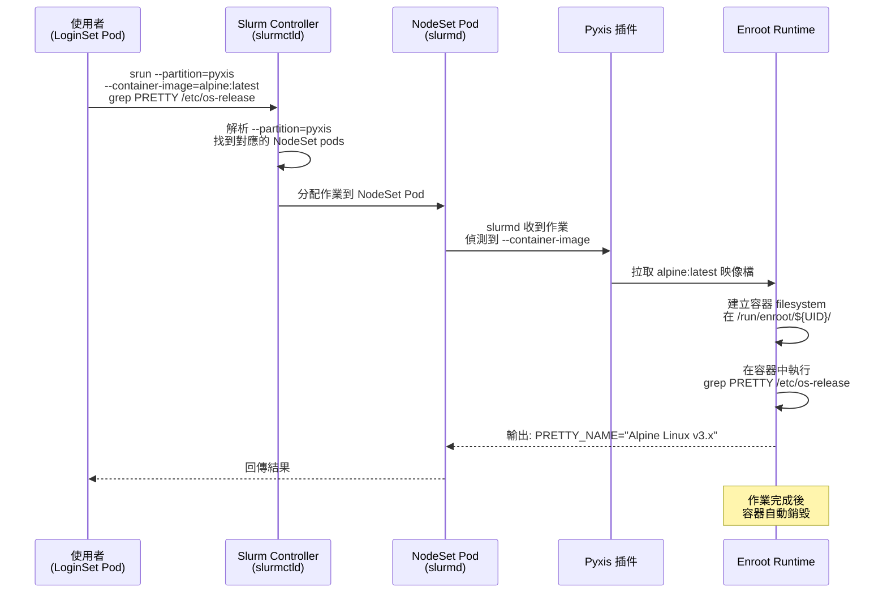

# Pyxis、NodeSet 與容器化作業深入解析

> 最後更新：2025-12-23
> 相關文件：[使用指南](./slurm-usage-guide.md) | [NodeSet API 參考](./nodeset-api-reference.md) | [Helm 管理指南](./helm-nodeset-guide.md) | [Pyxis 官方指南](../docs/usage/pyxis.md)

---

## 目錄

- [1. 概述](#1-概述)
- [2. 核心概念：三層架構](#2-核心概念三層架構)
- [3. 完整執行流程](#3-完整執行流程)
- [4. 啟用 Pyxis 的設定方式](#4-啟用-pyxis-的設定方式)
- [5. Enroot 進階設定](#5-enroot-進階設定)
- [6. 常見使用情境](#6-常見使用情境)
- [7. 故障排除](#7-故障排除)

---

## 1. 概述

### 什麼是 Pyxis？

**Pyxis** 是 NVIDIA 開發的 Slurm SPANK 插件，讓 Slurm 作業可以在容器中執行。它搭配 **enroot** 容器運行時使用，專為 HPC 環境設計。



### 為什麼需要 Pyxis？

| 需求 | Pyxis 解決方案 |
|------|---------------|
| 環境隔離 | 每個作業在獨立容器中執行 |
| 可重現性 | 使用 Docker/OCI 映像確保一致環境 |
| GPU 支援 | 自動傳遞 GPU 裝置到容器 |
| 與 Slurm 整合 | 無需修改現有作業腳本，只需加參數 |

---

## 2. 核心概念：三層架構

這是理解 Pyxis 運作的關鍵概念。在 Slurm Operator 環境中存在三個層級：



### 層級說明

| 層級 | 說明 | 生命週期 |
|------|------|----------|
| **Kubernetes Pod** | NodeSet Pod，運行 slurmd daemon | 長駐，由 NodeSet Controller 管理 |
| **Slurm Node** | 對 Slurm 來說，這個 Pod 就是一個計算節點 | 與 Pod 相同 |
| **Pyxis Container** | Job 執行時在 Pod 內部建立的 enroot 容器 | 短暫，作業結束即銷毀 |

### 重要觀念

- **NodeSet Pod 是長駐的**：不會因為 job 結束而消失
- **Pyxis 容器是短暫的**：job 結束就銷毀
- **一個 NodeSet Pod 可以執行多個 Pyxis jobs**：依序或同時（取決於資源分配）

---

## 3. 完整執行流程

當使用者提交一個帶有 `--container-image` 參數的作業時，以下是完整的執行流程：



### 流程說明

1. **作業提交**：使用者從 LoginSet Pod 提交作業，指定 `--container-image`
2. **排程分配**：slurmctld 根據 partition 找到對應的 pyxis-enabled NodeSet
3. **插件攔截**：slurmd 的 Pyxis SPANK 插件偵測到容器參數
4. **容器建立**：enroot 拉取映像並建立容器 filesystem
5. **作業執行**：命令在容器環境中執行
6. **結果回傳**：輸出回傳給使用者，容器銷毀

---

## 4. 啟用 Pyxis 的設定方式

在 Helm `values.yaml` 中需要三個關鍵設定：

### 4.1 啟用 plugstack.conf

```yaml
# 1. 載入 Pyxis 插件
configFiles:
  plugstack.conf: |
    include /usr/share/pyxis/*
```

> **重要**：必須使用 glob 語法 (`*`)，避免 slurmctld 嘗試解析路徑時失敗。

### 4.2 設定 NodeSet 使用 Pyxis 映像

```yaml
# 2. NodeSet 使用 pyxis 版本的映像檔
nodesets:
  - name: pyxis
    image:
      repository: ghcr.io/slinkyproject/slurmd-pyxis
      tag: 25.05-rockylinux9
    partition:
      name: pyxis
    # Pyxis 需要 privileged 才能運行 enroot
    securityContext:
      privileged: true
```

### 4.3 設定 LoginSet 使用 Pyxis 映像

```yaml
# 3. LoginSet 也使用 pyxis 版本
loginsets:
  - name: pyxis
    image:
      repository: ghcr.io/slinkyproject/login-pyxis
      tag: 25.05-rockylinux9
    securityContext:
      privileged: true  # enroot 需要
```

### 完整範例

```yaml
# values.yaml - Pyxis 完整設定範例
configFiles:
  plugstack.conf: |
    include /usr/share/pyxis/*

nodesets:
  - name: pyxis
    enabled: true
    replicas: 4
    image:
      repository: ghcr.io/slinkyproject/slurmd-pyxis
      tag: 25.05-rockylinux9
    partition:
      name: pyxis
      config: |
        State=UP
        Default=NO
    securityContext:
      privileged: true
    slurmd:
      resources:
        requests:
          cpu: "4"
          memory: "16Gi"
          nvidia.com/gpu: "1"
        limits:
          nvidia.com/gpu: "1"

loginsets:
  - name: pyxis
    enabled: true
    replicas: 1
    image:
      repository: ghcr.io/slinkyproject/login-pyxis
      tag: 25.05-rockylinux9
    securityContext:
      privileged: true
```

---

## 5. Enroot 進階設定

### 5.1 自訂 Enroot 配置

透過 ConfigMap 掛載自訂 enroot 設定：

```yaml
# ConfigMap 定義
apiVersion: v1
kind: ConfigMap
metadata:
  name: enroot-config
  namespace: slurm
data:
  enroot.conf: |
    ENROOT_RUNTIME_PATH=/run/enroot/user-$(id -u)
    ENROOT_CACHE_PATH=/var/cache/enroot
    ENROOT_DATA_PATH=/var/lib/enroot
    ENROOT_SQUASH_OPTIONS="-comp lz4 -noD"
```

### 5.2 在 NodeSet 掛載設定

```yaml
# values.yaml
nodesets:
  - name: pyxis
    template:
      spec:
        volumes:
          - name: enroot-config
            configMap:
              name: enroot-config
    slurmd:
      volumeMounts:
        - name: enroot-config
          mountPath: /etc/enroot/enroot.conf
          subPath: enroot.conf
```

### 5.3 常用 Enroot 環境變數

| 變數 | 說明 | 建議值 |
|------|------|--------|
| `ENROOT_RUNTIME_PATH` | 容器執行時路徑 | `/run/enroot/user-$(id -u)` |
| `ENROOT_CACHE_PATH` | 映像快取路徑 | `/var/cache/enroot` |
| `ENROOT_DATA_PATH` | 資料儲存路徑 | `/var/lib/enroot` |
| `ENROOT_SQUASH_OPTIONS` | 壓縮選項 | `-comp lz4 -noD` |
| `ENROOT_MOUNT_HOME` | 是否掛載 home | `yes` 或 `no` |

### 5.4 儲存路徑規劃

對於生產環境，建議將 enroot 路徑掛載到持久化儲存：

```yaml
nodesets:
  - name: pyxis
    volumeClaimTemplates:
      - metadata:
          name: enroot-cache
        spec:
          accessModes: ["ReadWriteOnce"]
          storageClassName: fast-ssd
          resources:
            requests:
              storage: 100Gi
    slurmd:
      volumeMounts:
        - name: enroot-cache
          mountPath: /var/cache/enroot
```

---

## 6. 常見使用情境

### 6.1 基本容器執行

```bash
# 在容器中執行命令
srun --partition=pyxis \
     --container-image=ubuntu:22.04 \
     cat /etc/os-release
```

### 6.2 掛載主機目錄

```bash
# 將主機目錄掛載到容器
srun --partition=pyxis \
     --container-image=pytorch/pytorch:latest \
     --container-mounts=/shared/data:/data:ro \
     python train.py --data-dir=/data
```

### 6.3 GPU 作業

```bash
# GPU 自動傳遞到容器
srun --partition=pyxis \
     --gres=gpu:1 \
     --container-image=nvcr.io/nvidia/cuda:12.0-base \
     nvidia-smi
```

### 6.4 批次作業

```bash
#!/bin/bash
#SBATCH --job-name=ml-training
#SBATCH --partition=pyxis
#SBATCH --nodes=2
#SBATCH --ntasks-per-node=1
#SBATCH --gres=gpu:4
#SBATCH --container-image=nvcr.io/nvidia/pytorch:24.01-py3
#SBATCH --container-mounts=/shared/datasets:/data

torchrun --nproc_per_node=4 train.py
```

### 6.5 互動式容器

```bash
# 啟動互動式容器 session
srun --partition=pyxis \
     --container-image=python:3.11 \
     --pty \
     bash
```

### 6.6 保留容器供除錯

```bash
# 作業完成後保留容器
srun --partition=pyxis \
     --container-image=myapp:v1 \
     --container-save=/tmp/debug-container \
     ./run-test.sh

# 之後可以重新進入
enroot start /tmp/debug-container
```

---

## 7. 故障排除

### 7.1 常見錯誤與解決方案

| 錯誤訊息 | 可能原因 | 解決方案 |
|---------|---------|---------|
| `pyxis: could not import docker image` | 網路問題或映像不存在 | 確認映像名稱正確，檢查網路連通性 |
| `pyxis: enroot failed` | privileged 權限不足 | 確認 NodeSet 有設定 `privileged: true` |
| `pyxis: plugin not found` | plugstack.conf 未設定 | 確認 `include /usr/share/pyxis/*` |
| `No space left on device` | enroot 快取空間不足 | 清理快取或擴充儲存 |

### 7.2 診斷步驟

**步驟 1：確認 Pyxis 已載入**

```bash
# 在 Login Pod 中
scontrol show config | grep -i plugin
```

**步驟 2：檢查 NodeSet Pod 日誌**

```bash
kubectl logs -n slurm slurm-compute-pyxis-0 -c slurmd | grep -i pyxis
```

**步驟 3：測試 enroot 功能**

```bash
# 進入 NodeSet Pod
kubectl exec -it -n slurm slurm-compute-pyxis-0 -- bash

# 測試 enroot
enroot import docker://alpine:latest
enroot create alpine.sqsh
enroot start alpine.sqsh -- cat /etc/os-release
```

**步驟 4：檢查權限**

```bash
# 確認 Pod 有 privileged 權限
kubectl get pod -n slurm slurm-compute-pyxis-0 -o yaml | grep -A5 securityContext
```

### 7.3 清理 Enroot 快取

```bash
# 在 NodeSet Pod 中
enroot list
enroot remove <container-name>

# 清理所有快取
rm -rf /var/cache/enroot/*
```

---

## 相關連結

- [Pyxis GitHub](https://github.com/NVIDIA/pyxis)
- [Enroot GitHub](https://github.com/NVIDIA/enroot)
- [Slurm SPANK 文件](https://slurm.schedmd.com/spank.html)
- [NodeSet API 參考](./nodeset-api-reference.md)
- [Helm NodeSet 管理指南](./helm-nodeset-guide.md)
