# Singularity/Apptainer 容器運行時支援深入解析

> 最後更新：2026-02-10
> 相關文件：[Pyxis 與 NodeSet 深入解析](./deep-dive-pyxis-nodeset.md) | [Helm Chart 深入解析](./deep-dive-helm.md) | [NodeSet 儲存深入解析](./deep-dive-nodeset-storage.md)

---

## 目錄

- [1. 概述](#1-概述)
- [2. 核心技術概念](#2-核心技術概念)
- [3. 客戶現有環境分析](#3-客戶現有環境分析)
- [4. 架構遷移對照](#4-架構遷移對照)
- [5. 遷移實作步驟](#5-遷移實作步驟)
- [6. Helm Values 配置](#6-helm-values-配置)
- [7. 遷移後的作業提交方式](#7-遷移後的作業提交方式)
- [8. Singularity 與 Enroot+Pyxis 比較](#8-singularity-與-enrootpyxis-比較)
- [9. 遷移挑戰與解決方案](#9-遷移挑戰與解決方案)
- [10. 故障排除](#10-故障排除)

---

## 1. 概述

### 背景

客戶目前在 TWCC Taiwania2 上使用裸機 Slurm + Singularity 的工作流程，擁有大量現成的 `.sif` 容器映像檔。在遷移至 Kubernetes Slurm Operator（Slinky）時，客戶希望繼續沿用這些 `.sif` 檔案，而非轉換成 Enroot + Pyxis 體系。

### 什麼是 Singularity/Apptainer？

**Singularity** 是 HPC 環境中最廣泛使用的容器運行時，專為多使用者共享叢集設計。**Apptainer** 是 Singularity 的後繼專案（Linux Foundation），完全向下相容，並提供 `singularity` 命令別名。


### 可行性結論

客戶**完全可以**在 Slurm Operator 環境下繼續使用 Singularity `.sif` 檔案：

| 項目 | 說明 |
|------|------|
| 現有 `.sif` 檔案 | 不需要任何轉換，直接沿用 |
| Job Script | 改動極小（僅 partition 名稱和移除 `module load`） |
| Operator 原始碼 | 不需修改，只需自建含 Apptainer 的容器映像 |
| Enroot + Pyxis | 不需要，Apptainer 是獨立的容器運行時路徑 |

---

## 2. 核心技術概念

### 2.1 SIF 映像格式內部結構

Singularity Image Format（`.sif`）是一種**唯讀、單一檔案**的容器映像格式。理解其結構有助於理解為什麼它特別適合 HPC 環境：


**SIF 格式的 HPC 優勢：**

| 特性 | 說明 | HPC 效益 |
|------|------|---------|
| **單一檔案** | 整個容器打包成一個 `.sif` 檔 | 便於在共享儲存上分發，無需解壓 |
| **唯讀** | 執行時不修改映像本身 | 多使用者可同時使用同一個 `.sif`，無鎖定衝突 |
| **SquashFS 壓縮** | 內部使用 SquashFS 壓縮檔案系統 | 減少儲存空間和 I/O 負載 |
| **可簽章** | 支援 PGP 簽章驗證 | 確保映像完整性和來源可信 |
| **直接掛載** | 可透過 loop device 直接掛載 | 啟動速度快，無需解壓步驟 |

### 2.2 `--nv` 旗標的運作原理

Singularity 的 `--nv` 旗標是 GPU 透傳的核心機制。以下是其內部運作流程：

```mermaid
sequenceDiagram
    participant User as 使用者命令
    participant Sing as Singularity Runtime
    participant Host as 主機系統
    participant Cntr as 容器命名空間

    User->>Sing: singularity run --nv image.sif
    Sing->>Host: 偵測 NVIDIA 驅動版本<br/>讀取 /proc/driver/nvidia/version

    Sing->>Host: 收集 GPU 相關程式庫<br/>ldconfig + nvidia 搜尋

    Note over Sing: 找到的主機 GPU 程式庫：<br/>libcuda.so<br/>libnvidia-ml.so<br/>libcuda-*.so<br/>libnvcuvid.so

    Sing->>Host: 收集 GPU 裝置節點<br/>/dev/nvidia0, /dev/nvidia1, ...<br/>/dev/nvidiactl<br/>/dev/nvidia-uvm

    Sing->>Cntr: 建立容器命名空間
    Sing->>Cntr: Bind mount GPU 程式庫<br/>到容器內 /.singularity.d/libs/
    Sing->>Cntr: Bind mount GPU 裝置節點<br/>到容器內 /dev/

    Cntr->>Cntr: 設定 LD_LIBRARY_PATH<br/>包含 /.singularity.d/libs/

    Note over Cntr: 容器內程式現在<br/>可以存取 GPU
```



**關鍵概念**：`--nv` 不是在容器內安裝 GPU 驅動，而是將**主機的 GPU 驅動程式庫和裝置節點**透過 bind mount 注入容器中。因此：

- 容器映像**不需要**包含 NVIDIA 驅動
- CUDA toolkit 版本需與主機驅動**相容**
- 在 Kubernetes 中，這些裝置節點由 NVIDIA device plugin 管理

### 2.3 Singularity 與 Pyxis 的 Slurm 整合方式差異

這是理解遷移方案的關鍵概念。兩者與 Slurm 的整合方式在架構上截然不同：


**核心差異：**

| 面向 | Pyxis + Enroot | Singularity |
|------|---------------|-------------|
| **Slurm 感知** | Slurm 知道正在執行容器（SPANK 攔截） | Slurm 不知道容器的存在（只看到 `singularity` 命令） |
| **映像處理** | 自動拉取、快取、解壓 | 使用者自行管理 `.sif` 檔案 |
| **容器建立時機** | SPANK `task_init` 階段 | `singularity` 被 srun 執行時 |
| **容器生命週期** | 由 Pyxis 管理（含清理） | 由 Singularity 管理 |
| **失敗偵測** | SPANK 可回報容器相關錯誤 | Slurm 只看到命令退出碼 |

> **實務影響**：因為 Singularity 對 Slurm 透明（Slurm 只看到 `singularity` 執行檔），所以**不需要修改 Slurm 的 plugstack.conf 或任何 SPANK 設定**。這大幅簡化了 Operator 層面的配置。

### 2.4 Kubernetes 中的 Singularity 容器巢狀

在 Slurm Operator 環境中，存在「容器中的容器」的巢狀結構。理解這個結構對於排除問題至關重要：


**巢狀層級說明：**

| 層級 | 技術 | 管理者 | 說明 |
|------|------|-------|------|
| L0 | 實體/虛擬機 | 基礎設施 | Kubernetes worker node |
| L1 | OCI 容器 | containerd / CRI-O | NodeSet Pod 中的 slurmd 容器 |
| L2 | Singularity 容器 | Apptainer | 使用者的 `.sif` 作業容器 |

**為什麼 `privileged: true` 是必要的**：L1 容器（slurmd Pod）需要足夠的權限才能讓 L2 容器（Singularity）執行以下操作：

- Loop mount `.sif` 檔案（需要 `SYS_ADMIN`）
- 建立新的 mount namespace（需要 `CAP_SYS_ADMIN`）
- 存取 GPU 裝置節點（需要裝置存取權限）
- 進行 bind mount 注入 GPU 程式庫（需要 `SYS_ADMIN`）

> **好消息**：Slurm Operator 的 slurmd 容器**預設已經是 `privileged: true`**，並自動加入 `BPF`、`NET_ADMIN`、`SYS_ADMIN`、`SYS_NICE` capabilities（見 `internal/builder/workerbuilder/worker_app.go`）。因此**不需要額外設定 securityContext**。

### 2.5 多節點 Singularity 作業的資料流

客戶的典型使用場景是跨節點 GPU 訓練。以下是完整的跨節點資料流：


---

## 3. 客戶現有環境分析

### 3.1 TWCC Taiwania2 環境

客戶使用 TWCC（台灣 AI 雲）的 Taiwania2 HPC 叢集，以裸機 Slurm + Singularity 提交 GPU 訓練作業。

**系統規格：**

| 項目 | 規格 |
|------|------|
| GPU | NVIDIA V100（每節點 8 顆） |
| 資源比例 | 1 GPU : 4 CPU : 90GB 記憶體 |
| 網路 | InfiniBand（低延遲高吞吐量） |
| 容器格式 | Singularity `.sif` |
| 容器儲存 | `/work/TWCC_cntr/`（預載）、`/home/$USER`（客製） |

### 3.2 預載容器

TWCC 預先提供常用的 NGC 容器，存放於共享路徑：

```text
/work/TWCC_cntr/
├── tensorflow_21.11-tf1-py3.sif
├── tensorflow_21.11-tf2-py3.sif
└── pytorch_21.11-py3_horovod.sif
```

使用者也可以用 `singularity pull` 下載其他 NGC 容器：

```bash
singularity pull docker://nvcr.io/nvidia/pytorch:24.01-py3
```

### 3.3 典型 Job Script

以下是客戶在 Taiwania2 上提交多節點 GPU 訓練的標準作業腳本：

```bash
#!/bin/bash
#SBATCH --job-name=Hello_twcc
#SBATCH --nodes=2
#SBATCH --ntasks-per-node=8
#SBATCH --cpus-per-task=4
#SBATCH --gres=gpu:8
#SBATCH --time=00:10:00
#SBATCH --account="PROJECT_ID"
#SBATCH --partition=gtest

module purge
module load singularity

export UCX_NET_DEVICES=mlx5_0:1
export UCX_IB_GPU_DIRECT_RDMA=1
export NCCL_DEBUG=INFO

SIF=/work/TWCC_cntr/pytorch_21.11-py3_horovod.sif
SINGULARITY="singularity run --nv $SIF"
HOROVOD="python pytorch_synthetic_benchmark.py --batch-size 256"

srun $SINGULARITY $HOROVOD
```

### 3.4 客製容器建置

客戶使用 Singularity Definition File (`.def`) 建置自訂容器，基於 NGC 映像加裝額外套件：

```text
BootStrap: docker
From: nvcr.io/nvidia/pytorch:20.09-py3
Stage: build

%post
. /.singularity.d/env/10-docker*.sh
export HOROVOD_GPU=CUDA
export HOROVOD_GPU_OPERATIONS=NCCL
export HOROVOD_NCCL_LINK=SHARED
export HOROVOD_WITHOUT_GLOO=1
export HOROVOD_WITH_MPI=1
export HOROVOD_WITH_PYTORCH=1
export HOROVOD_WITHOUT_TENSORFLOW=1
export HOROVOD_WITHOUT_MXNET=1
export LD_LIBRARY_PATH=/usr/local/cuda/lib64/stubs:$LD_LIBRARY_PATH
pip install --no-cache-dir horovod==0.20.3
```

> **注意**：建置 `.sif` 需要 `sudo` 權限。TWCC 建議在獨立 VCS VM 上建置後上傳至共享儲存。

### 3.5 關鍵依賴項

| 功能 | 客戶使用方式 | 遷移影響 |
|------|-------------|---------|
| GPU 透傳 | `singularity run --nv` | 需確保 Pod 有 GPU 裝置存取權限 |
| InfiniBand RDMA | `UCX_NET_DEVICES=mlx5_0:1` | 需要 hostNetwork 或 RDMA device plugin |
| NCCL 跨節點通訊 | Horovod + NCCL | NCCL 本身不受影響 |
| 共享儲存 | `/work/TWCC_cntr/`、`/home/$USER` | 需透過 PV/PVC 掛載 |
| Environment Modules | `module load singularity` | Pod 中不需要，Apptainer 預裝在映像中 |

---

## 4. 架構遷移對照

### 4.1 整體架構比較


### 4.2 元件對照表

| 裸機元件 | K8s Operator 對應元件 | 說明 |
|---------|---------------------|------|
| `slurmctld`（systemd 服務） | Controller Pod | 由 Controller CRD 管理 |
| `slurmd`（systemd 服務） | NodeSet Pod | 每個 Pod 內運行 slurmd daemon |
| 登入節點（SSH） | LoginSet Pod | 提供 sackd/sshd/sssd |
| Singularity（主機安裝） | Apptainer（安裝在容器映像中） | 自建映像加裝 |
| `/work/TWCC_cntr/` | PV/PVC 掛載 | 使用 NFS/Lustre ReadWriteMany |
| `/home/$USER` | PV/PVC 掛載 | 使用 NFS/Lustre ReadWriteMany |
| `module load singularity` | 不需要 | Apptainer 已預裝在映像中 |
| InfiniBand | hostNetwork + RDMA device plugin | 需要額外 K8s 網路設定 |
| NVIDIA GPU | NVIDIA GPU Operator / device plugin | 標準 K8s GPU 排程 |

### 4.3 三層架構（Singularity 版本）

與 Pyxis 版本類似，Singularity 版本也有三層架構，但 Singularity 容器的角色不同：


| 層級 | 說明 | 與 Pyxis 的差異 |
|------|------|----------------|
| **Kubernetes Pod** | NodeSet Pod，運行 slurmd + apptainer | 映像自建（含 apptainer） |
| **Slurm Node** | 對 Slurm 來說，Pod 就是計算節點 | 相同 |
| **Singularity Container** | Job 透過 `singularity run` 在 Pod 中啟動 `.sif` 容器 | 無 SPANK 插件攔截，由 srun 直接呼叫 |

---

## 5. 遷移實作步驟

### 5.1 建置含 Apptainer 的 slurmd 映像

你需要基於 Slinky 官方的 slurmd 映像，加裝 Apptainer：

```dockerfile
# Dockerfile.slurmd-apptainer
FROM ghcr.io/slinkyproject/slurmd:25.11-ubuntu24.04

RUN apt-get update && apt-get install -y \
    software-properties-common \
    && add-apt-repository -y ppa:apptainer/ppa \
    && apt-get update \
    && apt-get install -y apptainer \
    && rm -rf /var/lib/apt/lists/*
```

建置並推送到你的容器映像倉庫：

```bash
docker build -t your-registry/slurmd-apptainer:25.11-ubuntu24.04 \
    -f Dockerfile.slurmd-apptainer .
docker push your-registry/slurmd-apptainer:25.11-ubuntu24.04
```

### 5.2 建置含 Apptainer 的 login 映像

同樣為 LoginSet 建置：

```dockerfile
# Dockerfile.login-apptainer
FROM ghcr.io/slinkyproject/login:25.11-ubuntu24.04

RUN apt-get update && apt-get install -y \
    software-properties-common \
    && add-apt-repository -y ppa:apptainer/ppa \
    && apt-get update \
    && apt-get install -y apptainer \
    && rm -rf /var/lib/apt/lists/*
```

```bash
docker build -t your-registry/login-apptainer:25.11-ubuntu24.04 \
    -f Dockerfile.login-apptainer .
docker push your-registry/login-apptainer:25.11-ubuntu24.04
```

### 5.3 準備共享儲存 PV/PVC

將客戶現有的 `.sif` 檔案遷移到 Kubernetes 可存取的共享儲存：

```yaml
# pvc-sif-storage.yaml
apiVersion: v1
kind: PersistentVolumeClaim
metadata:
  name: twcc-cntr-pvc
  namespace: slurm
spec:
  accessModes:
    - ReadWriteMany
  storageClassName: nfs-client    # 依環境調整
  resources:
    requests:
      storage: 500Gi

---
# pvc-user-work.yaml
apiVersion: v1
kind: PersistentVolumeClaim
metadata:
  name: user-work-pvc
  namespace: slurm
spec:
  accessModes:
    - ReadWriteMany
  storageClassName: nfs-client
  resources:
    requests:
      storage: 1Ti

---
# pvc-user-home.yaml
apiVersion: v1
kind: PersistentVolumeClaim
metadata:
  name: user-home-pvc
  namespace: slurm
spec:
  accessModes:
    - ReadWriteMany
  storageClassName: nfs-client
  resources:
    requests:
      storage: 500Gi
```

### 5.4 驗證 Apptainer 安裝

部署完成後，進入 NodeSet Pod 驗證：

```bash
# 確認 apptainer 可用
kubectl exec -it -n slurm slurm-compute-apptainer-0 -- apptainer --version

# 確認 singularity 別名可用
kubectl exec -it -n slurm slurm-compute-apptainer-0 -- singularity --version

# 確認 .sif 掛載可見
kubectl exec -it -n slurm slurm-compute-apptainer-0 -- ls /work/TWCC_cntr/

# 測試 .sif 執行
kubectl exec -it -n slurm slurm-compute-apptainer-0 -- \
    singularity exec /work/TWCC_cntr/pytorch_21.11-py3_horovod.sif python --version
```

---

## 6. Helm Values 配置

### 6.1 完整範例

> **重要**：以下配置已根據 Helm chart 的實際結構驗證。`volumes` 必須放在 `podSpec.volumes`（對應 CRD 的 `template.spec.volumes`），`volumeMounts` 必須放在各容器下（如 `slurmd.volumeMounts`、`login.volumeMounts`）。

```yaml
# values-singularity.yaml

controller:
  slurmctld:
    image:
      repository: ghcr.io/slinkyproject/slurmctld
      tag: 25.11-ubuntu24.04

nodesets:
  apptainer:                          # NodeSet key，會影響自動產生的 partition 名稱
    enabled: true
    replicas: 2                       # 計算節點數量
    useResourceLimits: true           # 將 resources.limits 傳遞給 slurmd
    # slurmd 容器配置
    slurmd:
      image:
        repository: your-registry/slurmd-apptainer
        tag: 25.11-ubuntu24.04
      # 注意：securityContext 不需要手動設定
      # Operator 程式碼已硬編碼 privileged: true 及 SYS_ADMIN 等 capabilities
      # （見 internal/builder/workerbuilder/worker_app.go）
      resources:
        requests:
          nvidia.com/gpu: "8"
        limits:
          nvidia.com/gpu: "8"
      volumeMounts:                   # volumeMounts 放在容器層級
        - name: sif-storage
          mountPath: /work/TWCC_cntr
          readOnly: true
        - name: user-work
          mountPath: /work/users
        - name: user-home
          mountPath: /home/users
    # Pod 層級配置
    podSpec:
      volumes:                        # volumes 放在 podSpec 層級
        - name: sif-storage
          persistentVolumeClaim:
            claimName: twcc-cntr-pvc
        - name: user-work
          persistentVolumeClaim:
            claimName: user-work-pvc
        - name: user-home
          persistentVolumeClaim:
            claimName: user-home-pvc

loginsets:
  apptainer:
    enabled: true                     # 注意：LoginSet 預設 enabled: false，必須明確啟用
    replicas: 1
    # login 容器配置
    login:
      image:
        repository: your-registry/login-apptainer
        tag: 25.11-ubuntu24.04
      volumeMounts:                   # volumeMounts 放在容器層級
        - name: sif-storage
          mountPath: /work/TWCC_cntr
          readOnly: true
        - name: user-work
          mountPath: /work/users
        - name: user-home
          mountPath: /home/users
    # Pod 層級配置
    podSpec:
      volumes:                        # volumes 放在 podSpec 層級
        - name: sif-storage
          persistentVolumeClaim:
            claimName: twcc-cntr-pvc
        - name: user-work
          persistentVolumeClaim:
            claimName: user-work-pvc
        - name: user-home
          persistentVolumeClaim:
            claimName: user-home-pvc
```

> **Helm Values 結構對照**（常見錯誤提醒）：
>
> | 設定項目 | 正確位置 | 錯誤位置 |
> |---------|---------|---------|
> | volumes | `nodesets.<name>.podSpec.volumes` | ~~`nodesets.<name>.volumes`~~ |
> | volumeMounts | `nodesets.<name>.slurmd.volumeMounts` | ~~`nodesets.<name>.volumeMounts`~~ |
> | securityContext | 不需設定（slurmd 預設 privileged） | — |
> | LoginSet enabled | 必須設 `enabled: true` | 預設 `false` |

### 6.2 與 Pyxis 設定的差異

| 設定項目 | Pyxis 版本 | Singularity 版本 |
|---------|-----------|-----------------|
| 映像來源 | `ghcr.io/slinkyproject/slurmd-pyxis` | 自建 `your-registry/slurmd-apptainer` |
| `plugstack.conf` | 必要（透過 `configFiles` 設定：`include /usr/share/pyxis/*`） | **不需要** |
| `privileged` | 預設已啟用（Operator 硬編碼） | 預設已啟用（Operator 硬編碼） |
| 額外 PVC | enroot cache 儲存 | `.sif` 檔案儲存 + 使用者目錄 |

> **關鍵差異**：
> - Singularity 版本**不需要** `plugstack.conf` 設定，因為 Singularity 不是 Slurm SPANK 插件，而是作為獨立的容器執行檔由 `srun` 直接呼叫。
> - Pyxis 版本需透過 Helm 的 `configFiles` 機制注入 `plugstack.conf`（例如 `configFiles: {"plugstack.conf": "include /usr/share/pyxis/*"}`），該設定會掛載至 `/etc/slurm/`。
> - 兩者的 slurmd 容器**預設都是 privileged**，無需額外設定 securityContext。

### 6.3 `configFiles` 額外設定檔機制

Slurm Operator 透過 Helm 的 `configFiles`（`values.yaml` 頂層欄位）提供注入額外 Slurm 設定檔的機制。這些檔案會掛載至所有元件的 `/etc/slurm/` 目錄。

**Singularity 方案通常不需要額外的 `configFiles`**，但如果需要自訂 `gres.conf`、`cgroup.conf` 等設定檔，可透過此機制注入：

```yaml
# 選用：額外 Slurm 設定檔
configFiles:
  # 自訂 GPU 偵測設定（預設 Operator 已自動生成 AutoDetect=nvidia）
  # gres.conf: |
  #   AutoDetect=nvidia
  # 自訂 cgroup 設定（預設 Operator 已自動生成）
  # cgroup.conf: |
  #   CgroupPlugin=cgroup/v2
  #   IgnoreSystemd=yes
```

> **注意**：`gres.conf`（`AutoDetect=nvidia`）和 `cgroup.conf`（`CgroupPlugin=cgroup/v2`）由 Operator 程式碼自動生成（見 `internal/builder/controllerbuilder/controller_config.go`）。只有在需要覆蓋預設值時才使用 `configFiles`。

---

## 7. 遷移後的作業提交方式

### 7.1 遷移前後對照

**遷移前（裸機 TWCC）：**

```bash
#!/bin/bash
#SBATCH --partition=gtest               # TWCC partition
module purge
module load singularity                  # 需要 module 系統

SIF=/work/TWCC_cntr/pytorch_21.11-py3_horovod.sif
srun singularity run --nv $SIF python train.py
```

**遷移後（K8s Slurm Operator）：**

```bash
#!/bin/bash
#SBATCH --partition=all                 # 使用 sinfo 確認實際 partition 名稱
                                        # 不需要 module load

SIF=/work/TWCC_cntr/pytorch_21.11-py3_horovod.sif
srun singularity run --nv $SIF python train.py
```

**差異摘要：**

| 項目 | 變更內容 |
|------|---------|
| `--partition` | 改為 Operator 中的 partition 名稱（見下方說明） |
| `module load singularity` | 移除（apptainer 已預裝在映像中） |
| `.sif` 路徑 | 不變（透過 PVC 掛載到相同路徑） |
| `singularity run --nv` | 不變（apptainer 提供 singularity 命令別名） |
| 環境變數 | UCX/NCCL 設定可能需依環境微調 |

> **Partition 名稱說明**：Slurm Operator 會自動產生兩類 partition：
> 1. **每個 NodeSet 自動產生的 partition**：名稱為 NodeSet 的全名（含 Helm release prefix），例如 NodeSet key 為 `apptainer` 時，partition 名稱可能為 `slurm-compute-apptainer`。
> 2. **`partitions:` 頂層區塊定義的額外 partition**：預設有一個名為 `all` 的 partition，包含所有 NodeSet（`Nodes=ALL`）。
>
> 部署後請使用 `sinfo` 命令確認實際的 partition 名稱。

### 7.2 完整遷移後 Job Script

```bash
#!/bin/bash
#SBATCH --job-name=Hello_twcc
#SBATCH --nodes=2
#SBATCH --ntasks-per-node=8
#SBATCH --cpus-per-task=4
#SBATCH --gres=gpu:8
#SBATCH --time=00:10:00
#SBATCH --account="PROJECT_ID"
#SBATCH --partition=all            # 使用 sinfo 確認實際名稱

export UCX_NET_DEVICES=mlx5_0:1
export UCX_IB_GPU_DIRECT_RDMA=1
export NCCL_DEBUG=INFO

SIF=/work/TWCC_cntr/pytorch_21.11-py3_horovod.sif
SINGULARITY="singularity run --nv $SIF"
HOROVOD="python pytorch_synthetic_benchmark.py --batch-size 256"

srun $SINGULARITY $HOROVOD
```

### 7.3 其他常見操作

**下載新的 NGC 容器：**

```bash
# 在 LoginSet Pod 中
singularity pull docker://nvcr.io/nvidia/pytorch:24.01-py3
# 將產生的 .sif 檔移到共享儲存
mv pytorch_24.01-py3.sif /work/TWCC_cntr/
```

**互動式容器存取：**

```bash
srun --partition=all --gres=gpu:1 --pty \
    singularity shell --nv /work/TWCC_cntr/pytorch_21.11-py3_horovod.sif
```

**掛載額外目錄：**

```bash
srun --partition=all --gres=gpu:8 \
    singularity run --nv \
    --bind /work/users/$USER/datasets:/data \
    /work/TWCC_cntr/pytorch_21.11-py3_horovod.sif \
    python train.py --data-dir=/data
```

---

## 8. Singularity 與 Enroot+Pyxis 比較

### 8.1 功能比較

| 特性 | Singularity/Apptainer | Enroot + Pyxis |
|------|----------------------|----------------|
| **映像格式** | `.sif`（單一不可變檔案） | SquashFS `.sqsh` |
| **權限模型** | User namespace 或 setuid | 完全非特權（chroot） |
| **GPU 支援** | `--nv` 旗標 | 原生 NVIDIA GPU + InfiniBand |
| **Slurm 整合方式** | 直接呼叫或 SPANK plugin | 原生 SPANK plugin（`--container-*` 旗標） |
| **Docker 映像相容** | 可從 Docker 映像建置 `.sif` | 直接匯入 Docker 映像 |
| **HPC 採用率** | 最廣泛（歷史悠久，多數 HPC 中心標準） | 快速成長（NVIDIA GPU 叢集偏好） |
| **維護方** | Linux Foundation（Apptainer）/ Sylabs（SingularityCE） | NVIDIA |

### 8.2 使用體驗對比

**Singularity 方式：**

```bash
srun singularity run --nv /path/to/image.sif python train.py
```

**Pyxis 方式：**

```bash
srun --container-image=nvcr.io/nvidia/pytorch:24.01-py3 python train.py
```

### 8.3 適用場景建議

| 場景 | 建議方案 | 理由 |
|------|---------|------|
| 客戶已有大量 `.sif` 檔案 | **Singularity/Apptainer** | 避免轉換成本，保持工作流程一致 |
| 新建 NVIDIA GPU 叢集 | **Enroot + Pyxis** | 原生 GPU/IB 支援、更緊密的 Slurm 整合 |
| 混合需求 | **兩者並存** | 可在同一叢集中建立不同 partition |
| 需要 OCI 標準容器 | **Enroot + Pyxis** | 更好的 Docker 映像相容性 |

### 8.4 並存方案

Singularity/Apptainer 和 Pyxis 可以在同一個 Slurm 叢集中並存，透過不同的 NodeSet/Partition 區隔：

```yaml
# 同時支援兩種容器運行時

# Pyxis 需要 plugstack.conf
configFiles:
  plugstack.conf: |
    include /usr/share/pyxis/*

nodesets:
  # Singularity/Apptainer NodeSet
  apptainer:
    enabled: true
    slurmd:
      image:
        repository: your-registry/slurmd-apptainer
        tag: 25.11-ubuntu24.04
    partition:
      enabled: true

  # Pyxis + Enroot NodeSet
  pyxis:
    enabled: true
    slurmd:
      image:
        repository: ghcr.io/slinkyproject/slurmd-pyxis
        tag: 25.11-ubuntu24.04
    partition:
      enabled: true
```

> **注意**：每個 NodeSet 會自動產生一個同名的 partition。實際 partition 名稱包含 Helm release prefix（例如 `slurm-compute-apptainer`、`slurm-compute-pyxis`）。此外，預設的 `all` partition 會包含所有 NodeSet。部署後請用 `sinfo` 確認實際名稱。

使用者依需求選擇 partition：

```bash
# 使用 Singularity（partition 名稱以 sinfo 輸出為準）
srun --partition=slurm-compute-apptainer singularity run --nv image.sif python train.py

# 使用 Pyxis
srun --partition=slurm-compute-pyxis --container-image=pytorch:latest python train.py

# 或使用包含所有節點的 all partition
srun --partition=all singularity run --nv image.sif python train.py
```

---

## 9. 遷移挑戰與解決方案

### 9.1 GPU 裝置透傳

**問題**：Singularity 的 `--nv` 旗標需要存取主機上的 NVIDIA GPU 裝置（`/dev/nvidia*`）。在 Kubernetes 中，GPU 由 NVIDIA device plugin 管理。

**解決方案**：

1. 部署 [NVIDIA GPU Operator](https://docs.nvidia.com/datacenter/cloud-native/gpu-operator/) 或 NVIDIA device plugin
2. 在 NodeSet 的 slurmd 資源請求中指定 GPU：

```yaml
nodesets:
  apptainer:
    slurmd:
      resources:
        requests:
          nvidia.com/gpu: "8"
        limits:
          nvidia.com/gpu: "8"
      # securityContext 不需設定，Operator 預設已是 privileged: true
```

> **注意**：slurmd 容器預設已啟用 `privileged: true` 及 `SYS_ADMIN` capability，無需額外設定 securityContext。

### 9.2 InfiniBand / RDMA 存取

**問題**：客戶依賴 `UCX_NET_DEVICES=mlx5_0:1` 進行 GPU Direct RDMA，需要 Pod 可見主機的 IB 裝置。

**解決方案**（擇一）：

- **方案 A：hostNetwork**

```yaml
nodesets:
  apptainer:
    podSpec:                  # 注意：是 podSpec，不是 template.spec
      hostNetwork: true
```

> **Helm 結構說明**：在 Helm values 中使用 `podSpec`，模板會將其渲染為 CRD 的 `template.spec`。

- **方案 B：RDMA Device Plugin + Multus CNI**

部署 [k8s-rdma-shared-dev-plugin](https://github.com/Mellanox/k8s-rdma-shared-dev-plugin)，透過 SR-IOV 提供 RDMA 裝置給 Pod。

### 9.3 Fakeroot / User Namespace

**問題**：Singularity 的 `--nv` 和 `--fakeroot` 在容器中可能受 Kubernetes securityContext 限制。

**解決方案**：Operator 的 slurmd 容器**預設已經是 `privileged: true`**（硬編碼於 `internal/builder/workerbuilder/worker_app.go`），並自動加入以下 capabilities：

- `BPF`
- `NET_ADMIN`
- `SYS_ADMIN`
- `SYS_NICE`

因此**不需要額外的 securityContext 設定**。Singularity 的 `--nv`（GPU 透傳）和 `--fakeroot`（user namespace）操作所需的權限已全部具備。

> **安全提醒**：`privileged: true` 授予 Pod 完整主機權限。如需更細粒度的控制，可透過 `slurmd.securityContext` 覆蓋預設值（使用 strategic merge patch），但需確保至少保留 `SYS_ADMIN` capability 以支援 Singularity 的 loop mount 操作。

### 9.4 共享儲存

**問題**：客戶的 `/work/TWCC_cntr/` 和 `/home/$USER` 需要對所有 NodeSet 和 LoginSet Pod 可見。

**解決方案**：使用支援 `ReadWriteMany` 的儲存方案：

| 儲存方案 | 適用場景 |
|---------|---------|
| NFS | 通用，易於設定 |
| Lustre | 高效能平行 I/O |
| GPFS / Spectrum Scale | 企業級大型叢集 |
| CephFS | 雲原生環境 |

### 9.5 Environment Modules

**問題**：客戶原有工作流程使用 `module load singularity` 載入 Singularity。Kubernetes Pod 中通常沒有 Environment Modules 系統。

**解決方案**：不需要任何動作。Apptainer 已直接安裝在自建的 slurmd/login 映像中，在 Pod 內直接可用。使用者只需從 Job Script 中移除 `module load singularity` 即可。

### 9.6 `.sif` 建置流程

**問題**：建置 `.sif` 需要 `sudo` 或 `--fakeroot` 權限。

**解決方案**：

| 方案 | 說明 |
|------|------|
| 獨立 VM 建置 | 維持現有流程：在 VM 上建置後上傳共享儲存（最穩定） |
| Apptainer `--remote` | 使用 Sylabs Cloud 遠端建置服務 |
| `--fakeroot` | 在支援 user namespace 的環境中不需 root |
| CI/CD Pipeline | 在 CI 環境中建置 `.sif`，自動上傳到共享儲存 |

---

## 10. 故障排除

### 10.1 常見錯誤與解決方案

| 錯誤訊息 | 可能原因 | 解決方案 |
|---------|---------|---------|
| `singularity: command not found` | Apptainer 未安裝在映像中 | 確認使用自建含 apptainer 的映像 |
| `FATAL: container creation failed: mount error` | securityContext 權限不足 | 確認 slurmd 容器為 privileged（Operator 預設已啟用） |
| `CUDA driver not found` | `--nv` 無法找到 GPU 裝置 | 確認 GPU Operator 已部署、Pod 有 GPU resource limits |
| `No such file or directory: /work/TWCC_cntr/*.sif` | PVC 未正確掛載 | 檢查 PVC 狀態和 volumeMount 路徑 |
| `UCX ERROR: no device` | InfiniBand 裝置對 Pod 不可見 | 啟用 hostNetwork 或 RDMA device plugin |
| `NCCL WARN: peer mapping failed` | GPU Direct RDMA 未啟用 | 確認 `UCX_IB_GPU_DIRECT_RDMA=1` 和 IB 裝置可見 |

### 10.2 診斷步驟

**步驟 1：確認 Apptainer 可用**

```bash
kubectl exec -it -n slurm slurm-compute-apptainer-0 -- singularity --version
```

**步驟 2：確認 .sif 檔案掛載**

```bash
kubectl exec -it -n slurm slurm-compute-apptainer-0 -- ls -la /work/TWCC_cntr/
```

**步驟 3：測試 GPU 透傳**

```bash
kubectl exec -it -n slurm slurm-compute-apptainer-0 -- \
    singularity exec --nv /work/TWCC_cntr/pytorch_21.11-py3_horovod.sif nvidia-smi
```

**步驟 4：測試透過 Slurm 執行**

```bash
# 從 LoginSet Pod 提交測試作業（partition 名稱以 sinfo 輸出為準）
kubectl exec -it -n slurm slurm-login-apptainer-0 -- \
    srun --partition=all --gres=gpu:1 \
    singularity exec --nv /work/TWCC_cntr/pytorch_21.11-py3_horovod.sif nvidia-smi
```

**步驟 5：檢查 Pod 權限**

```bash
kubectl get pod -n slurm slurm-compute-apptainer-0 \
    -o jsonpath='{.spec.containers[0].securityContext}'
```

### 10.3 效能驗證

遷移後使用客戶原有的 benchmark 驗證效能：

```bash
#!/bin/bash
#SBATCH --job-name=migration-benchmark
#SBATCH --nodes=2
#SBATCH --ntasks-per-node=8
#SBATCH --cpus-per-task=4
#SBATCH --gres=gpu:8
#SBATCH --partition=all            # 使用 sinfo 確認實際名稱

export UCX_NET_DEVICES=mlx5_0:1
export UCX_IB_GPU_DIRECT_RDMA=1
export NCCL_DEBUG=INFO

SIF=/work/TWCC_cntr/pytorch_21.11-py3_horovod.sif
srun singularity run --nv $SIF \
    python pytorch_synthetic_benchmark.py --batch-size 256
```

比較遷移前後的 throughput（images/sec）數值，確認效能無明顯退化。

---

## 相關連結

**客戶參考文件：**

- [TWCC 建立 HPC 容器](https://docs.twcloud.ai/docs/concepts-tutorials/twcc/twnia2-hpc-cli/tutorials/create-hpc-container/)
- [TWCC AI Benchmark 跨節點運算](https://docs.twcloud.ai/docs/concepts-tutorials/twcc/twnia2-hpc-cli/tutorials/container-ai-benchmark/)
- [TWCC HackMD 容器跨節點教學](https://man.twcc.ai/@twccdocs/howto-twnia2-run-parallel-job-container-zh)

**技術參考：**

- [Apptainer 官方文件](https://apptainer.org/docs/user/latest/)
- [NVIDIA NGC + Singularity 使用指南](https://developer.nvidia.com/blog/how-to-run-ngc-deep-learning-containers-with-singularity/)
- [Slurm Containers Guide](https://slurm.schedmd.com/containers.html)
- [NVIDIA Pyxis](https://github.com/NVIDIA/pyxis)
- [k8s-rdma-shared-dev-plugin](https://github.com/Mellanox/k8s-rdma-shared-dev-plugin)

**內部文件：**

- [Pyxis 與 NodeSet 深入解析](./deep-dive-pyxis-nodeset.md)
- [NodeSet 儲存深入解析](./deep-dive-nodeset-storage.md)
- [Helm Chart 深入解析](./deep-dive-helm.md)
- [NodeSet API 參考](./nodeset-api-reference.md)
