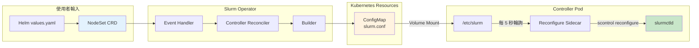

# NodeSet Partition 技術文件

> 本文件集詳細說明 Slurm Operator 中 NodeSet 與 Partition 的運作機制。

## 快速參考

- **Partition 是什麼？** Slurm 中的邏輯節點群組，在 slurm.conf 中定義
- **與 K8s 的關係？** Partition 不是 K8s 資源，而是由 Operator 產生的 slurm.conf 設定
- **如何啟用？** 在 NodeSet CRD 中設定 `spec.partition.enabled: true`
- **何時生效？** ConfigMap 更新後，經 kubelet 同步（約 1-2 分鐘）後由 reconfigure sidecar 觸發

## 系統架構總覽

## 文件導航

### 基礎概念

| 文件 | 說明 | 適合讀者 |
|------|------|---------|
| [Partition 基礎](./concepts/partition-fundamentals.md) | Partition 是什麼？與 NodeSet 的關係 | 新手入門 |

### 架構深入

| 文件 | 說明 | 適合讀者 |
|------|------|---------|
| [Reconcile 流程](./architecture/operator-reconcile-flow.md) | slurm.conf 何時會更新？觸發條件是什麼？ | Operator 開發者 |
| [Partition 建立流程](./architecture/partition-creation-flow.md) | Partition 行是如何被產生的？ | Operator 開發者 |
| [Reconfigure 機制](./architecture/reconfigure-mechanism.md) | 設定變更後如何生效？ | 運維人員 |

### 管理指南

| 文件 | 說明 | 適合讀者 |
|------|------|---------|
| [API 能力分析](./management/api-capabilities.md) | REST API 能做什麼？不能做什麼？ | API 使用者 |

### 參考資料

| 文件 | 說明 |
|------|------|
| [程式碼索引](./reference/source-code-index.md) | 相關原始碼檔案位置 |

## 版本資訊

- **文件版本**：1.0.0
- **適用 Operator 版本**：v1.0+（API v1beta1）
- **最後更新**：2025-01-09

## 相關資源

- [Slurm Partition 管理深度分析](../deep-dive-partition.md) - REST API 限制、動態管理方案
- [Slurm 官方文件 - Partition 配置](https://slurm.schedmd.com/slurm.conf.html#SECTION_PARTITION-CONFIGURATION)
