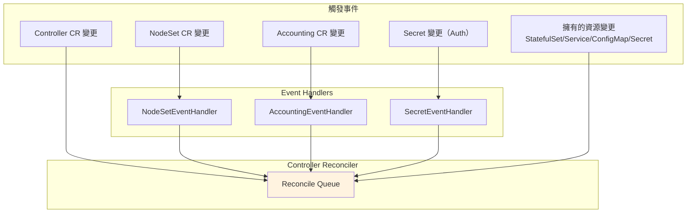
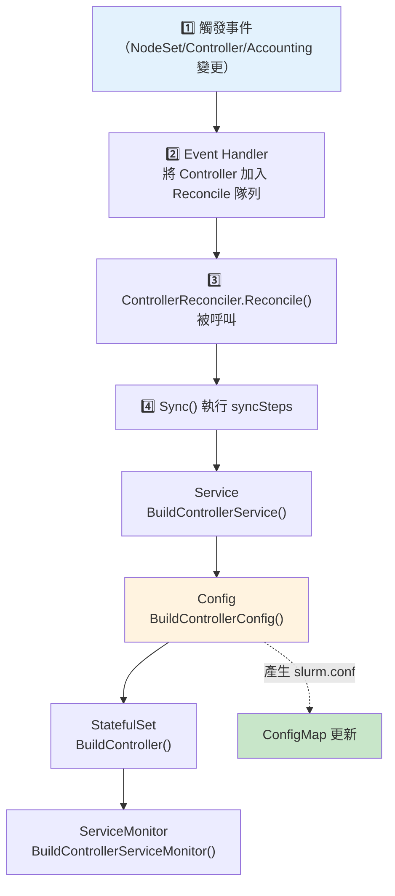

# slurm.conf Reconcile 流程

> 本文說明 slurm-operator 中 slurm.conf 何時會被更新，以及完整的觸發流程。

## 快速參考

- **誰負責更新 slurm.conf？** Controller Reconciler
- **觸發條件？** NodeSet / Controller / Accounting CR 變更，或相關資源變更
- **更新機制？** 透過 ConfigMap Patch

## Reconcile 觸發條件

slurm.conf 的更新由 **Controller Reconciler** 負責。以下事件會觸發 Reconcile：



### 觸發條件一覽表

| 事件類型 | 觸發方式 | 程式碼位置 |
|----------|----------|------------|
| Controller CR 變更 | `.For(&Controller{})` | `controller_controller.go:109` |
| 擁有的 StatefulSet 變更 | `.Owns(&StatefulSet{})` | `controller_controller.go:110` |
| 擁有的 Service 變更 | `.Owns(&Service{})` | `controller_controller.go:111` |
| 擁有的 ConfigMap 變更 | `.Owns(&ConfigMap{})` | `controller_controller.go:112` |
| 擁有的 Secret 變更 | `.Owns(&Secret{})` | `controller_controller.go:113` |
| Accounting CR 變更 | `.Watches(&Accounting{})` | `controller_controller.go:114` |
| NodeSet CR 變更 | `.Watches(&NodeSet{})` | `controller_controller.go:115` |
| Secret 變更（Auth） | `.Watches(&Secret{})` | `controller_controller.go:116` |

## 完整 Reconcile 流程



## 程式碼詳解

### 1. SetupWithManager - Watch 設定

**檔案**：`internal/controller/controller/controller_controller.go:105-121`

```go
func (r *ControllerReconciler) SetupWithManager(mgr ctrl.Manager) error {
    return ctrl.NewControllerManagedBy(mgr).
        Named(ControllerName).
        For(&slinkyv1beta1.Controller{}).           // 監聽 Controller CR
        Owns(&appsv1.StatefulSet{}).                // 監聽擁有的 StatefulSet
        Owns(&corev1.Service{}).                    // 監聽擁有的 Service
        Owns(&corev1.ConfigMap{}).                  // 監聽擁有的 ConfigMap
        Owns(&corev1.Secret{}).                     // 監聽擁有的 Secret
        Watches(&slinkyv1beta1.Accounting{}, eventhandler.NewAccountingEventHandler(r.Client)).
        Watches(&slinkyv1beta1.NodeSet{}, eventhandler.NewNodeSetEventHandler(r.Client)).
        Watches(&corev1.Secret{}, eventhandler.NewSecretEventHandler(r.Client)).
        WithOptions(controller.Options{
            MaxConcurrentReconciles: maxConcurrentReconciles,
        }).
        Complete(r)
}
```

### 2. NodeSet Event Handler

當 NodeSet 變更時，會找到對應的 Controller 並觸發 Reconcile。

**檔案**：`internal/controller/controller/eventhandler/eventhandler_nodeset.go:70-82`

```go
func (e *NodesetEventHandler) enqueueRequest(
    ctx context.Context,
    obj client.Object,
    q workqueue.TypedRateLimitingInterface[reconcile.Request],
) {
    nodeset, ok := obj.(*slinkyv1beta1.NodeSet)
    if !ok {
        return
    }

    // 透過 ControllerRef 找到所屬的 Controller
    controller, err := e.refResolver.GetController(ctx, nodeset.Spec.ControllerRef)
    if err != nil {
        return
    }

    // 將 Controller 加入 Reconcile 隊列
    objectutils.EnqueueRequest(q, controller)
}
```

### 3. Sync Steps

Reconcile 時會依序執行以下步驟：

**檔案**：`internal/controller/controller/controller_sync.go:39-112`

```go
syncSteps := []SyncStep{
    {
        Name: "Service",
        Sync: func(ctx context.Context, controller *slinkyv1beta1.Controller) error {
            // 建立/更新 Service
        },
    },
    {
        Name: "Config",  // ← slurm.conf 在這裡產生
        Sync: func(ctx context.Context, controller *slinkyv1beta1.Controller) error {
            var object *corev1.ConfigMap
            if controller.Spec.External {
                object, err = r.builder.BuildControllerConfigExternal(controller)
            } else {
                object, err = r.builder.BuildControllerConfig(controller)
            }
            // 更新 ConfigMap
            if err := objectutils.SyncObject(r.Client, ctx, object, true); err != nil {
                return err
            }
            return nil
        },
    },
    {
        Name: "StatefulSet",
        Sync: func(ctx context.Context, controller *slinkyv1beta1.Controller) error {
            // 建立/更新 StatefulSet
        },
    },
    {
        Name: "ServiceMonitor",
        Sync: func(ctx context.Context, controller *slinkyv1beta1.Controller) error {
            // 建立/更新/刪除 ServiceMonitor（用於 Prometheus 監控）
        },
    },
}
```

### 4. BuildControllerConfig - 產生 slurm.conf

**檔案**：`internal/builder/controller_config.go:29-152`

```go
func (b *Builder) BuildControllerConfig(controller *slinkyv1beta1.Controller) (*corev1.ConfigMap, error) {
    // 1. 讀取 Accounting 設定
    accounting, err := b.refResolver.GetAccounting(ctx, controller.Spec.AccountingRef)

    // 2. 讀取所有屬於此 Controller 的 NodeSets
    nodesetList, err := b.refResolver.GetNodeSetsForController(ctx, controller)

    // 3. 讀取額外設定檔、腳本等

    // 4. 建立 ConfigMap
    opts := ConfigMapOpts{
        Key:      controller.ConfigKey(),
        Metadata: controller.Spec.Template.PodMetadata,
        Data: map[string]string{
            slurmConfFile: buildSlurmConf(controller, accounting, nodesetList, ...),
        },
    }

    return b.BuildConfigMap(opts, controller)
}
```

## 重要觀察

### Reconcile 是「最終一致性」模型

- Controller Reconciler 不會在每次 NodeSet 變更時立即重建所有內容
- 它會讀取**當前狀態**的所有 NodeSets，然後產生對應的 slurm.conf
- 這意味著即使有多個 NodeSet 同時變更，也只會產生一次更新

### ConfigMap 更新觸發條件

ConfigMap 只有在**內容實際變更**時才會被 Patch：

```go
// objectutils.SyncObject 會比較新舊內容
if err := objectutils.SyncObject(r.Client, ctx, object, true); err != nil {
    return err
}
```

## 下一步

- [Partition 建立流程](./partition-creation-flow.md) - 了解 Partition 行是如何被產生的
- [Reconfigure 機制](./reconfigure-mechanism.md) - 了解 ConfigMap 更新後如何生效
