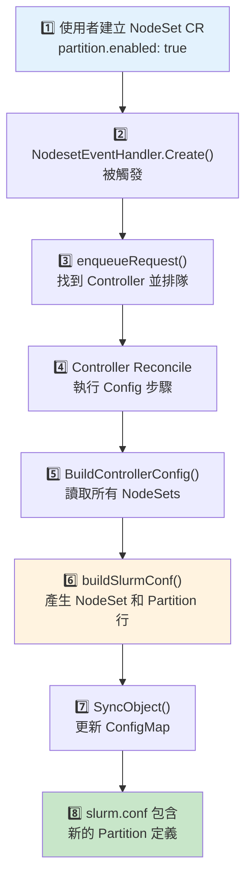
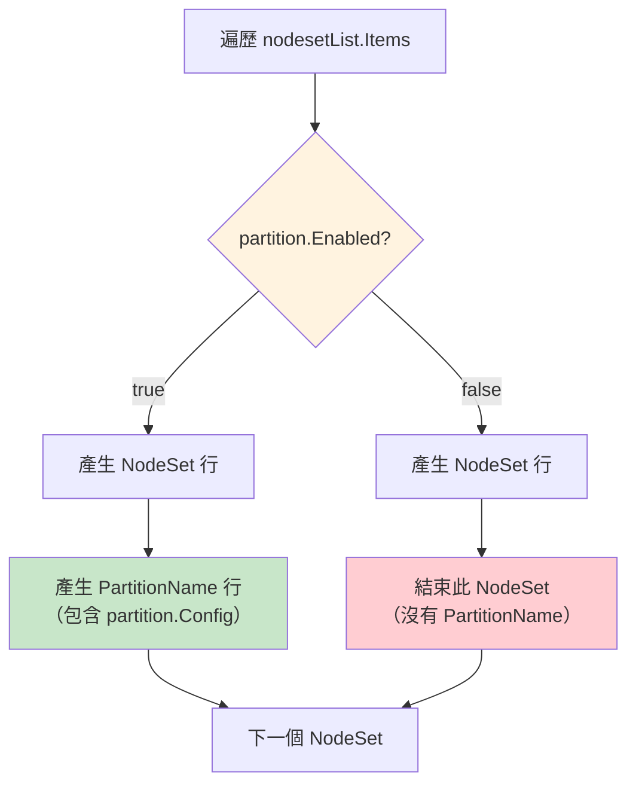

# Partition 建立流程

> 本文詳細說明當 NodeSet 設定 `partition.enabled: true` 時，Partition 是如何被建立的。

## 快速參考

- **Partition 是 K8s 資源嗎？** 不是，它是 slurm.conf 中的一行設定
- **誰負責產生？** `buildSlurmConf()` 函數
- **何時產生？** Controller Reconcile 的 "Config" 步驟

## 重要概念

**Partition 的「建立」其實就是在 slurm.conf 中新增一行 `PartitionName=...`**，不是建立任何 Kubernetes 資源。

## 完整流程圖



## 步驟詳解

### 步驟 1：使用者建立 NodeSet CR

```yaml
apiVersion: slinky.slurm.net/v1beta1
kind: NodeSet
metadata:
  name: compute
spec:
  controllerRef:
    name: slurm
  replicas: 8
  partition:
    enabled: true
    config: "Default=YES MaxTime=7-00:00:00"
```

### 步驟 2-3：Event Handler 觸發 Controller Reconcile

**檔案**：`internal/controller/controller/eventhandler/eventhandler_nodeset.go:35-41`

```go
func (e *NodesetEventHandler) Create(
    ctx context.Context,
    evt event.CreateEvent,
    q workqueue.TypedRateLimitingInterface[reconcile.Request],
) {
    e.enqueueRequest(ctx, evt.Object, q)
}
```

**檔案**：`internal/controller/controller/eventhandler/eventhandler_nodeset.go:70-82`

```go
func (e *NodesetEventHandler) enqueueRequest(...) {
    nodeset, ok := obj.(*slinkyv1beta1.NodeSet)
    if !ok {
        return
    }

    // 透過 ControllerRef 找到所屬的 Controller
    controller, err := e.refResolver.GetController(ctx, nodeset.Spec.ControllerRef)
    if err != nil {
        return
    }

    // 將 Controller 加入 Reconcile 隊列
    objectutils.EnqueueRequest(q, controller)
}
```

### 步驟 4-5：Controller Reconcile 執行 Config 步驟

**檔案**：`internal/controller/controller/controller_sync.go:56-74`

```go
{
    Name: "Config",
    Sync: func(ctx context.Context, controller *slinkyv1beta1.Controller) error {
        var object *corev1.ConfigMap
        if controller.Spec.External {
            object, err = r.builder.BuildControllerConfigExternal(controller)
        } else {
            object, err = r.builder.BuildControllerConfig(controller)
        }
        // ...
        if err := objectutils.SyncObject(r.Client, ctx, object, true); err != nil {
            return err
        }
        return nil
    },
},
```

**檔案**：`internal/builder/controller_config.go:39`

```go
// 讀取所有屬於此 Controller 的 NodeSets
nodesetList, err := b.refResolver.GetNodeSetsForController(ctx, controller)
```

### 步驟 6：buildSlurmConf() 產生 Partition 行

這是核心邏輯所在。

**檔案**：`internal/builder/controller_config.go:252-279`

```go
if len(nodesetList.Items) > 0 {
    conf.AddProperty(config.NewPropertyRaw("#"))
    conf.AddProperty(config.NewPropertyRaw("### COMPUTE & PARTITION ###"))
}

for _, nodeset := range nodesetList.Items {
    // 決定名稱（使用 Hostname 或 NodeSet 名稱）
    name := nodeset.Name
    template := nodeset.Spec.Template.PodSpecWrapper
    if template.Hostname != "" {
        name = strings.Trim(template.Hostname, "-")
    }

    // ① 永遠產生 NodeSet 行
    nodesetLine := []string{
        fmt.Sprintf("NodeSet=%v", name),
        fmt.Sprintf("Feature=%v", name),
    }
    nodesetLineRendered := strings.Join(nodesetLine, " ")
    conf.AddProperty(config.NewPropertyRaw(nodesetLineRendered))

    // ② 檢查 partition.enabled
    partition := nodeset.Spec.Partition
    if !partition.Enabled {
        continue  // 跳過 Partition，只保留 NodeSet
    }

    // ③ partition.enabled = true → 產生 Partition 行
    partitionLine := []string{
        fmt.Sprintf("PartitionName=%v", name),
        fmt.Sprintf("Nodes=%v", name),
        partition.Config,  // 使用者提供的額外參數
    }
    partitionLineRendered := strings.Join(partitionLine, " ")
    conf.AddProperty(config.NewPropertyRaw(partitionLineRendered))
}
```

### 步驟 7-8：ConfigMap 更新

**檔案**：`internal/utils/objectutils/patch.go:77-87`

```go
case *corev1.ConfigMap:
    obj := oldObj.(*corev1.ConfigMap)
    if ptr.Deref(obj.Immutable, false) {
        return nil  // 不可變的 ConfigMap 跳過
    }
    patch = client.MergeFrom(obj.DeepCopy())
    obj.Annotations = structutils.MergeMaps(obj.Annotations, o.Annotations)
    obj.Labels = structutils.MergeMaps(obj.Labels, o.Labels)
    obj.Data = o.Data  // 更新 slurm.conf 內容
    obj.BinaryData = o.BinaryData
```

## 產生結果對照表

| `partition.enabled` | `partition.config` | 產生的 slurm.conf |
|---------------------|-------------------|-------------------|
| `true` | `""` (空) | `PartitionName=foo Nodes=foo ` |
| `true` | `"Default=YES"` | `PartitionName=foo Nodes=foo Default=YES` |
| `true` | `"MaxTime=24:00:00 Default=YES"` | `PartitionName=foo Nodes=foo MaxTime=24:00:00 Default=YES` |
| `false` | (任何值) | (不產生 PartitionName 行) |

## 完整範例

### 輸入：NodeSet CR

```yaml
apiVersion: slinky.slurm.net/v1beta1
kind: NodeSet
metadata:
  name: compute
spec:
  controllerRef:
    name: slurm
  replicas: 8
  partition:
    enabled: true
    config: "Default=YES MaxTime=7-00:00:00 State=UP"
  template:
    podSpecWrapper:
      hostname: "compute-"
```

### 輸出：slurm.conf 片段

```conf
#
### COMPUTE & PARTITION ###
NodeSet=compute Feature=compute
PartitionName=compute Nodes=compute Default=YES MaxTime=7-00:00:00 State=UP
```

## 流程圖：partition.enabled 決策邏輯



## 常見問題

### 為什麼 Partition 沒有被建立？

1. **檢查 NodeSet CR**：確認 `partition.enabled` 是否為 `true`
2. **檢查 Controller Reconcile**：查看 operator logs 是否有錯誤
3. **檢查 ConfigMap**：確認 slurm.conf 是否包含 PartitionName 行

```bash
# 檢查 ConfigMap
kubectl get configmap <controller>-config -o jsonpath='{.data.slurm\.conf}' | grep -E "NodeSet|Partition"
```

### 為什麼 Partition 存在但 Slurm 看不到？

ConfigMap 更新後，需要等待 Reconfigure 生效。請參考 [Reconfigure 機制](./reconfigure-mechanism.md)。

## 下一步

- [Reconfigure 機制](./reconfigure-mechanism.md) - 了解 ConfigMap 更新後如何生效
- [Partition 基礎概念](../concepts/partition-fundamentals.md) - 了解 Partition 的基本概念
