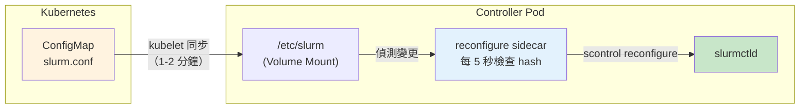
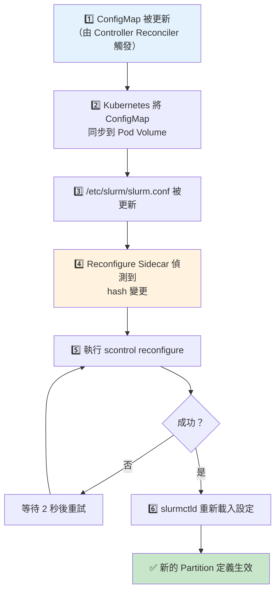
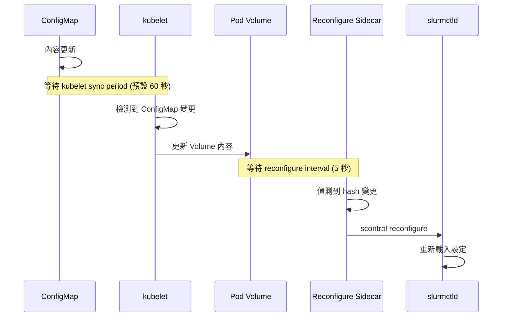

# slurmctld Reconfigure 機制

> 本文說明 ConfigMap 更新後，slurmctld 如何載入新的設定。

## 快速參考

- **誰負責觸發 reconfigure？** Controller Pod 中的 `reconfigure` sidecar container
- **檢測機制？** 每 5 秒輪詢 `/etc/slurm` 目錄的 hash 值
- **執行方式？** `scontrol reconfigure`
- **延遲時間？** ConfigMap 同步約 1-2 分鐘 + 輪詢間隔 5 秒

## 機制概述



## Reconfigure Sidecar 工作原理

Controller Pod 中有一個 `reconfigure` sidecar container，它的任務是：

1. 每 5 秒檢查 `/etc/slurm` 目錄中所有檔案的 hash
2. 如果 hash 改變，執行 `scontrol reconfigure`
3. 持續重試直到成功

### 腳本內容

**檔案**：`internal/builder/scripts/reconfigure.sh`

```bash
#!/usr/bin/env bash
set -euo pipefail

SLURM_DIR="/etc/slurm"
INTERVAL="5"

function getHash() {
    # 計算目錄中所有檔案的 SHA256 hash
    echo "$(find "$SLURM_DIR" -type f -exec sha256sum {} \; | sort -k2 | sha256sum)"
}

function reconfigure() {
    echo "[$(date)] Reconfiguring Slurm..."
    # 持續重試直到成功
    until scontrol reconfigure; do
        echo "[$(date)] Failed to reconfigure, try again..."
        sleep 2
    done
    echo "[$(date)] SUCCESS"
}

function main() {
    local lastHash=""
    local newHash=""

    echo "[$(date)] Start '$SLURM_DIR' polling"
    while true; do
        newHash="$(getHash)"
        if [ "$newHash" != "$lastHash" ]; then
            reconfigure
            lastHash="$newHash"
        fi
        sleep "$INTERVAL"
    done
}
main
```

### Container 定義

**檔案**：`internal/builder/controller_app.go:297-312`

```go
func (b *Builder) reconfigureContainer(container slinkyv1beta1.ContainerWrapper) corev1.Container {
    opts := ContainerOpts{
        base: corev1.Container{
            Name: "reconfigure",
            Command: []string{
                "tini",
                "-g",
                "--",
                "bash",
                "-c",
                reconfigureScript,
            },
            // 使用 Kubernetes 1.28+ 的 sidecar 功能
            RestartPolicy: ptr.To(corev1.ContainerRestartPolicyAlways),
            VolumeMounts: []corev1.VolumeMount{
                {Name: slurmEtcVolume, MountPath: slurmEtcDir, ReadOnly: true},
                {Name: slurmAuthSocketVolume, MountPath: slurmctldAuthSocketDir, ReadOnly: true},
            },
        },
        // ...
    }
    // ...
}
```

## 完整 Reconfigure 流程



## ConfigMap Propagation 延遲

Kubernetes ConfigMap 更新到 Pod 的延遲取決於多個因素：

### 影響因素

| 因素 | 預設值 | 說明 |
|------|--------|------|
| kubelet sync period | 1 分鐘 | kubelet 檢查 ConfigMap 更新的週期 |
| ConfigMap cache TTL | 與 sync period 相同 | ConfigMap 在 kubelet 中的快取時間 |
| 掛載方式 | - | subPath 掛載**不會**自動更新 |

### 總延遲計算

```
總延遲 = kubelet sync period + reconfigure sidecar interval
       ≈ 60秒 + 5秒
       ≈ 1-2 分鐘
```

### 為什麼不是即時的？



## 診斷指令

### 檢查 reconfigure sidecar 狀態

```bash
# 查看 reconfigure sidecar 的 logs
kubectl logs <controller-pod> -c reconfigure -f

# 預期輸出：
# [Fri Jan 09 10:00:00 UTC 2025] Start '/etc/slurm' polling
# [Fri Jan 09 10:00:05 UTC 2025] Reconfiguring Slurm...
# [Fri Jan 09 10:00:05 UTC 2025] SUCCESS
```

### 檢查 Pod 內的 slurm.conf

```bash
# 確認 Pod 內的 slurm.conf 是否已更新
kubectl exec <controller-pod> -c slurmctld -- \
    cat /etc/slurm/slurm.conf | grep -E "NodeSet|Partition"
```

### 比較 ConfigMap 與 Pod 內容

```bash
# 檢查 ConfigMap 內容
kubectl get configmap <controller>-config -o jsonpath='{.data.slurm\.conf}' | \
    grep -E "NodeSet|Partition"

# 檢查 Pod 內容（應該相同）
kubectl exec <controller-pod> -c slurmctld -- \
    cat /etc/slurm/slurm.conf | grep -E "NodeSet|Partition"
```

### 手動觸發 reconfigure

```bash
# 如果需要立即生效，可以手動觸發
kubectl exec <controller-pod> -c slurmctld -- scontrol reconfigure
```

### 檢查 Slurm 是否已載入新設定

```bash
# 查看 partition
kubectl exec <controller-pod> -c slurmctld -- scontrol show partition

# 查看 nodes
kubectl exec <controller-pod> -c slurmctld -- sinfo -a
```

## 強制立即同步

如果不想等待 kubelet sync period，有以下選項：

### 方法 1：重啟 Pod

```bash
# 刪除 Pod，讓它重建（會立即載入最新 ConfigMap）
kubectl delete pod <controller-pod>
```

### 方法 2：手動執行 reconfigure

```bash
kubectl exec <controller-pod> -c slurmctld -- scontrol reconfigure
```

## 常見問題

### 問題 1：ConfigMap 已更新，但 Pod 內的檔案沒變

**可能原因**：
- kubelet 尚未同步（等待 1-2 分鐘）
- 使用了 subPath 掛載（subPath 不會自動更新）

**解決方案**：
```bash
# 確認掛載方式
kubectl get pod <controller-pod> -o yaml | grep -A5 volumeMounts

# 如果使用 subPath，需要重啟 Pod
kubectl delete pod <controller-pod>
```

### 問題 2：reconfigure 失敗

**可能原因**：
- slurm.conf 語法錯誤
- slurmctld 尚未啟動

**解決方案**：
```bash
# 檢查 reconfigure sidecar logs
kubectl logs <controller-pod> -c reconfigure

# 檢查 slurmctld logs
kubectl logs <controller-pod> -c slurmctld

# 手動驗證 slurm.conf 語法
kubectl exec <controller-pod> -c slurmctld -- slurmctld -t
```

### 問題 3：Partition 在 slurm.conf 中存在，但 sinfo 看不到

**可能原因**：
- reconfigure 尚未執行
- reconfigure 執行失敗

**解決方案**：
```bash
# 檢查 reconfigure sidecar 是否偵測到變更
kubectl logs <controller-pod> -c reconfigure | tail -20

# 手動觸發 reconfigure
kubectl exec <controller-pod> -c slurmctld -- scontrol reconfigure

# 再次檢查
kubectl exec <controller-pod> -c slurmctld -- sinfo -a
```

## 下一步

- [Partition 建立流程](./partition-creation-flow.md) - 了解 Partition 是如何被產生的
- [API 能力分析](../management/api-capabilities.md) - 了解 REST API 的能力與限制
