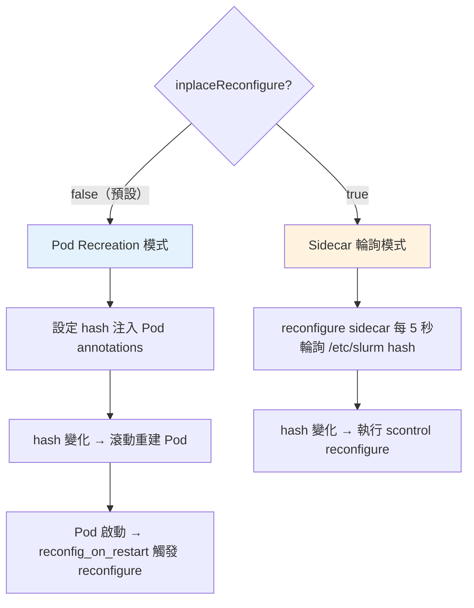
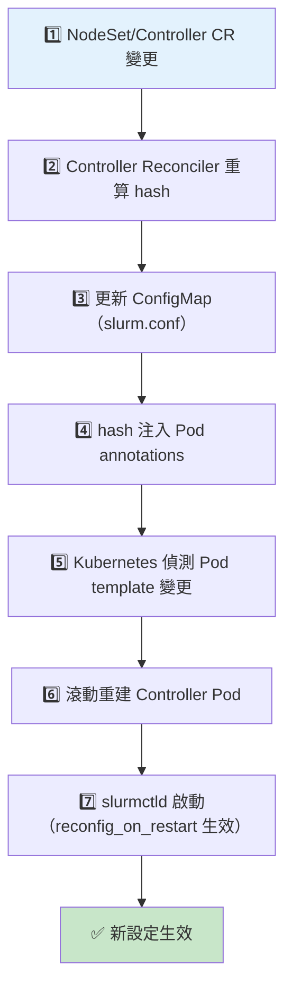
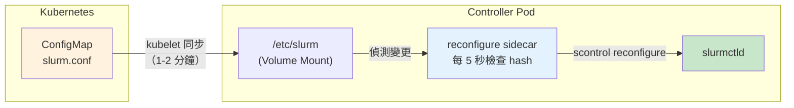

# slurmctld Reconfigure 機制

> 本文說明 ConfigMap 更新後，slurmctld 如何載入新的設定。

## 快速參考

- **預設機制？** Pod 重建（Recreation）- 當設定變更時，Controller Pod 會被滾動重建
- **選用機制？** Inplace Reconfigure Sidecar - 需明確設定 `inplaceReconfigure: true`
- **`reconfig_on_restart` 確保？** Pod 重啟時 slurmctld 自動執行 reconfigure
- **延遲時間（預設）？** 取決於滾動更新速度，約數秒到數十秒

## 兩種 Reconfigure 模式

自 v1.1+ 起，`inplaceReconfigure` 預設值改為 **`false`**，從 sidecar 輪詢改為 Pod 重建模式。


```mermaid
flowchart TD
    A{inplaceReconfigure?} -->|false（預設）| B["Pod Recreation 模式"]
    A -->|true| C["Sidecar 輪詢模式"]

    B --> B1["設定 hash 注入 Pod annotations"]
    B1 --> B2["hash 變化 → 滾動重建 Pod"]
    B2 --> B3["Pod 啟動 → reconfig_on_restart 觸發 reconfigure"]

    C --> C1["reconfigure sidecar 每 5 秒輪詢 /etc/slurm hash"]
    C1 --> C2["hash 變化 → 執行 scontrol reconfigure"]

    style B fill:#e3f2fd
    style C fill:#fff3e0
```

## 模式一：Pod Recreation（預設）

### 運作原理

當 `inplaceReconfigure: false`（預設），設定變更時 Controller Pod 會被**滾動重建**：

1. Controller Reconciler 偵測到 NodeSet/Controller CR 變更
2. 重新計算所有設定資源的 hash（ConfigMaps、Secrets 等）
3. 將 hash 注入 Pod template annotations
4. Kubernetes 偵測到 Pod template 變更，觸發滾動更新
5. 新 Pod 啟動時，slurmctld 因 `reconfig_on_restart` 參數自動執行 reconfigure

### `reconfig_on_restart` 機制

`buildSlurmConf()` 會自動在 `SlurmctldParameters` 中加入 `reconfig_on_restart`：

**檔案**：`internal/builder/controllerbuilder/controller_config.go`

```go
mergeConfig := map[string][]string{
    "SlurmctldParameters": func() []string {
        params := []string{"enable_configless", "reconfig_on_restart"}
        if cgroupEnabled {
            params = append(params, "enable_stepmgr")
        }
        return params
    }(),
    // ...
}
```

這確保 slurmctld 在每次重啟時自動讀取最新設定，而不需要額外的 reconfigure 觸發。

### 流程圖


```mermaid
flowchart TD
    A["1️⃣ NodeSet/Controller CR 變更"] --> B["2️⃣ Controller Reconciler 重算 hash"]
    B --> C["3️⃣ 更新 ConfigMap（slurm.conf）"]
    C --> D["4️⃣ hash 注入 Pod annotations"]
    D --> E["5️⃣ Kubernetes 偵測 Pod template 變更"]
    E --> F["6️⃣ 滾動重建 Controller Pod"]
    F --> G["7️⃣ slurmctld 啟動<br/>（reconfig_on_restart 生效）"]
    G --> H["✅ 新設定生效"]

    style A fill:#e3f2fd
    style H fill:#c8e6c9
```

## 模式二：Inplace Reconfigure Sidecar（選用）

當 `inplaceReconfigure: true` 時，Controller Pod 中會有一個 `reconfigure` sidecar container。

### 設定方式

**Controller CRD**：

```yaml
apiVersion: slinky.slurm.net/v1beta1
kind: Controller
metadata:
  name: slurm
spec:
  inplaceReconfigure: true  # 預設 false
```

### Sidecar 運作原理

1. 每 5 秒檢查 `/etc/slurm` 目錄中所有檔案的 hash
2. 如果 hash 改變，執行 `scontrol reconfigure`
3. 持續重試直到成功


```mermaid
flowchart LR
    subgraph k8s["Kubernetes"]
        CM["ConfigMap<br/>slurm.conf"]
    end

    subgraph pod["Controller Pod"]
        VOL["/etc/slurm<br/>(Volume Mount)"]
        RC["reconfigure sidecar<br/>每 5 秒檢查 hash"]
        SD["slurmctld"]
    end

    CM -->|"kubelet 同步<br/>（1-2 分鐘）"| VOL
    VOL -->|"偵測變更"| RC
    RC -->|"scontrol reconfigure"| SD

    style CM fill:#fff3e0
    style RC fill:#e3f2fd
    style SD fill:#c8e6c9
```

### Sidecar 腳本

**檔案**：`internal/builder/scripts/reconfigure.sh`

```bash
#!/usr/bin/env bash
set -euo pipefail

SLURM_DIR="/etc/slurm"
INTERVAL="5"

function getHash() {
    echo "$(find "$SLURM_DIR" -type f -exec sha256sum {} \; | sort -k2 | sha256sum)"
}

function reconfigure() {
    echo "[$(date)] Reconfiguring Slurm..."
    until scontrol reconfigure; do
        echo "[$(date)] Failed to reconfigure, try again..."
        sleep 2
    done
    echo "[$(date)] SUCCESS"
}

function main() {
    local lastHash=""
    local newHash=""

    echo "[$(date)] Start '$SLURM_DIR' polling"
    while true; do
        newHash="$(getHash)"
        if [ "$newHash" != "$lastHash" ]; then
            reconfigure
            lastHash="$newHash"
        fi
        sleep "$INTERVAL"
    done
}
main
```

### Container 定義

**檔案**：`internal/builder/controllerbuilder/controller_app.go`

```go
// reconfigure sidecar 只在 InplaceReconfigure=true 時加入 initContainers
if controller.Spec.InplaceReconfigure {
    initContainers = append(initContainers, b.reconfigureContainer(spec.Reconfigure))
}
```

### Inplace 模式延遲

```
總延遲 = kubelet sync period + reconfigure sidecar interval
       ≈ 60秒 + 5秒
       ≈ 1-2 分鐘
```

## 模式比較

| 面向 | Pod Recreation（預設） | Inplace Sidecar（選用） |
|------|----------------------|----------------------|
| **設定** | `inplaceReconfigure: false` | `inplaceReconfigure: true` |
| **觸發方式** | Pod 重建 | sidecar 輪詢 |
| **生效延遲** | 秒級（滾動更新） | 1-2 分鐘（kubelet 同步） |
| **適用場景** | 一般使用 | 不希望 Pod 重啟時 |
| **auth hash 範圍** | 所有設定資源 | 僅 auth 相關資源 |

## 診斷指令

### 確認當前模式

```bash
# 查看 Controller CR 的 inplaceReconfigure 設定
kubectl get controller <name> -o jsonpath='{.spec.inplaceReconfigure}'
```

### Pod Recreation 模式診斷

```bash
# 查看 Pod annotations 中的 hash
kubectl get pod <controller-pod> -o jsonpath='{.metadata.annotations}' | jq

# 查看滾動更新狀態
kubectl rollout status statefulset/<controller-name>
```

### Inplace Sidecar 模式診斷

```bash
# 查看 reconfigure sidecar 的 logs
kubectl logs <controller-pod> -c reconfigure -f

# 預期輸出：
# [Fri Jan 09 10:00:00 UTC 2025] Start '/etc/slurm' polling
# [Fri Jan 09 10:00:05 UTC 2025] Reconfiguring Slurm...
# [Fri Jan 09 10:00:05 UTC 2025] SUCCESS
```

### 通用診斷

```bash
# 確認 Pod 內的 slurm.conf 是否已更新
kubectl exec <controller-pod> -c slurmctld -- \
    cat /etc/slurm/slurm.conf | grep -E "NodeSet|Partition"

# 檢查 ConfigMap 內容
kubectl get configmap <controller>-config -o jsonpath='{.data.slurm\.conf}' | \
    grep -E "NodeSet|Partition"

# 手動觸發 reconfigure
kubectl exec <controller-pod> -c slurmctld -- scontrol reconfigure

# 查看 partition
kubectl exec <controller-pod> -c slurmctld -- scontrol show partition
```

## 常見問題

### 問題 1：設定已更新，但 Slurm 看不到新 Partition

**Pod Recreation 模式**：
```bash
# 確認 Pod 是否已重建
kubectl get pod <controller-pod> -o jsonpath='{.metadata.creationTimestamp}'

# 查看 slurmctld logs
kubectl logs <controller-pod> -c slurmctld | tail -20
```

**Inplace Sidecar 模式**：
```bash
# 確認 ConfigMap 是否已更新
kubectl get configmap <controller>-config -o jsonpath='{.data.slurm\.conf}' | grep Partition

# 確認 Volume 是否已同步（等待 1-2 分鐘）
kubectl exec <controller-pod> -c slurmctld -- cat /etc/slurm/slurm.conf | grep Partition

# 檢查 sidecar logs
kubectl logs <controller-pod> -c reconfigure | tail -10
```

### 問題 2：reconfigure 失敗

```bash
# 檢查 slurmctld logs
kubectl logs <controller-pod> -c slurmctld

# 手動驗證 slurm.conf 語法
kubectl exec <controller-pod> -c slurmctld -- slurmctld -t
```

## 下一步

- [Partition 建立流程](./partition-creation-flow.md) - 了解 Partition 是如何被產生的
- [API 能力分析](../management/api-capabilities.md) - 了解 REST API 的能力與限制
