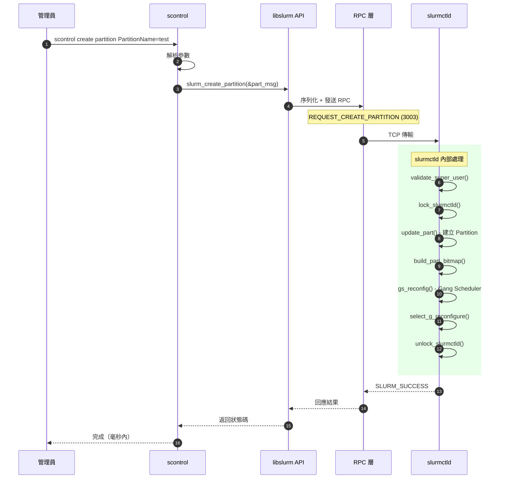
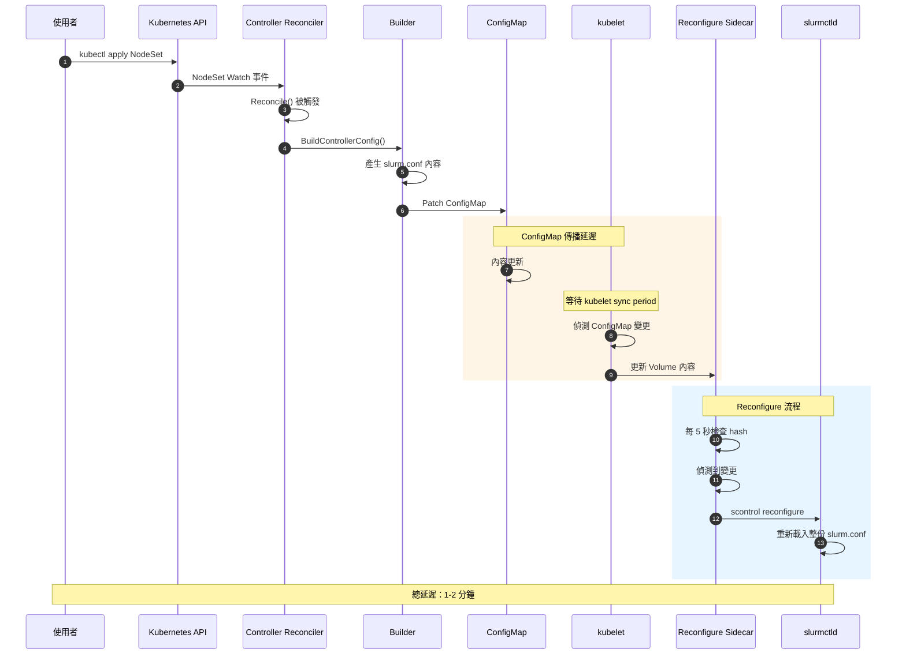
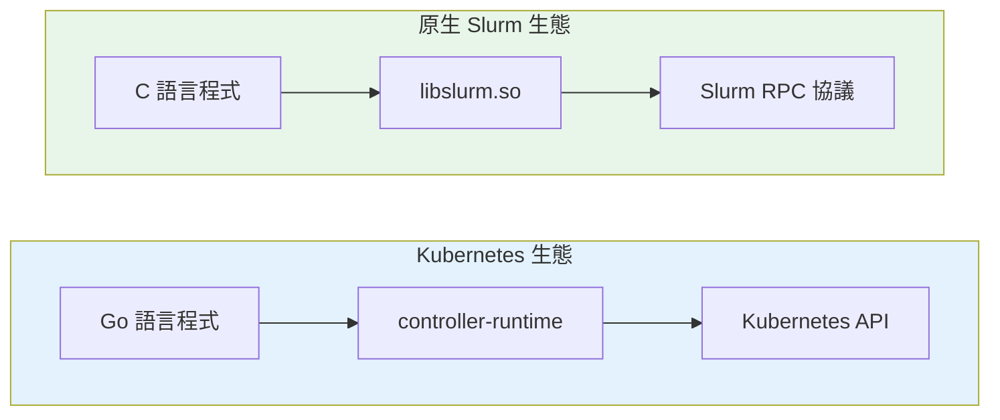
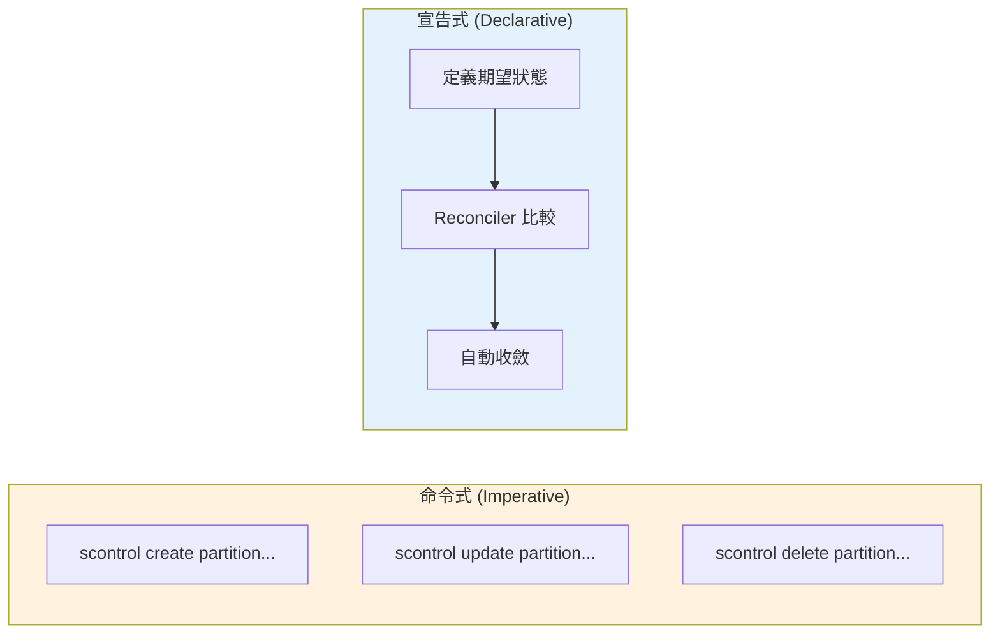
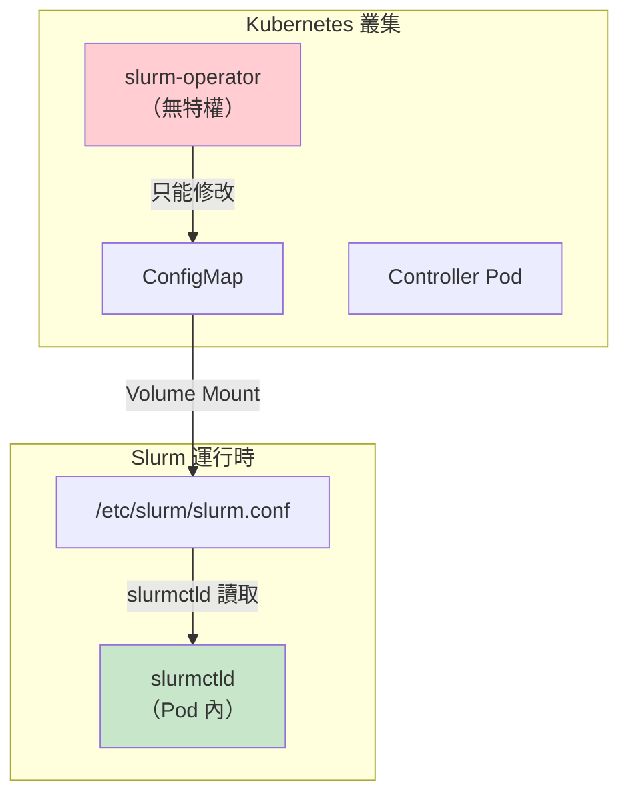
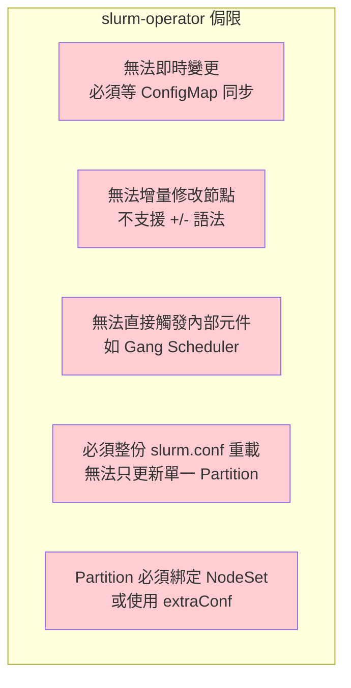
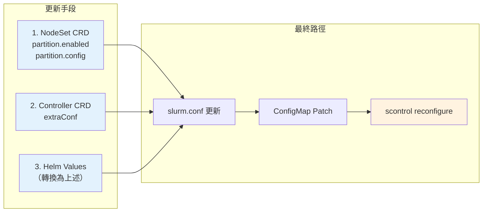
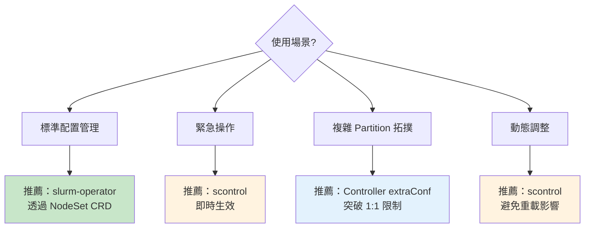
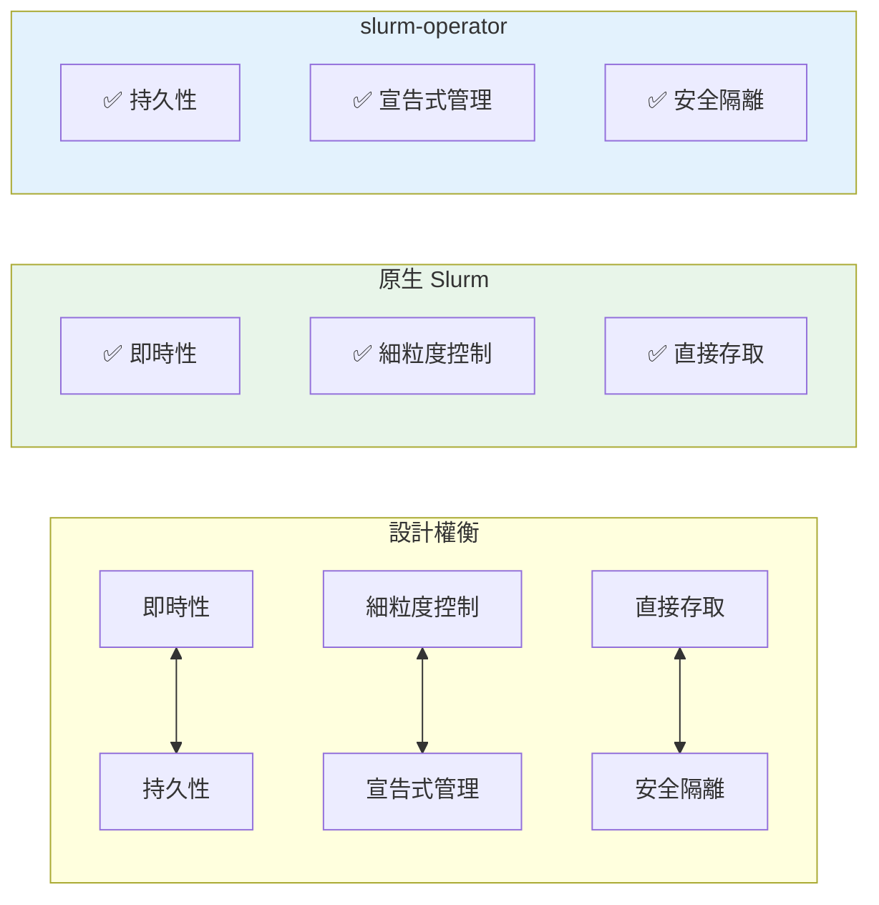

# slurm-operator 與原生 Slurm 的架構差異

> 本文深入分析 slurm-operator 與原生 Slurm（scontrol）在 Partition 管理上的根本差異，幫助你理解設計權衡並選擇適合的管理方式。

## 快速參考

| 面向 | 原生 Slurm (scontrol) | slurm-operator |
|------|----------------------|----------------|
| **通訊方式** | 直接 RPC 到 slurmctld | 透過 ConfigMap + reconfigure |
| **生效時間** | 即時（毫秒級） | 延遲（1-2 分鐘） |
| **變更模式** | 命令式（Imperative） | 宣告式（Declarative） |
| **狀態持久性** | 記憶體 + state 檔案 | Kubernetes etcd |
| **觸發機制** | 直接觸發內部元件 | 間接透過 `scontrol reconfigure` |

## 核心架構差異

### 原生 Slurm 的 RPC 機制

當你執行 `scontrol create partition` 時，會發生以下流程：



**關鍵特點**：

- 直接透過 `libslurm` API 發送 RPC 訊息（訊息類型 3003）
- slurmctld 直接在記憶體中建立 `part_record_t` 結構
- 同步觸發多個內部元件（Gang Scheduler、Select Plugin 等）
- 整個過程在毫秒內完成

### slurm-operator 的間接機制

相對地，slurm-operator 必須透過「配置檔案」來間接控制 Slurm：



**關鍵差異**：

- 無法直接呼叫 `libslurm` API（Kubernetes controller 不是 C 程式）
- 只能透過修改 `slurm.conf` ConfigMap 來間接控制
- 需要經過 kubelet 同步週期（預設 1 分鐘）
- 最終透過 `scontrol reconfigure` 觸發重載

## 為什麼有這些差異？

### 1. 技術架構限制



- **原生 Slurm**：使用 C 語言撰寫，透過 `libslurm` 共享庫與 daemon 通訊
- **slurm-operator**：使用 Go 語言撰寫，遵循 Kubernetes controller 模式
- Go 程式無法直接呼叫 C 的 `libslurm` API（除非使用 cgo，但會增加複雜性）

### 2. Kubernetes 的設計哲學

Kubernetes 推崇**宣告式配置**（Declarative Configuration）：



**宣告式的優點**：

- GitOps 友善：配置可以版本控制
- 自動修復：Reconciler 持續確保狀態一致
- 可審計：所有變更都有記錄

**代價**：

- 失去即時性
- 無法做細粒度的動態調整

### 3. 安全邊界考量



slurm-operator 作為 Kubernetes controller，受限於：

- 無法直接存取 slurmctld 的 Unix socket
- 無法發送 RPC 到 slurmctld
- 只能透過 Kubernetes 原生機制（ConfigMap）傳遞配置

## slurm-operator 的侷限

### 侷限一覽



### 詳細說明

| 侷限 | 原因 | 實際影響 |
|------|------|----------|
| **無法即時變更** | ConfigMap propagation 需 1-2 分鐘 | 緊急操作（如 drain partition）無法即時生效 |
| **無法增量修改** | slurm.conf 是完整配置，非增量 | 每次變更都需重建完整節點列表 |
| **無法獨立建立 Partition** | Partition 透過 NodeSet 管理 | 無法建立跨多個 NodeSet 的 Partition |
| **無法直接觸發** | 只能透過 `scontrol reconfigure` | 無法精確控制觸發哪些元件 |
| **重載成本較高** | `scontrol reconfigure` 重載整份配置 | 大型叢集可能有效能影響 |

### 對比：節點增量修改

**原生 Slurm**：支援 `+/-` 語法

```bash
# 增加節點到 partition
scontrol update partitionname=compute nodes=+node[005-010]

# 從 partition 移除節點
scontrol update partitionname=compute nodes=-node[001-002]
```

**slurm-operator**：必須指定完整列表

```yaml
# 無法使用 +/- 語法，必須在 NodeSet replicas 調整
spec:
  replicas: 10  # 從 8 改為 10
```

### 對比：觸發的內部元件

**原生 `scontrol create partition`** 直接觸發：

| 元件 | 函數 | 時機 |
|------|------|------|
| 位圖管理 | `build_part_bitmap()` | 同步 |
| TRES 計算 | `_calc_part_tres()` | 同步 |
| Gang Scheduler | `gs_reconfig()` | 同步 |
| Select Plugin | `select_g_reconfigure()` | 同步 |
| 狀態儲存 | `schedule_part_save()` | 非同步 |
| 作業排程 | `queue_job_scheduler()` | 非同步 |

**slurm-operator** 透過 `scontrol reconfigure`：

| 元件 | 說明 |
|------|------|
| 全部 | 重新讀取整份 slurm.conf，觸發所有相關元件 |

無法選擇性觸發特定元件。

## slurm-operator 可用的更新手段

slurm-operator 只能透過以下方式更新 Slurm 配置：



### 方法 1：NodeSet CRD - Partition 設定

最標準的方式，一個 NodeSet 對應一個 Partition：

```yaml
apiVersion: slinky.slurm.net/v1beta1
kind: NodeSet
metadata:
  name: compute
spec:
  controllerRef:
    name: slurm
  replicas: 8
  partition:
    enabled: true
    config: "Default=YES MaxTime=7-00:00:00 State=UP"
```

**產生的 slurm.conf**：

```conf
NodeSet=compute Feature=compute
PartitionName=compute Nodes=compute Default=YES MaxTime=7-00:00:00 State=UP
```

### 方法 2：Controller CRD - extraConf

適合複雜的 Partition 拓撲或需要跨 NodeSet 的設定：

```yaml
apiVersion: slinky.slurm.net/v1beta1
kind: Controller
metadata:
  name: slurm
spec:
  extraConf: |
    # 跨多個 NodeSet 的 Partition
    PartitionName=all Nodes=ALL Default=NO

    # 指定特定 NodeSet 組合
    PartitionName=highprio Nodes=compute,gpu MaxTime=1-00:00:00 Priority=100
```

### 方法 3：Helm Values

透過 Helm 部署時設定：

```yaml
# values.yaml
nodeSets:
  compute:
    replicas: 8
    partition:
      enabled: true
      config: "Default=YES"

  gpu:
    replicas: 2
    partition:
      enabled: true
      config: "MaxTime=1-00:00:00"

controller:
  extraConf: |
    PartitionName=debug Nodes=compute MaxTime=00:30:00
```

## 使用場景建議

根據不同需求選擇適合的管理方式：



| 場景 | 推薦方式 | 原因 |
|------|----------|------|
| 標準配置管理 | slurm-operator | 宣告式、GitOps 友善、持久化 |
| 緊急操作 | scontrol | 即時生效 |
| 複雜 Partition 拓撲 | extraConf | 突破 1:1 NodeSet-Partition 限制 |
| 動態調整（作業執行中） | scontrol | 避免重載影響 |

## 變通方案：混合使用

對於需要即時操作的場景，可以結合使用兩種方式：

```bash
# 步驟 1：緊急操作 - 使用 scontrol 即時生效
kubectl exec <controller-pod> -c slurmctld -- \
    scontrol update partitionname=compute state=drain

# 步驟 2：確保持久性 - 同時更新 CRD
kubectl patch nodeset compute --type=merge -p '
spec:
  partition:
    config: "State=DRAIN"
'
```

**注意事項**：

- scontrol 的變更在 Pod 重啟後會遺失
- 務必同步更新 CRD 以確保持久性
- 當 CRD 變更觸發 reconcile 時，會以 CRD 定義為準

## 總結



slurm-operator 的設計是為了 **Kubernetes 原生整合** 和 **宣告式管理**，這是有意識的架構選擇，而非技術缺陷。理解這些權衡後，你可以：

1. 日常管理使用 slurm-operator（GitOps、可審計、自動修復）
2. 緊急情況使用 scontrol（即時生效）
3. 複雜拓撲使用 extraConf（突破限制）

## 延伸閱讀

- [Partition 基礎概念](./partition-fundamentals.md) - 了解 Partition 與 NodeSet 的關係
- [Reconcile 流程](../architecture/operator-reconcile-flow.md) - 深入了解 Operator 如何更新配置
- [API 能力分析](../management/api-capabilities.md) - 各介面的 CRUD 能力對比
