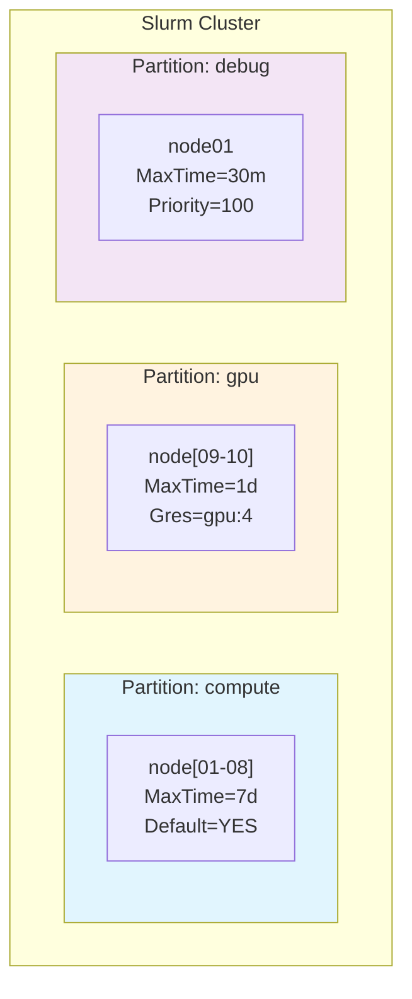
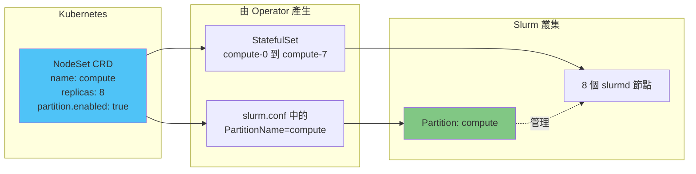

# Partition 基礎概念

> 本文說明 Slurm Partition 的基本概念，以及在 slurm-operator 中與 NodeSet 的關係。

## 快速參考

- **Partition** = Slurm 中將節點分組的邏輯單位（類似「佇列」概念）
- **NodeSet** = slurm-operator 的 Kubernetes CRD，管理一組計算節點
- **關係**：一個 NodeSet 可以選擇是否自動建立對應的 Partition

## 什麼是 Partition？

Partition（分割區）是 Slurm 中將節點分組的邏輯單位，類似於傳統 HPC 系統的「佇列（queue）」概念。使用者提交作業時，會指定要使用哪個 Partition。



### Partition 在 slurm.conf 中的定義

```conf
# 定義一個名為 "compute" 的 partition
PartitionName=compute Nodes=node[01-08] Default=YES MaxTime=7-00:00:00 State=UP

# 定義一個名為 "gpu" 的 partition
PartitionName=gpu Nodes=node[09-10] MaxTime=1-00:00:00 Gres=gpu:4 State=UP
```

### 常用 Partition 參數

| 參數 | 說明 | 範例 |
|------|------|------|
| `PartitionName` | Partition 名稱（必填） | `compute` |
| `Nodes` | 包含的節點 | `node[01-08]` |
| `Default` | 是否為預設 partition | `YES` / `NO` |
| `MaxTime` | 作業最長執行時間 | `7-00:00:00`（7天） |
| `State` | 狀態 | `UP` / `DOWN` / `DRAIN` |
| `MaxNodes` | 單一作業最多使用節點數 | `4` |
| `Priority` | 優先級 | `100` |

## NodeSet 與 Partition 的關係

在 slurm-operator 中，NodeSet CRD 負責管理計算節點，同時**可選擇**自動建立對應的 Partition。



### NodeSet CRD 中的 Partition 設定

```yaml
apiVersion: slinky.slurm.net/v1beta1
kind: NodeSet
metadata:
  name: compute
spec:
  controllerRef:
    name: slurm
  replicas: 8

  # Partition 設定
  partition:
    enabled: true                              # 是否建立 partition（預設 true）
    config: "Default=YES MaxTime=7-00:00:00"   # 額外參數（可選）
```

### API 定義

**檔案**：`api/v1beta1/nodeset_types.go:114-124`

```go
// NodeSetPartition defines the Slurm partition configuration for the NodeSet.
type NodeSetPartition struct {
    // Enabled will create a partition for this NodeSet.
    // +default:=true
    Enabled bool `json:"enabled"`

    // Config is added to the NodeSet's partition line.
    // +optional
    Config string `json:"config,omitzero"`
}
```

## Partition 設定範例

### 範例 1：基本 Partition（使用預設值）

```yaml
spec:
  partition:
    enabled: true
```

**產生的 slurm.conf**：
```conf
NodeSet=compute Feature=compute
PartitionName=compute Nodes=compute
```

### 範例 2：帶額外參數的 Partition

```yaml
spec:
  partition:
    enabled: true
    config: "Default=YES MaxTime=7-00:00:00 State=UP"
```

**產生的 slurm.conf**：
```conf
NodeSet=compute Feature=compute
PartitionName=compute Nodes=compute Default=YES MaxTime=7-00:00:00 State=UP
```

### 範例 3：不建立 Partition

```yaml
spec:
  partition:
    enabled: false
```

**產生的 slurm.conf**：
```conf
NodeSet=compute Feature=compute
# 沒有 PartitionName 行
```

## 重要概念釐清

### Partition 不是 Kubernetes 資源

Partition **不是**獨立的 Kubernetes CRD，它只是 slurm.conf 中的一行設定。你無法透過 `kubectl get partition` 來查看它。

### 如何查看 Partition？

```bash
# 方式 1：查看 slurm.conf ConfigMap
kubectl get configmap <controller>-config -o jsonpath='{.data.slurm\.conf}' | grep Partition

# 方式 2：透過 scontrol（需進入 slurmctld pod）
kubectl exec <controller-pod> -c slurmctld -- scontrol show partition

# 方式 3：透過 sinfo
kubectl exec <controller-pod> -c slurmctld -- sinfo -a
```

## 下一步

- [Partition 建立流程](../architecture/partition-creation-flow.md) - 了解 Partition 是如何被產生的
- [Reconcile 流程](../architecture/operator-reconcile-flow.md) - 了解 slurm.conf 何時會更新
