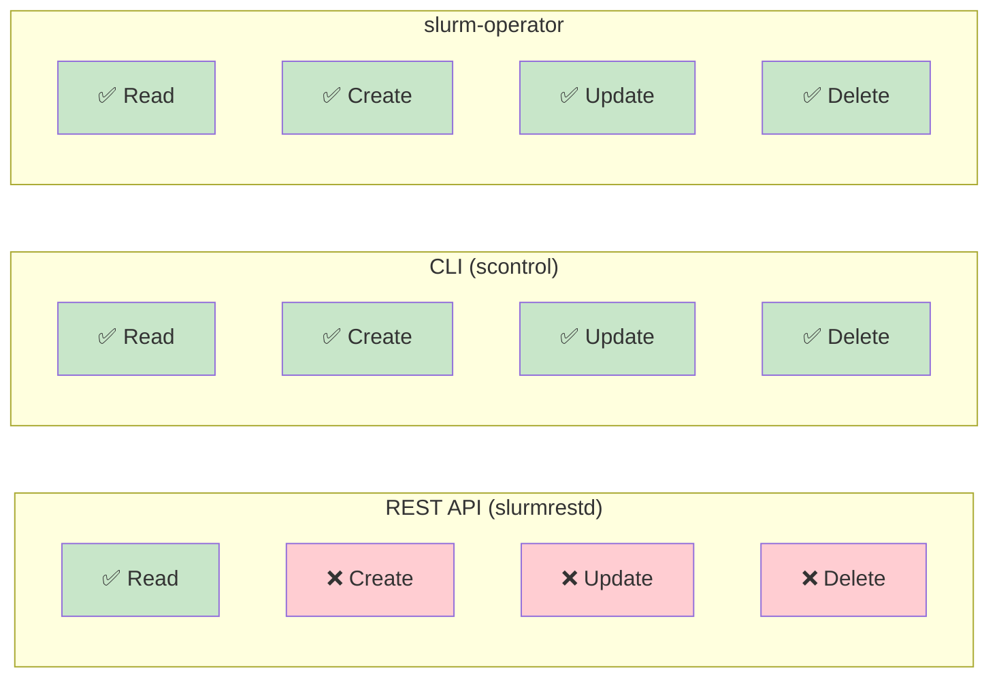
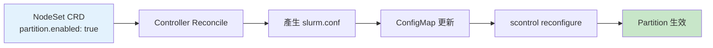

# API 能力分析

> 本文說明透過各種介面管理 Slurm Partition 的能力與限制。

## 快速參考

| 管理介面 | Create | Read | Update | Delete |
|----------|--------|------|--------|--------|
| REST API (slurmrestd) | ❌ | ✅ | ❌ | ❌ |
| C API (libslurm) | ✅ | ✅ | ✅ | ✅ |
| CLI (scontrol) | ✅ | ✅ | ✅ | ✅ |
| slurm.conf | ✅ | - | ✅ | ✅ |
| slurm-operator | ✅ | ✅ | ✅ | ✅ |

## REST API (slurmrestd)

### 可用端點

| 方法 | 路徑 | 功能 | 狀態 |
|------|------|------|------|
| GET | `/slurm/{version}/partitions/` | 列出所有 partition | ✅ 可用 |
| GET | `/slurm/{version}/partition/{name}` | 取得特定 partition | ✅ 可用 |
| POST | `/slurm/{version}/partition/` | 建立 partition | ❌ 不存在 |
| POST | `/slurm/{version}/partition/{name}` | 更新 partition | ❌ 不存在 |
| DELETE | `/slurm/{version}/partition/{name}` | 刪除 partition | ❌ 不存在 |

### 能力對比



### 為什麼 REST API 不支援 Partition CUD？

可能原因：

1. **設計哲學**：Partition 被視為「配置」而非「運行時資源」
2. **複雜性**：Partition 變更涉及節點重新分配、作業遷移等複雜邏輯
3. **優先級**：相比 Jobs/Nodes，動態 Partition 管理需求較低
4. **安全考量**：Partition 影響叢集整體結構，限制修改途徑可減少誤操作

## CLI (scontrol)

`scontrol` 是目前動態管理 Partition 的主要方式。

### 常用命令

```bash
# 查看所有 partition
scontrol show partition

# 建立 partition
scontrol create partition \
    PartitionName=gpu \
    Nodes=node[09-10] \
    State=UP \
    MaxTime=1-00:00:00 \
    Default=NO

# 更新 partition
scontrol update partitionname=compute state=drain
scontrol update partitionname=compute maxtime=14-00:00:00

# 刪除 partition
scontrol delete partition=gpu
```

### 優缺點

| 優點 | 缺點 |
|------|------|
| 即時生效 | 非宣告式管理 |
| 完整支援所有參數 | 動態變更不持久（重啟後遺失） |
| 成熟穩定 | 需要 root 權限 |

## slurm-operator

slurm-operator 採用**宣告式配置**方式管理 Partition。

### 運作方式



### 設定方式

```yaml
# 透過 NodeSet CRD
apiVersion: slinky.slurm.net/v1beta1
kind: NodeSet
metadata:
  name: compute
spec:
  controllerRef:
    name: slurm
  partition:
    enabled: true
    config: "Default=YES MaxTime=7-00:00:00"
```

### 優缺點

| 優點 | 缺點 |
|------|------|
| 宣告式管理 | 需要等待 ConfigMap 同步（1-2 分鐘） |
| 變更持久化 | 無法即時生效 |
| 與 K8s 原生整合 | Partition 必須對應 NodeSet |
| GitOps 友善 | 無法獨立建立 Partition |

## 管理策略建議

### 情境 1：標準使用（推薦）

透過 NodeSet CRD 管理，一個 NodeSet 對應一個 Partition：

```yaml
spec:
  partition:
    enabled: true
    config: "Default=YES"
```

### 情境 2：複雜 Partition 拓撲

如果需要一個 Partition 包含多個 NodeSet，可以：

1. 關閉各 NodeSet 的自動 partition 建立
2. 使用 Helm `partitions` 區塊或 Controller `extraConf` 手動定義

```yaml
# NodeSet 設定
spec:
  partition:
    enabled: false  # 不自動建立

# Controller extraConf
spec:
  extraConf: |
    PartitionName=all Nodes=ALL Default=YES
```

### 情境 3：臨時調整

如果需要即時調整 Partition（例如緊急下線節點），使用 `scontrol`：

```bash
kubectl exec <controller-pod> -c slurmctld -- \
    scontrol update partitionname=compute state=drain
```

**注意**：此變更在 slurmctld 重啟後會遺失，需要同步更新 NodeSet CRD。

## 相關資源

- [Slurm Partition 管理深度分析](../../deep-dive-partition.md) - 更詳細的 API 分析與動態管理方案
- [Slurm REST API 文件](https://slurm.schedmd.com/rest_api.html)
