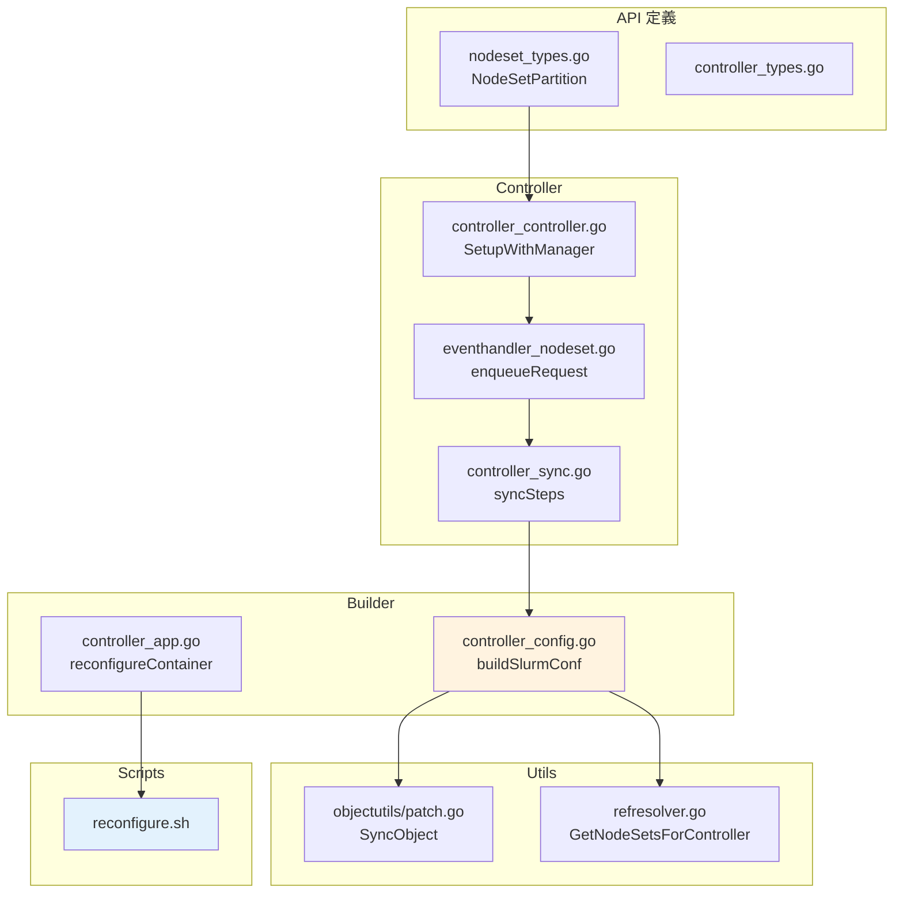

# 程式碼索引

> 本文彙整 NodeSet Partition 相關的原始碼檔案位置。

## API 定義

| 檔案 | 說明 | 關鍵行號 |
|------|------|----------|
| `api/v1beta1/nodeset_types.go` | NodeSet CRD 定義 | - |
| `api/v1beta1/nodeset_types.go` | `NodeSetPartition` 結構 | 114-124 |
| `api/v1beta1/controller_types.go` | Controller CRD 定義 | - |

## Controller Reconciler

| 檔案 | 說明 | 關鍵行號 |
|------|------|----------|
| `internal/controller/controller/controller_controller.go` | Controller Reconciler 主程式 | - |
| `internal/controller/controller/controller_controller.go` | `SetupWithManager` - Watch 設定 | 105-121 |
| `internal/controller/controller/controller_controller.go` | `Reconcile` 入口 | 77-103 |

## Controller Sync Steps

| 檔案 | 說明 | 關鍵行號 |
|------|------|----------|
| `internal/controller/controller/controller_sync.go` | Sync 主程式 | 27-127 |
| `internal/controller/controller/controller_sync.go` | Service sync step | 40-54 |
| `internal/controller/controller/controller_sync.go` | Config sync step（slurm.conf） | 56-74 |
| `internal/controller/controller/controller_sync.go` | StatefulSet sync step | 75-90 |
| `internal/controller/controller/controller_sync.go` | ServiceMonitor sync step | 91-111 |

## Event Handlers

| 檔案 | 說明 | 關鍵行號 |
|------|------|----------|
| `internal/controller/controller/eventhandler/eventhandler_nodeset.go` | NodeSet Event Handler | - |
| `internal/controller/controller/eventhandler/eventhandler_nodeset.go` | `Create` 處理 | 35-41 |
| `internal/controller/controller/eventhandler/eventhandler_nodeset.go` | `enqueueRequest` | 70-82 |
| `internal/controller/controller/eventhandler/eventhandler_accounting.go` | Accounting Event Handler | - |
| `internal/controller/controller/eventhandler/eventhandler_secret.go` | Secret Event Handler | - |

## Config Builder

| 檔案 | 說明 | 關鍵行號 |
|------|------|----------|
| `internal/builder/controller_config.go` | ConfigMap 建構 | - |
| `internal/builder/controller_config.go` | `BuildControllerConfig` | 29-152 |
| `internal/builder/controller_config.go` | `GetNodeSetsForController` 呼叫 | 39 |
| `internal/builder/controller_config.go` | `buildSlurmConf` | 144-287 |
| `internal/builder/controller_config.go` | NodeSet/Partition 行產生 | 252-279 |

## Controller App Builder

| 檔案 | 說明 | 關鍵行號 |
|------|------|----------|
| `internal/builder/controller_app.go` | Controller Pod 建構 | - |
| `internal/builder/controller_app.go` | `reconfigureContainer` 定義 | 297-312 |
| `internal/builder/controller_app.go` | InitContainers 設定 | 152-156 |

## Reconfigure Script

| 檔案 | 說明 |
|------|------|
| `internal/builder/scripts/reconfigure.sh` | Reconfigure sidecar 腳本 |

## Object Utils

| 檔案 | 說明 | 關鍵行號 |
|------|------|----------|
| `internal/utils/objectutils/patch.go` | `SyncObject` 函數 | 24-202 |
| `internal/utils/objectutils/patch.go` | ConfigMap patch 邏輯 | 77-87 |

## Ref Resolver

| 檔案 | 說明 |
|------|------|
| `internal/utils/refresolver/refresolver.go` | Reference 解析工具 |
| `internal/utils/refresolver/refresolver.go` | `GetNodeSetsForController` |
| `internal/utils/refresolver/refresolver.go` | `GetController` |

## CRD YAML

| 檔案 | 說明 |
|------|------|
| `config/crd/bases/slinky.slurm.net_nodesets.yaml` | NodeSet CRD YAML |
| `config/crd/bases/slinky.slurm.net_controllers.yaml` | Controller CRD YAML |

## Helm Templates

| 檔案 | 說明 |
|------|------|
| `helm/slurm/templates/nodeset/nodeset-cr.yaml` | NodeSet CR Helm 模板 |
| `helm/slurm/templates/controller/controller-cr.yaml` | Controller CR Helm 模板 |
| `helm/slurm/templates/controller/_helpers.tpl` | Controller helpers（含 partition 設定） |

## 測試檔案

| 檔案 | 說明 |
|------|------|
| `internal/builder/controller_config_test.go` | Config builder 測試 |
| `internal/controller/controller/eventhandler/eventhandler_nodeset_test.go` | NodeSet event handler 測試 |

## 程式碼流程圖

