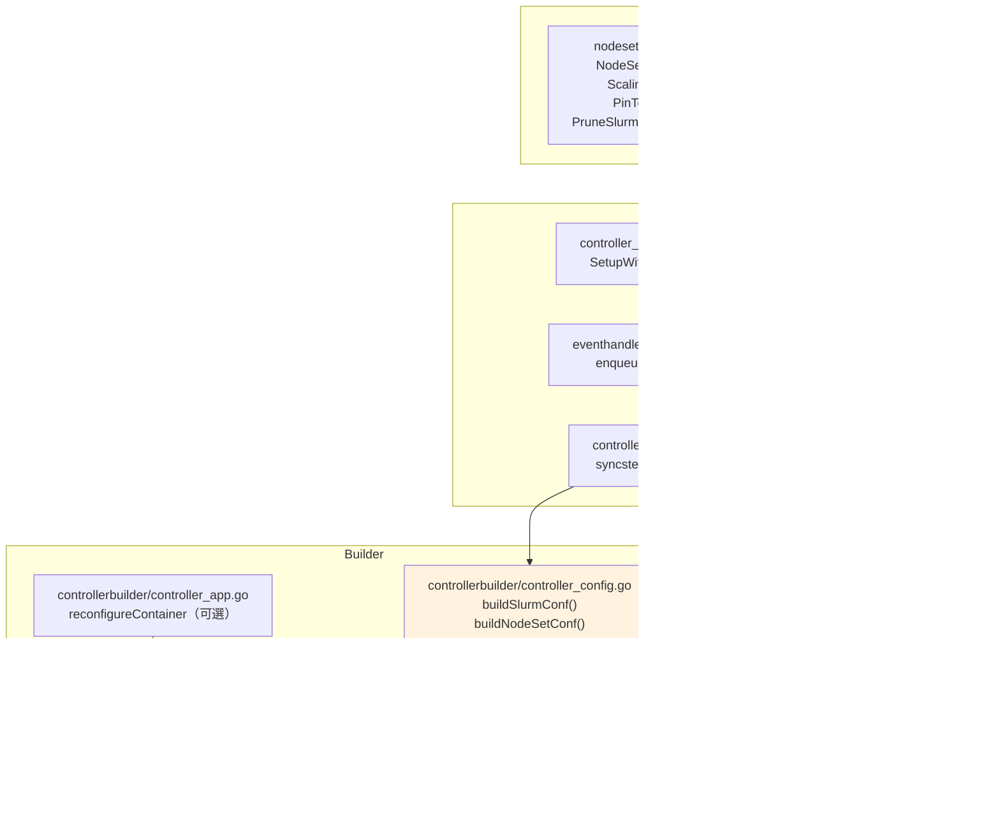

# 程式碼索引

> 本文彙整 NodeSet Partition 相關的原始碼檔案位置。

## API 定義

| 檔案 | 說明 | 關鍵行號 |
|------|------|----------|
| `api/v1beta1/nodeset_types.go` | NodeSet CRD 定義 | - |
| `api/v1beta1/nodeset_types.go` | `NodeSetPartition` 結構 | ~160 |
| `api/v1beta1/nodeset_types.go` | `ScalingModeType` 枚舉 | ~149 |
| `api/v1beta1/nodeset_types.go` | `NodeSetPruneSlurmNodeRecordType` 枚舉 | ~278 |
| `api/v1beta1/nodeset_types.go` | `NodeSetStatus.Desired` 欄位 | ~313 |
| `api/v1beta1/nodeset_types.go` | `NodeSetStatus.OrdinalToNode` 欄位 | ~365 |
| `api/v1beta1/controller_types.go` | Controller CRD 定義 | - |
| `api/v1beta1/controller_types.go` | `InplaceReconfigure` 欄位（預設 false） | ~70 |

## Controller Reconciler

| 檔案 | 說明 | 關鍵行號 |
|------|------|----------|
| `internal/controller/controller/controller_controller.go` | Controller Reconciler 主程式 | - |
| `internal/controller/controller/controller_controller.go` | `SetupWithManager` - Watch 設定 | ~110 |
| `internal/controller/controller/controller_controller.go` | `Reconcile` 入口 | ~77 |
| `internal/controller/controller/controller_sync.go` | Sync 主程式（使用 syncsteps） | ~25 |
| `internal/controller/controller/controller_sync.go` | Config sync step（slurm.conf） | ~62 |
| `internal/syncsteps/syncsteps.go` | Sync Steps 模組 | - |

## Event Handlers

| 檔案 | 說明 | 關鍵行號 |
|------|------|----------|
| `internal/controller/controller/eventhandler/eventhandler_nodeset.go` | NodeSet Event Handler | - |
| `internal/controller/controller/eventhandler/eventhandler_nodeset.go` | `Create` 處理 | ~35 |
| `internal/controller/controller/eventhandler/eventhandler_nodeset.go` | `enqueueRequest` | ~60 |
| `internal/controller/controller/eventhandler/eventhandler_accounting.go` | Accounting Event Handler | - |
| `internal/controller/controller/eventhandler/eventhandler_secret.go` | Secret Event Handler | - |

## Config Builder

> **注意**：v1.1+ 中 builder 套件已重構，路徑由 `internal/builder/` 移至各子目錄。

| 檔案 | 說明 | 關鍵行號 |
|------|------|----------|
| `internal/builder/controllerbuilder/controller_config.go` | ConfigMap 建構 | - |
| `internal/builder/controllerbuilder/controller_config.go` | `BuildControllerConfig` | ~29 |
| `internal/builder/controllerbuilder/controller_config.go` | `buildSlurmConf` | ~162 |
| `internal/builder/controllerbuilder/controller_config.go` | `buildNodeSetConf`（新增）| ~334 |
| `internal/builder/controllerbuilder/controller_config.go` | NodeSet/Partition 行產生 | ~340 |

## Controller App Builder

| 檔案 | 說明 | 關鍵行號 |
|------|------|----------|
| `internal/builder/controllerbuilder/controller_app.go` | Controller Pod 建構 | - |
| `internal/builder/controllerbuilder/controller_app.go` | `reconfigureContainer` 定義 | ~321 |
| `internal/builder/controllerbuilder/controller_app.go` | InplaceReconfigure 條件判斷 | ~107 |

## Reconfigure Script

| 檔案 | 說明 |
|------|------|
| `internal/builder/scripts/reconfigure.sh` | Reconfigure sidecar 腳本（`InplaceReconfigure=true` 時使用） |

## Object Utils

| 檔案 | 說明 | 關鍵行號 |
|------|------|----------|
| `internal/utils/objectutils/patch.go` | `SyncObject` 函數 | ~24 |

## Ref Resolver

| 檔案 | 說明 |
|------|------|
| `internal/utils/refresolver/refresolver.go` | Reference 解析工具 |
| `internal/utils/refresolver/refresolver.go` | `GetNodeSetsForController` |
| `internal/utils/refresolver/refresolver.go` | `GetController` |

## CRD YAML

| 檔案 | 說明 |
|------|------|
| `config/crd/bases/slinky.slurm.net_nodesets.yaml` | NodeSet CRD YAML |
| `config/crd/bases/slinky.slurm.net_controllers.yaml` | Controller CRD YAML |

## Helm Templates

| 檔案 | 說明 |
|------|------|
| `helm/slurm/templates/nodeset/nodeset-cr.yaml` | NodeSet CR Helm 模板 |
| `helm/slurm/templates/controller/controller-cr.yaml` | Controller CR Helm 模板 |

## Webhook（新增）

| 檔案 | 說明 |
|------|------|
| `internal/webhook/nodeset_webhook.go` | NodeSet 驗證 Webhook |

## 測試檔案

| 檔案 | 說明 |
|------|------|
| `internal/builder/controllerbuilder/controller_config_test.go` | Config builder 測試 |
| `internal/controller/controller/eventhandler/eventhandler_nodeset_test.go` | NodeSet event handler 測試 |

## 新增欄位速查表

| 欄位 | 型別 | 預設值 | 說明 |
|------|------|--------|------|
| `spec.scalingMode` | `ScalingModeType` | `StatefulSet` | Pod 擴展模式（StatefulSet / DaemonSet） |
| `spec.ordinalPadding` | `uint` | `0` | Pod 序號補零位數（StatefulSet 模式） |
| `spec.pinToNode` | `bool` | `false` | Pod 固定在首次調度的節點（StatefulSet 模式） |
| `spec.pruneSlurmNodeRecords` | `NodeSetPruneSlurmNodeRecordType` | `Never` | 自動清理 Slurm 節點紀錄策略 |
| `spec.partition.enabled` | `bool` | **`false`**（v1.1+ 改變） | 是否建立 Partition |
| `spec.rollingUpdate.maxUnavailable` | `IntOrString` | **`25%`**（v1.1+ 改變） | 滾動更新最大不可用數 |
| `status.desired` | `int32` | - | 期望 Pod 數（DaemonSet: 符合條件節點數；StatefulSet: replicas） |
| `status.ordinalToNode` | `map[string]string` | - | Pod 序號到 Kubernetes 節點名稱的映射（pinToNode 使用） |

## 程式碼流程圖

```mermaid
flowchart TD
    subgraph api["API 定義"]
        NT["nodeset_types.go<br/>NodeSetPartition<br/>ScalingMode<br/>PinToNode<br/>PruneSlurmNodeRecords"]
        CT["controller_types.go<br/>InplaceReconfigure"]
    end

    subgraph controller["Controller"]
        CC["controller_controller.go<br/>SetupWithManager"]
        CS["controller_sync.go<br/>syncsteps.Sync()"]
        EH["eventhandler_nodeset.go<br/>enqueueRequest"]
    end

    subgraph builder["Builder"]
        BC["controllerbuilder/controller_config.go<br/>buildSlurmConf()<br/>buildNodeSetConf()"]
        BA["controllerbuilder/controller_app.go<br/>reconfigureContainer（可選）"]
    end

    subgraph utils["Utils"]
        OU["objectutils/patch.go<br/>SyncObject"]
        RR["refresolver.go<br/>GetNodeSetsForController"]
        SS["syncsteps/syncsteps.go<br/>Sync()"]
    end

    subgraph scripts["Scripts"]
        RS["reconfigure.sh（InplaceReconfigure=true）"]
    end

    NT --> CC
    CC --> EH
    EH --> CS
    CS --> SS
    CS --> BC
    BC --> RR
    BC --> OU
    BA --> RS

    style BC fill:#fff3e0
    style RS fill:#e3f2fd
    style SS fill:#c8e6c9
```
