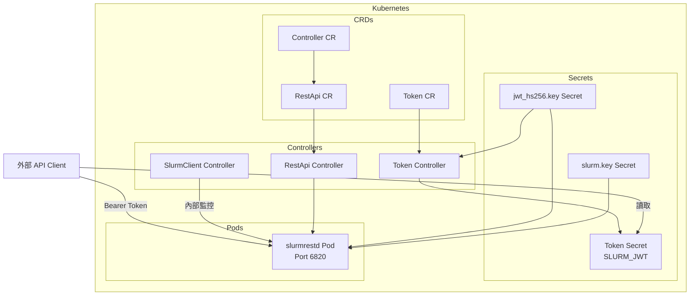
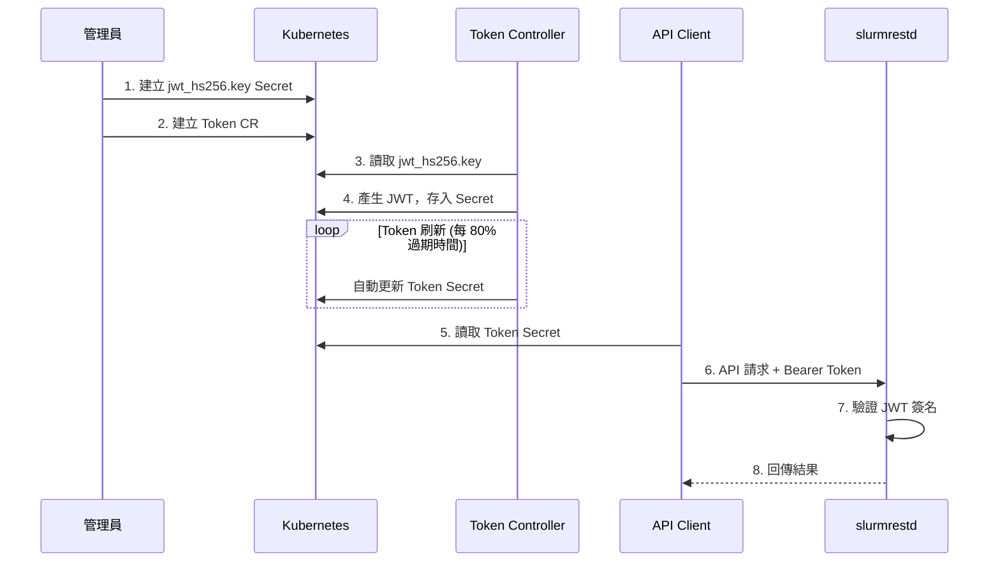
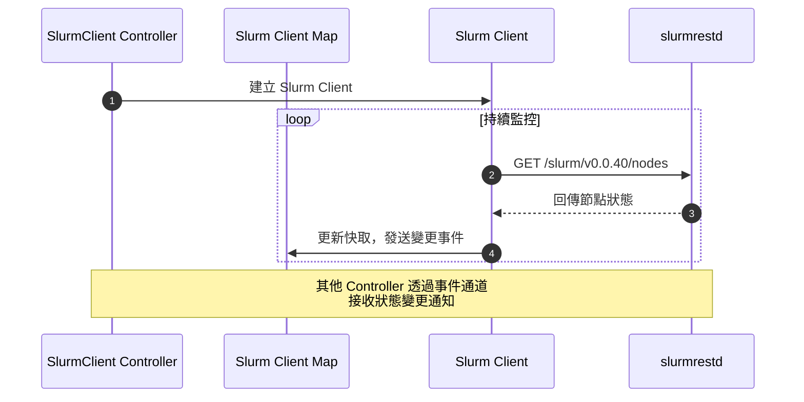
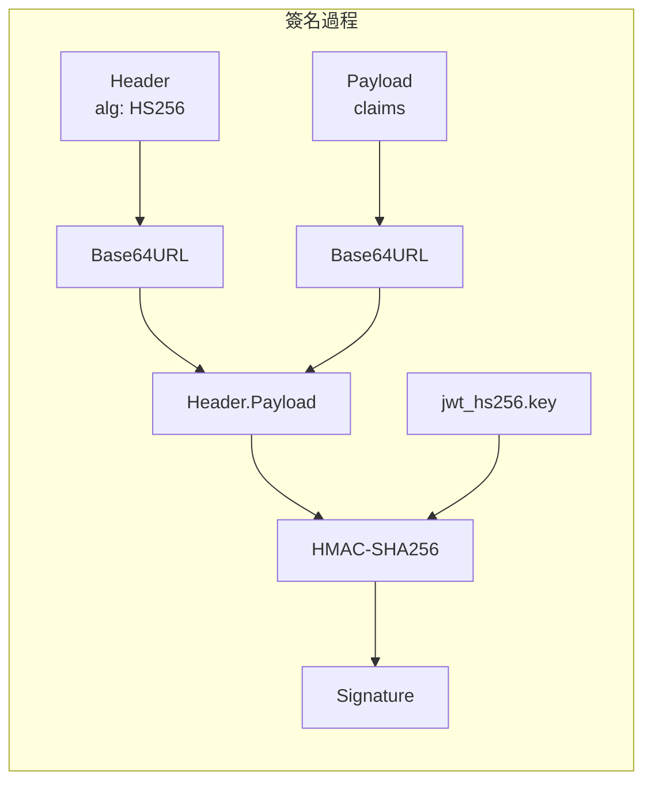

# REST API 與 JWT Token 認證

## 目錄

<!-- mdformat-toc start --slug=github --no-anchors --maxlevel=6 --minlevel=1 -->

- [REST API 與 JWT Token 認證](#rest-api-與-jwt-token-認證)
  - [目錄](#目錄)
  - [概述](#概述)
  - [架構](#架構)
    - [元件關係圖](#元件關係圖)
    - [認證流程](#認證流程)
    - [Operator 內部使用](#operator-內部使用)
  - [RestApi CRD](#restapi-crd)
    - [規格說明](#規格說明)
    - [slurmrestd 環境變數](#slurmrestd-環境變數)
    - [部署範例](#部署範例)
  - [Token CRD](#token-crd)
    - [規格說明](#規格說明-1)
    - [Token 狀態](#token-狀態)
    - [部署範例](#部署範例-1)
  - [JWT Token 詳解](#jwt-token-詳解)
    - [Token 結構](#token-結構)
    - [簽名機制](#簽名機制)
    - [自動刷新機制](#自動刷新機制)
    - [手動解析 JWT (調試用)](#手動解析-jwt-調試用)
  - [JWT 密鑰管理](#jwt-密鑰管理)
    - [產生 jwt_hs256.key](#產生-jwt_hs256key)
    - [匯入 Kubernetes](#匯入-kubernetes)
    - [安全最佳實踐](#安全最佳實踐)
  - [使用指南](#使用指南)
    - [Step 1: 確認 JWT 密鑰](#step-1-確認-jwt-密鑰)
    - [Step 2: 建立 Token 資源](#step-2-建立-token-資源)
    - [Step 3: 取得 Token](#step-3-取得-token)
    - [Step 4: 呼叫 REST API](#step-4-呼叫-rest-api)
  - [API 端點參考](#api-端點參考)
    - [API 版本](#api-版本)
    - [常用端點列表](#常用端點列表)
    - [查詢作業範例](#查詢作業範例)
    - [提交作業範例](#提交作業範例)
    - [節點管理範例](#節點管理範例)
  - [進階配置](#進階配置)
    - [自訂 Token 存儲](#自訂-token-存儲)
    - [長期 Token](#長期-token)
    - [多用戶 Token](#多用戶-token)
    - [RBAC 存取控制](#rbac-存取控制)
  - [疑難排解](#疑難排解)
    - [常見問題](#常見問題)
    - [診斷指令](#診斷指令)
    - [驗證 JWT Token](#驗證-jwt-token)
  - [相關連結](#相關連結)

<!-- mdformat-toc end -->

## 概述

Slurm REST API (slurmrestd) 提供 HTTP 介面來存取 Slurm 集群功能，包括作業提交、查詢、節點管理等操作。在 Slurm Operator 中，REST API 透過 JWT (JSON Web Token) 進行身份驗證。

Operator 提供兩個主要 CRD 來管理 REST API：

| CRD | 用途 |
|-----|------|
| `RestApi` | 部署和管理 slurmrestd 服務 |
| `Token` | 自動產生和管理 JWT Token |

**為什麼需要 REST API？**

- **Operator 內部**：SlurmClient Controller 透過 REST API 監控 Slurm 節點狀態
- **外部整合**：提供標準 HTTP 介面供外部系統存取 Slurm
- **自動化**：支援程式化的作業提交、監控和管理

## 架構

### 元件關係圖



### 認證流程



### Operator 內部使用

Slurm Operator 內部透過 **SlurmClient Controller** 使用 REST API：



這個機制讓 Operator 能夠：
- 監控 Slurm 節點狀態變化
- 同步 Kubernetes 資源與 Slurm 狀態
- 實現自動擴縮容 (autoscaling)

詳見 [SlurmClient Controller 文件](../docs-zhTW/concepts/slurmclient-controller.md)。

## RestApi CRD

RestApi CRD 管理 slurmrestd 服務的部署。

### 規格說明

| 欄位 | 類型 | 必填 | 說明 |
|------|------|------|------|
| `controllerRef` | ObjectReference | 是 | 關聯的 Controller CR 參考 |
| `replicas` | int32 | 否 | 副本數量，預設為 1 |
| `slurmrestd` | ContainerWrapper | 否 | slurmrestd 容器配置 |
| `template` | PodTemplate | 否 | Pod 模板規格 |
| `service` | ServiceSpec | 否 | Service 配置 |

**服務端口**: 6820 (slurmrestd 標準端口)

### slurmrestd 環境變數

Operator 自動設定以下環境變數：

| 環境變數 | 值 | 說明 |
|---------|-----|------|
| `SLURM_JWT` | `daemon` | 啟用 JWT daemon 模式，slurmrestd 自動讀取 jwt_hs256.key 驗證 Token |
| `SLURMRESTD_SECURITY` | `disable_unshare_files,disable_unshare_sysv` | 容器環境安全設定 |

**SLURM_JWT=daemon 的意義**：
- slurmrestd 啟動時讀取 `jwt_hs256.key`
- 所有 API 請求都需要有效的 JWT Token
- Token 中的 `sun` claim 決定請求的身份

### 部署範例

透過 Helm chart 安裝時，RestApi 會自動部署：

```sh
helm install slurm oci://ghcr.io/slinkyproject/charts/slurm \
  --namespace=slurm --create-namespace
```

檢查 RestApi 狀態：

```sh
kubectl get restapi -n slurm
kubectl describe restapi slurm-restapi -n slurm
```

## Token CRD

Token CRD 自動化管理 JWT Token 的生成與刷新。

### 規格說明

| 欄位 | 類型 | 必填 | 說明 |
|------|------|------|------|
| `jwtHs256KeyRef` | SecretKeySelector | 是 | JWT HS256 密鑰 Secret 參考 |
| `username` | string | 是 | Token 對應的 Slurm 用戶名 |
| `lifetime` | Duration | 否 | Token 有效期，預設 15 分鐘 |
| `refresh` | bool | 否 | 是否自動刷新，預設 true |
| `secretRef` | SecretKeySelector | 否 | 自訂 Token 存儲位置 |

### Token 狀態

| 欄位 | 說明 |
|------|------|
| `issuedAt` | Token 發行時間 |
| `conditions` | Token 狀態條件 |

查看 Token 狀態：

```sh
kubectl get token -n slurm
# 輸出範例:
# NAME          USER    IAT                    AGE
# slurm-token   foo     2024-01-15T10:30:00Z   2h
```

### 部署範例

```yaml
apiVersion: slinky.slurm.net/v1beta1
kind: Token
metadata:
  name: slurm-token
  namespace: slurm
spec:
  jwtHs256KeyRef:
    name: slurm-auth-jwths256
    key: jwt_hs256.key
  username: slurmuser
  lifetime: 15m
  refresh: true
```

## JWT Token 詳解

### Token 結構

Slurm JWT Token 遵循 [RFC 7519] 標準，包含以下 Claims：

```json
{
  "jti": "550e8400-e29b-41d4-a716-446655440000",
  "iss": "slurm-operator",
  "iat": 1705312200,
  "exp": 1705313100,
  "nbf": 1705312200,
  "sun": "slurmuser"
}
```

| Claim | 全名 | 說明 |
|-------|------|------|
| `jti` | JWT ID | 唯一識別碼 (UUID) |
| `iss` | Issuer | 發行者，固定為 `slurm-operator` |
| `iat` | Issued At | 發行時間 (Unix timestamp) |
| `exp` | Expiration | 過期時間 (Unix timestamp) |
| `nbf` | Not Before | 生效時間 (Unix timestamp) |
| `sun` | Slurm Username | Slurm 專用用戶名 claim (非標準) |

### 簽名機制

Token 使用 **HS256 (HMAC-SHA256)** 對稱式簽名：



**運作方式**：
1. Slurm 集群產生 `jwt_hs256.key` 共享密鑰
2. Token Controller 使用此密鑰簽名 JWT
3. slurmrestd 使用相同密鑰驗證 JWT

> **安全警告**: `jwt_hs256.key` 是對稱密鑰，必須妥善保護。擁有此密鑰者可產生任意用戶的有效 Token。

### 自動刷新機制

當 `refresh: true` 時，Token Controller 會在 Token 過期前自動更新：

- **刷新時機**: Token 生命週期的 80% (即過期前 20% 時間)
- **範例**: 15 分鐘有效期的 Token，會在發行後 12 分鐘刷新

```mermaid
gantt
    title Token 生命週期 (15分鐘)
    dateFormat X
    axisFormat %s

    section Token
    有效期間     :0, 900
    刷新時機點   :milestone, 720, 0
    刷新後新 Token :720, 1620
```



刷新流程：

1. Controller 監控 Token 的 `exp` Claim
2. 接近過期時，產生新的 JWT
3. 更新 Kubernetes Secret
4. 應用程式讀取 Secret 時自動取得新 Token

### 手動解析 JWT (調試用)

JWT 是 Base64URL 編碼的字串，可以手動解析進行調試：

**方法 1: 使用 jq**

```sh
# 取得 Token
TOKEN=$(kubectl get secret my-token -n slurm \
  -o jsonpath='{.data.SLURM_JWT}' | base64 -d)

# 解析 Header
echo $TOKEN | cut -d. -f1 | base64 -d 2>/dev/null | jq

# 解析 Payload (claims)
echo $TOKEN | cut -d. -f2 | base64 -d 2>/dev/null | jq

# 輸出範例:
# {
#   "jti": "550e8400-e29b-41d4-a716-446655440000",
#   "iss": "slurm-operator",
#   "iat": 1705312200,
#   "exp": 1705313100,
#   "nbf": 1705312200,
#   "sun": "myuser"
# }
```

**方法 2: 線上工具**

可使用 [jwt.io](https://jwt.io) 解析 Token。

> **安全提醒**: 不要在生產環境使用線上工具解析敏感 Token。

**方法 3: 檢查過期時間**

```sh
# 取得 exp claim 並轉換為可讀時間
EXP=$(echo $TOKEN | cut -d. -f2 | base64 -d 2>/dev/null | jq -r '.exp')
date -d "@$EXP"
```

## JWT 密鑰管理

### 產生 jwt_hs256.key

如果是新建 Slurm 集群，需要產生 JWT 密鑰：

**方法 1: 使用 dd (推薦)**

```sh
dd if=/dev/urandom bs=32 count=1 > /etc/slurm/jwt_hs256.key
chmod 600 /etc/slurm/jwt_hs256.key
chown slurm:slurm /etc/slurm/jwt_hs256.key
```

**方法 2: 使用 openssl**

```sh
openssl rand -out /etc/slurm/jwt_hs256.key 32
chmod 600 /etc/slurm/jwt_hs256.key
```

> **重要**: 密鑰長度應為 32 bytes (256 bits) 以符合 HS256 要求。

### 匯入 Kubernetes

將密鑰從 Slurm 集群匯入 Kubernetes：

```sh
# 從本地檔案匯入
kubectl create secret generic slurm-auth-jwths256 \
  --namespace=slurm \
  --from-file="jwt_hs256.key=/etc/slurm/jwt_hs256.key"

# 從遠端主機匯入
ssh slurm-controller "cat /etc/slurm/jwt_hs256.key" | \
  kubectl create secret generic slurm-auth-jwths256 \
    --namespace=slurm \
    --from-file="jwt_hs256.key=/dev/stdin"
```

對於混合式集群，請參考 [Hybrid 文件](../docs/usage/hybrid.md#slurm-configuration)。

### 安全最佳實踐

**密鑰保護**：

1. **限制 Secret 存取**: 使用 RBAC 限制誰能讀取 `jwt_hs256.key` Secret
2. **啟用 etcd 加密**: 在 Kubernetes 啟用 Secret 靜態加密
3. **定期輪換**: 定期更換 JWT 密鑰（需同步更新所有 Slurm 節點）

**Token 保護**：

1. **最小權限**: 為不同用途建立不同用戶的 Token
2. **短期有效**: 使用短 lifetime 搭配自動刷新
3. **存取控制**: 使用 RBAC 限制 Token Secret 的存取

## 使用指南

### Step 1: 確認 JWT 密鑰

確認 JWT 密鑰 Secret 已存在：

```sh
kubectl get secret slurm-auth-jwths256 -n slurm

# 如果不存在，請匯入密鑰 (參見「JWT 密鑰管理」章節)
```

### Step 2: 建立 Token 資源

```sh
kubectl apply -f - <<EOF
apiVersion: slinky.slurm.net/v1beta1
kind: Token
metadata:
  name: my-token
  namespace: slurm
spec:
  jwtHs256KeyRef:
    name: slurm-auth-jwths256
    key: jwt_hs256.key
  username: myuser
  lifetime: 1h
  refresh: true
EOF
```

### Step 3: 取得 Token

```sh
# 從 Secret 讀取 Token
TOKEN=$(kubectl get secret my-token -n slurm \
  -o jsonpath='{.data.SLURM_JWT}' | base64 -d)

# 驗證 Token 不為空
echo $TOKEN | head -c 50
```

### Step 4: 呼叫 REST API

**方法 A: 使用 Port Forward (開發測試)**

```sh
# 開啟 port forward
kubectl port-forward -n slurm svc/slurm-restapi 6820:6820 &

# 測試連線
curl -s http://localhost:6820/slurm/v0.0.40/ping

# 帶認證的請求
curl -s -H "Authorization: Bearer $TOKEN" \
  http://localhost:6820/slurm/v0.0.40/jobs | jq
```

**方法 B: 從集群內部存取**

```sh
# 在 Pod 內直接存取
curl -s -H "Authorization: Bearer $SLURM_JWT" \
  http://slurm-restapi.slurm.svc.cluster.local:6820/slurm/v0.0.40/jobs
```

## API 端點參考

### API 版本

Slurm REST API 使用版本化端點，格式為 `/slurm/v{major}.{minor}.{patch}/`。

**查詢可用版本**：

```sh
curl -s http://localhost:6820/openapi | jq '.info.version'

# 或查看完整 OpenAPI spec
curl -s http://localhost:6820/openapi/v3 | jq '.info'
```

**常見版本對應**：

| Slurm 版本 | API 版本 |
|-----------|----------|
| 23.02.x | v0.0.39 |
| 23.11.x | v0.0.40 |
| 24.05.x | v0.0.41 |

### 常用端點列表

| 端點 | 方法 | 說明 |
|------|------|------|
| `/slurm/v0.0.40/ping` | GET | 健康檢查 (不需認證) |
| `/slurm/v0.0.40/diag` | GET | 診斷資訊 |
| `/slurm/v0.0.40/jobs` | GET | 列出所有作業 |
| `/slurm/v0.0.40/job/{job_id}` | GET | 取得特定作業 |
| `/slurm/v0.0.40/job/submit` | POST | 提交作業 |
| `/slurm/v0.0.40/job/{job_id}` | DELETE | 取消作業 |
| `/slurm/v0.0.40/nodes` | GET | 列出所有節點 |
| `/slurm/v0.0.40/node/{node_name}` | GET | 取得特定節點 |
| `/slurm/v0.0.40/partitions` | GET | 列出所有分區 |
| `/slurm/v0.0.40/partition/{partition_name}` | GET | 取得特定分區 |
| `/slurmdb/v0.0.40/jobs` | GET | 從 accounting DB 查詢作業 |

### 查詢作業範例

```sh
# 列出所有作業
curl -s -H "Authorization: Bearer $TOKEN" \
  http://localhost:6820/slurm/v0.0.40/jobs | jq '.jobs[].job_id'

# 查詢特定作業
curl -s -H "Authorization: Bearer $TOKEN" \
  http://localhost:6820/slurm/v0.0.40/job/12345 | jq

# 查詢正在執行的作業
curl -s -H "Authorization: Bearer $TOKEN" \
  "http://localhost:6820/slurm/v0.0.40/jobs?job_state=RUNNING" | jq
```

### 提交作業範例

```sh
# 提交簡單作業
curl -s -X POST \
  -H "Authorization: Bearer $TOKEN" \
  -H "Content-Type: application/json" \
  http://localhost:6820/slurm/v0.0.40/job/submit \
  -d '{
    "job": {
      "name": "test-job",
      "ntasks": 1,
      "cpus_per_task": 1,
      "time_limit": "00:10:00",
      "current_working_directory": "/tmp",
      "environment": ["PATH=/usr/bin:/bin"],
      "script": "#!/bin/bash\necho Hello World\nhostname\nsleep 60"
    }
  }' | jq

# 回應範例:
# {
#   "job_id": 12345,
#   "step_id": "batch",
#   "job_submit_user_msg": ""
# }
```

### 節點管理範例

```sh
# 列出所有節點狀態
curl -s -H "Authorization: Bearer $TOKEN" \
  http://localhost:6820/slurm/v0.0.40/nodes | \
  jq '.nodes[] | {name: .name, state: .state}'

# 查詢特定節點
curl -s -H "Authorization: Bearer $TOKEN" \
  http://localhost:6820/slurm/v0.0.40/node/worker-0 | jq

# 列出分區資訊
curl -s -H "Authorization: Bearer $TOKEN" \
  http://localhost:6820/slurm/v0.0.40/partitions | \
  jq '.partitions[] | {name: .name, state: .state.current, nodes: .nodes.total}'
```

## 進階配置

### 自訂 Token 存儲

預設 Token 存儲在與 Token CR 同名的 Secret 中，key 為 `SLURM_JWT`。可透過 `secretRef` 自訂：

```yaml
apiVersion: slinky.slurm.net/v1beta1
kind: Token
metadata:
  name: my-token
  namespace: slurm
spec:
  jwtHs256KeyRef:
    name: slurm-auth-jwths256
    key: jwt_hs256.key
  username: myuser
  secretRef:
    name: custom-secret-name
    key: MY_CUSTOM_KEY
```

### 長期 Token

對於需要長期有效的 Token（如自動化系統），可設定較長的 `lifetime`：

```yaml
spec:
  lifetime: 24h  # 24 小時
  refresh: true  # 建議保持自動刷新
```

> **注意**: 不建議停用 `refresh`，因為這會使 Secret 變為 immutable，Token 過期後無法自動更新。

### 多用戶 Token

可為不同用戶建立多個 Token：

```yaml
---
apiVersion: slinky.slurm.net/v1beta1
kind: Token
metadata:
  name: admin-token
  namespace: slurm
spec:
  jwtHs256KeyRef:
    name: slurm-auth-jwths256
    key: jwt_hs256.key
  username: admin
---
apiVersion: slinky.slurm.net/v1beta1
kind: Token
metadata:
  name: user-token
  namespace: slurm
spec:
  jwtHs256KeyRef:
    name: slurm-auth-jwths256
    key: jwt_hs256.key
  username: regularuser
```

### RBAC 存取控制

限制哪些 ServiceAccount 可以讀取 Token Secret：

```yaml
apiVersion: rbac.authorization.k8s.io/v1
kind: Role
metadata:
  name: token-reader
  namespace: slurm
rules:
- apiGroups: [""]
  resources: ["secrets"]
  resourceNames: ["my-token"]  # 指定允許存取的 Secret
  verbs: ["get"]
---
apiVersion: rbac.authorization.k8s.io/v1
kind: RoleBinding
metadata:
  name: app-token-reader
  namespace: slurm
subjects:
- kind: ServiceAccount
  name: my-app
  namespace: slurm
roleRef:
  kind: Role
  name: token-reader
  apiGroup: rbac.authorization.k8s.io
```

## 疑難排解

### 常見問題

**問題: API 回傳 401 Unauthorized**

可能原因：
- Token 已過期
- jwt_hs256.key 不正確或不匹配
- Token 格式錯誤

解決方法：

```sh
# 檢查 Token 狀態
kubectl describe token my-token -n slurm

# 檢查 Token 是否過期
TOKEN=$(kubectl get secret my-token -n slurm -o jsonpath='{.data.SLURM_JWT}' | base64 -d)
EXP=$(echo $TOKEN | cut -d. -f2 | base64 -d 2>/dev/null | jq -r '.exp')
echo "Token 過期時間: $(date -d @$EXP)"
echo "目前時間: $(date)"

# 重新建立 Token
kubectl delete token my-token -n slurm
kubectl apply -f token.yaml
```

**問題: slurmrestd Pod 無法啟動**

```sh
# 檢查 Pod 狀態
kubectl describe pod -l app.kubernetes.io/component=restapi -n slurm

# 檢查 Secret 是否存在
kubectl get secret slurm-auth-jwths256 -n slurm
kubectl get secret slurm-auth-slurm -n slurm

# 檢查 Pod 日誌
kubectl logs -l app.kubernetes.io/component=restapi -n slurm
```

**問題: Token 未自動刷新**

```sh
# 檢查 Token Controller 日誌
kubectl logs -l app.kubernetes.io/name=slurm-operator -n slinky | grep -i token

# 確認 refresh 設定為 true
kubectl get token my-token -n slurm -o yaml | grep refresh

# 檢查 Token conditions
kubectl get token my-token -n slurm -o jsonpath='{.status.conditions}' | jq
```

### 診斷指令

```sh
# 列出所有 Token
kubectl get tokens -n slurm

# 查看 Token 詳情
kubectl describe token <token-name> -n slurm

# 查看 RestApi 狀態
kubectl get restapi -n slurm

# 檢查 slurmrestd Pod 日誌
kubectl logs -l app.kubernetes.io/component=restapi -n slurm

# 測試 API 連線 (不需認證)
kubectl port-forward -n slurm svc/slurm-restapi 6820:6820 &
curl -v http://localhost:6820/slurm/v0.0.40/ping

# 測試認證
curl -v -H "Authorization: Bearer $TOKEN" \
  http://localhost:6820/slurm/v0.0.40/diag
```

### 驗證 JWT Token

完整的 Token 驗證流程：

```sh
# 1. 取得 Token
TOKEN=$(kubectl get secret my-token -n slurm \
  -o jsonpath='{.data.SLURM_JWT}' | base64 -d)

# 2. 檢查 Token 格式 (應該有 3 個部分，用 . 分隔)
echo $TOKEN | tr '.' '\n' | wc -l  # 應該輸出 3

# 3. 解析 Header
echo "=== Header ==="
echo $TOKEN | cut -d. -f1 | base64 -d 2>/dev/null | jq

# 4. 解析 Payload
echo "=== Payload ==="
echo $TOKEN | cut -d. -f2 | base64 -d 2>/dev/null | jq

# 5. 檢查關鍵 claims
echo "=== 驗證結果 ==="
PAYLOAD=$(echo $TOKEN | cut -d. -f2 | base64 -d 2>/dev/null)
echo "發行者: $(echo $PAYLOAD | jq -r '.iss')"
echo "用戶名: $(echo $PAYLOAD | jq -r '.sun')"
echo "發行時間: $(date -d @$(echo $PAYLOAD | jq -r '.iat'))"
echo "過期時間: $(date -d @$(echo $PAYLOAD | jq -r '.exp'))"

# 6. 檢查是否過期
EXP=$(echo $PAYLOAD | jq -r '.exp')
NOW=$(date +%s)
if [ $NOW -lt $EXP ]; then
  echo "狀態: 有效"
else
  echo "狀態: 已過期"
fi
```

## 相關連結

**內部文件**:
- [混合式集群配置](../docs/usage/hybrid.md) - JWT 密鑰匯入與外部集群整合
- [安裝指南](../docs/installation.md) - 基本安裝與 RestApi 部署
- [系統需求](../docs/usage/system-requirements.md) - 部署前置需求
- [SlurmClient Controller](../docs-zhTW/concepts/slurmclient-controller.md) - Operator 內部 REST API 使用

**外部資源**:
- [Slurm REST API 文件](https://slurm.schedmd.com/rest_api.html)
- [Slurm JWT 認證](https://slurm.schedmd.com/jwt.html)
- [Slurm auth/jwt 設定](https://slurm.schedmd.com/authentication.html#jwt)
- [Slurm Client Library](https://github.com/SlinkyProject/slurm-client) - Operator 使用的 Go client
- [RFC 7519 - JSON Web Token](https://datatracker.ietf.org/doc/html/rfc7519)

<!-- Links -->
[RFC 7519]: https://datatracker.ietf.org/doc/html/rfc7519
