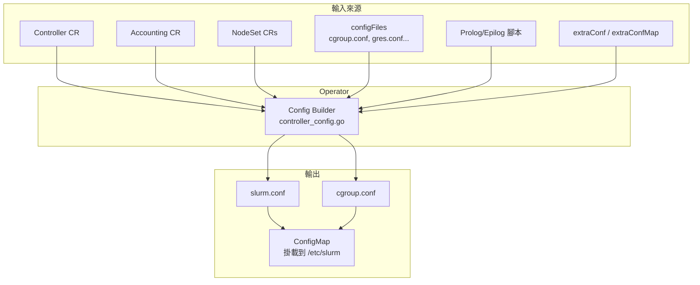
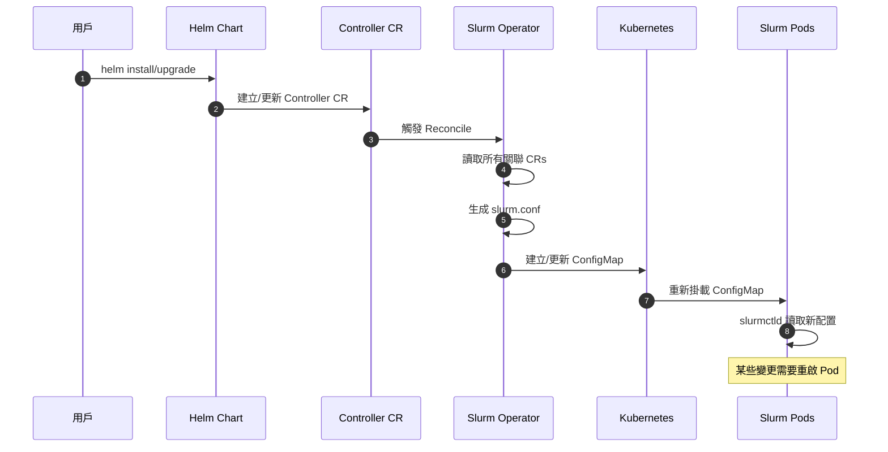
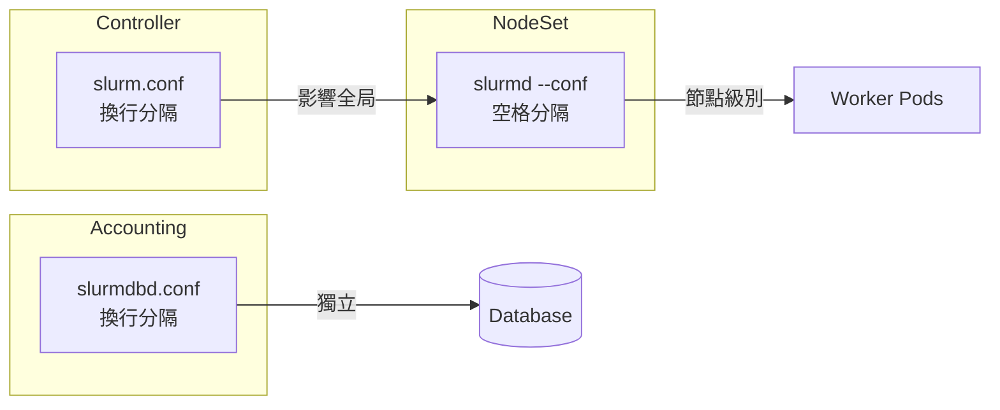
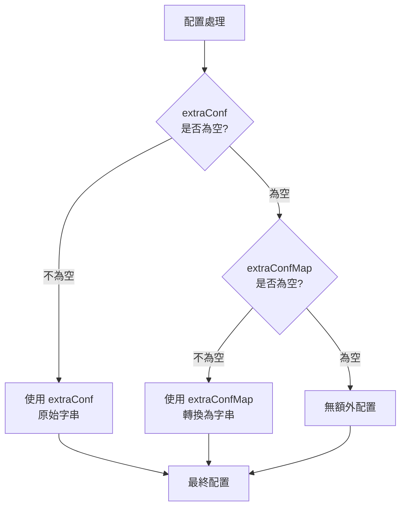
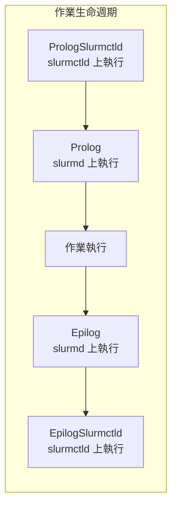
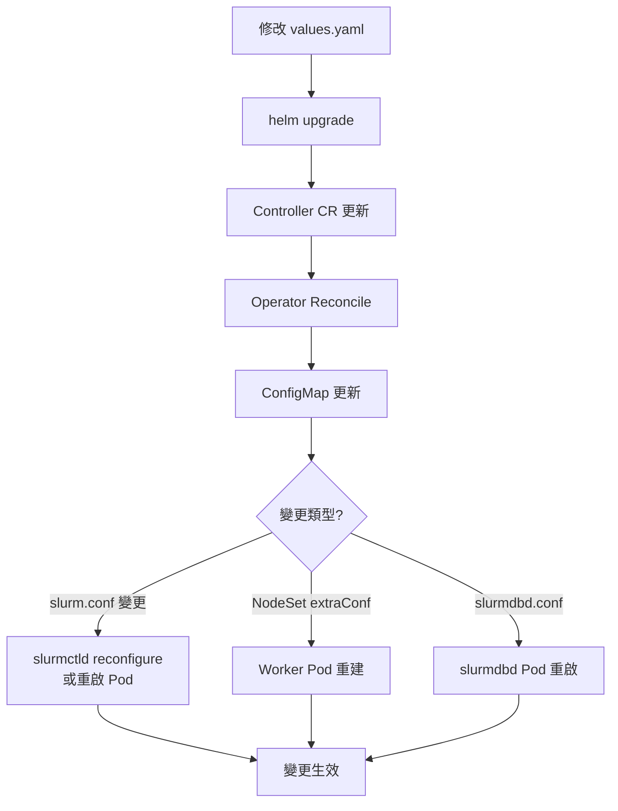

# slurm.conf 配置指南

本文件說明 Slurm Operator 如何生成與管理 slurm.conf，以及如何透過 Helm 或 CRD 自訂配置。

---

## 目錄

<!-- mdformat-toc start --slug=github --no-anchors --maxlevel=6 --minlevel=1 -->

- [slurm.conf 配置指南](#slurmconf-配置指南)
  - [目錄](#目錄)
  - [概覽：Operator 如何生成 slurm.conf](#概覽operator-如何生成-slurmconf)
  - [配置生成流程](#配置生成流程)
  - [三種配置層級](#三種配置層級)
  - [配置優先級](#配置優先級)
  - [配置方式一：extraConf（原始字串）](#配置方式一extraconf原始字串)
  - [配置方式二：extraConfMap（結構化）](#配置方式二extraconfmap結構化)
  - [configFiles：額外配置檔案](#configfiles額外配置檔案)
    - [cgroup.conf](#cgroupconf)
    - [gres.conf（GPU 配置）](#gresconfgpu-配置)
    - [其他配置檔案](#其他配置檔案)
  - [Prolog 與 Epilog 腳本](#prolog-與-epilog-腳本)
  - [Partition 配置](#partition-配置)
  - [完整 Helm values.yaml 範例](#完整-helm-valuesyaml-範例)
  - [配置變更流程](#配置變更流程)
  - [配置驗證與調試](#配置驗證與調試)
  - [常見錯誤與解決方案](#常見錯誤與解決方案)
  - [常用 slurm.conf 參數參考](#常用-slurmconf-參數參考)
  - [程式碼位置參考](#程式碼位置參考)
  - [相關文件](#相關文件)

<!-- mdformat-toc end -->

---

## 概覽：Operator 如何生成 slurm.conf

Slurm Operator **自動生成** slurm.conf，由以下來源組合：



**slurm.conf 結構**：

| 區段 | 來源 | 說明 |
|------|------|------|
| `GENERAL` | 自動生成 | ClusterName, SlurmUser, Ports... |
| `LOGGING` | 自動生成 | Log 檔案路徑 |
| `PLUGINS & PARAMETERS` | 自動生成 + 條件化 | 認證、排程、cgroup 相關 |
| `ACCOUNTING` | 根據 Accounting CR | 如果啟用 accounting |
| `PROLOG & EPILOG` | 根據 Script Refs | 如果有配置腳本 |
| `COMPUTE & PARTITION` | 根據 NodeSet CRs | NodeSet 和 Partition 定義 |
| `EXTRA CONFIG` | extraConf | 用戶自定義配置 |

---

## 配置生成流程



---

## 三種配置層級

| 層級 | 配置文件 | Helm 欄位 | 分隔符 |
|------|----------|-----------|--------|
| **Controller** | slurm.conf | `controller.extraConf` | 換行 `\n` |
| **NodeSet** | slurmd `--conf` | `nodesets.<name>.extraConf` | 空格 |
| **Accounting** | slurmdbd.conf | `accounting.extraConf` | 換行 `\n` |



---

## 配置優先級

當 `extraConf` 和 `extraConfMap` 同時存在時，遵循以下優先級：



> **重要**: `extraConf` 優先於 `extraConfMap`。如果兩者都設定，只有 `extraConf` 會生效。

---

## 配置方式一：extraConf（原始字串）

直接提供 Slurm 配置字串，適合複雜或需要精確控制的情境。

### Controller extraConf

```yaml
# values.yaml
controller:
  extraConf: |
    MinJobAge=2
    MaxNodeCount=2048
    SlurmctldDebug=debug2
    SchedulerParameters=defer,max_rpc_cnt=0
    DefMemPerCPU=1024
    MaxMemPerCPU=8192
```

### NodeSet extraConf（空格分隔）

```yaml
nodesets:
  gpu:
    extraConf: "Features=gpu,tesla Weight=10 Gres=gpu:nvidia:2"
```

### Accounting extraConf

```yaml
accounting:
  extraConf: |
    CommitDelay=1
    DebugLevel=debug2
    PurgeJobAfter=12month
    PurgeEventAfter=1month
```

---

## 配置方式二：extraConfMap（結構化）

使用 YAML map 格式，列表會自動轉換為逗號分隔字串。

### Controller extraConfMap

```yaml
controller:
  extraConfMap:
    MinJobAge: 2
    MaxNodeCount: 2048
    SlurmctldDebug: debug2
    # 列表會自動轉換為逗號分隔
    DebugFlags:
      - time
      - trace_events
    SchedulerParameters:
      - defer
      - max_rpc_cnt=0
```

**生成結果**：

```ini
MinJobAge=2
MaxNodeCount=2048
SlurmctldDebug=debug2
DebugFlags=time,trace_events
SchedulerParameters=defer,max_rpc_cnt=0
```

### NodeSet extraConfMap

```yaml
nodesets:
  gpu:
    extraConfMap:
      Features:
        - gpu
        - tesla
        - cuda
      Weight: 10
      Gres:
        - "gpu:nvidia:2"
```

**生成結果** (空格分隔)：

```
Features=gpu,tesla,cuda Weight=10 Gres=gpu:nvidia:2
```

---

## configFiles：額外配置檔案

透過 `configFiles` 可以掛載額外的 Slurm 配置檔案到 `/etc/slurm`。

### cgroup.conf

控制 Linux cgroup 資源隔離行為。

```yaml
configFiles:
  cgroup.conf: |
    CgroupPlugin=cgroup/v2
    IgnoreSystemd=yes
    ConstrainCores=yes
    ConstrainRAMSpace=yes
    ConstrainDevices=yes
    ConstrainSwapSpace=yes
```

> **注意**: 如果不提供 `cgroup.conf`，Operator 會自動生成預設配置：
>
> ```ini
> CgroupPlugin=cgroup/v2
> IgnoreSystemd=yes
> ```

**cgroup.conf 常用參數**：

| 參數 | 說明 | 預設值 |
|------|------|--------|
| `CgroupPlugin` | cgroup 版本 | `cgroup/v2` |
| `IgnoreSystemd` | 繞過 systemd | `yes` (容器環境必要) |
| `ConstrainCores` | 限制 CPU cores | `no` |
| `ConstrainRAMSpace` | 限制記憶體 | `no` |
| `ConstrainDevices` | 限制設備存取 | `no` |
| `ConstrainSwapSpace` | 限制 swap | `no` |

### gres.conf（GPU 配置）

定義 GPU 等通用資源。

```yaml
configFiles:
  gres.conf: |
    # 自動偵測 NVIDIA GPU
    AutoDetect=nvidia

    # 或手動定義
    # NodeName=gpu-[0-7] Name=gpu Type=nvidia File=/dev/nvidia[0-3] Count=4
```

**gres.conf 常用參數**：

| 參數 | 說明 | 範例 |
|------|------|------|
| `AutoDetect` | 自動偵測 GPU | `nvidia`, `amd`, `nrt` |
| `Name` | 資源名稱 | `gpu` |
| `Type` | 資源類型 | `nvidia`, `a100`, `h100` |
| `File` | 設備檔案 | `/dev/nvidia[0-3]` |
| `Count` | 數量 | `4` |

### 其他配置檔案

```yaml
configFiles:
  # MPI 配置
  mpi.conf: |
    PMIxDebug=0

  # OCI 容器配置
  oci.conf: |
    FileDebug=debug2

  # SPANK 插件配置
  plugstack.conf: |
    include /usr/share/pyxis/*

  # 拓撲配置
  topology.yaml: |
    ---
    Switches:
      - Name: switch1
        Nodes: node[001-100]
```

---

## Prolog 與 Epilog 腳本

在作業執行前後運行的腳本。



### 配置範例

```yaml
# slurmctld 上執行的腳本
prologSlurmctldScripts:
  00-check-quota.sh: |
    #!/usr/bin/env bash
    set -euo pipefail
    # 檢查用戶配額
    exit 0

epilogSlurmctldScripts:
  00-cleanup.sh: |
    #!/usr/bin/env bash
    set -euo pipefail
    # 清理作業記錄
    exit 0

# slurmd 上執行的腳本
prologScripts:
  00-setup-env.sh: |
    #!/usr/bin/env bash
    set -euo pipefail
    # 設定執行環境
    exit 0

epilogScripts:
  00-cleanup-tmp.sh: |
    #!/usr/bin/env bash
    set -euo pipefail
    # 清理暫存檔案
    exit 0
```

> **注意**: 腳本必須包含 shebang (`#!/usr/bin/env bash`)，否則 Slurm 無法正確執行。

---

## Partition 配置

### 方式一：透過 NodeSet 自動建立

每個 NodeSet 預設會建立一個同名的 Partition：

```yaml
nodesets:
  compute:
    enabled: true
    replicas: 10
    partition:
      enabled: true  # 預設為 true
      config: |
        State=UP
        Default=YES
        MaxTime=1-00:00:00
```

### 方式二：透過 Helm partitions 區塊（推薦）

可自訂名稱、將多個 NodeSet 關聯到同一個 Partition：

```yaml
# 關閉 NodeSet 自動建立 partition
nodesets:
  compute:
    partition:
      enabled: false
  gpu:
    partition:
      enabled: false

# 自訂 Partition 定義
partitions:
  # 包含所有節點
  all:
    enabled: true
    nodesets:
      - ALL  # 特殊關鍵字：所有 NodeSet
    configMap:
      State: UP
      Default: "YES"
      MaxTime: UNLIMITED

  # 包含多個 NodeSet
  batch:
    enabled: true
    nodesets:
      - compute
      - gpu
    configMap:
      State: UP
      MaxTime: "7-00:00:00"
```

### Partition 配置選項

| config (原始字串) | configMap (結構化) |
|-------------------|-------------------|
| `config: "State=UP Default=YES"` | `configMap: { State: UP, Default: "YES" }` |

---

## 完整 Helm values.yaml 範例

```yaml
# ============================================
# 全局配置
# ============================================
clusterName: mycluster

# 額外配置檔案
configFiles:
  cgroup.conf: |
    CgroupPlugin=cgroup/v2
    IgnoreSystemd=yes
    ConstrainCores=yes
    ConstrainRAMSpace=yes

  gres.conf: |
    AutoDetect=nvidia

# Prolog/Epilog 腳本
prologScripts:
  00-setup.sh: |
    #!/usr/bin/env bash
    set -euo pipefail
    exit 0

# ============================================
# Controller 配置
# ============================================
controller:
  enabled: true

  slurmctld:
    image:
      repository: ghcr.io/slinkyproject/slurmctld
      tag: 25.11-ubuntu24.04

  # 方式 1: 原始字串（優先）
  extraConf: |
    SchedulerType=sched/backfill
    SchedulerParameters=defer,max_rpc_cnt=0
    DefMemPerCPU=1024
    MaxMemPerCPU=8192
    MaxJobCount=50000
    MinJobAge=300

  # 方式 2: 結構化（如果 extraConf 為空則使用）
  # extraConfMap:
  #   DefMemPerCPU: 1024
  #   MaxMemPerCPU: 8192

# ============================================
# NodeSet 配置
# ============================================
nodesets:
  # 一般計算節點
  compute:
    enabled: true
    replicas: 50
    slurmd:
      image:
        repository: ghcr.io/slinkyproject/slurmd
        tag: 25.11-ubuntu24.04
    extraConfMap:
      Weight: 1
    partition:
      enabled: false  # 使用下方的 partitions 設定

  # GPU 節點
  gpu:
    enabled: true
    replicas: 8
    slurmd:
      image:
        repository: ghcr.io/slinkyproject/slurmd
        tag: 25.11-ubuntu24.04
    extraConf: "Features=gpu,tesla,cuda Weight=100 Gres=gpu:nvidia:4"
    partition:
      enabled: false

# ============================================
# Partition 配置
# ============================================
partitions:
  all:
    enabled: true
    nodesets:
      - ALL
    configMap:
      State: UP
      Default: "YES"
      MaxTime: UNLIMITED

  batch:
    enabled: true
    nodesets:
      - compute
    configMap:
      State: UP
      MaxTime: "7-00:00:00"

  gpu:
    enabled: true
    nodesets:
      - gpu
    config: |
      State=UP
      MaxTime=2-00:00:00
      PriorityTier=100

# ============================================
# Accounting 配置
# ============================================
accounting:
  enabled: true

  slurmdbd:
    image:
      repository: ghcr.io/slinkyproject/slurmdbd
      tag: 25.11-ubuntu24.04

  extraConf: |
    CommitDelay=1
    PurgeJobAfter=12month
    PurgeEventAfter=1month
```

---

## 配置變更流程

修改配置後，變更如何生效：



### 強制重新載入配置

```sh
# 方法 1: 觸發 slurmctld reconfigure
kubectl exec -n slurm slurmctld-pod -- scontrol reconfigure

# 方法 2: 重啟 slurmctld Pod
kubectl rollout restart deployment/slurm-controller -n slurm

# 方法 3: 重新部署整個 Helm release
helm upgrade slurm oci://ghcr.io/slinkyproject/charts/slurm \
  -f values.yaml --namespace=slurm
```

---

## 配置驗證與調試

### 檢查生成的 slurm.conf

```sh
# 查看 ConfigMap 內容
kubectl get configmap -n slurm -l app.kubernetes.io/component=controller \
  -o jsonpath='{.items[0].data.slurm\.conf}'

# 或直接進入 Pod 查看
kubectl exec -n slurm -it deployment/slurm-controller -c slurmctld -- \
  cat /etc/slurm/slurm.conf
```

### 檢查 cgroup.conf

```sh
kubectl get configmap -n slurm -l app.kubernetes.io/component=controller \
  -o jsonpath='{.items[0].data.cgroup\.conf}'
```

### 驗證配置語法

```sh
# 進入 slurmctld Pod 驗證配置
kubectl exec -n slurm -it deployment/slurm-controller -c slurmctld -- \
  slurmctld -C

# 檢查 slurmd 配置
kubectl exec -n slurm -it statefulset/slurm-worker-<nodeset> -c slurmd -- \
  slurmd -C
```

### 查看 Operator 日誌

```sh
kubectl logs -n slinky deployment/slurm-operator | grep -i config
```

### 檢查 ConfigMap 變更歷史

```sh
kubectl describe configmap -n slurm -l app.kubernetes.io/component=controller
```

---

## 常見錯誤與解決方案

### 問題 1: extraConf 格式錯誤

**錯誤訊息**: `slurmctld: error: Invalid configuration line`

**原因**: extraConf 中有語法錯誤

**解決方法**:

```sh
# 檢查 ConfigMap 中的 slurm.conf
kubectl get configmap -n slurm slurm-config -o yaml

# 確認沒有多餘的空白或換行
# 確認每行格式為 Key=Value
```

### 問題 2: NodeSet extraConf 空格問題

**錯誤訊息**: `slurmd: error: Couldn't find NodeName`

**原因**: NodeSet extraConf 使用換行而非空格分隔

**錯誤範例**:

```yaml
nodesets:
  gpu:
    extraConf: |
      Features=gpu
      Weight=10
```

**正確範例**:

```yaml
nodesets:
  gpu:
    extraConf: "Features=gpu Weight=10"
```

### 問題 3: cgroup 錯誤

**錯誤訊息**: `task/cgroup: unable to initialize cgroup plugin`

**原因**: cgroup.conf 設定與容器環境不相容

**解決方法**:

```yaml
configFiles:
  cgroup.conf: |
    CgroupPlugin=cgroup/v2
    IgnoreSystemd=yes  # 容器環境必要
```

### 問題 4: Partition 不存在

**錯誤訊息**: `partition "xxx" is referencing nodeset "yyy" that does not exist`

**原因**: partitions 引用了未啟用或不存在的 NodeSet

**解決方法**:

```yaml
# 確認 NodeSet 已啟用
nodesets:
  compute:
    enabled: true  # 必須為 true

partitions:
  batch:
    nodesets:
      - compute  # 必須匹配 nodesets 中的名稱
```

### 問題 5: GPU 無法偵測

**錯誤訊息**: `No GRES configured`

**解決方法**:

```yaml
# 1. 確認 gres.conf 存在
configFiles:
  gres.conf: |
    AutoDetect=nvidia

# 2. 確認 NodeSet extraConf 設定了 Gres
nodesets:
  gpu:
    extraConf: "Features=gpu Gres=gpu:nvidia:4"
```

---

## 常用 slurm.conf 參數參考

### 調度相關

| 參數 | 說明 | 範例 |
|------|------|------|
| `SchedulerType` | 調度演算法 | `sched/backfill` |
| `SchedulerParameters` | 調度參數 | `defer,max_rpc_cnt=0` |
| `SelectType` | 資源選擇類型 | `select/cons_tres` |
| `SelectTypeParameters` | 資源選擇參數 | `CR_Core_Memory` |
| `PriorityType` | 優先級計算 | `priority/multifactor` |

### 資源限制

| 參數 | 說明 | 範例 |
|------|------|------|
| `DefMemPerCPU` | 預設每 CPU 記憶體 (MB) | `1024` |
| `MaxMemPerCPU` | 最大每 CPU 記憶體 (MB) | `8192` |
| `MaxJobCount` | 最大作業數 | `50000` |
| `MaxArraySize` | 最大陣列大小 | `10000` |
| `MaxNodeCount` | 最大節點數 | `1024` |

### 作業管理

| 參數 | 說明 | 範例 |
|------|------|------|
| `MinJobAge` | 作業完成後保留秒數 | `300` |
| `MaxJobAge` | 作業最大保留秒數 | `604800` |
| `KillWait` | Kill 等待秒數 | `30` |
| `RequeueExit` | 重新排隊的退出碼 | `1-255` |

### Partition 參數

| 參數 | 說明 | 範例 |
|------|------|------|
| `State` | 分區狀態 | `UP`, `DOWN`, `DRAIN` |
| `Default` | 預設分區 | `YES`, `NO` |
| `MaxTime` | 最大執行時間 | `7-00:00:00`, `UNLIMITED` |
| `DefaultTime` | 預設時間 | `1:00:00` |
| `PriorityTier` | 優先層級 | `1-65533` |
| `PreemptMode` | 搶占模式 | `OFF`, `REQUEUE`, `CANCEL` |
| `OverSubscribe` | 超額訂閱 | `NO`, `YES`, `FORCE` |

### 節點參數（NodeSet extraConf）

| 參數 | 說明 | 範例 |
|------|------|------|
| `Features` | 節點特徵標籤 | `gpu,tesla,cuda` |
| `Weight` | 調度權重 | `1-65533` |
| `Gres` | 通用資源 | `gpu:nvidia:4` |

---

## 程式碼位置參考

| 功能 | 檔案路徑 |
|------|----------|
| Controller slurm.conf 生成 | `internal/builder/controller_config.go` |
| buildSlurmConf 函數 | `internal/builder/controller_config.go:155` |
| buildCgroupConf 函數 | `internal/builder/controller_config.go:290` |
| NodeSet --conf 生成 | `internal/builder/worker_app.go:285` |
| Accounting slurmdbd.conf 生成 | `internal/builder/accounting_config.go` |
| Helm extraConf 處理 | `helm/slurm/templates/controller/_helpers.tpl` |
| Helm partitions 處理 | `helm/slurm/templates/controller/_helpers.tpl:43` |

---

## 相關文件

- [NodeSet API 參考](nodeset-api-reference.md)
- [Helm NodeSet 管理指南](helm-nodeset-guide.md)
- [REST API 與 JWT Token 認證](rest-api.md)
- [Slurm 使用指南](slurm-usage-guide.md)
- [Slurm FAQ](slurm-faq.md)
- [Helm Deep Dive](deep-dive-helm.md)

**外部資源**:

- [Slurm slurm.conf 文件](https://slurm.schedmd.com/slurm.conf.html)
- [Slurm cgroup.conf 文件](https://slurm.schedmd.com/cgroup.conf.html)
- [Slurm gres.conf 文件](https://slurm.schedmd.com/gres.conf.html)
- [Slurm Prolog/Epilog 文件](https://slurm.schedmd.com/prolog_epilog.html)
