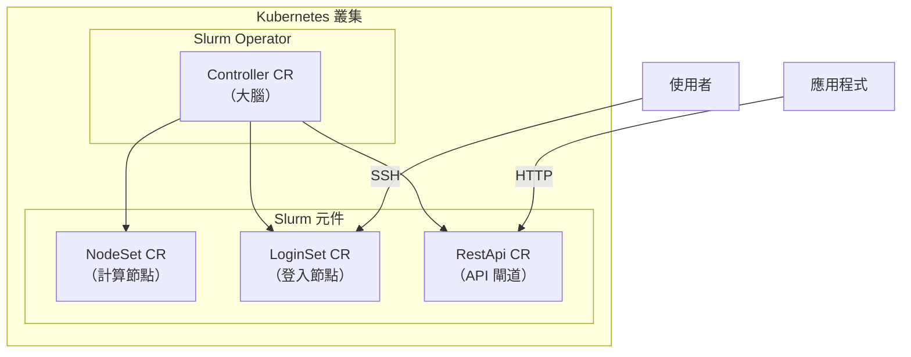
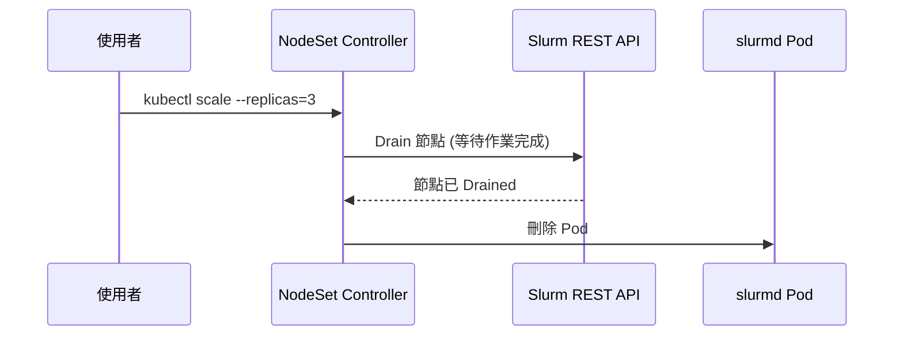
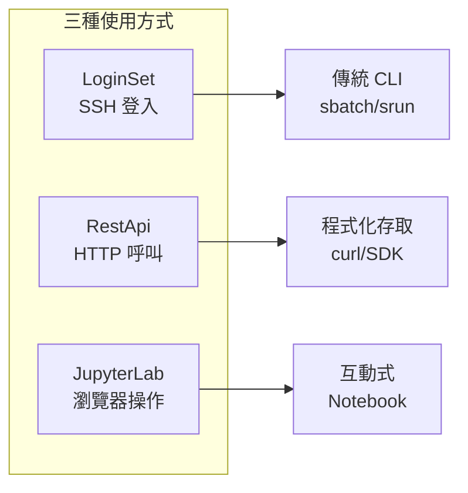
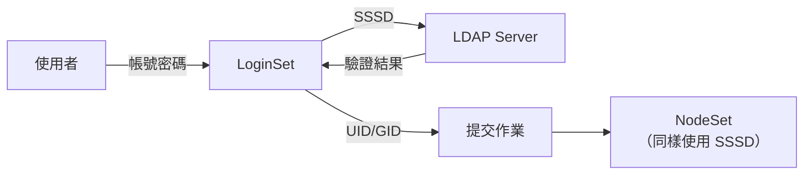

# Slurm Operator 使用指南

> 最後更新：2025-12-23
> 適用版本：slurm-operator v1.x
> 目標讀者：Kubernetes 與 HPC 新手
> 相關文件：[FAQ](./slurm-faq.md) | [NodeSet API 參考](./nodeset-api-reference.md)

---

## 目錄

- [1. 概覽](#1-概覽)
- [2. 核心概念](#2-核心概念)
  - [2.1 什麼是 Custom Resource (CR)？](#21-什麼是-custom-resource-cr)
  - [2.2 NodeSet vs RestApi 差異](#22-nodeset-vs-restapi-差異)
  - [2.3 何時用哪個？](#23-何時用哪個)
- [3. 使用 Slurm 的三種方式](#3-使用-slurm-的三種方式)
  - [3.1 透過 LoginSet (SSH 登入)](#31-透過-loginset-ssh-登入)
  - [3.2 透過 REST API](#32-透過-rest-api)
  - [3.3 透過 JupyterLab](#33-透過-jupyterlab)
- [4. LDAP 認證配置](#4-ldap-認證配置)
  - [4.1 認證架構說明](#41-認證架構說明)
  - [4.2 SSSD 設定步驟](#42-sssd-設定步驟)
  - [4.3 常見 LDAP Schema 對應](#43-常見-ldap-schema-對應)
  - [4.4 驗證與除錯](#44-驗證與除錯)
- [5. 下一步](#5-下一步)

---

## 1. 概覽

### 什麼是 Slurm？

**Slurm** 是一套開源的高效能運算（HPC）工作排程系統。簡單來說，它幫你：

- 管理一群計算節點（像是一個超級電腦叢集）
- 排隊和分配計算任務（例如：AI 訓練、科學模擬）
- 確保資源公平分配給不同使用者

### 什麼是 Slurm Operator？

**Slurm Operator** 讓你可以在 Kubernetes 上運行 Slurm 叢集。它的好處是：

- 不需要手動安裝設定 Slurm 的複雜元件
- 可以用 Kubernetes 的方式管理 HPC 資源
- 支援自動擴縮容

### 架構總覽



---

## 2. 核心概念

### 2.1 什麼是 Custom Resource (CR)？

在 Kubernetes 中，**Custom Resource (CR)** 是一種自訂的資源類型。你可以把它想像成一份「訂單」：

- 你填寫訂單（建立 CR YAML）
- Operator 幫你製作（建立對應的 Pod、Service 等）
- 你只需要管理訂單，不需要自己動手做

Slurm Operator 提供以下 CR：

| CR 名稱 | 簡稱 | 用途 |
|---------|------|------|
| Controller | slurmctld | Slurm 控制器，叢集的大腦 |
| **NodeSet** | slurmd | 計算節點集合，執行作業 |
| LoginSet | sackd | 登入節點，使用者 SSH 入口 |
| **RestApi** | slurmrestd | REST API 服務 |
| Accounting | slurmdbd | 會計資料庫 |
| Token | jwt | JWT 令牌管理 |

### 2.2 NodeSet vs RestApi 差異

這是新手最常混淆的兩個 CR，讓我們用比喻來解釋：

#### 比喻說明

| | NodeSet | RestApi |
|--|---------|---------|
| **比喻** | 工廠的**生產線工人** | 工廠的**客服窗口** |
| **職責** | 實際執行計算任務 | 提供程式化存取介面 |
| **本質** | 有狀態，每個節點有身份 | 無狀態，純 API 服務 |

#### 技術差異

```
┌─────────────────────────────────────────────────────────────────┐
│                     NodeSet vs RestApi                          │
├─────────────────────────────────────────────────────────────────┤
│                                                                 │
│  NodeSet (基礎設施層)              RestApi (API 閘道層)         │
│  ─────────────────                 ──────────────────           │
│  ✅ 建立/刪除計算節點 Pod          ❌ 無法建立/刪除 Pod         │
│  ✅ 擴縮節點數量                   ❌ 無法改變節點數量          │
│  ✅ 管理節點配置                   ✅ 查詢節點狀態              │
│  ✅ 透過 REST API 管理節點狀態     ✅ 設定節點狀態 (Drain)      │
│                                    ✅ 提交/管理作業             │
│                                                                 │
└─────────────────────────────────────────────────────────────────┘
```

#### 重點：NodeSet 內部使用 RestApi

NodeSet Controller 在執行某些操作時，實際上是呼叫 Slurm REST API：



### 2.3 何時用哪個？

| 你想做什麼 | 用什麼 |
|-----------|--------|
| 增加/減少計算節點數量 | **NodeSet** (修改 replicas) |
| 查詢節點狀態 | 兩者皆可（NodeSet 自動同步） |
| 手動 Drain 特定節點 | **REST API** 或 kubectl annotate |
| 提交作業 | **REST API** 或 LoginSet |
| 更新節點的 image/資源配置 | **NodeSet** (會重建 Pod) |

---

## 3. 使用 Slurm 的三種方式

當你透過 Slurm Operator 架設好 Slurm 叢集後，有三種方式可以使用它：



### 3.1 透過 LoginSet (SSH 登入)

這是最傳統的 HPC 使用方式，適合習慣命令列的使用者。

#### 步驟 1：確認 LoginSet 已啟用

```yaml
# values.yaml
loginsets:
  slinky:
    enabled: true
    replicas: 1
```

#### 步驟 2：連入 Login 節點

```bash
# 方法 A：使用 kubectl exec
kubectl exec -it -n slurm deploy/slurm-login-slinky -- bash

# 方法 B：使用 SSH（需要設定 Service 和認證）
ssh your_username@<login-service-ip>
```

#### 步驟 3：使用 Slurm 指令

```bash
# 查看叢集狀態
sinfo

# 查看作業佇列
squeue

# 提交批次作業
sbatch my-job.sh

# 互動式執行
srun -N 2 hostname

# 取消作業
scancel <job_id>
```

#### 範例：提交一個簡單作業

```bash
# 建立作業腳本
cat << 'EOF' > hello-job.sh
#!/bin/bash
#SBATCH --job-name=hello
#SBATCH --nodes=1
#SBATCH --time=00:05:00
#SBATCH --partition=slinky

echo "Hello from $(hostname)"
echo "Running as user: $(whoami)"
sleep 10
echo "Job completed!"
EOF

# 提交作業
sbatch hello-job.sh

# 查看作業狀態
squeue
```

### 3.2 透過 REST API

適合需要程式化整合的場景，例如 CI/CD 管線或自動化系統。

#### 步驟 1：取得 JWT Token

```bash
# 方法 A：從 Token CR 取得
kubectl get secret -n slurm slurm-token-xxx -o jsonpath='{.data.token}' | base64 -d

# 方法 B：在 Login Pod 內生成
kubectl exec -n slurm deploy/slurm-login-slinky -- scontrol token lifespan=3600
```

#### 步驟 2：呼叫 API

```bash
# 設定變數
SLURMRESTD="http://slurm-restapi-slinky.slurm.svc:6820"
TOKEN="your-jwt-token"

# 查看節點狀態
curl -s -X GET "$SLURMRESTD/slurm/v0.0.44/nodes" \
     -H "X-SLURM-USER-TOKEN: $TOKEN" | jq '.nodes[] | {name, state}'

# 查看作業佇列
curl -s -X GET "$SLURMRESTD/slurm/v0.0.44/jobs" \
     -H "X-SLURM-USER-TOKEN: $TOKEN" | jq

# 提交作業
curl -X POST "$SLURMRESTD/slurm/v0.0.44/job/submit" \
     -H "X-SLURM-USER-TOKEN: $TOKEN" \
     -H "Content-Type: application/json" \
     -d '{
       "job": {
         "name": "api-job",
         "ntasks": 1,
         "partition": "slinky",
         "current_working_directory": "/tmp",
         "environment": ["PATH=/usr/bin"],
         "script": "#!/bin/bash\nhostname\nsleep 30"
       }
     }'
```

### 3.3 透過 JupyterLab

適合資料科學家和 ML 工程師，提供互動式的開發環境。

#### 步驟 1：使用包含 JupyterLab 的映像

```yaml
# values.yaml
nodesets:
  slinky:
    enabled: true
    slurmd:
      image:
        repository: ghcr.io/slinkyproject/slurmd
        tag: jupyterlab  # 需要自己建置此映像
      ports:
        - containerPort: 9999
```

#### 步驟 2：透過作業啟動 Jupyter

```bash
# jupyter-job.sh
#!/bin/bash
#SBATCH --job-name=jupyter
#SBATCH --nodes=1
#SBATCH --time=02:00:00

jupyter lab --port=9999 --no-browser --ip=0.0.0.0
```

#### 步驟 3：存取 JupyterLab

```bash
# Port forward 到本機
kubectl port-forward -n slurm slurm-worker-slinky-0 8081:9999

# 在瀏覽器開啟
# http://localhost:8081
```

---

## 4. LDAP 認證配置

如果你的組織使用 LDAP 管理使用者帳號，可以讓 Slurm 叢集直接使用這些帳號。

### 4.1 認證架構說明

Slurm Operator 透過 **SSSD (System Security Services Daemon)** 與 LDAP 整合：



**重點**：LoginSet 和 NodeSet 都需要能夠查詢 LDAP，這樣作業才能以正確的使用者身份執行。

### 4.2 SSSD 設定步驟

#### 方式 A：直接在 values.yaml 設定

```yaml
# Cluster SSSD configuration
sssd:
  conf: |
    [sssd]
    config_file_version = 2
    services = nss, pam
    domains = MYCOMPANY

    [nss]
    filter_groups = root,slurm
    filter_users = root,slurm

    [pam]

    [domain/MYCOMPANY]
    # LDAP 連線設定
    auth_provider = ldap
    id_provider = ldap

    # 你的 LDAP 伺服器位址
    ldap_uri = ldap://ldap.mycompany.com
    # 或使用加密連線
    # ldap_uri = ldaps://ldap.mycompany.com:636

    # 搜尋基底
    ldap_search_base = dc=mycompany,dc=com
    ldap_user_search_base = ou=People,dc=mycompany,dc=com
    ldap_group_search_base = ou=Groups,dc=mycompany,dc=com

    # 如果需要 bind DN（非匿名綁定）
    ldap_default_bind_dn = cn=readonly,dc=mycompany,dc=com
    ldap_default_authtok = your-bind-password

    # 快取設定
    cache_credentials = true
    enumerate = false
```

#### 方式 B：使用 Secret（推薦，更安全）

```bash
# 1. 建立 sssd.conf 檔案
cat << 'EOF' > sssd.conf
[sssd]
config_file_version = 2
services = nss, pam
domains = MYCOMPANY

[nss]
filter_groups = root,slurm
filter_users = root,slurm

[pam]

[domain/MYCOMPANY]
auth_provider = ldap
id_provider = ldap
ldap_uri = ldap://ldap.mycompany.com
ldap_search_base = dc=mycompany,dc=com
ldap_user_search_base = ou=People,dc=mycompany,dc=com
ldap_group_search_base = ou=Groups,dc=mycompany,dc=com
ldap_default_bind_dn = cn=readonly,dc=mycompany,dc=com
ldap_default_authtok = secret-password
cache_credentials = true
EOF

# 2. 建立 Kubernetes Secret
kubectl create secret generic slurm-sssd-conf \
  --from-file=sssd.conf=sssd.conf \
  -n slurm

# 3. 清理本地檔案
rm sssd.conf
```

然後在 values.yaml 中參考：

```yaml
sssd:
  secretRef:
    name: slurm-sssd-conf
    key: sssd.conf
```

#### 啟用 LoginSet

```yaml
loginsets:
  slinky:
    enabled: true
    replicas: 1
    # 管理員用的 SSH 金鑰（可選）
    rootSshAuthorizedKeys: |
      ssh-rsa AAAA... admin-key
```

### 4.3 常見 LDAP Schema 對應

不同的 LDAP 伺服器使用不同的 schema，以下是常見的對應設定：

#### OpenLDAP

```ini
[domain/OPENLDAP]
auth_provider = ldap
id_provider = ldap
ldap_uri = ldap://ldap.example.com
ldap_search_base = dc=example,dc=com

ldap_user_object_class = posixAccount
ldap_user_name = uid
ldap_user_uid_number = uidNumber
ldap_user_gid_number = gidNumber
ldap_user_home_directory = homeDirectory
ldap_user_shell = loginShell

ldap_group_object_class = posixGroup
ldap_group_name = cn
ldap_group_gid_number = gidNumber
ldap_group_member = memberUid
```

#### FreeIPA

```ini
[domain/IPA]
auth_provider = ldap
id_provider = ldap
ldap_uri = ldap://ipa.example.com
ldap_search_base = dc=example,dc=com

ldap_user_object_class = posixAccount
ldap_group_object_class = posixGroup
ldap_group_member = member
```

#### Active Directory

```ini
[domain/AD]
auth_provider = ldap
id_provider = ldap
ldap_uri = ldaps://ad.mycompany.com:636
ldap_search_base = dc=mycompany,dc=com

# AD 特定設定
ldap_schema = ad
ldap_id_mapping = true
ldap_user_object_class = user
ldap_user_name = sAMAccountName
ldap_group_object_class = group
```

### 4.4 驗證與除錯

#### 驗證 SSSD 設定

```bash
# 進入 Login Pod
kubectl exec -it -n slurm deploy/slurm-login-slinky -- bash

# 檢查 SSSD 服務狀態
systemctl status sssd

# 測試使用者查詢
getent passwd ldap_username
# 預期輸出：ldap_username:*:10001:10001:User Name:/home/ldap_username:/bin/bash

# 測試群組查詢
getent group ldap_groupname

# 測試認證（切換使用者）
su - ldap_username
whoami
id
```

#### 常見問題排查

```bash
# 查看 SSSD 日誌
journalctl -u sssd -f

# 增加 SSSD debug 等級（暫時）
# 在 sssd.conf 的 [domain/XXX] 區段加入：
# debug_level = 9

# 測試 LDAP 連線
ldapsearch -x -H ldap://ldap.mycompany.com \
  -b "dc=mycompany,dc=com" \
  "(uid=testuser)"
```

---

## 5. 下一步

恭喜你已經了解 Slurm Operator 的基本使用方式！以下是建議的進階主題：

- **自動擴縮容**：根據作業負載自動調整節點數量
- **工作負載隔離**：使用 Kubernetes 的 Namespace 和 ResourceQuota
- **監控與告警**：整合 Prometheus 和 Grafana
- **混合部署**：結合雲端和地端資源

如有其他問題，請參考 [FAQ](./slurm-faq.md)。

---

> 相關文件：
> - [Slurm 官方文件](https://slurm.schedmd.com/documentation.html)
> - [Slinky 專案文件](https://slinky.schedmd.com/)
> - [slurm-operator GitHub](https://github.com/SlinkyProject/slurm-operator)
