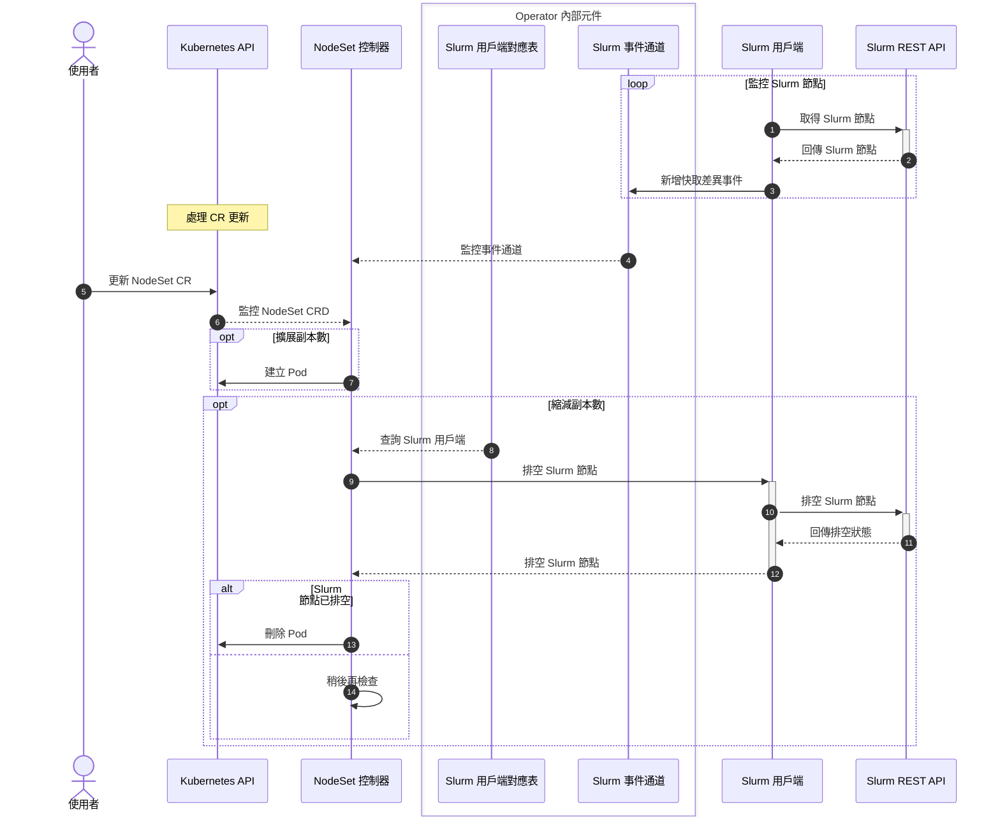

# NodeSet 控制器 (NodeSet Controller)

## TL;DR

NodeSet 控制器負責管理和調和 NodeSet CRD，它代表一組同質性的 Slurm 節點。控制器會監控 Kubernetes 和 Slurm 的狀態，在擴展 (Scale-out) 時建立 Pod，在縮減 (Scale-in) 時先排空節點再刪除 Pod。

---

## Translation

## 目錄

<!-- mdformat-toc start --slug=github --no-anchors --maxlevel=6 --minlevel=1 -->

- [NodeSet 控制器](#nodeset-控制器-nodeset-controller)
  - [目錄](#目錄)
  - [概述](#概述)
  - [設計](#設計)
    - [序列圖](#序列圖)

<!-- mdformat-toc end -->

## 概述

NodeSet 控制器負責管理和調和 (Reconcile) NodeSet CRD，它代表一組同質性的 Slurm 節點 (Nodes)。

## 設計

此控制器負責管理和調和 NodeSet CRD。除了透過 Kubernetes API 在 Kubernetes 中管理資源的常規職責外，此控制器還應考慮 Slurm 的狀態來做出某些調和決策。

### 序列圖



---

## Explanation

### NodeSet 是什麼？

NodeSet 是 Slinky 定義的自訂資源 (Custom Resource)，用於表示一組具有相同配置的 Slurm 工作節點。每個 NodeSet 對應到 Slurm 中的一個分割區 (Partition)。

### 控制器的工作流程

1. **監控變更**：持續監控 Kubernetes 和 Slurm 的狀態變化
2. **擴展 (Scale-out)**：當需要更多節點時，建立新的 Pod
3. **縮減 (Scale-in)**：當需要減少節點時：
   - 先排空 (Drain) Slurm 節點，讓正在執行的作業完成
   - 確認節點已排空後，再刪除對應的 Pod

### 為何需要排空節點？

直接刪除執行中的 slurmd Pod 會導致：
- 正在執行的作業被中斷
- 作業狀態可能遺失
- 使用者體驗不佳

透過排空機制，控制器可以優雅地處理縮減，確保作業完成後再移除節點。

---

## Practical Example

### 查看 NodeSet 狀態

```bash
# 列出所有 NodeSet 資源
# nss 是 NodeSet 的簡寫 (shortname)
kubectl get nss -n slurm

# 查看特定 NodeSet 的詳細資訊
# -o yaml: 以 YAML 格式輸出完整規格
kubectl get nss slurm-worker-slinky -n slurm -o yaml

# 查看 NodeSet 的 Pod
# -l: 使用標籤選擇器
kubectl get pods -n slurm -l app.kubernetes.io/instance=slurm-worker-slinky
```

### 手動擴展 NodeSet

```bash
# 將 NodeSet 擴展到 3 個副本
# scale: Kubernetes 擴展指令
# --replicas: 指定目標副本數
kubectl scale nss/slurm-worker-slinky -n slurm --replicas=3

# 驗證擴展結果
kubectl get pods -n slurm -l app.kubernetes.io/instance=slurm-worker-slinky

# 在 Slurm 中確認節點狀態
kubectl exec -n slurm statefulset/slurm-controller -- sinfo
```

### 縮減 NodeSet 並觀察排空過程

```bash
# 將 NodeSet 縮減到 1 個副本
kubectl scale nss/slurm-worker-slinky -n slurm --replicas=1

# 觀察節點狀態變化
# -w: 持續監控變化
kubectl get pods -n slurm -l app.kubernetes.io/instance=slurm-worker-slinky -w

# 查看 Slurm 節點狀態（應該會看到 draining 狀態）
kubectl exec -n slurm statefulset/slurm-controller -- sinfo
```

---

## Common Mistakes & Tips

| 常見錯誤 | 解決方法 |
|---------|---------|
| 縮減後 Pod 一直處於 Terminating 狀態 | Slurm 節點正在排空中，等待作業完成 |
| NodeSet 擴展後 Slurm 看不到新節點 | 檢查 slurmd Pod 是否正常啟動 |
| 控制器無法更新 Slurm 節點 | 確認 slurmrestd 服務正常運行 |
| 節點排空超時 | 考慮取消長時間執行的作業或調整超時設定 |

### 小技巧

1. **預留時間排空**：縮減前確保沒有長時間執行的作業
2. **監控控制器日誌**：排空過程中觀察 Operator 日誌
3. **使用 HPA/KEDA**：自動化擴展比手動更可靠
4. **設定 minReplicas**：避免意外將 NodeSet 縮減到 0

---

## Quick Reference

| 指令 | 說明 |
|-----|------|
| `kubectl get nss -n slurm` | 列出所有 NodeSet |
| `kubectl describe nss <name> -n slurm` | 查看 NodeSet 詳細資訊 |
| `kubectl scale nss/<name> -n slurm --replicas=N` | 調整 NodeSet 副本數 |
| `kubectl get pods -n slurm -l app.kubernetes.io/instance=<name>` | 查看 NodeSet 的 Pod |
| `kubectl logs -n slinky -l app.kubernetes.io/instance=slurm-operator` | 查看控制器日誌 |
