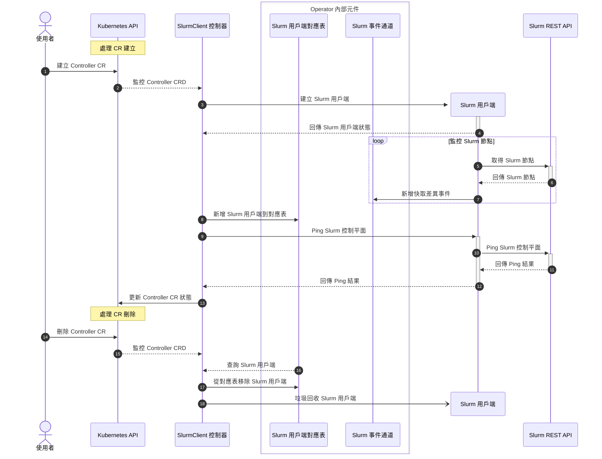

# Slurm 用戶端控制器 (Slurm Client Controller)

## TL;DR

Slurm 用戶端控制器負責管理其他內部控制器使用的 Slurm 用戶端 (Slurm Clients)。它建立、管理用戶端連線，並透過 REST API 持續監控 Slurm 節點狀態，將變更事件發送到內部事件通道供其他控制器使用。

---

## Translation

## 目錄

<!-- mdformat-toc start --slug=github --no-anchors --maxlevel=6 --minlevel=1 -->

- [Slurm 用戶端控制器](#slurm-用戶端控制器-slurm-client-controller)
  - [目錄](#目錄)
  - [概述](#概述)
  - [序列圖](#序列圖)

<!-- mdformat-toc end -->

## 概述

此控制器負責管理其他內部控制器使用的 Slurm 用戶端 (Slurm Clients)。

此控制器使用 [Slurm client] 函式庫。

## 序列圖



<!-- Links -->

[slurm client]: https://github.com/SlinkyProject/slurm-client

---

## Explanation

### 什麼是 Slurm 用戶端控制器？

Slurm 用戶端控制器是 `slurm-operator` 的核心元件之一，它負責：

1. **管理 API 連線**：建立和維護與 Slurm REST API (slurmrestd) 的連線
2. **快取狀態資訊**：定期從 Slurm 取得節點資訊並快取
3. **發送變更事件**：當 Slurm 狀態改變時，通知其他控制器

### 為何需要獨立的用戶端控制器？

- **資源共享**：多個控制器可以共用同一個 Slurm 用戶端
- **連線管理**：集中處理認證、重連等邏輯
- **狀態同步**：透過事件通道機制，確保所有控制器看到一致的 Slurm 狀態

### 內部架構

| 元件 | 說明 |
|-----|------|
| **Slurm Client Map** | 儲存所有 Slurm 用戶端的對應表 |
| **Slurm Event Channel** | 事件通道，用於發送狀態變更通知 |
| **Slurm Client** | 實際與 Slurm REST API 通訊的用戶端 |

---

## Practical Example

### 驗證 Slurm 用戶端連線狀態

```bash
# 查看 Cluster CR 狀態
# Cluster CR 的 READY 欄位表示用戶端是否連線成功
kubectl get clusters.slinky.slurm.net -n slurm

# 輸出範例：
# NAME    READY   AGE
# slurm   true    5m

# 查看詳細的連線狀態
kubectl describe clusters.slinky.slurm.net slurm -n slurm
```

### 檢查 slurmrestd 服務

```bash
# 確認 slurmrestd Pod 正在運行
kubectl get pods -n slurm -l app.kubernetes.io/name=slurmrestd

# 查看 slurmrestd 日誌
kubectl logs -n slurm -l app.kubernetes.io/name=slurmrestd

# 測試 REST API 是否可達
# 透過 port-forward 測試
kubectl port-forward -n slurm svc/slurm-restapi 6820:6820 &
curl -s http://localhost:6820/slurm/v0.0.41/ping
```

### 診斷連線問題

```bash
# 查看 Operator 日誌中的 Slurm 用戶端相關訊息
kubectl logs -n slinky deployment/slurm-operator | grep -i "slurm client"

# 檢查 Slurm 認證金鑰是否正確設定
kubectl get secrets -n slurm | grep auth

# 驗證 JWT 金鑰存在
kubectl get secret slurm-auth-jwths256 -n slurm -o yaml
```

---

## Common Mistakes & Tips

| 常見錯誤 | 解決方法 |
|---------|---------|
| Cluster CR 的 READY 為 false | 檢查 slurmrestd 是否正常運行 |
| 連線超時 | 確認網路策略允許 Operator 存取 slurmrestd |
| 認證失敗 | 驗證 JWT 金鑰 Secret 是否正確配置 |
| 節點狀態不同步 | 檢查 Operator 日誌中是否有錯誤 |

### 小技巧

1. **監控 READY 狀態**：Cluster CR 的 READY 狀態是判斷連線健康的最佳指標
2. **設定重試機制**：確保 Helm chart 中有適當的重試配置
3. **日誌級別**：排錯時可以調高 Operator 的日誌級別
4. **健康檢查**：定期檢查 slurmrestd 的健康狀態

---

## Quick Reference

| 指令 | 說明 |
|-----|------|
| `kubectl get clusters.slinky.slurm.net -n slurm` | 查看 Cluster 連線狀態 |
| `kubectl describe clusters.slinky.slurm.net <name> -n slurm` | 查看 Cluster 詳細資訊 |
| `kubectl get pods -n slurm -l app.kubernetes.io/name=slurmrestd` | 查看 slurmrestd Pod |
| `kubectl logs -n slurm -l app.kubernetes.io/name=slurmrestd` | 查看 slurmrestd 日誌 |
| `kubectl port-forward -n slurm svc/slurm-restapi 6820:6820` | 轉發 REST API 埠 |
